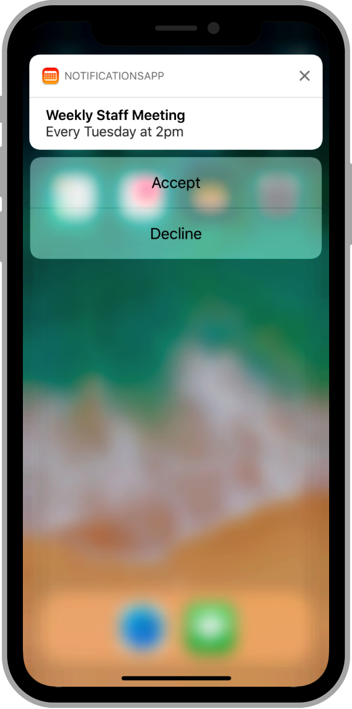

> Navigation: [Technologies](../technologies.md) · [User Notifications](../usernotifications.md)

# Handling notifications and notification-related actions

<sub>Article</sub>

Respond to user interactions with the system’s notification interfaces, including handling your app’s custom actions.

## Overview

Notifications are primarily a way of putting information in front of the user, but your app can also respond to them. For example, you might want to respond to:

- Actions selected by the user from the notification interface.
- A notification that arrives when your app is running in the foreground.
- A silent notification (see [Pushing background updates to your App](pushing-background-updates-to-your-app.md)).
- A notification associated with the [PushKit](../pushkit.md) framework, such as VoIP or complication-related notifications.

### Handle user-selected actions

Actionable notifications let the user respond to a notification directly from the notification interface. In addition to the notification’s content, an actionable notification displays one or more buttons representing the actions that the user can take. Tapping one of the buttons forwards the selected action to your app, without bringing the app to the foreground. If your app supports actionable notification types, you must handle the associated actions.



> [!note] Note
> You declare actionable notification types at launch time at the same time you declare your app’s supported categories. For more information, see [Declaring your actionable notification types](declaring-your-actionable-notification-types.md).

You handle selected actions from the delegate object of the shared [UNUserNotificationCenter](unusernotificationcenter.md) object. When the user selects an action, the system launches your app in the background and calls the delegate’s [- userNotificationCenter:didReceiveNotificationResponse:withCompletionHandler:](<unusernotificationcenterdelegate/usernotificationcenter(__didreceive_withcompletionhandler_).md>) method. Match the value in the [actionIdentifier](unnotificationresponse/actionidentifier.md) property of the response object to one of your app’s actions or a system-defined action. The system reports special actions when the user dismisses the notification or launches your app.

Listing 1 shows an example that processes actions associated with a meeting invitation. The `ACCEPT_ACTION` and `DECLINE_ACTION` strings identify the app-specific actions, which generate an appropriate response to the meeting invitation. If the user doesn’t choose one of the app-defined actions, the method saves the invitation until the user launches the app.

Listing 1. Handling the actions in your actionable notifications

```swift
func userNotificationCenter(_ center: UNUserNotificationCenter,
            didReceive response: UNNotificationResponse,
            withCompletionHandler completionHandler: 
               @escaping () -> Void) {
   // Get the meeting ID from the original notification.
   let userInfo = response.notification.request.content.userInfo
        
   if response.notification.request.content.categoryIdentifier ==
              "MEETING_INVITATION" {
      // Retrieve the meeting details.
      let meetingID = userInfo["MEETING_ID"] as! String
      let userID = userInfo["USER_ID"] as! String
            
      switch response.actionIdentifier {
      case "ACCEPT_ACTION":
         sharedMeetingManager.acceptMeeting(user: userID, 
               meetingID: meetingID)
         break
                
      case "DECLINE_ACTION":
         sharedMeetingManager.declineMeeting(user: userID, 
               meetingID: meetingID)
         break
                
      case UNNotificationDefaultActionIdentifier,
           UNNotificationDismissActionIdentifier:
         // Queue meeting-related notifications for later
         //  if the user does not act.
         sharedMeetingManager.queueMeetingForDelivery(user: userID,
               meetingID: meetingID)
         break
                
      default:
         break
      }
   }
   else {
      // Handle other notification types...
   }
        
   // Always call the completion handler when done.
   completionHandler()
}
```

### Handle notifications while your app runs in the foreground

If a notification arrives when your app is running in the foreground, the system delivers that notification directly to your app. Upon receiving a notification, you can use the notification’s payload to do whatever you want. For example, you can update your app’s interface to reflect new information contained in the notification. You can then suppress any scheduled alerts or modify those alerts.

When a notification arrives, the system calls the [- userNotificationCenter:willPresentNotification:withCompletionHandler:](<unusernotificationcenterdelegate/usernotificationcenter(__willpresent_withcompletionhandler_).md>) method of the [UNUserNotificationCenter](unusernotificationcenter.md) object’s delegate. Use that method to process the notification and let the system know how you want it to proceed. Listing 2 shows a version of this method for a calendar app. When a meeting invitation arrives, the app calls its custom `queueMeetingForDelivery` method to show the new invitation in the app’s interface. The app also asks the system to play the notification’s sound by passing the [UNNotificationPresentationOptionSound](unnotificationpresentationoptions/sound.md) value to the completion handler. For other notification types, the method silences the notification.

Listing 2. Processing notifications in the foreground

```swift
func userNotificationCenter(_ center: UNUserNotificationCenter,
         willPresent notification: UNNotification,
         withCompletionHandler completionHandler: 
            @escaping (UNNotificationPresentationOptions) -> Void) {
   if notification.request.content.categoryIdentifier == 
            "MEETING_INVITATION" {
      // Retrieve the meeting details.
      let meetingID = notification.request.content.
                       userInfo["MEETING_ID"] as! String
      let userID = notification.request.content.
                       userInfo["USER_ID"] as! String
            
      // Add the meeting to the queue.
      sharedMeetingManager.queueMeetingForDelivery(user: userID,
            meetingID: meetingID)

      // Play a sound to let the user know about the invitation.
      completionHandler(.sound)
      return
   }
   else {
      // Handle other notification types...
   }

   // Don't alert the user for other types.
   completionHandler(UNNotificationPresentationOptions(rawValue: 0))
}
```

If you registered your app with PushKit, notifications targeting PushKit-types are always delivered directly to your app and are never displayed to the user. If your app is in the foreground or background, the system gives your app time to process the notification. If your app isn’t running, the system launches your app in the background so that it can process the notification. To send a PushKit notification, your provider server must set the notification’s topic to the appropriate target, such as your app’s complication. For more information about registering for PushKit notifications, see [PushKit](../pushkit.md).

## See Also

### Notification responses

- [UNNotificationResponse](unnotificationresponse.md) — The user’s response to an actionable notification.
- [UNTextInputNotificationResponse](untextinputnotificationresponse.md) — The user’s response to an actionable notification, including any custom text that the user typed or dictated.
