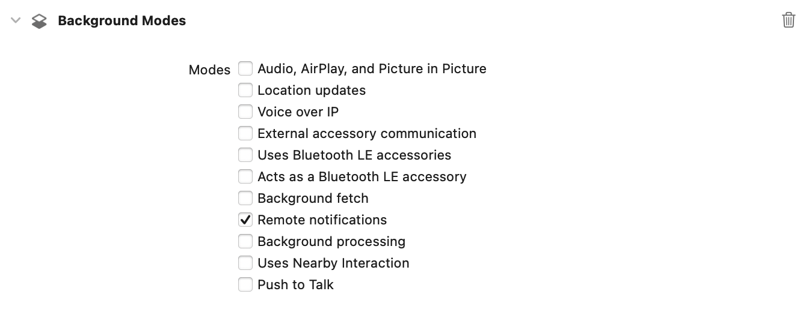

> Navigation: [Technologies](../technologies.md) · [User Notifications](../usernotifications.md) · [Setting up a remote notification server](setting-up-a-remote-notification-server.md)

# Pushing background updates to your App

<sub>Article</sub>

Deliver notifications that wake your app and update it in the background.

## Overview

If your app’s server-based content changes infrequently or at irregular intervals, you can use _background notifications_ to notify your app when new content becomes available. A background notification is a remote notification that doesn’t display an alert, play a sound, or badge your app’s icon. It wakes your app in the background and gives it time to initiate downloads from your server and update its content.

> [!important] Important
> The system treats background notifications as low priority: you can use them to refresh your app’s content, but the system doesn’t guarantee their delivery. In addition, the system may throttle the delivery of background notifications if the total number becomes excessive. The number of background notifications allowed by the system depends on current conditions, but don’t try to send more than two or three per hour.

### Enable the remote notifications capability

To receive background notifications, you must add the remote notifications background mode to your app. In the Signing and Capability tab, add the Background Modes capability, then select the Remote notification checkbox. The figure below shows what you must select to recieve background notifications.



For watchOS, add this capability to your WatchKit Extension.

### Create a background notification

To send a background notification, create a remote notification with an `aps` dictionary that includes only the `content-available` key, as shown in the sample code below. You may include custom keys in the payload, but the `aps` dictionary must not contain any keys that would trigger user interactions.

```swift
{
   "aps" : {
      "content-available" : 1
   },
   "acme1" : "bar",
   "acme2" : 42
}

```

Additionally, the notification’s POST request should contain the `apns-push-type` header field with a value of `background`, and the `apns-priority` field with a value of `5`. The APNs server requires the `apns-push-type` field when sending push notifications to Apple Watch, and recommends it for all platforms. For more information, see Create a POST request to APNs in [Sending notification requests to APNs](sending-notification-requests-to-apns.md).

### Receive background notifications

When a device receives a background notification, the system may hold and delay the delivery of the notification, which can have the following side effects:

- When the system receives a new background notification, it discards the older notification and only holds the newest one.
- If something force quits or kills the app, the system discards the held notification.
- If the user launches the app, the system immediately delivers the held notification.

To deliver a background notification, the system wakes your app in the background. On iOS it then calls your app delegate’s [application(_:didReceiveRemoteNotification:fetchCompletionHandler:)](<../uikit/uiapplicationdelegate/application(__didreceiveremotenotification_fetchcompletionhandler_).md>) method. On watchOS, it calls your extension delegate’s [didReceiveRemoteNotification(_:fetchCompletionHandler:)](<../watchkit/wkextensiondelegate/didreceiveremotenotification(__fetchcompletionhandler_).md>) method. Your app has 30 seconds to perform any tasks and call the provided completion handler. For more information, see [Handling notifications and notification-related actions](handling-notifications-and-notification-related-actions.md).

## See Also

### Server tasks

- [Registering your app with APNs](registering-your-app-with-apns.md) — Communicate with Apple Push Notification service (APNs) and receive a unique device token that identifies your app.
- [Generating a remote notification](generating-a-remote-notification.md) — Send notifications to the user’s device with a JSON payload.
- [Establishing a connection to Apple Push Notification service (APNs)](establishing-a-connection-to-apns.md) — Secure your communications with APNs to send API requests.
