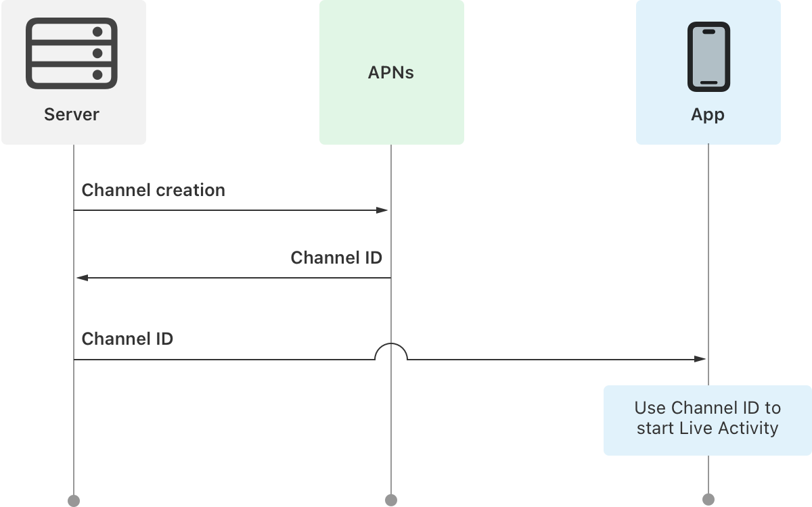

> Navigation: [Technologies](../technologies.md) · [User Notifications](../usernotifications.md) · [Setting up a remote notification server](setting-up-a-remote-notification-server.md)

# Sending channel management requests to APNs

<sub>Article</sub>

Manage channels that your application uses for broadcast push notifications.

## Overview

Broadcast push notifications use channels to reach a large number of people with Live Activities. To send updates with a Live Activity for an event such a sports game using broadcast push notifications, associate your event with a channel, identified by creating a unique channel ID. Store the association for each Live Activity event with a unique channel ID, and then share the channel ID with the devices. Devices use this channel identifier to subscribe to push notifications for each Live Activity event. Devices on iOS 18 and iPadOS 18 can subscribe to receive updates on channels using [ActivityKit](https://developer.apple.com/documentation/activitykit). For more information on using ActivityKit to subscribe for updates on a channel, refer to [Starting and updating Live Activities with ActivityKit push notifications](https://developer.apple.com/documentation/activitykit/starting-and-updating-live-activities-with-activitykit-push-notifications).

The figure below describes how your server communicates with Apple Push Notification service (APNs) when you create a channel. APNs returns a channel ID which your server shares with the people interested in receiving Live Activity updates. The device uses the channel ID to subscribe for broadcast push notifications on the channel.



<sub>A diagram that illustrates the process of using a channel ID to start a Live Activity. Three boxes are at the top: a server graphic labeled Server on the left, a box labeled APNs in the middle, and a box with an iPhone in the center representing an App on the right. Below that is another box labeled Use channel ID to start Live Activity. An arrow labeled Channel creation points from the server to APNs, indicating that the server requests a unique channel ID. APNs returns a unique channel ID, as indicated by an arrow labeled Channel ID pointing from APNs to the server. The server then uses the unique channel ID to initiate a Live Activity, as shown by an arrow labeled Channel ID pointing from the server to the App.</sub>

The lifecycles of the channel ID and Live Activity on device are independent. Specifically, a channel ID exists even if there are no active subscribers, or all subscribers remove the Live Activity. In order to support several simultaneous events, you can maintain up to 10,000 channels for your app in the development and production environment, respectively. Once the Live Activity event is complete, and you no longer plan to use the channel for any subsequent updates, delete the channel to avoid going over the allocated channel limit.

### Establish a connection to APNs

Use HTTP/2 and TLS 1.2 or later to establish a connection between your provider server and one of the following servers.

- Development/Sandbox Environment: [api-manage-broadcast.sandbox.push.apple.com:2195](https://api-manage-broadcast.sandbox.push.apple.com:2195)
- Production Environment: [api-manage-broadcast.push.apple.com:2196](https://api-manage-broadcast.push.apple.com:2196)

For more details on establishing a connection to the APNs server to send requests, refer to [Establishing a connection to Apple Push Notification service (APNs)](establishing-a-connection-to-apns.md).

### Create a channel

To create a new channel, create and send a POST request to APNs with the appropriate configuration. Channel IDs generate randomly when you create them, and you can’t request a channel with a specific ID.

Message storage policy configured as part of the request can’t be modified later. The message storage policy of the channel determines if the channel stores deferred messages for offline devices. There are two available options: No Message Storage and Most Recent Message Stored. For activities with frequent updates like sports scores, use No Message Storage, which allows a higher publishing budget. For activities with infrequent updates, such as event tracking and flight updates, use Most Recent Message Stored. Messages in Most Recent Message store for a maximum duration of 8 hours. You can specify an earlier expiration of messages by setting an `apns-expiration` header when you send push notification on the channel.

The table below describes the HTTP/2 request fields:

| Header field | Required | Description |
|---|---|---|
| `:method` | Required | The value `POST`. |
| `:path` | Required | `/1/apps/<bundleId>/channels` |
| `authorization` | Required, if mTLS authentication is omitted | The value of this header is bearer `<`provider_token`>`, where `provider_token` is the encrypted token that authorizes you to send notifications for the specified topic. APNs ignores this header if you use certificate-based authentication. For more information, refer to [Establishing a token-based connection to APNs](establishing-a-token-based-connection-to-apns.md). |
| `apns-request-id` | Optional | A canonical UUID that’s the unique ID for this request. If an error occurs when processing the request, APNs includes this value when reporting the error to your server. Canonical UUIDs are 32 lowercase hexadecimal digits, displayed in five groups separated by hyphens in the form `8-4-4-4-12`; for example: `123e4567-e89b-12d3-a456-4266554400a0`. If you omit this header, APNs creates a `UUID` for you and returns it in its response. |

The table below describes the JSON dictionary request body fields:

| Body field | Required | Description |
|---|---|---|
| `message-storage-policy` | Required | There are two available options: No Message Stored and Most Recent Message Stored. Specify `0` for No Message Stored. Specify `1` for Most Recent Message Stored. |
| `push-type` | Required | The push type configured for the channel. Allowed value is `LiveActivity`. |

The code snippet below shows a sample to request a channel using a JWT.

```other
curl -v -X POST \
-H "authorization: bearer <token>" \
-H "apns-request-id: 2288cf3f-70d8-46a6-97d7-dd5d00867127" \
-d '{"message-storage-policy": 1, "push-type": "LiveActivity"}' \
--http2 \
https://api-manage-broadcast.sandbox.push.apple.com:2195/1/apps/com.example.MyApp/channels 

HEADERS
  - END_STREAM
  + END_HEADERS
  :method = POST
  :scheme = https
  :path = /1/apps/com.example.MyApp/channels
  host = api-manage-broadcast.sandbox.push.apple.com
  authorization = bearer <token>
  apns-request-id = 2288cf3f-70d8-46a6-97d7-dd5d00867127
DATA
  + END_STREAM
  { "message-storage-policy": 1, "push-type": "LiveActivity" }
```

The response to a successful request contains the header fields described below, with the body of the response empty. On failure, the response body contains a JSON dictionary describing the error. For more information on how to handle error responses, refer to [Handling error responses from Apple Push Notification service](handling-error-responses-from-apns.md).

The table below describes the HTTP/2 response fields:

| Header | Description |
|---|---|
| `:status` | The HTTP status code for a successul request is 201. For a failed request and a list of all possible status codes, refer to [Handling error responses from Apple Push Notification service](handling-error-responses-from-apns.md). |
| `apns-request-id` | The request identifier specified in the corresponding request. If not specified, the server generates the identifier. |
| `apns-channel-id` | A base64-encoded string that identifies the newly created channel. |

> [!note] Note
> Channels can’t be shared across environments: a channel created in the development environment can’t be used in the production environment. Also, don’t make assumptions on the channel ID size.

### Read a channel

To read the configuration for a channel, construct and send a request over the connection you created using HTTP/2 and TLS. The table below describes the HTTP/2 request header fields:

| Header field | Required | Description |
|---|---|---|
| `:method` | Required | The value `GET`. |
| `:path` | Required | `/1/apps/<bundleId>/channels` |
| `authorization` | Required, if mTLS authentication is omitted. | The value of this header is bearer `provider_token`, where `provider_token` is the encrypted token that authorizes you to send notifications for the specified topic. APNs ignores this header if you use certificate-based authentication. For more information, refer to [Establishing a token-based connection to APNs](establishing-a-token-based-connection-to-apns.md). |
| `apns-request-id` | Optional | A canonical UUID that’s the unique ID for this request. If an error occurs when processing the request, APNs includes this value when reporting the error to your server. Canonical UUIDs are 32 lowercase hexadecimal digits, displayed in five groups separated by hyphens in the form `8-4-4-4-12`; for example: `123e4567-e89b-12d3-a456-4266554400a0`. If you omit this header, APNs creates a `UUID` for you and returns it in its response. |
| `apns-channel-id` | Required | A base64-encoded string that identifies the channel. Your server receives the channel ID as part of the channel creation response. |

The code snippet below shows a sample request constructed for reading the configuration for a channel using a JWT.

```other
curl -v -X GET \
-H "authorization: bearer <token>" \
-H "apns-request-id: 2288cf3f-70d8-46a6-97d7-dd5d00867127" \
-H "apns-channel-id: dHN0LXNyY2gtY2hubA==" \ 
--http2 \
https://api-manage-broadcast.sandbox.push.apple.com:2195/1/apps/com.example.MyApp/channels 

HEADERS
  - END_STREAM
  + END_HEADERS
  :method = GET
  :scheme = https
  :path = /1/apps/com.example.MyApp/channels
  host = api-manage-broadcast.sandbox.push.apple.com
  authorization = bearer <token>
  apns-request-id = 2288cf3f-70d8-46a6-97d7-dd5d00867127
  apns-channel-id = dHN0LXNyY2gtY2hubA==
DATA
  + END_STREAM
```

The response to a successful request contains the header fields, and the body of the response is a JSON dictionary, as described below. On failure, the response body contains a JSON dictionary describing the error. For more information on how to handle error responses, refer to [Handling error responses from Apple Push Notification service](handling-error-responses-from-apns.md).

The table below describes the HTTP/2 response fields:

| Header | Description |
|---|---|
| `:status` | The HTTP status code for a successul request is 200. For a failed request and a list of all possible status codes, refer to [Handling error responses from Apple Push Notification service](handling-error-responses-from-apns.md). |
| `apns-request-id` | The request identifier specified in the corresponding request. If the request doesn’t specify an identifier, the server generates one. |

The table below describes the HTTP/2 response body:

| Body field | Description |
|---|---|
| `message-storage-policy` | The storage policy configured at channel creation. Indicates if APNs stores deferred messages for offline devices. Value `0` indicates No Message Stored. Value `1` indicates Most Recent Message Stored. |
| `push-type` | The push type configured for the channel. Allowed value is `LiveActivity`. |

### Delete a channel

To delete an existing channel, construct and send a request that includes the channel ID over the connection with APNs. Deleting a channel doesn’t discard pending messages immediately. APNs may still deliver stored messages after you delete the channel. Deleting a channel is an irreversible action. Once you delete the channel, it’s no longer valid; don’t send any pushes to the channel. As channel IDs are randomly generated for channel creation requests, the same channel ID can’t be created again. The table below describes the HTTP/2 request header fields:

| Header field | Required | Description |
|---|---|---|
| `:method` | Required | The value `DELETE`. |
| `:path` | Required | `/1/apps/<bundleId>/channels` |
| `authorization` | Required for token-based authentication. | The value of this header is bearer `provider_token`, where `provider_token` is the encrypted token that authorizes you to send notifications for the specified topic. APNs ignores this header if you use certificate-based authentication. For more information, refer to [Establishing a token-based connection to APNs](establishing-a-token-based-connection-to-apns.md). |
| `apns-request-id` | Optional | A canonical UUID that’s the unique ID for this request. If an error occurs when processing the request, APNs includes this value when reporting the error to your server. Canonical UUIDs are 32 lowercase hexadecimal digits, displayed in five groups separated by hyphens in the form `8-4-4-4-12`; for example: `123e4567-e89b-12d3-a456-4266554400a0`. If you omit this header, APNs creates a `UUID` for you and returns it in its response. |
| `apns-channel-id` | Required | The base64 bytes that identify the channel. Your server receives the channel ID as part of the channel creation response. |

The code snippet below shows a sample request constructed for deleting a channel JWT.

```other
curl -v -X DELETE \
-H "authorization: bearer <token>" \
-H "apns-request-id: 2288cf3f-70d8-46a6-97d7-dd5d00867127" \
-H "apns-channel-id: dHN0LXNyY2gtY2hubA==" \ 
--http2 \
https://api-manage-broadcast.sandbox.push.apple.com:2195/1/apps/com.example.MyApp/channels

HEADERS
  - END_STREAM
  + END_HEADERS
  :method = DELETE
  :scheme = https
  :path = /1/apps/com.example.MyApp/channels
  host = api-manage-broadcast.sandbox.push.apple.com
  authorization = bearer <token>
  apns-request-id = 2288cf3f-70d8-46a6-97d7-dd5d00867127
  apns-channel-id = dHN0LXNyY2gtY2hubA==
DATA
  + END_STREAM
```

The response to a successful request contains the header fields described below, with the body of the response empty. On failure, the response body contains a JSON dictionary describing the error. For more information on how to handle error responses, refer to [Handling error responses from Apple Push Notification service](handling-error-responses-from-apns.md).

The table below describes the HTTP/2 response fields:

| Header | Description |
|---|---|
| `:status` | The HTTP status code for a successul request is 204. For a failed request and a list of all possible status codes, refer to [Handling error responses from Apple Push Notification service](handling-error-responses-from-apns.md). |
| `apns-request-id` | The request identifier the corresponding request specifies. If the request doesn’t specify an identifier, the server generates one. |

### Read all channel IDs for a bundle ID

To get the list all the current active channels for your app, you can send a GET request over the connection with APNs. The table below describes the HTTP/2 request fields:

| Header field | Required | Description |
|---|---|---|
| `:method` | Required | The value `GET`. |
| `:path` | Required | `/1/apps/<bundleId>/all-channels` |
| `authorization` | Required for token-based authentication. | The value of this header is bearer `provider_token`, where `provider_token` is the encrypted token that authorizes you to send notifications for the specified topic. APNs ignores this header if you use certificate-based authentication. For more information, refer to [Establishing a token-based connection to APNs](establishing-a-token-based-connection-to-apns.md). |
| `apns-request-id` | Optional | A canonical UUID that’s the unique ID for this request. If an error occurs when processing the request, APNs includes this value when reporting the error to your server. Canonical UUIDs are 32 lowercase hexadecimal digits, displayed in five groups separated by hyphens in the form `8-4-4-4-12`; For example: `123e4567-e89b-12d3-a456-4266554400a0`. If you omit this header, APNs creates a `UUID` for you and returns it in its response. |

The code snippet below shows a sample request constructed for listing all the channels belonging to a bundle ID.

```other
curl -v -X GET \
-H "authorization: bearer <token>" \
-H "apns-request-id: 2288cf3f-70d8-46a6-97d7-dd5d00867127" \
--http2 \
https://api-manage-broadcast.sandbox.push.apple.com:2195/1/apps/com.example.MyApp/all-channels 

HEADERS
  - END_STREAM
  + END_HEADERS
  :method = GET
  :scheme = https
  :path = /1/apps/com.example.MyApp/all-channels
  host = api-manage-broadcast.sandbox.push.apple.com
  authorization = bearer <token>
  apns-request-id = 2288cf3f-70d8-46a6-97d7-dd5d00867127
DATA
  + END_STREAM
```

The response of a successful request contains the header fields described below, with the body of the response empty. On failure, the response body contains a JSON dictionary describing the error. For more information on how to handle error responses, refer to [Handling error responses from Apple Push Notification service](handling-error-responses-from-apns.md).

The table below describes the HTTP/2 response fields:

| Header | Description |
|---|---|
| `:status` | The HTTP status code for a successul request is 200. For a failed request and a list of all possible status codes, refer to [Handling error responses from Apple Push Notification service](handling-error-responses-from-apns.md). |
| `apns-request-id` | The request identifier the corresponding request specifies. If the request doesn’t specify an identifier, the server generates one. |

The key below describes the HTTP/2 response body for a successful request:

| Key | Description |
|---|---|
| `channels` | List of all the base64-encoded channel identifiers for the topic. |

## See Also

### Broadcast push notifications

- [Setting up broadcast push notifications](setting-up-broadcast-push-notifications.md) — Enable broadcast capability for Apple Push Notifications service (APNs).
- [Sending broadcast push notification requests to APNs](sending-broadcast-push-notification-requests-to-apns.md) — Transmit your broadcast notification payload to Apple Push Notifications service (APNs).
- [Handling error responses from Apple Push Notification service](handling-error-responses-from-apns.md) — Respond to the status codes returned by APNs servers.
