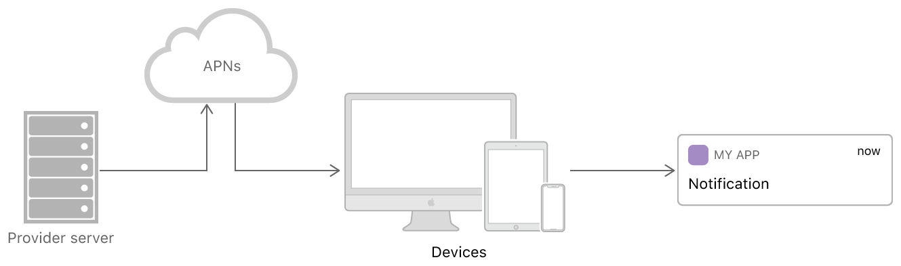

> Navigation: [Technologies](../technologies.md) · [User Notifications](../usernotifications.md)

# Setting up a remote notification server

Generate notifications and push them to user devices.

## Overview

Use remote notifications (also known as _push notifications_) to push small amounts of data to devices that use your app, even when your app isn’t running. Apps use notifications to provide important information to users. For example, a messaging service sends remote notifications when new messages arrive.

The delivery of remote notifications involves several key components:

- Your company’s server, known as the _provider server_
- Apple Push Notification service (APNs)
- The user’s device
- Your app running on the user’s device

Remote notifications begin with your company’s server. You decide which notifications you want to send to your users, and when to send them. When it’s time to send a notification, you generate a request that contains the notification data and a unique identifier for the user’s device. You then forward your request to APNs, which handles the delivery of the notification to the user’s device. Upon receipt of the notification, the operating system on the user’s device handles any user interactions and delivers the notification to your app.

Your company’s provider server communicates with Apple Push Notification service, which in turn communicates with the user’s devices.

You’re responsible for setting up a provider server (or servers) and for configuring your app to handle notifications on the user’s device. Apple manages everything in between, including the presentation of notifications to the user. You must also have an app running on the user’s device that can communicate with your server and provide necessary information. For information about how to configure your app to handle remote notifications, see [Registering your app with APNs](registering-your-app-with-apns.md).

> [!tip] Tip
> If you’re setting up a provider server to send push notifications to users in Safari and other browsers, see [Sending web push notifications in web apps and browsers](sending-web-push-notifications-in-web-apps-and-browsers.md).

### Build custom infrastructure for notifications

Setting up a remote notification server consists of a few key tasks. How you implement these tasks depends on your infrastructure. Use the technologies that are appropriate for your company:

- Write code to receive device tokens from instances of your app running on user devices, and to associate those tokens with your users’ accounts. See [Registering your app with APNs](registering-your-app-with-apns.md).
- Determine when to send notifications to your users, and write code to generate notification payloads. See [Generating a remote notification](generating-a-remote-notification.md).
- Manage a connection to APNs using HTTP/2 and TLS. See [Sending notification requests to APNs](sending-notification-requests-to-apns.md).
- Write code to generate POST requests that contain your payloads, and send those requests over your HTTP/2 connection. See [Sending notification requests to APNs](sending-notification-requests-to-apns.md).
- Regenerate your token periodically for token-based authentication. See [Establishing a token-based connection to APNs](establishing-a-token-based-connection-to-apns.md).

### Establish a trusted connection to APNs

Communication between your provider server and APNs must take place over a secure connection. Creating a secure connection requires installing the [AAA Certificate Services root certificate](https://comodoca.my.salesforce.com/sfc/dist/version/download/?oid=00D1N000002Ljih&ids=0683l00000G9fLm&d=%2Fa%2F3l000000VbG0%2Fh70Hv.GWfGuD79pR_if0MtGjJFcUj.NRZS_RLqEyC_4&asPdf=false) and [SHA-2 Root : USERTrust RSA Certification Authority certificate](https://www.sectigo.com/knowledge-base/detail/Sectigo-Intermediate-Certificates/kA01N000000rfBO) on each of your provider servers.

If your provider server runs macOS Sequoia or later, both AAA and UserTrust Certificate Services root certificate are in the keychain by default. On other systems, you might need to install this certificate yourself. You can download the “AAACertificateServices 5/12/2020” certificate from the [Sectigo KnowledgeBase](https://support.sectigo.com/Com_KnowledgeDetailPage?Id=kA03l00000117cL) website and “SHA-2 Root : USERTrust RSA Certification Authority” certificate from the [Sectigo KnowledgeBase](https://www.sectigo.com/knowledge-base/detail/Sectigo-Intermediate-Certificates/kA01N000000rfBO) website.

> [!tip] Tip
> APNs is migrating from AAA to UserTrust Certificate Services root certificate. For migration dates, consult [Developer News](https://developer.apple.com/news/?id=09za8wzy).

To send notifications, your provider server must establish either token-based or certificate-based trust with APNs using HTTP/2 and TLS. Both techniques have advantages and disadvantages, so decide which technique is best for your company.

- To set up token-based trust with APNs, see [Establishing a token-based connection to APNs](establishing-a-token-based-connection-to-apns.md).
- To set up certificate-based trust with APNs, see [Establishing a certificate-based connection to APNs](establishing-a-certificate-based-connection-to-apns.md).

### Understand what APNs provides

APNs makes every effort to deliver your notifications, and to deliver them with the best user experience:

- APNs manages an accredited, encrypted, and persistent IP connection to the user’s device.
- APNs can store notifications for a device that’s currently offline. APNs then forwards the stored notifications when the device comes online.
- If APNs doesn’t deliver a notification immediately, either for device power considerations or because the destination is offline, it may coalesce notifications for the same bundle ID.

## Topics

### Server tasks

- [Registering your app with APNs](registering-your-app-with-apns.md) — Communicate with Apple Push Notification service (APNs) and receive a unique device token that identifies your app.
- [Generating a remote notification](generating-a-remote-notification.md) — Send notifications to the user’s device with a JSON payload.
- [Pushing background updates to your App](pushing-background-updates-to-your-app.md) — Deliver notifications that wake your app and update it in the background.
- [Establishing a connection to Apple Push Notification service (APNs)](establishing-a-connection-to-apns.md) — Secure your communications with APNs to send API requests.

### Security

- [Establishing a token-based connection to APNs](establishing-a-token-based-connection-to-apns.md) — Secure your communications with Apple Push Notification service (APNs) by using stateless authentication tokens.
- [Establishing a certificate-based connection to APNs](establishing-a-certificate-based-connection-to-apns.md) — Secure your communications with Apple Push Notification service (APNs) by installing a certificate on your provider server.

### Device push notifications

- [Sending notification requests to APNs](sending-notification-requests-to-apns.md) — Transmit your remote notification payload and device token information to Apple Push Notification service (APNs).
- [Handling notification responses from APNs](handling-notification-responses-from-apns.md) — Respond to the status codes that the APNs servers return.
- [Viewing the status of push notifications using Metrics and APNs](viewing-the-status-of-push-notifications-using-metrics-and-apns.md) — Monitor and interpret the status of your push notifications with Apple Push Notification service (APNs).

### Broadcast push notifications

- [Setting up broadcast push notifications](setting-up-broadcast-push-notifications.md) — Enable broadcast capability for Apple Push Notifications service (APNs).
- [Sending channel management requests to APNs](sending-channel-management-requests-to-apns.md) — Manage channels that your application uses for broadcast push notifications.
- [Sending broadcast push notification requests to APNs](sending-broadcast-push-notification-requests-to-apns.md) — Transmit your broadcast notification payload to Apple Push Notifications service (APNs).
- [Handling error responses from Apple Push Notification service](handling-error-responses-from-apns.md) — Respond to the status codes returned by APNs servers.

### Troubleshooting

- [Troubleshooting push notifications](troubleshooting-push-notifications.md) — Debug your server to send push notifications with device and broadcast push notifications.

## See Also

### Remote notifications

- [Sending push notifications using command-line tools](sending-push-notifications-using-command-line-tools.md) — Use basic macOS command-line tools to send push notifications to Apple Push Notification service (APNs).
- [Testing notifications using the Push Notification Console](testing-notifications-using-the-push-notification-console.md) — Send test notifications and access delivery logs to test your app’s integration with Apple Push Notification service (APNs).
