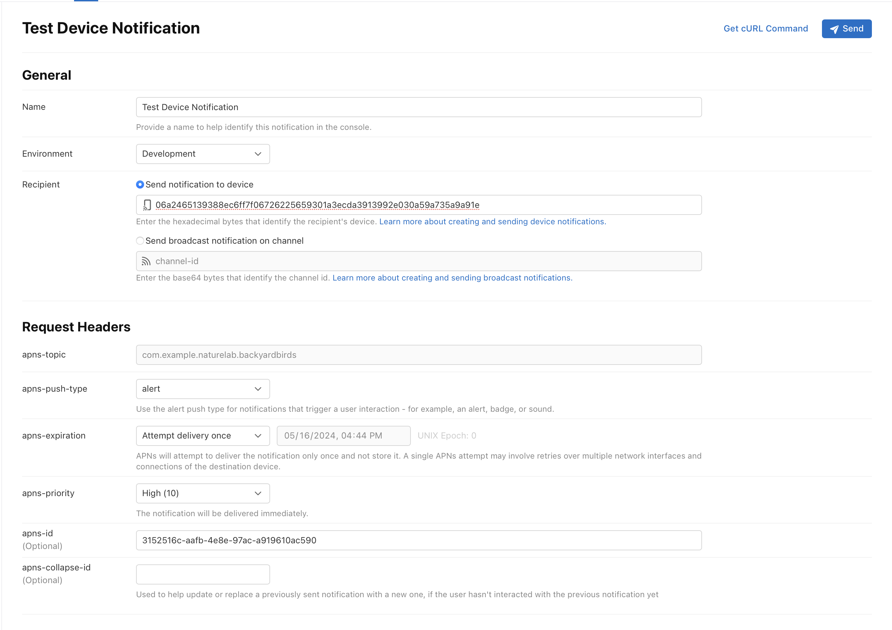
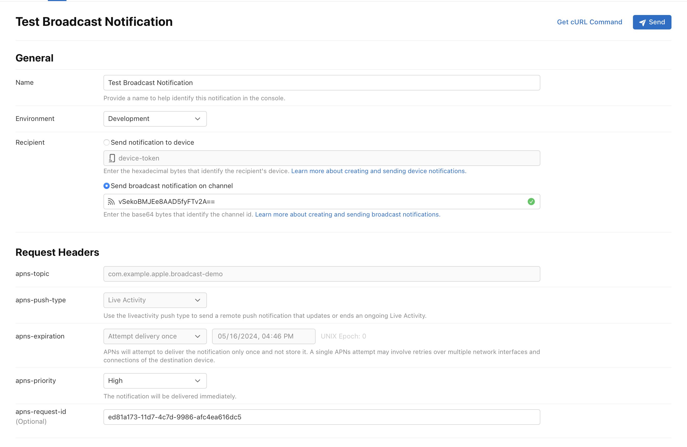
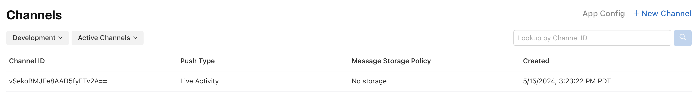
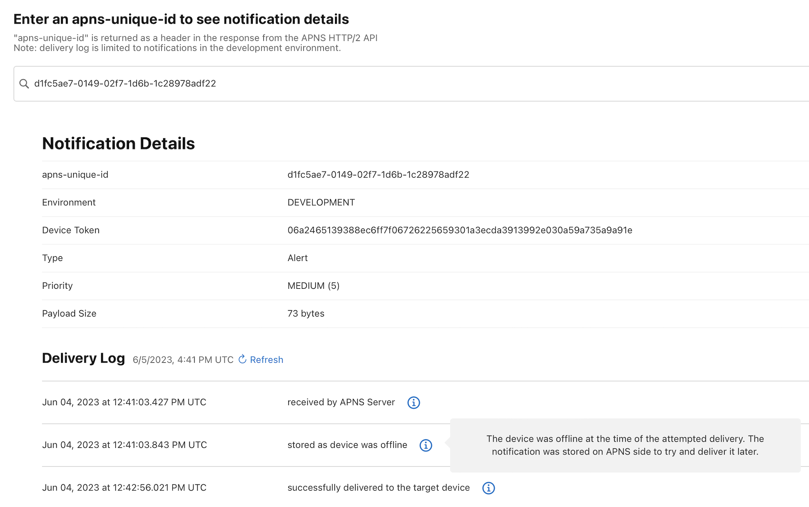
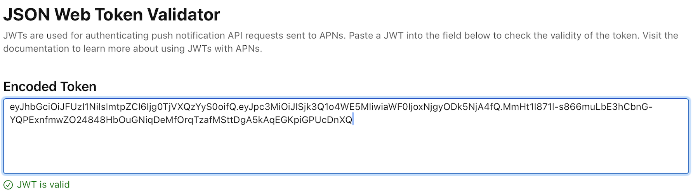
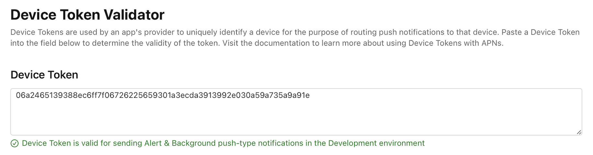
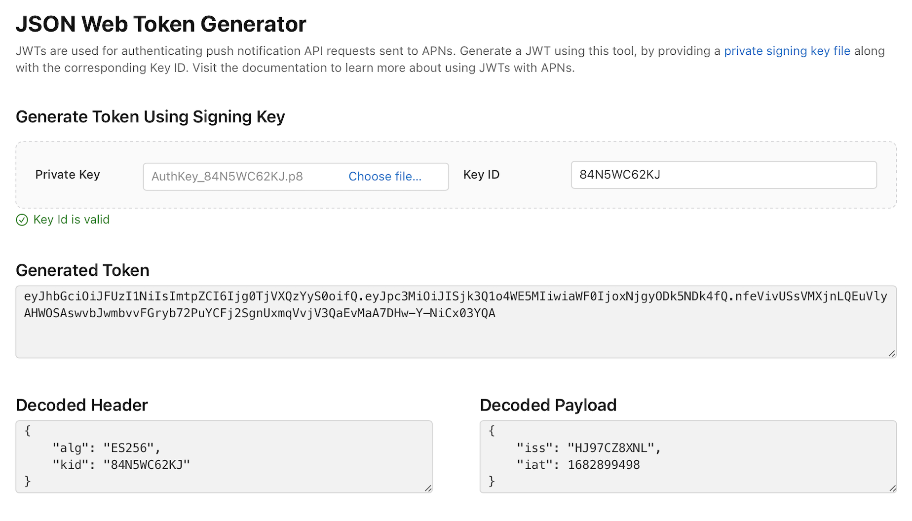

> Navigation: [Technologies](../technologies.md) · [User Notifications](../usernotifications.md)

# Testing notifications using the Push Notification Console

Article

Send test notifications and access delivery logs to test your app’s integration with Apple Push Notification service (APNs).

## Overview

Push notifications inform people about the most recent updates, news, or events from your app. A successful notification ensures that people get relevant information from your app, even when they’re not using it. Testing notifications before you send them can ensure functionality and reliability, and enhance the experience of your app.

The [Push Notification Console](https://icloud.developer.apple.com/dashboard) is a web interface; use it to send tests both for device tokens and channels. The console lets you monitor delivery status for device push notifications in the development environment. It contains a delivery log, in which you can gain insight into your notification history. The Push Notification Console also provides status information about your notification, such as when APNs receives your notification, and if it goes to persistent storage.

Broadcast push notifications use channels to reach a large audience for updates on Live Activities. You can use the Push Notification Console to create channels and manage them; you can review channels, delete existing channels, and send push notifications on a channel.

The console also provides additional tooling to help debug and authenticate tokens used in Apple Push Notification service (APNs). You can determine the validity of your tokens to troubleshoot sending a notification and generate a JSON Web token (JWT).

> [!note] Related sessions from WWDC
> Session 10025: [Meet Push Notifications Console](https://developer.apple.com/videos/play/wwdc2023/10025/) Session 9162: [Broadcast updates to your Live Activities](https://developer.apple.com/videos/play/wwdc2024/9162/)

> [!tip] Tip
> Refer to [Viewing the status of push notifications using Metrics and APNs](viewing-the-status-of-push-notifications-using-metrics-and-apns.md).

### Create and send a test push notification

The Push Notification Console provides guidance on configuring various push notification parameters like push type, priority, and expiration as well as constructing the payload for the notification. Push Notification Console keeps a history of all the notifications sent from this page for 30 days. You can access the history in the sidebar on the left. All team members can access the console and view the history of the push notifications sent.

Use the payload editor to input raw JSON directly or construct the payload using the editor’s interface. The payload format changes depending on the push type you select for the notification, and as a result, the layout of the editor may change accordingly. For more information about construction of the notification payload, refer to [Generating a remote notification](generating-a-remote-notification.md).

The screenshot below is an example of using a test notification form to send a test notification to a device token in the Push Notification Console.

A screenshot of a form in the Push Notification console used as an example to send a test notification to a device token.

The screenshot below is an example of a form used to send a test notification to a channel in the Push Notification Console.

After entering the required information for a push notification request, you can generate the corresponding cURL command by clicking the Get cURL Command button. The generated cURL command includes the necessary headers, authentication information, and payload data for the request. Use this to send the same notification by connecting directly to APNs from the command line. For more information, refer to [Sending push notifications using command-line tools](sending-push-notifications-using-command-line-tools.md).

In the APNs production environment, only team members with the admin role can send push notifications. Nonadmins and admins can send pushes to the APNs development environment. For more information about the request parameters, refer to [Sending notification requests to APNs](sending-notification-requests-to-apns.md).

### Manage channels for broadcast capability

Use the push notification console to manage your channels in the Channels tab. You can create new channels and delete existing channels that aren’t relevant. When you create a new channel, the console provides guidance on configuring parameters required for channel creation: environment and message storage policy. The parameters you specify can’t be changed later. For more information about message storage policy, refer to [Sending channel management requests to APNs](sending-channel-management-requests-to-apns.md). You can also search a specific channel you created using the channel ID returned by APNs. The screenshot below is an example of a channel created using the Push Notification Console. At the top right corner, you can create a new channel, and underneath that, you can search for a specific channel with the channel ID.

A screenshot of a channel created using the Push Notification Console. Starting from left is a Channel ID, the push type, message storage policy, and the date that the channel was created. 

### Verify delivery in the development environment

After APNs receives a push notification, it can undergo several state transitions before it reaches the device. The delivery of a push notification depends on a device’s battery, network connectivity, and other factors. APNs might deliver the notification immediately, defer delivery, make multiple attempts to deliver, or discard it based on those conditions. For more information, see [Viewing the status of push notifications using Metrics and APNs](viewing-the-status-of-push-notifications-using-metrics-and-apns.md).

You can use the Delivery Log to monitor a notification’s delivery and give you insight into what happens to the notifications you send. To access this information, provide an “apns-unique-id”, an identifier that APNs returns in response to each notification request.

To view the delivery log for a particular push notification sent to APNs, you need to select the bundle ID that you used to send the notification from the dashboard. You can only query delivery logs of notifications sent for the selected bundle ID. Delivery logs are only available in the development environment. You can access the logs for up to seven days after you send the notification. Download and save the logs to retain them for future analysis or reference.

### Debug APNs tokens

The authentication token that you include with your notification requests uses the JSON Web Token (JWT) specification. You need a private key to sign the JWT. You can manage those keys through the developer portal. A team can have multiple signing keys. Each key is uniquely identified by a key ID. For more information about key management, see the “Manage keys” section in [Developer Account Help](https://developer.apple.com/help/account/#/devcdfbb56a3).

You can determine the validity of an authentication token by using the JWT Validator. Whether the token is valid depends on many factors, including but not limited to:

- Signature validity (public/private key match)
- Team ID
- Expiration

If the provided key is invalid, the tool gives the reason why it’s invalid. For debugging purposes, the validator parses and displays the key-value pairs that constitute the token’s header and payload. This helps identify any authentication problems you may face when using these credentials to initiate push notification requests. For more information on the token-based authentication that APNs uses, refer to [Establishing a token-based connection to APNs](establishing-a-token-based-connection-to-apns.md).

You can use the Device Token Validator to determine the validity of the device token. To verify a device token associated with a bundle ID, you need to select the respective bundle ID in the dashboard. For more information on getting a device token, see [Registering your app with APNs](registering-your-app-with-apns.md).

### Generate an authentication token

You can generate an authentication token using the JWT generator by providing your private signing key and key ID. You need to get a private key before you can generate a JWT. For more information, see [Create a private key to access a service](https://developer.apple.com/help/account/manage-keys/create-a-private-key/). The screenshot below shows the JSON Web Token Generator with the correct information in the Private Key and Key ID fields. The generator tells you whether your key is valid.

> [!note] Note
> The signing key isn’t uploaded anywhere, it’s only used in your browser.

## See Also

### Remote notifications

- [Setting up a remote notification server](setting-up-a-remote-notification-server.md) — Generate notifications and push them to user devices.
- [Sending push notifications using command-line tools](sending-push-notifications-using-command-line-tools.md) — Use basic macOS command-line tools to send push notifications to Apple Push Notification service (APNs).
