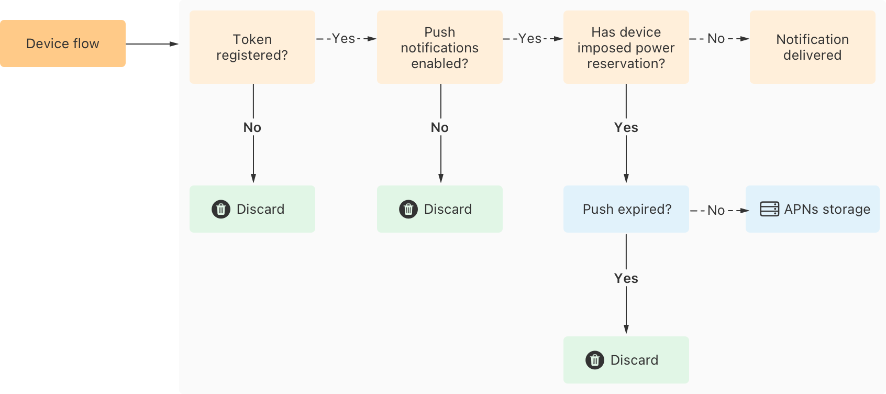
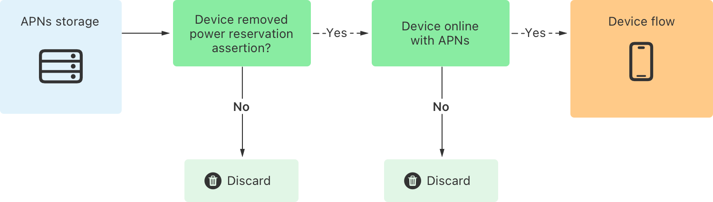

> Navigation: [Technologies](../technologies.md) · [User Notifications](../usernotifications.md) · [Setting up a remote notification server](setting-up-a-remote-notification-server.md)

# Viewing the status of push notifications using Metrics and APNs

Article

Monitor and interpret the status of your push notifications with Apple Push Notification service (APNs).

## Overview

Push notifications can help optimize the user experience for your app by delivering important and time-sensitive information. Knowing the status of your notifications and whether your audience actually received them provides clarity and a better experience for people who use your app. You can monitor the status of your push notifications, after APNs accepts your request, using Metrics. Metrics shows you if APNs delivers or discards your push notifications, or saves them in persistent storage to attempt delivery later.

### Get access to the Push Notifications Console

The [Push Notifications Console](https://icloud.developer.apple.com/dashboard/notifications) is available to developers with valid WWDR developer accounts. To get access to the Push Notifications Console for your application, sign in with your developer account credentials. Verify that you’re part of the WWDR development team that registered the bundle ID of your application. Ask the admin of your WWDR team to add you to the team with the appropriate role. For more information, refer to [Invite team members](https://developer.apple.com/help/account/manage-your-team/invite-team-members).

The console is available to all team members, but certain features are only accessible to the admin role. For example, any team member can send a push notification to the APNs development environment, but only an admin user can send a push notification to the APNs production environment. For more details, refer to [Testing notifications using the Push Notification Console](testing-notifications-using-the-push-notification-console.md). Similar access restrictions apply when you’re exporting delivery metrics. For more information, refer to [Exporting delivery metrics logs](https://developer.apple.com/documentation/pushkit/exporting-delivery-metrics-logs). To learn more about managing a team member’s roles, refer to [Roles and access](https://developer.apple.com/help/account/manage-your-team/roles).

### View your metrics

The [Push Notification Console](https://icloud.developer.apple.com/dashboard) Metrics tab provides aggregated, rounded reports on notification states as your notifications pass through APNs. Under the Metrics tab, it shows multiple notification statuses, such as delivered, stored, and discarded. Successful delivery depends on multiple factors, including:

- Notification attributes, such as push priority and push type
- The destination device, such as the device’s power state
- External factors, such as the device’s connection quality (both cellular and Wi-Fi)
- A person’s actions, such as disabling push notifications or background refresh

If APNs stores or discards a notification, Metrics seperates the notifications into categories that explain why that status occured. For example, _Stored - Device Offline_ means APNs stored the notification because the device was offline. Metrics collects the notification status data when a notification reaches a specific state. For example, a notification for an offline device may get delivered later when the device is back online. For that notification, saving in APNs storage and delivery are seperate data points for a single notification.

Use the notification metrics to observe adoption of your new notification features or to tune your existing solution. For example, an uptick of _Discarded - Disabled_ means that people who use your app find notifications for your app irrelevant or noisy. Consider emphasizing on events that are interesting for people who use your app. Check the number of notifications preserved in APNs storage for offline devices and compare it with the number of push notifications delivered from APNs storage. If the former is significantly higher, it’s a strong indication that a large volume of notifications are sent to devices that aren’t active with APNs. To preserve privacy, APNs doesn’t track states of offline devices, other than preserving notifications. In this scenario, consider building a system to remove push tokens of inactive users and save on resources for your service.

### Interpret data about discarded notifications

The figure below shows the logical flow that APNs takes to deliver a push notification to the destination device.

A flow diagram depicting the steps taken by APNs to deliver a push notification to the destination device. Starting on the left, APNs accepts the push notification and checks if the token is registered and if push notifications is enabled. If the answer is no, APNs discards the notification and checks if the destination device imposed power reservation. If the answer is no, then the notification gets delivered to the destination device. Otherwise, APNs checks if the push is expired. If the answer is yes, APNs discards the notification. If the answer is no, APNs stores the notification in APNs storage to send at a later time.

After viewing or exporting your notification metrics, you may see that APNs discarded some notifications. APNs discards a push notification for a number of reasons:

- Your push token is no longer active on the destination device because a person removed your application or the push token for your application changes. For more information, see [Registering your app with APNs](registering-your-app-with-apns.md).
- A person disabled push notifications for your app in Settings on the destination device. For more information, see [Asking permission to use notifications](asking-permission-to-use-notifications.md).
- The push notification expires. You can adjust the expiration attribute accordingly for future notifications. For more information, see [Sending notification requests to APNs](sending-notification-requests-to-apns.md).

You can use the Push Notification Console to send test notifications. For information on how to test notifications, see [Testing notifications using the Push Notification Console](testing-notifications-using-the-push-notification-console.md).

### Interpret data about stored notifications

After viewing or exporting your notification metrics, you may see that APNs stored some notifications in storage. APNs stores a push notification for a number of reasons. If the destination device isn’t connected to APNs, then APNs saves the push notification in persistent storage to deliver later (unless it expires). APNs attempts to deliver an unexpired, stored push notification when the destination device connects to the APNs server the next time. When APNs delivers the push notification to the destination device, the delivery may take multiple attempts and some attempts may reach across multiple network interfaces.

If the destination device is connected to APNs but it has power restrictions, APNs may defer delivery of a notification to conserve battery. In that case, APNs stores the notification in persistent storage. When the device revises its power assertions and removes the restriction on delivery, APNs reattempts to deliver the stored notification.

When APNs tries to deliver a notification from the APNs persistent storage, it might get delivered successfully or get discarded, depending on a number of factors. See the figure below to understand the logical flow of a push notification getting discarded in APNs persistant storage.

A flow diagram depicting the steps taken by APNs to deliver a push notification to the destination device after the notification is in APNs storage. APNs checks if the device removed power reservation assertion and if the device is online with APNs. If the answer is no, then APNs discards the notification. If the answer is yes, then APNs sends the notification back to device flow. In device flow, APNs reattempts to deliver the notfication.

While in APNs persistent storage, other notifications can overwrite notifications you send for the same device token and bundle ID. APNs persistent storage only stores one notification per application per device. If you send multiple notifications for the same bundle ID while APNs can’t deliver the notifications, APNs preserves only one of the accepted push notifications. Most of the time, it’s the last notification sent, but because APNs doesn’t have any ordering guarantees, this isn’t always the case.

> [!note] Note
> When storing a push notification, APNs uses either the specified expiry or defaults to time-to-live (TTL) of 30 days, whichever comes first.

If your push notification expires before the destination device connects to APNs and removes power state restrictions, APNs discards the notification. Your app may need to synchronize with your application server about the information missed due to discarded, expired, or overwritten notification.

## See Also

### Device push notifications

- [Sending notification requests to APNs](sending-notification-requests-to-apns.md) — Transmit your remote notification payload and device token information to Apple Push Notification service (APNs).
- [Handling notification responses from APNs](handling-notification-responses-from-apns.md) — Respond to the status codes that the APNs servers return.
