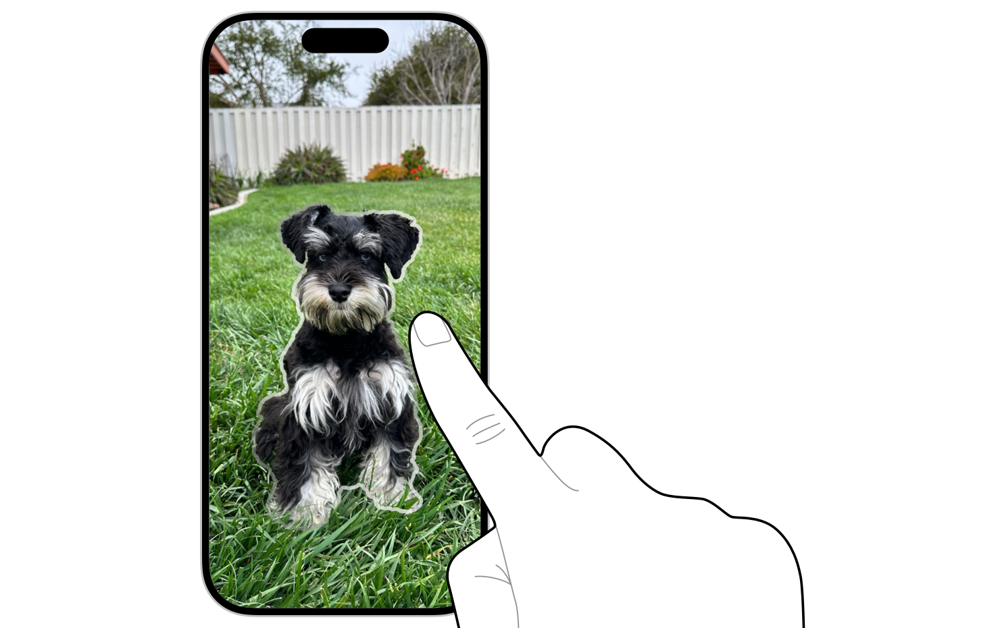

> Navigation: [Technologies](technologies.md)

# Vision

<sub>Framework</sub>

Analyze image and video content in your app using computer vision algorithms for object detection, text recognition, and image segmentation.

## Overview

The Vision framework provides pretrained machine learning models for computer vision tasks. Use Vision to analyze still images and video for a variety of purposes, including:

- Recognizing text in 26 languages across everyday objects, documents, and photos
- Detecting barcodes and QR codes
- Detecting faces and analyzing facial features
- Isolating people and foreground objects with subject lifting
- Tracking body poses of people and animals for action and gesture recognition
- Classifying images for categorization and search
- Measuring image quality and comparing visual similarity



All Vision analysis tasks follow the same steps: create a request, perform it on an image or video frame, and read the resulting observations. For example, to detect text in an image, you create a request for the type of analysis you want to perform. Each request conforms to the [VisionRequest](vision/visionrequest.md) protocol.

```swift
let request = RecognizeTextRequest()
let observations = try await request.perform(on: imageData)

// Store observations for use in your app
var scannedText: [String] = []

for observation in observations {
    scannedText.append(observation.transcript)
}
```

The request returns an array of observation objects that contain the image-analysis results. Each observation type provides specific details about the analysis results, such as recognized text, confidence scores, and bounding box locations.

For observations that describe image locations -—- such as face bounding boxes or text regions -—- Vision uses a normalized coordinate system where values range from `0.0` to `1.0`, with the origin at the lower-left corner. For more information on coordinate types and conversion helpers, see [Image locations and regions](https://developer.apple.com/documentation/vision#Image-locations-and-regions).

You can also perform multiple requests on the same image, for more information see [ImageRequestHandler](vision/imagerequesthandler.md) in the Request handlers section.

This pattern applies to all Vision requests, whether you’re detecting faces, tracking motion, analyzing image quality, or performing custom analysis with Core ML models. Each request type returns observations specific to its analysis task.

> [!note] Note
> Starting in iOS 18.0, the Vision framework provides a new Swift-only API. See [Original Objective-C and Swift API](vision/original-objective-c-and-swift-api.md) to view the original API.

## Topics

### Text and document analysis

- [Locating and displaying recognized text](vision/locating-and-displaying-recognized-text.md) — Perform text recognition on a photo using the Vision framework’s text-recognition request.
- [Recognizing tables within a document](vision/recognize-tables-within-a-document.md) — Scan a document that contains a table and extract its content in a formatted way.
- [DetectBarcodesRequest](vision/detectbarcodesrequest.md) — A request that detects barcodes in an image.
- [DetectDocumentSegmentationRequest](vision/detectdocumentsegmentationrequest.md) — A request that detects rectangular regions that contain text in the input image.
- [DetectTextRectanglesRequest](vision/detecttextrectanglesrequest.md) — An image-analysis request that finds regions of visible text in an image.
- [RecognizeDocumentsRequest](vision/recognizedocumentsrequest.md) — An image-analysis request to scan an image of a document and provide information about its structure.
- [RecognizeTextRequest](vision/recognizetextrequest.md) — An image-analysis request that recognizes text in an image.

### Facial analysis

- [Analyzing a selfie and visualizing its content](vision/analyzing-a-selfie-and-visualizing-its-content.md) — Calculate face-capture quality and visualize facial features for a collection of images using the Vision framework.
- [DetectFaceCaptureQualityRequest](vision/detectfacecapturequalityrequest.md) — A request that produces a floating-point number that represents the capture quality of a face in a photo.
- [DetectFaceLandmarksRequest](vision/detectfacelandmarksrequest.md) — An image analysis request that finds facial features like eyes and mouth in an image.
- [DetectFaceRectanglesRequest](vision/detectfacerectanglesrequest.md) — A request that finds faces within an image.

### Image segmentation and subject lifting

- [Segmenting objects using taps, scribbles or rectangles](vision/segmenting-objects-using-taps-scribbles-or-rectangles.md) — Select objects or regions in a photo using taps, scribbles, or rectangle selection, and generate a segmentation mask using the iterative segmentation API.
- [GenerateForegroundInstanceMaskRequest](vision/generateforegroundinstancemaskrequest.md) — A request that generates an instance mask of noticeable objects to separate from the background.
- [GeneratePersonInstanceMaskRequest](vision/generatepersoninstancemaskrequest.md) — A request that produces a mask of individual people it finds in the input image.
- [GeneratePersonSegmentationRequest](vision/generatepersonsegmentationrequest.md) — A request that produces a matte image for a person it finds in the input image.
- [GenerateIterativeSegmentationRequest](vision/generateiterativesegmentationrequest.md) — A request that generates a segmentation mask from points, a rectangle, or a scribble. _(beta)_

### Pose analysis

- [DetectAnimalBodyPoseRequest](vision/detectanimalbodyposerequest.md) — A request that detects an animal body pose.
- [DetectHumanBodyPose3DRequest](vision/detecthumanbodypose3drequest.md) — A request that detects points on human bodies in 3D space, relative to the camera.
- [DetectHumanBodyPoseRequest](vision/detecthumanbodyposerequest.md) — A request that detects a human body pose.
- [DetectHumanHandPoseRequest](vision/detecthumanhandposerequest.md) — A request that detects a human hand pose.
- [Supporting Pose Types](vision/supporting-pose-types.md) — Types you use when working with pose analysis.

### Image classification and recognition

- [Classifying images for categorization and search](vision/classifying-images-for-categorization-and-search.md) — Analyze and label images using a Vision classification request.
- [ClassifyImageRequest](vision/classifyimagerequest.md) — A request to classify an image.
- [DetectHumanRectanglesRequest](vision/detecthumanrectanglesrequest.md) — A request that finds rectangular regions that contain people in an image.
- [RecognizeAnimalsRequest](vision/recognizeanimalsrequest.md) — A request that recognizes animals in an image.

### Shape and edge detection

- [DetectContoursRequest](vision/detectcontoursrequest.md) — A request that detects the contours of the edges of an image.
- [DetectHorizonRequest](vision/detecthorizonrequest.md) — An image-analysis request that determines the horizon angle in an image.
- [DetectRectanglesRequest](vision/detectrectanglesrequest.md) — An image-analysis request that finds projected rectangular regions in an image.

### Image quality and saliency analysis

- [Implementing saliency-based image cropping in iOS and watchOS](vision/implementing-saliency-based-image-cropping-in-ios-and-watchos.md) — Crop regions most likely drawing people’s attention from an image in your iOS or watchOS app.
- [Generating high-quality thumbnails from videos](vision/generating-thumbnails-from-videos.md) — Identify the most visually pleasing frames in a video by using the image-aesthetics scores request.
- [CalculateImageAestheticsScoresRequest](vision/calculateimageaestheticsscoresrequest.md) — A request that analyzes an image for aesthetically pleasing attributes.
- [DetectLensSmudgeRequest](vision/detectlenssmudgerequest.md) — A request that detects a smudge on a lens from an image or video frame capture.
- [GenerateAttentionBasedSaliencyImageRequest](vision/generateattentionbasedsaliencyimagerequest.md) — An object that produces a heat map that identifies the parts of an image most likely to draw attention.
- [GenerateObjectnessBasedSaliencyImageRequest](vision/generateobjectnessbasedsaliencyimagerequest.md) — A request that generates a heat map that identifies the parts of an image most likely to represent objects.

### Motion and object tracking

- [DetectTrajectoriesRequest](vision/detecttrajectoriesrequest.md) — A request that detects the trajectories of shapes moving along a parabolic path.
- [TrackObjectRequest](vision/trackobjectrequest.md) — An image analysis request that tracks the movement of a previously identified object across multiple images or video frames.
- [TrackOpticalFlowRequest](vision/trackopticalflowrequest.md) — A request that determines the direction change of vectors for each pixel from a previous to current image.
- [TrackRectangleRequest](vision/trackrectanglerequest.md) — An image-analysis request that tracks movement of a previously identified rectangular object across multiple images or video frames.

### Image registration and comparison

- [GenerateImageFeaturePrintRequest](vision/generateimagefeatureprintrequest.md) — An image-based request to generate feature prints from an image.
- [TrackHomographicImageRegistrationRequest](vision/trackhomographicimageregistrationrequest.md) — An image-analysis request that you track over time to determine the perspective warp matrix necessary to align the content of two images.
- [TrackTranslationalImageRegistrationRequest](vision/tracktranslationalimageregistrationrequest.md) — An image-analysis request that you track over time to determine the affine transform necessary to align the content of two images.

### Custom Core ML integration

- [CoreMLRequest](vision/coremlrequest.md) — An image-analysis request that uses a Core ML model to process images.

### Foundation Models integration

- [BarcodeReaderTool](vision/barcodereadertool.md) — A tool that scans machine-readable codes in an image. _(beta)_
- [OCRTool](vision/ocrtool.md) — A tool that recognizes text in an image. _(beta)_

### Protocols

- [ImageProcessingRequest](vision/imageprocessingrequest.md) — A type for image-analysis requests that focus on a specific part of an image.
- [PoseProviding](vision/poseproviding.md) — An observation that provides a collection of joints that make up a pose.
- [StatefulRequest](vision/statefulrequest.md) — The protocol for a type that builds evidence of a condition over time.
- [TargetedRequest](vision/targetedrequest.md) — A type for analyzing two images together.
- [VisionObservation](vision/visionobservation.md) — A type for objects produced by image-analysis requests.
- [VisionRequest](vision/visionrequest.md) — A type for image-analysis requests.
- [DownloadableAssetsRequest](vision/downloadableassetsrequest.md) — A request whose execution depends on assets that may need to be downloaded. _(beta)_
- [DownloadableAssetsRequestStatus](vision/downloadableassetsrequeststatus.md) — The status of the assets required by a [DownloadableAssetsRequest](vision/downloadableassetsrequest.md). _(beta)_

### Request handlers

- [ImageRequestHandler](vision/imagerequesthandler.md) — An object that processes one or more image-analysis requests pertaining to a single image.
- [TargetedImageRequestHandler](vision/targetedimagerequesthandler.md) — An object that performs image-analysis requests on two images.
- [VideoProcessor](vision/videoprocessor.md) — An object that performs offline analysis of video content.

### Image locations and regions

- [NormalizedPoint](vision/normalizedpoint.md) — A point in a 2D coordinate system.
- [NormalizedRect](vision/normalizedrect.md) — The location and dimensions of a rectangle.
- [NormalizedRegion](vision/normalizedregion.md) — A polygon composed of normalized points.
- [NormalizedCircle](vision/normalizedcircle.md) — The center point and radius of a 2D circle.
- [BoundingBoxProviding](vision/boundingboxproviding.md) — A protocol for objects that have a bounding box.
- [BoundingRegionProviding](vision/boundingregionproviding.md) — A protocol for objects that have a defined boundary in an image.
- [QuadrilateralProviding](vision/quadrilateralproviding.md) — A protocol for objects that have a bounding quadrilateral.
- [CoordinateOrigin](vision/coordinateorigin.md) — The origin of a coordinate system relative to an image.

### Errors

- [VisionError](vision/visionerror.md) — The errors that the framework produces.

### Legacy API

- [Original Objective-C and Swift API](vision/original-objective-c-and-swift-api.md)
