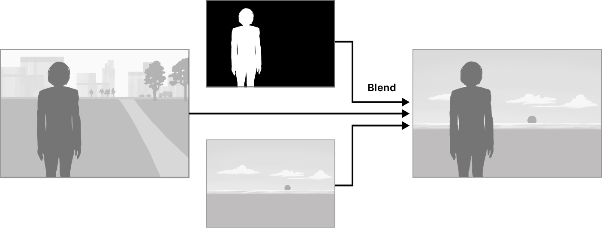
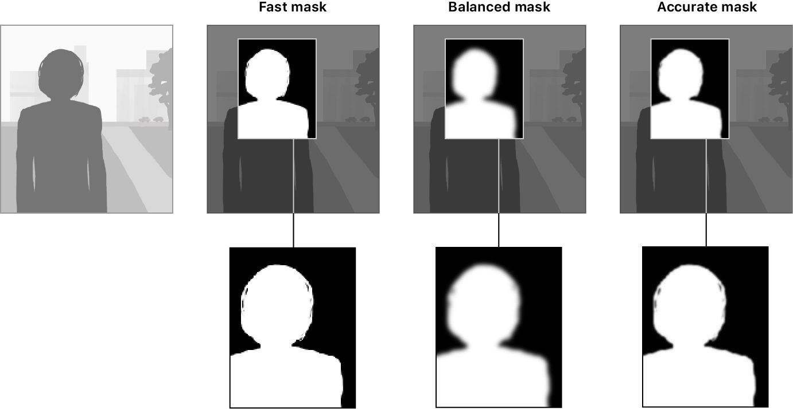

> Navigation: [Technologies](../technologies.md) · [Vision](../vision.md) · [Original Objective-C and Swift API](original-objective-c-and-swift-api.md)

# Applying Matte Effects to People in Images and Video

<sub>Sample Code</sub>

Generate image masks for people automatically by using semantic person-segmentation.

## Overview

You can use image masks to make selective adjustments to particular areas of an image. For example, the illustration below shows how to use a mask to perform a blend operation to replace the background behind the subject. 

<sub>An illustration of an image-processing operation that blends an original and mask image of a person with a replacement background image. The operation produces a new image that replaces the original background with the background image.</sub>

In iOS and tvOS 15 and macOS 12, Vision makes it simple for you to generate image masks for people it finds in images and video by using the [VNGeneratePersonSegmentationRequest](https://developer.apple.com/documentation/vision/vngeneratepersonsegmentationrequest) class. This new request type brings the semantic person-segmentation capabilities found in frameworks like ARKit and AVFoundation to the Vision framework.

The sample app uses the front-facing camera to capture video of the user. It runs a person-segmentation request on each video frame to produce an image mask. Then, it uses Core Image to perform a blend operation that replaces the original video frame’s background with an image that the app dynamically generates and colors based on the user’s head movements. Finally, it renders the image on screen using Metal.

> [!note] Note
> You must run the sample app on a physical device with iOS 15 or later.

### Prepare the Requests

The app uses two Vision requests to perform its logic: [VNDetectFaceRectanglesRequest](https://developer.apple.com/documentation/vision/vndetectfacerectanglesrequest) and [VNGeneratePersonSegmentationRequest](http://developer.apple.com/documentation/vision/vngeneratepersonsegmentationrequest). It uses `VNDetectFaceRectanglesRequest` to detect a bounding rectangle around a person’s face. The observation the request produces also includes the [roll](http://developer.apple.com/documentation/vision/vnfaceobservation/2980939-roll), [yaw](http://developer.apple.com/documentation/vision/vnfaceobservation/2980940-yaw), and new in iOS and tvOS 15 and macOS 12, the [pitch](http://developer.apple.com/documentation/vision/vnfaceobservation/3750998-pitch) angles of the rectangle. The app uses the angles to dynamically calculate background colors as the user moves their head.

```swift
// Create a request to detect face rectangles.
facePoseRequest = VNDetectFaceRectanglesRequest { [weak self] request, _ in
    guard let face = request.results?.first as? VNFaceObservation else { return }
    // Generate RGB color intensity values for the face rectangle angles.
    self?.colors = AngleColors(roll: face.roll, pitch: face.pitch, yaw: face.yaw)
}
facePoseRequest.revision = VNDetectFaceRectanglesRequestRevision3
```

`VNGeneratePersonSegmentationRequest` generates an image mask for a person it detects in an image. The app can set the value for request’s [qualityLevel](http://developer.apple.com/documentation/vision/vngeneratepersonsegmentationrequest/3750989-qualitylevel) property to `.fast`, `.balanced`, or `.accurate`; this value determines the quality of the generated mask as shown in the illustration below.



<sub>An image that shows the quality of the image masks that the request generates when it uses its .fast, .balanced, and .accurate quality level settings.</sub>

Because the sample processes live video, it chooses `.balanced`, which provides a mixture of accuracy and performance. It also sets the format of the mask image that the request generates to an 8-bit, one-component format where `0` represents black.

```swift
// Create a request to segment a person from an image.
segmentationRequest = VNGeneratePersonSegmentationRequest()
segmentationRequest.qualityLevel = .balanced
segmentationRequest.outputPixelFormat = kCVPixelFormatType_OneComponent8
```

### Perform the Requests on a Video Frame

The sample captures video from the front-facing camera and performs the requests on each frame. After the requests finish processing, the app retrieves the image mask from result of the segmentation request and passes it and original frame to the the app’s `blend(original:mask:)` method for further processing.

```swift
private func processVideoFrame(_ framePixelBuffer: CVPixelBuffer) {
    // Perform the requests on the pixel buffer that contains the video frame.
    try? requestHandler.perform([facePoseRequest, segmentationRequest],
                                on: framePixelBuffer,
                                orientation: .right)
    
    // Get the pixel buffer that contains the mask image.
    guard let maskPixelBuffer =
            segmentationRequest.results?.first?.pixelBuffer else { return }
    
    // Process the images.
    blend(original: framePixelBuffer, mask: maskPixelBuffer)
}
```

### Render the Results

The sample processes the results of the requests by taking the original frame, the mask image, and a background image that it dynamically generates based on the roll, pitch, and yaw angles of the user’s face. It creates a [CIImage](http://developer.apple.com/documentation/coreimage/ciimage) object for each image.

```swift
// Create CIImage objects for the video frame and the segmentation mask.
let originalImage = CIImage(cvPixelBuffer: framePixelBuffer).oriented(.right)
var maskImage = CIImage(cvPixelBuffer: maskPixelBuffer)

// Scale the mask image to fit the bounds of the video frame.
let scaleX = originalImage.extent.width / maskImage.extent.width
let scaleY = originalImage.extent.height / maskImage.extent.height
maskImage = maskImage.transformed(by: .init(scaleX: scaleX, y: scaleY))

// Define RGB vectors for CIColorMatrix filter.
let vectors = [
    "inputRVector": CIVector(x: 0, y: 0, z: 0, w: colors.red),
    "inputGVector": CIVector(x: 0, y: 0, z: 0, w: colors.green),
    "inputBVector": CIVector(x: 0, y: 0, z: 0, w: colors.blue)
]

// Create a colored background image.
let backgroundImage = maskImage.applyingFilter("CIColorMatrix",
                                               parameters: vectors)
```

The app then scales the mask image to fit the bounds of the captured video frame, and dynamically generates a background image using a `CIColorMatrix` filter.

It blends the images and sets the result as the current image, which causes the view to render it on screen.

```swift
// Blend the original, background, and mask images.
let blendFilter = CIFilter.blendWithRedMask()
blendFilter.inputImage = originalImage
blendFilter.backgroundImage = backgroundImage
blendFilter.maskImage = maskImage

// Set the new, blended image as current.
currentCIImage = blendFilter.outputImage?.oriented(.left)
```

## See Also

### Image sequence analysis

- [Detecting human actions in a live video feed](../createml/detecting-human-actions-in-a-live-video-feed.md) — Identify body movements by sending a person’s pose data from a series of video frames to an action-classification model.
- [Segmenting and colorizing individuals from a surrounding scene](segmenting-and-colorizing-individuals-from-a-surrounding-scene.md) — Use the Vision framework to isolate and apply colors to people in an image.
- [VNStatefulRequest](vnstatefulrequest.md) — An abstract request type that builds evidence of a condition over time.
- [VNGeneratePersonSegmentationRequest](vngeneratepersonsegmentationrequest.md) — An object that produces a matte image for a person it finds in the input image.
- [VNGeneratePersonInstanceMaskRequest](vngeneratepersoninstancemaskrequest.md) — An object that produces a mask of individual people it finds in the input image.
- [VNDetectDocumentSegmentationRequest](vndetectdocumentsegmentationrequest.md) — An object that detects rectangular regions that contain text in the input image.
- [VNSequenceRequestHandler](vnsequencerequesthandler.md) — An object that processes image-analysis requests for each frame in a sequence.

## Download

- [ApplyingMatteEffectsToPeopleInImagesAndVideo.zip](https://docs-assets.developer.apple.com/published/6419e39ee70c/ApplyingMatteEffectsToPeopleInImagesAndVideo.zip)
