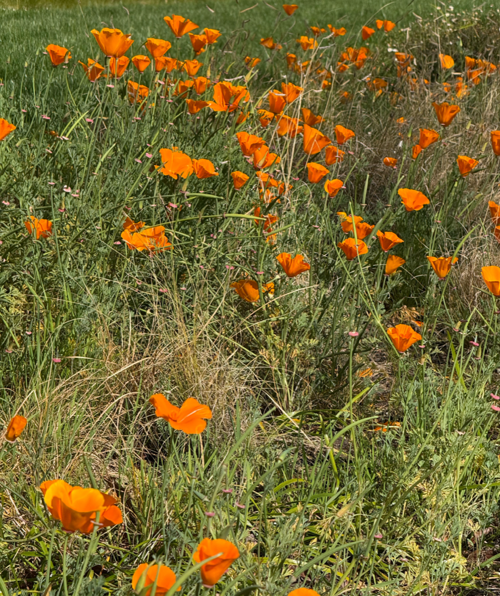
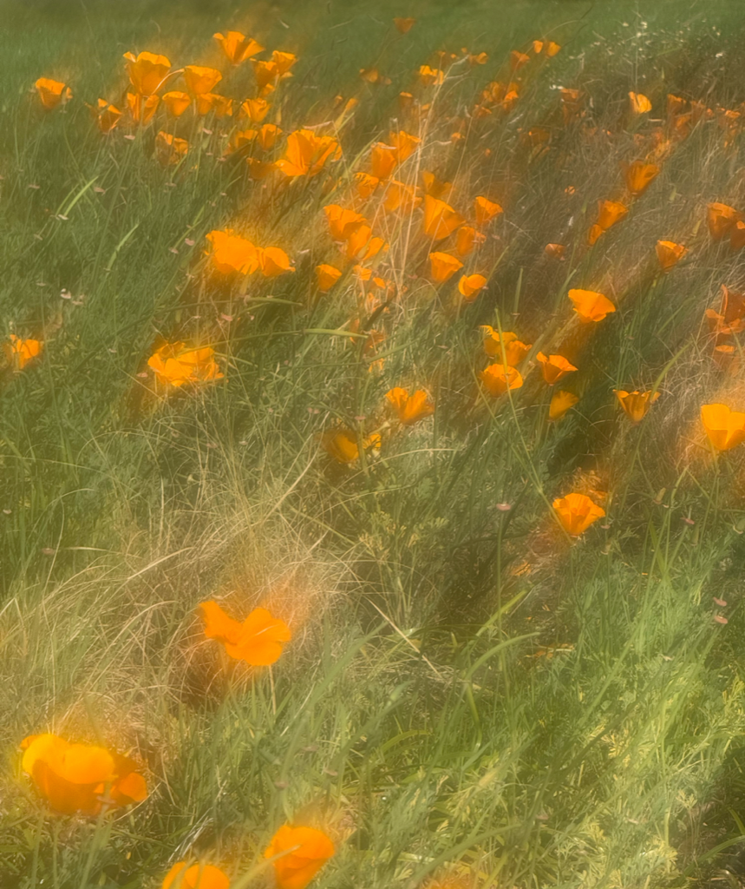

> Navigation: [Technologies](../technologies.md) · [Vision](../vision.md)

# DetectLensSmudgeRequest

<sub>Structure</sub>

A request that detects a smudge on a lens from an image or video frame capture.

<sub>iOS, iPadOS, Mac Catalyst, macOS, tvOS, visionOS, watchOS</sub>

```swift
struct DetectLensSmudgeRequest
```

## Overview

Use this request to detect whether an image or video is captured with a smudged lens. A smudge is anything that obscures a lens, like a fingerprint or raindrops, resulting in a hazy or blurry capture. Use this capability to find the best frame from a video or set of images.





Perform this request when detecting a smudge within an image or video frame. The request returns a [SmudgeObservation](smudgeobservation.md). This observation contains a floating-point [confidence](smudgeobservation/confidence.md) value in the range of  `0.0` to `1.0` indicating the probability that a capture has an impaired or smudged lens at capture time. A score of `1.0` represents a high probability the lens is smudged at capture time.

Running [DetectLensSmudgeRequest](detectlenssmudgerequest.md) requires a device with A14 Bionic and later or device with M1 and later.

> [!note] Note
> Certain types of content may be categorized as a smudge, such as naturally-blurred objects, long exposure, and motion blur while taking a photo. Make sure that you are using a request on a fixed capture where the device is stable when taking the image.

To use the properties of the request, add a [ImageProcessingRequest](imageprocessingrequest.md) to your chosen capture type.

```swift
func isGoodCapture(imageURL:URL) async throws -> Bool {
   
   // Set an optional threshold from 0.0 to 1.0 to flag a maximum level of smudge in your capture.
    let smudgeThreshold: Float = 0.9;
    let request = DetectLensSmudgeRequest(.revision1)
    let smudgeObservation = try await request.perform(on: imageURL)
    
    return (smudgeObservation.confidence < smudgeThreshold)
}
```

## Relationships

- **Conforms To**: [CustomStringConvertible](../swift/customstringconvertible.md), [Equatable](../swift/equatable.md), [Hashable](../swift/hashable.md), [ImageProcessingRequest](imageprocessingrequest.md), [Sendable](../swift/sendable.md), [SendableMetatype](../swift/sendablemetatype.md), [VisionRequest](visionrequest.md)

## Topics

### Creating a request

- [init(_:)](<detectlenssmudgerequest/init(__).md>) — Creates a request to detect whether the camera lens has a smudge.

### Performing a request

- [perform(on:orientation:)](<imageprocessingrequest/perform(on_orientation_)-80bya.md>) — Performs the request on an image URL and produces observations.
- [perform(on:orientation:)](<imageprocessingrequest/perform(on_orientation_)-3f3f1.md>) — Performs the request on image data and produces observations.
- [perform(on:orientation:)](<imageprocessingrequest/perform(on_orientation_)-qxxx.md>) — Performs the request on a Core Graphics image and produces observations.
- [perform(on:orientation:)](<imageprocessingrequest/perform(on_orientation_)-xspx.md>) — Performs the request on a pixel buffer and produces observations.
- [perform(on:orientation:)](<imageprocessingrequest/perform(on_orientation_)-3hddl.md>) — Performs the request on a Core Media buffer and produces observations.
- [perform(on:orientation:)](<imageprocessingrequest/perform(on_orientation_)-85ex1.md>) — Performs the request on a Core Image image and produces observations.

### Understanding the result

- [SmudgeObservation](smudgeobservation.md) — An observation that provides an overall score of the presence of a smudge in an image or video frame capture.

### Configuring a request

- [cropAndScaleAction](detectlenssmudgerequest/cropandscaleaction.md) — An optional setting that tells the algorithm how to scale an input image before generating the result.
- [ImageCropAndScaleAction](imagecropandscaleaction.md) — A scale to apply to an input image before performing a request.

### Getting the revision

- [revision](detectlenssmudgerequest/revision-swift.property.md) — The algorithm or implementation the request uses.
- [supportedRevisions](detectlenssmudgerequest/supportedrevisions.md) — The collection of revisions the request supports.
- [Revision](detectlenssmudgerequest/revision-swift.enum.md) — A type that describes the algorithm or implementation that the request performs.

## See Also

### Image quality and saliency analysis

- [Implementing saliency-based image cropping in iOS and watchOS](implementing-saliency-based-image-cropping-in-ios-and-watchos.md) — Crop regions most likely drawing people’s attention from an image in your iOS or watchOS app.
- [Generating high-quality thumbnails from videos](generating-thumbnails-from-videos.md) — Identify the most visually pleasing frames in a video by using the image-aesthetics scores request.
- [CalculateImageAestheticsScoresRequest](calculateimageaestheticsscoresrequest.md) — A request that analyzes an image for aesthetically pleasing attributes.
- [GenerateAttentionBasedSaliencyImageRequest](generateattentionbasedsaliencyimagerequest.md) — An object that produces a heat map that identifies the parts of an image most likely to draw attention.
- [GenerateObjectnessBasedSaliencyImageRequest](generateobjectnessbasedsaliencyimagerequest.md) — A request that generates a heat map that identifies the parts of an image most likely to represent objects.
