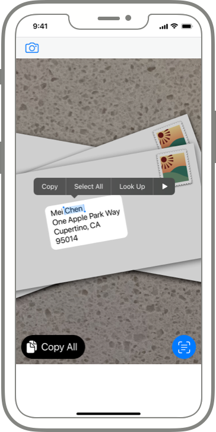

> Navigation: [Technologies](technologies.md)

# VisionKit

Framework

Identify and extract information in the environment using the device’s camera, or in images that your app displays.

## Overview

VisionKit analyzes pixel information and isolates important data such as text of a given language, URLs, street addresses, phone numbers, shipment tracking numbers, flight numbers, dates, times, durations, and barcodes of various formats. The framework provides this analysis to your app through user interfaces your app displays, which enable people to interact with the analyzed data ([AnalysisTypes](visionkit/imageanalyzer/analysistypes.md)) and return the data of interest back to your app. In the interfaces, people can highlight, tap to focus, copy and extract data to the clipboard, or invoke a menu option that runs an app-defined action. VisionKit offers the following user interfaces:

[DataScannerViewController](visionkit/datascannerviewcontroller.md) presents a camera pass-through view that enables the user to interact with any of the recognized content types ([RecognizedDataType](visionkit/datascannerviewcontroller/recognizeddatatype.md)) as seen in the environment, and provides captured information to the app for processing.

The Image Analysis interface ([ImageAnalysisInteraction](visionkit/imageanalysisinteraction.md) on iOS, and [ImageAnalysisOverlayView](visionkit/imageanalysisoverlayview.md) on macOS) displays on top of an image and enables people to interact with content types ([InteractionTypes](visionkit/imageanalysisinteraction/interactiontypes.md)) that the framework recognizes in the image. For example, the Live Text interface enables them to select any text present in the image ([textSelection](visionkit/imageanalysisinteraction/interactiontypes/textselection.md)), or invoke a URL ([dataDetectors](visionkit/imageanalysisinteraction/interactiontypes/datadetectors.md)). Also, the text selection UI offers framework-standard buttons for copying selected text, or looking up the subject on the web for more information.

VisionKit’s Document Camera view controller ([VNDocumentCameraViewController](visionkit/vndocumentcameraviewcontroller.md)) is a camera pass-through experience that enables users to scan physical documents. The user scans the document page by page by tapping a camera interface in the view, which provides your app with the resulting images by page number after the scan completes. With the collection of scanned images, your app can create a digital version of the physical document, such as by exporting the scanned images to PDF.

## Interact with image subjects

In iOS 17 and macOS 14 and later, VisionKit identifies subjects within an image (see [Subject](visionkit/imageanalysisinteraction/subject.md)). A _subject_ may be the focal point of a picture, such as an object around which a photograph centers. Or, the framework may identify several objects that it recognizes in an image. VisionKit enables your app to extract, or _lift_, subjects to a separate image with the background removed (see [image](visionkit/imageanalysisinteraction/subject/image.md)), or present a button that gives more information on the subject ([visualLookUp](visionkit/imageanalysisinteraction/interactiontypes/visuallookup.md)).

> [!note] Note
> In macOS 14 and later, macOS apps built with Mac Catalyst support the [ImageAnalyzer](visionkit/imageanalyzer.md) and [ImageAnalysisInteraction](visionkit/imageanalysisinteraction.md) classes.

## Topics

### Content recognition and interaction in images

- [Enabling Live Text interactions with images](visionkit/enabling-live-text-interactions-with-images.md) — Add a Live Text interface that enables users to perform actions with text and QR codes that appear in images.
- [ImageAnalyzer](visionkit/imageanalyzer.md) — An object that finds items in images that people can interact with, such as subjects, text, and QR codes.
- [ImageAnalysis](visionkit/imageanalysis.md) — An object that represents the results of analyzing an image, and provides the input for the Live Text interface object.
- [ImageAnalysisInteraction](visionkit/imageanalysisinteraction.md) — An interface that enables people to interact with recognized text, barcodes, and other objects in an image.
- [ImageAnalysisInteractionDelegate](visionkit/imageanalysisinteractiondelegate.md) — A delegate that handles image-analysis and user-interaction callbacks for an interaction object.
- [ImageAnalysisOverlayView](visionkit/imageanalysisoverlayview.md) — A view that enables people to interact with recognized text, barcodes, and other objects in an image.
- [ImageAnalysisOverlayViewDelegate](visionkit/imageanalysisoverlayviewdelegate.md) — A delegate that handles image-analysis and user-interaction callbacks for an overlay view.
- [CameraRegionView](visionkit/cameraregionview.md) — This view displays a stabilized region of interest within a person’s view and provides passthrough camera feed for that selected region.

### Barcode and text scanning through the camera

- [Scanning data with the camera](visionkit/scanning-data-with-the-camera.md) — Enable Live Text data scanning of text and codes that appear in the camera’s viewfinder.
- [DataScannerViewController](visionkit/datascannerviewcontroller.md) — An object that scans the camera live video for text, data in text, and machine-readable codes.
- [DataScannerViewControllerDelegate](visionkit/datascannerviewcontrollerdelegate.md) — A delegate object that responds when people interact with items that the data scanner recognizes.
- [RecognizedItem](visionkit/recognizeditem.md) — An item that the data scanner recognizes in the camera’s live video.

### Document scanning through the camera

- [Structuring recognized text on a document](visionkit/structuring-recognized-text-on-a-document.md) — Detect, recognize, and structure text on a business card or receipt using Vision and VisionKit.
- [VNDocumentCameraViewController](visionkit/vndocumentcameraviewcontroller.md) — An object that presents UI for a camera pass-through that helps people scan physical documents.
- [VNDocumentCameraViewControllerDelegate](visionkit/vndocumentcameraviewcontrollerdelegate.md) — A delegate protocol through which the document camera returns its scanned results.
- [VNDocumentCameraScan](visionkit/vndocumentcamerascan.md) — A single document scanned in the document camera.
