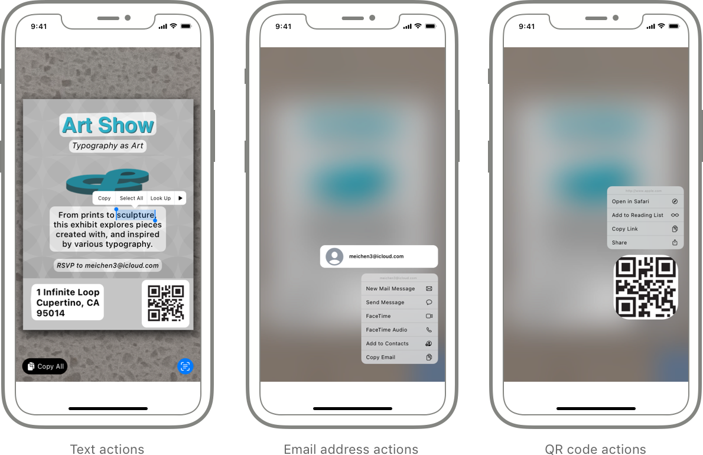
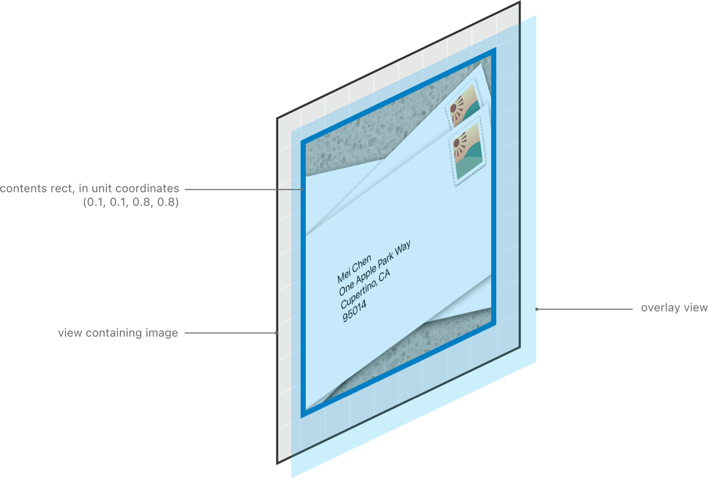
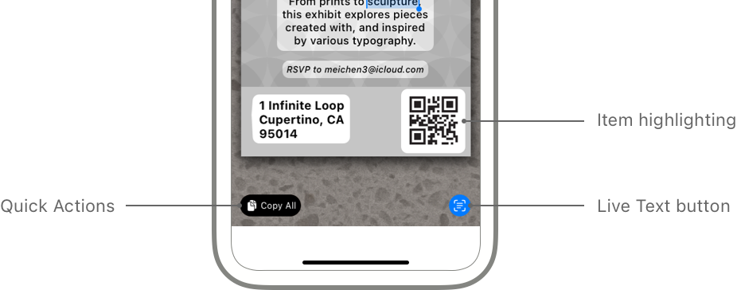

> Navigation: [Technologies](../technologies.md) · [VisionKit](../visionkit.md)

# Enabling Live Text interactions with images

<sub>Article</sub>

Add a Live Text interface that enables users to perform actions with text and QR codes that appear in images.

## Overview

Enhance the user experience with images in your app by adding standard Live Text interactions. Live Text lets users tap text in an image to copy it, make a call, send an email, translate it, or look up directions. VisionKit provides this familiar Live Text interface to your images and across platforms.

For iOS apps, users can use a long-press gesture (touch and hold) a QR code to follow a link or take another action, depending on the payload. The payload is the data that a QR code contains, such as a URL or email address.

Before interacting with items in an image, the user can tap the Live Text button in the lower-right corner to highlight the recognized items. Then a data-specific action menu appears when the user double-taps on text in an image, and uses a long-press gesture on an email address or QR code.



<sub>A mockup of three iPhone screens showing the Live Text button and highlighted text with its action menu, a long press of an email address with its action menu, and a long press of a QR code with its action menu.</sub>

In your app, you decide whether Live Text recognizes text and data within text, and for iOS apps, QR codes in the image. You choose the types of items to look for and run the analysis on the image, and then VisionKit provides the entire Live Text interface with the breadth of actions for specific types.

> [!important] Important
> The code listings in this article use asynchronous methods that you invoke from an `async` method or within a [Task](../swift/task.md) structure. For details on asynchronous flows, see [Concurrency](../swift/concurrency.md).

### Check whether the device supports Live Text

Before showing a Live Text interface in your app, check whether the device supports Live Text. For iOS apps, the image analyzer is available only on devices with the A12 Bionic chip and later. If the `ImageAnalyzer` [isSupported](imageanalyzer/issupported.md) property is `true`, show the Live Text interface. Otherwise, disable any feature in your app that relies on Live Text. If you attempt to start the Live Text interface when this property is `false`, the interface doesn’t appear.

### Add a Live Text interaction object to your view in iOS

For iOS apps, you add the Live Text interface by adding an interaction object to the view containing the image. If you use a [UIImageView](../uikit/uiimageview.md) to display the image, it handles the image content area calculations for you.

Add an [ImageAnalysisInteraction](imageanalysisinteraction.md) object directly on the view containing the image.

```swift
let interaction = ImageAnalysisInteraction()
imageView.addInteraction(interaction)
```

Optionally, customize the interface by setting the interaction’s delegate to an object that implements the [ImageAnalysisInteractionDelegate](imageanalysisinteractiondelegate.md) protocol methods.

```swift
interaction.delegate = self
```

If you don’t use a [UIImageView](../uikit/uiimageview.md) object, inform the interaction object when the content area of the image changes while the interaction bounds don’t change. Implement the `ImageAnalysisInteractionDelegate` [contentsRect(for:)](<imageanalysisinteractiondelegate/contentsrect(for_).md>) protocol method to return the content area of the image. This keeps the Live Text highlights within the bounds of the image. Then use the [setContentsRectNeedsUpdate()](<imageanalysisinteraction/setcontentsrectneedsupdate().md>) method to notify the interaction if the content area changes.

### Add a Live Text view to your image view in macOS

For macOS apps, add the Live Text interface by adding a view above the view containing the image. If you use an [NSImageView](../appkit/nsimageview.md) to display the image, it handles the image content area calculations for you.

First create an instance of the [ImageAnalysisOverlayView](imageanalysisoverlayview.md) class.

```swift
let overlayView = ImageAnalysisOverlayView()
```

Then configure the overlay view to fit the bounds of the image. If your view is an image view, set the [trackingImageView](imageanalysisoverlayview/trackingimageview.md) property so that the dimensions adjust when the scaling and alignment properties change.

```swift
overlayView.autoresizingMask = [.width, .height]
overlayView.frame = imageView.bounds
overlayView.trackingImageView = imageView
```

Add the overlay view above the image in the hierarchy. For example, add it as a subview of the view containing the image.

```swift
imageView.addSubview(overlayView)
```

To customize the interface, set the overlay view’s delegate to an object that implements the optional [ImageAnalysisOverlayViewDelegate](imageanalysisoverlayviewdelegate.md) protocol methods.

```swift
overlayView.delegate = self
```

Implement the [overlayView(_:shouldBeginAt:forAnalysisType:)](<imageanalysisoverlayviewdelegate/overlayview(__shouldbeginat_foranalysistype_)-35czq.md>) protocol method to return `true` to begin the interaction.

```swift
func overlayView(_ overlayView: ImageAnalysisOverlayView, 
           shouldBeginAt point: CGPoint, forAnalysisType 
           analysisType: ImageAnalysisOverlayView.InteractionTypes) -> Bool { 
    overlayView.hasInteractiveItem(at: point) || 
    overlayView.hasActiveTextSelection 
}
```

If you aren’t using an [NSImageView](../appkit/nsimageview.md) object, implement the `ImageAnalysisOverlayViewDelegate` [contentsRect(for:)](<imageanalysisoverlayviewdelegate/contentsrect(for_)-34yzu.md>) protocol method to return the content area of the image. Then use the [setContentsRectNeedsUpdate()](<imageanalysisoverlayview/setcontentsrectneedsupdate().md>) method to notify the overlay view if the content area of the image changes while the view bounds don’t change.



### Find items and start the interaction with an image

Process the image that your view displays using an [ImageAnalyzer](imageanalyzer.md) object. First, specify the types of items in the image you want to find when you create an [Configuration](imageanalyzer/configuration.md) object. For iOS apps, the analyzer recognizes both text and machine-readable QR codes in an image; for macOS apps, the analyzer recognizes text in an image.

```swift
let configuration = ImageAnalyzer.Configuration([.text, .machineReadableCode])
```

Then analyze the image by sending [analyze(_:configuration:)](<imageanalyzer/analyze(__configuration_).md>) to an [ImageAnalyzer](imageanalyzer.md) object, passing the image and the configuration. To improve performance, use a single shared instance of the analyzer throughout the app.

```swift
let analyzer = ImageAnalyzer()
let analysis = try? await analyzer.analyze(image, configuration: configuration)
```

For iOS apps, start the Live Text interface by setting the [analysis](imageanalysisinteraction/analysis.md) property of the [ImageAnalysisInteraction](imageanalysisinteraction.md) object to the results of the analyze method. For example, set the [analysis](imageanalysisinteraction/analysis.md) property in the action method of a control that starts Live Text.

```swift
interaction.analysis = analysis
```

For macOS apps, start the Live Text interface by setting the [analysis](imageanalysisoverlayview/analysis.md) property of the [ImageAnalysisOverlayView](imageanalysisoverlayview.md) object.

```swift
overlayView.analysis = analysis
```

The standard Live Text menu appears when users click and hold items in the image. The user chooses actions from this menu, depending on the type of item.

### Customize behavior using interaction types

You can change the behavior of the interface by enabling types of interactions with items the analyzer finds in the image. If you set the interaction or overlay view [preferredInteractionTypes](imageanalysisinteraction/preferredinteractiontypes.md) property to [automatic](imageanalysisinteraction/interactiontypes/automatic.md), users can interact with all types of items that the analyzer finds.

```swift
interaction.preferredInteractionTypes = .automatic
```

If you set the [preferredInteractionTypes](imageanalysisinteraction/preferredinteractiontypes.md) property to just [textSelection](imageanalysisinteraction/interactiontypes/textselection.md), users can only select text in the image and then perform a basic text action, such as copying, translating, or sharing the text. For iOS apps, if the [ImageAnalysisInteraction](imageanalysisinteraction.md) object’s [allowLongPressForDataDetectorsInTextMode](imageanalysisinteraction/allowlongpressfordatadetectorsintextmode.md) property is `true`, users can also touch and hold text that contains data (URLs, phone numbers, and email addresses) to perform a data-specific action.

For iOS apps, users can tap the Live Text button in the lower-right corner to switch to highlight mode. Then users can touch and hold data that the analyzer detects in text to perform a data-specific action, such as opening a URL, calling a phone number, or sending an email.



<sub>A mockup of the lower half of an iPhone screen showing the Live Text button enabled and recognized items highlighted, such as a mailing address and QR code.</sub>

To let users interact with data that the analyzer detects in text in macOS, set the [preferredInteractionTypes](imageanalysisoverlayview/preferredinteractiontypes.md) property to [dataDetectors](imageanalysisoverlayview/interactiontypes/datadetectors.md). Then users can hover over data in text to perform a data-specific action.

For iOS apps only, users can touch and hold QR codes and perform an action, depending on the payload, such as following an embedded link. To enable QR code interactions, set the [Configuration](imageanalyzer/configuration.md) structure’s [analysisTypes](imageanalyzer/configuration/analysistypes.md) property to [machineReadableCode](imageanalyzer/analysistypes/machinereadablecode.md).

### Change the supplementary interface

You can modify the Live Text supplementary interface to conform better to the look of your app. The supplementary interface consists of the quick actions in the lower-left corner and the Live Text button in the lower-right corner of the interface.

To hide the supplementary interface, set the [isSupplementaryInterfaceHidden](imageanalysisinteraction/issupplementaryinterfacehidden.md) to `false`. For iOS apps, if the [allowLongPressForDataDetectorsInTextMode](imageanalysisinteraction/allowlongpressfordatadetectorsintextmode.md) property is `true`, users can still touch and hold text to perform data-specific actions.

If your interface overlaps the supplementary interface, set the [supplementaryInterfaceContentInsets](imageanalysisinteraction/supplementaryinterfacecontentinsets.md) property appropriately to move the quick actions and Live Text button.

If you want the supplementary interface to use a custom font, set the [supplementaryInterfaceFont](imageanalysisinteraction/supplementaryinterfacefont.md) property. Quick actions use the specified font for text and font weight for symbols. For button size consistency, the Live Text interface ignores the point size.

### Specify recognized languages

By default the image analyzer attempts to recognize the user’s preferred languages. If you want the analyzer to consider other languages, set the [locales](imageanalyzer/configuration/locales.md) property of the [Configuration](imageanalyzer/configuration.md) object.

To determine whether the image analyzer supports a language, check whether the array that the `ImageAnalyzer` [supportedTextRecognitionLanguages](imageanalyzer/supportedtextrecognitionlanguages.md) class property returns includes the language ID.

For more information on language IDs, see [Choosing localization regions and scripts](../xcode/choosing-localization-regions-and-scripts.md).

## See Also

### Content recognition and interaction in images

- [ImageAnalyzer](imageanalyzer.md) — An object that finds items in images that people can interact with, such as subjects, text, and QR codes.
- [ImageAnalysis](imageanalysis.md) — An object that represents the results of analyzing an image, and provides the input for the Live Text interface object.
- [ImageAnalysisInteraction](imageanalysisinteraction.md) — An interface that enables people to interact with recognized text, barcodes, and other objects in an image.
- [ImageAnalysisInteractionDelegate](imageanalysisinteractiondelegate.md) — A delegate that handles image-analysis and user-interaction callbacks for an interaction object.
- [ImageAnalysisOverlayView](imageanalysisoverlayview.md) — A view that enables people to interact with recognized text, barcodes, and other objects in an image.
- [ImageAnalysisOverlayViewDelegate](imageanalysisoverlayviewdelegate.md) — A delegate that handles image-analysis and user-interaction callbacks for an overlay view.
- [CameraRegionView](cameraregionview.md) — This view displays a stabilized region of interest within a person’s view and provides passthrough camera feed for that selected region.
