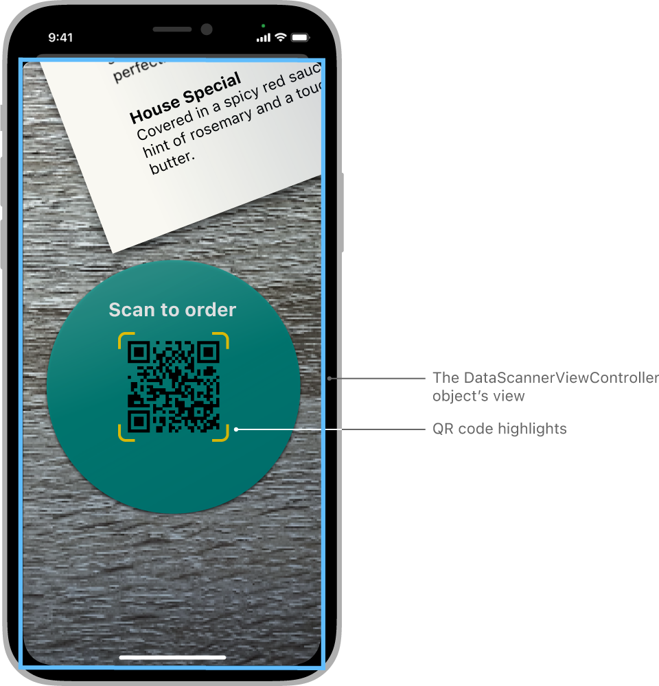
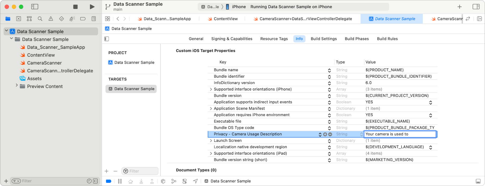
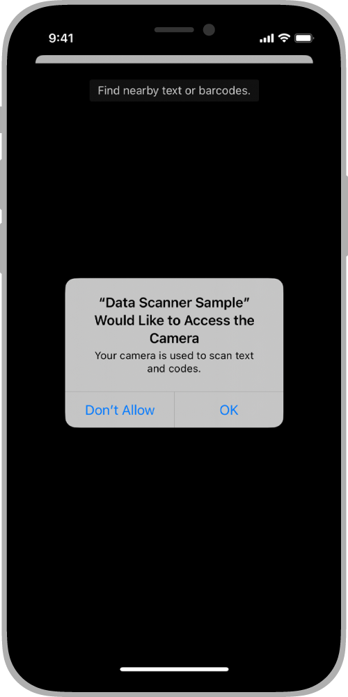

> Navigation: [Technologies](../technologies.md) · [VisionKit](../visionkit.md)

# Scanning data with the camera

<sub>Article</sub>

Enable Live Text data scanning of text and codes that appear in the camera’s viewfinder.

## Overview

Let users scan text and codes with the camera, similar to the Live Text interface in the Camera app. VisionKit provides the live video, guidance for the user, item highlighting, and tap-to-focus and pinch-to-zoom functionality. You provide the user with feedback and actions for the items the scanner recognizes and the user taps. For example, your app can let users scan a QR code on a warehouse box, or call a support number on product materials.

You create a [DataScannerViewController](datascannerviewcontroller.md) object and implement its delegate methods to handle when the scanner identifies items in the camera’s live video. When users tap an item, such as a QR code, you offer an appropriate action, depending on the item type. A QR code contains data, called a _payload_, such as a phone number or email address. If the payload is a website, you can open it in the browser or perform some other custom action.



<sub>A mockup of an iPhone screen showing the data scanner view controller view with a QR code highlighted in the camera’s live video.</sub>

> [!important] Important
> The code listings in this article use asynchronous methods that you invoke from an `async` method or within a [Task](../swift/task.md) structure. For details on asynchronous flows, see [Concurrency](../swift/concurrency.md).

### Provide a reason for using the camera

The first time your app attempts to use the camera, the system prompts users for permission. It displays a dialog that includes the name of your app and a reason that you provide to notify users why you’re using the camera. If the user grants permission, you can use the camera on the device; otherwise, the user is unable to use your app to scan text or codes. If you don’t add this key, a runtime error occurs when you access the camera.

You provide the reason for using the camera in the Xcode project configuration. Add the [NSCameraUsageDescription](../bundleresources/information-property-list/nscamerausagedescription.md) key to the target’s information property list in Xcode.

1. In the project editor, select the target and click Info.
2. Under Custom iOS Target Properties, click the Plus button in any row.
3. From the pop-up menu in the Key column, choose Privacy - Camera Usage Description.
4. In the Value column, enter the reason, such as “Your camera is used to scan text and codes.”



<sub>A screenshot of the Xcode project editor showing the target selected and editing the Privacy - Camera Usage Description key in the Information Property List.</sub>

For more information about privacy keys, see [Requesting access to protected resources](../uikit/requesting-access-to-protected-resources.md).

### Create a data scanner view controller

In your code, create a [DataScannerViewController](datascannerviewcontroller.md) object that you configure for the needs of your app. The [DataScannerViewController](datascannerviewcontroller.md) class provides the interface for scanning items in the live video. In the parameters of the initializer, you specify the types of items to scan, the quality level, whether to return multiple items, and more.

```swift
let viewController = DataScannerViewController(
    recognizedDataTypes: [.text(), .barcode()],
    qualityLevel: .fast,
    recognizesMultipleItems: false,
    isHighFrameRateTrackingEnabled: false,
    isHighlightingEnabled: true)
```

For larger items, you can pass [DataScannerViewController.QualityLevel.fast](datascannerviewcontroller/qualitylevel-swift.enum/fast.md) as the quality parameter to increase recognition speed by lowering the resolution. For smaller items, pass [DataScannerViewController.QualityLevel.accurate](datascannerviewcontroller/qualitylevel-swift.enum/accurate.md) to increase the resolution. If you’re unsure of the content, pass [DataScannerViewController.QualityLevel.balanced](datascannerviewcontroller/qualitylevel-swift.enum/balanced.md).

If you overlay an interface on the live video, pass `true` as the `isHighFrameRateTrackingEnabled` parameter so that the scanner updates the geometry of items more frequently. For example, pass `true` so that your custom highlights keep up with the camera movement.

Use the other parameters of the initializer to disable specific interface features and gestures. For example, pass `false` for the `isGuidanceEnabled` parameter to remove text that appears in the live video while the user is scanning, such as _Slow Down_.

After you create the view controller and before you present it, set its delegate to an object in your app that handles the [DataScannerViewControllerDelegate](datascannerviewcontrollerdelegate.md) protocol callbacks.

```swift
viewController.delegate = self
```

### Handle when the scanner becomes unavailable

Before presenting an interface for scanning, confirm that the device supports scanning and that your app has access to the camera.

Check that these two properties are true:

- If the scanner can run on the user’s device, the `DataScannerViewController` [isSupported](datascannerviewcontroller/issupported.md) class property is `true`. The data scanner is available on devices with the A12 Bionic chip and later.
- If the user doesn’t deny your app access to the camera, or there’s no other restrictions to using the camera, the `DataScannerViewController` [isAvailable](datascannerviewcontroller/isavailable.md) class property is `true`.

For example, when this convenience property that checks both these values returns `true`, enable the scanning interface in your app:

```swift
var scannerAvailable: Bool {
    DataScannerViewController.isSupported &&
    DataScannerViewController.isAvailable
}
```

If the scanner becomes unavailable for any reason while your app is running, the data scanner calls the [dataScanner(_:becameUnavailableWithError:)](<datascannerviewcontrollerdelegate/datascanner(__becameunavailablewitherror_).md>) delegate method. Implement this delegate method to disable or remove the data-scanning controls in your interface. For example, the scanner calls this method when users tap Don’t Allow the first time the system prompt appears, as described in [Provide a reason for using the camera](scanning-data-with-the-camera.md#Provide-a-reason-for-using-the-camera).

To reset the user authorization when testing your code, see [Requesting access to protected resources](../uikit/requesting-access-to-protected-resources.md#3137869).



<sub>A screenshot of an iPhone showing the system dialog requesting access to the camera with the reason given by the app, and the Don’t Allow and OK buttons.</sub>

### Begin data scanning

After the user allows access to the camera without restrictions, you can begin scanning for items that appear in the live video by invoking the [startScanning()](<datascannerviewcontroller/startscanning().md>) method.

```swift
try? viewController.startScanning()
```

The view controller begins scanning for items and maintains a collection of the current recognized items. To process items as they appear in the live video, implement these [DataScannerViewControllerDelegate](datascannerviewcontrollerdelegate.md) protocol methods to handle when the scanner adds, deletes, and updates items in the collection:

- [dataScanner(_:didAdd:allItems:)](<datascannerviewcontrollerdelegate/datascanner(__didadd_allitems_).md>)
- [dataScanner(_:didRemove:allItems:)](<datascannerviewcontrollerdelegate/datascanner(__didremove_allitems_).md>)
- [dataScanner(_:didUpdate:allItems:)](<datascannerviewcontrollerdelegate/datascanner(__didupdate_allitems_).md>)

For text items, the items in the `allItems` parameter appear in the reading order in which the strings appear in the live video.

When scanning QR codes, implement these methods to show an item’s payload, such as a URL, email address, or other data. To process items when the user taps them, see [Respond when users tap an item](scanning-data-with-the-camera.md#Respond-when-users-tap-an-item).

### Highlight recognized items

If you pass `true` for the `isHighlightingEnabled` parameter in the initializer when you create the view controller, the scanner automatically highlights items it recognizes.

Optionally, provide your own interface for highlighting recognized items. Implement the [DataScannerViewControllerDelegate](datascannerviewcontrollerdelegate.md) protocol methods that the scanner invokes when modifying the list of recognized items in the live video. Then add your custom highlights of the recognized items as subviews of the view controller’s [overlayContainerView](datascannerviewcontroller/overlaycontainerview.md) property.

If you pass `false` as the `recognizesMultipleItems` parameter in the initializer when you create the view controller, the scanner picks only one item in the live video. By default the scanner picks the item closest to the center. However, users can provide a hint to the scanner for which item to highlight. If users tap an area in the live video, the scanner recognizes the item closest to the tap.

### Respond when users tap an item

When users tap a recognized item in the live video, the view controller invokes the [dataScanner(_:didTapOn:)](<datascannerviewcontrollerdelegate/datascanner(__didtapon_).md>) delegate method and passes the recognized item. Implement this method to take some action, depending on the item the user taps. Use the parameters of the [RecognizedItem](recognizeditem.md) enumeration to get details about the item, such as the bounds.

For example, to handle when users tap a QR code, implement the [dataScanner(_:didTapOn:)](<datascannerviewcontrollerdelegate/datascanner(__didtapon_).md>) method to perform an action with the QR code’s payload. If the user taps text, provide other actions for text, such as copying it to the pasteboard.

```swift
func dataScanner(_ dataScanner: DataScannerViewController, didTapOn item: RecognizedItem) {
    switch item {
    case .text(let text):
        // Copy the text to the pasteboard.
        UIPasteboard.general.string = text.transcript
    case .barcode(let code):
        // Open the URL in the browser.
        ...
    default:
        // Insert code to handle other data types.
        ...
    }
}
```

### Dismiss the data scanner view controller

When users perform an action, such as tapping an item, you can dismiss the view controller. Alternatively, you can start and stop scanning while the view controller shows the live video.

To stop scanning, use the `DataScannerViewController` [stopScanning()](<datascannerviewcontroller/stopscanning().md>) method in one of the delegate methods. For example, after you capture information about the tapped item, stop scanning and dismiss the view controller in the [dataScanner(_:didTapOn:)](<datascannerviewcontrollerdelegate/datascanner(__didtapon_).md>) delegate method.

```swift
dataScanner.stopScanning()
dataScanner.dismiss(animated: true)
```

### Scan specific types of text and codes

You can specify the exact types of text and codes that the data scanner recognizes by passing custom types to the [DataScannerViewController](datascannerviewcontroller.md) initializer.

To create a custom text type, pass one of the [TextContentType](datascannerviewcontroller/textcontenttype.md) values to the text type initializer. The data scanner supports URLs, dates, email addresses, telephone numbers, and more. For example, a travel app can create a flight number text type.

```swift
.text(textContentType: .flightNumber)
```

To create a custom barcode type, pass the symbology you want to scan to the barcode type initializer. For a complete list of the symbology that the data scanner supports, see [VNBarcodeSymbology](../vision/vnbarcodesymbology.md). For example, create a type for scanning Aztec codes.

```swift
.barcode(symbologies: [.aztec])
```

Then pass the custom types as the `recognizedDataTypes` parameter to the [DataScannerViewController](datascannerviewcontroller.md) initializer. For example, create a data scanner that only recognizes URLs and QR codes.

```swift
// Specify the types of data to recognize.
let recognizedDataTypes:Set<DataScannerViewController.RecognizedDataType> = [
    .text(textContentType: .URL),
    .barcode(symbologies: [.qr])
]

// Create the data scanner.
let dataScanner = DataScannerViewController(recognizedDataTypes: recognizedDataTypes)
```

### Recognize more languages

By default, the data scanner view controller prioritizes text in the user’s preferred languages. If you know the content contains other languages, create the view controller by passing a [RecognizedDataType](datascannerviewcontroller/recognizeddatatype.md) object that you configure for those languages.

Create a [RecognizedDataType](datascannerviewcontroller/recognizeddatatype.md) structure using the [text(languages:textContentType:)](<datascannerviewcontroller/recognizeddatatype/text(languages_textcontenttype_).md>) initializer to pass the identifiers for the languages you want to recognize.

```swift
let textDataType: DataScannerViewController.RecognizedDataType =
    .text(languages: ["en-US", "fr-FR", "de-DE"])
)
```

Then pass the data type in the `recognizedDataTypes `parameter of the initializer when you create the `DataScannerViewController` object.

To determine whether the data scanner view controller supports a language, check whether the array that the `DataScannerViewController` [supportedTextRecognitionLanguages](datascannerviewcontroller/supportedtextrecognitionlanguages.md) class property returns includes the language ID. For more information on language IDs, see [Choosing localization regions and scripts](../xcode/choosing-localization-regions-and-scripts.md).

## See Also

### Barcode and text scanning through the camera

- [DataScannerViewController](datascannerviewcontroller.md) — An object that scans the camera live video for text, data in text, and machine-readable codes.
- [DataScannerViewControllerDelegate](datascannerviewcontrollerdelegate.md) — A delegate object that responds when people interact with items that the data scanner recognizes.
- [RecognizedItem](recognizeditem.md) — An item that the data scanner recognizes in the camera’s live video.
