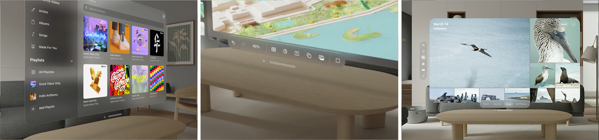
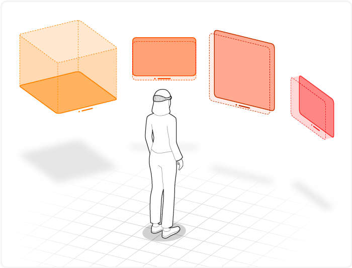
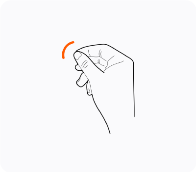
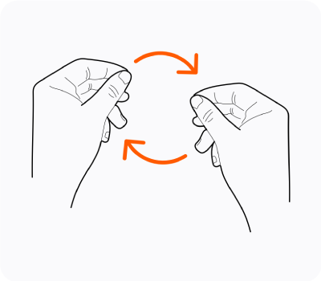
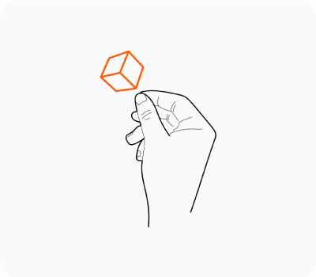
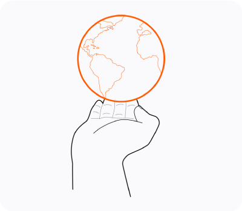

> Navigation: [Technologies](technologies.md)

# visionOS

Create a new universe of apps and games for Apple Vision Pro.

## Overview

visionOS is the operating system that powers Apple Vision Pro. Use visionOS together with familiar tools and technologies to build immersive apps and games for spatial computing.

Three scenes from visionOS apps that show the Music app, a close-up of the tools associated with a window, and a photo browser.

Developing for visionOS requires a Mac with Apple silicon. Create new apps using SwiftUI to take full advantage of the spectrum of immersion available in visionOS. If you have an existing iPad or iPhone app, add the visionOS destination to your app’s target to gain access to the standard system appearance, and add platform-specific features to create a compelling experience. To provide continuous access to your content in the meantime, deliver a compatible version of your app that runs in visionOS.

### Expand your app into immersive spaces

Start with a familiar window-based experience to introduce people to your content. From there, add [SwiftUI](swiftui.md) scene types specific to visionOS, such as volumes and spaces. These scene types let you incorporate depth, 3D objects, and immersive experiences.

Build your app’s 3D content with [RealityKit](realitykit.md) and [Reality Composer Pro](realitycomposerpro.md) and display it with a [RealityView](realitykit/realityview.md). In an immersive experience, use [ARKit](arkit.md) to integrate your content with the person’s surroundings.

An illustration that shows a person wearing Apple Vision Pro and looking at three windows and a volume in the space in front of them.

### Explore new kinds of interaction

People can select an element by looking at it and tapping their fingers together. They can also pinch, drag, zoom, and rotate objects using specific hand gestures. [SwiftUI](swiftui.md) provides built-in support for these standard gestures, so rely on them for most of your app’s input. When you want to go beyond the standard gestures, use [ARKit](arkit.md) to create custom gestures.

An illustration that shows a person making tap gestures with both hands and then rotating their hands around a central point.

An illustration that shows a person touching their thumb and index finger together to select a cube, and then using hand motions to manipulate the cube's position and orientation.

### Dive into featured sample apps

Explore the core concepts for all visionOS apps with Hello World. Understand how to detect custom gestures using ARKit with Happy Beam. Discover streaming 2D and stereoscopic media with Destination Video. And learn how to build 3D scenes with RealityKit and Reality Composer Pro with Diorama and Swift Splash.

- [Chaparral Village: Building an immersive visionOS adventure game](visionos/chaparral-village-building-an-immersive-visionos-adventure-game.md)
- [Designing no-code games with Reality Composer Pro 3](visionos/designing-no-code-games-in-reality-composer-pro-3.md)
- [Canyon Crosser: Building a volumetric hike-planning app](visionos/canyon-crosser-building-a-volumetric-hike-planning-app.md)
- [Petite Asteroids: Building a volumetric visionOS game](visionos/petite-asteroids-building-a-volumetric-visionos-game.md)
- [Hello World](visionos/world.md)
- [BOT-anist](visionos/bot-anist.md)
- [Destination Video](visionos/destination-video.md)
- [Happy Beam](visionos/happybeam.md)
- [Diorama](visionos/diorama.md)
- [Swift Splash](visionos/swift-splash.md)

## Topics

### App construction

- [Creating your first visionOS app](visionos/creating-your-first-visionos-app.md) — Build a new visionOS app using SwiftUI and add platform-specific features.
- [Adding 3D content to your app](visionos/adding-3d-content-to-your-app.md) — Add depth and dimension to your visionOS app and discover how to incorporate your app’s content into a person’s surroundings.
- [Creating fully immersive experiences in your app](visionos/creating-fully-immersive-experiences.md) — Build fully immersive experiences by combining spaces with content you create using RealityKit or Metal.
- [Drawing sharp layer-based content in visionOS](visionos/drawing-sharp-layer-based-content.md) — Deliver text and vector images at multiple resolutions from custom Core Animation layers in visionOS.
- [Introductory visionOS samples](visionos/introductory-visionos-samples.md) — Learn the fundamentals of building apps for visionOS with beginner-friendly sample code projects.
- [Combining spatial support from multiple frameworks](visionos/combining-spatial-support-from-multiple-frameworks.md) — Integrate the features of an array of frameworks seamlessly to enhance your spatial app.
- [Connecting iPadOS and visionOS apps over the local network](visionos/connecting-ipados-and-visionos-apps-over-the-local-network.md) — Build an iPadOS companion app to control your visionOS app.

### Design

- [Designing for visionOS](design/human-interface-guidelines/designing-for-visionos.md) — When people wear Apple Vision Pro, they enter an infinite 3D space where they can engage with your app or game while staying connected to their surroundings.
- [Adopting best practices for privacy and user preferences](visionos/adopting-best-practices-for-privacy.md) — Minimize your use of sensitive information and provide a clear statement of what information you do use and how you use it.
- [Improving accessibility support in your visionOS app](visionos/improving-accessibility-support-in-your-app.md) — Update your code to ensure everyone can access your app’s content in visionOS.

### SwiftUI

- [Canyon Crosser: Building a volumetric hike-planning app](visionos/canyon-crosser-building-a-volumetric-hike-planning-app.md) — Create a hike planning app using SwiftUI and RealityKit.
- [Hello World](visionos/world.md) — Use windows, volumes, and immersive spaces to teach people about the Earth.
- [Presenting windows and spaces](visionos/presenting-windows-and-spaces.md) — Open and close the scenes that make up your app’s interface.
- [Positioning and sizing windows](visionos/positioning-and-sizing-windows.md) — Influence the initial geometry of windows that your app presents.
- [Adopting best practices for persistent UI](visionos/adopting-best-practices-for-scene-restoration.md) — Create persistent and contextually relevant spatial experiences by managing scene restoration, customizing window behaviors, and surface snapping data.

### RealityKit and Reality Composer Pro

- [Reality Composer Pro](realitycomposerpro.md) — Build, design, and orchestrate 3D content for your RealityKit apps.
- [Chaparral Village: Building an immersive visionOS adventure game](visionos/chaparral-village-building-an-immersive-visionos-adventure-game.md) — Create an adventure game using SwiftUI, RealityKit, and Reality Composer Pro 3.
- [Designing no-code games with Reality Composer Pro 3](visionos/designing-no-code-games-in-reality-composer-pro-3.md) — Build a video game in Reality Composer Pro without code using Script Graphs.
- [Petite Asteroids: Building a volumetric visionOS game](visionos/petite-asteroids-building-a-volumetric-visionos-game.md) — Use the latest RealityKit APIs to create a beautiful video game for visionOS.
- [BOT-anist](visionos/bot-anist.md) — Build a multiplatform app that uses windows, volumes, and animations to create a robot botanist’s greenhouse.
- [Swift Splash](visionos/swift-splash.md) — Use RealityKit to create an interactive ride in visionOS.
- [Diorama](visionos/diorama.md) — Design scenes for your visionOS app using Reality Composer Pro.
- [Building an immersive media viewing experience](visionos/building-an-immersive-media-viewing-experience.md) — Add a deeper level of immersion to media playback in your app with RealityKit and Reality Composer Pro.
- [Enabling video reflections in an immersive environment](visionos/enabling-video-reflections-in-an-immersive-environment.md) — Create a more immersive experience by adding video reflections in a custom environment.
- [Combining 2D and 3D views in an immersive app](realitykit/combining-2d-and-3d-views-in-an-immersive-app.md) — Use attachments to place 2D content relative to 3D content in your visionOS app.
- [Understanding the modular architecture of RealityKit](visionos/understanding-the-realitykit-modular-architecture.md) — Learn how everything fits together in RealityKit.
- [Using transforms to move, scale, and rotate entities](visionos/understanding-transforms.md) — Learn how to use Transforms to move, scale, and rotate entities in RealityKit.
- [Capturing screenshots and video from Apple Vision Pro for 2D viewing](visionos/capturing-screenshots-and-video-from-your-apple-vision-pro-for-2d-viewing.md) — Create screenshots and record high-quality video of your visionOS app and its surroundings for app previews.
- [Implementing object tracking in your app](visionos/implementing-object-tracking-in-your-app.md) — Create engaging interactions by training models to recognize and track real-world objects in people’s surroundings.
- [Placing entities using head and device transform](visionos/placing-entities-using-head-and-device-transform.md) — Query and react to changes in the position and rotation of Apple Vision Pro.
- [Manipulating entities with solid collisions](visionos/manipulating-entities-with-solid-collisions.md) — Extend the capabilities of your app by using entities, components, and systems to maintain solid collisions when manipulating entities.
- [Gaussian splats on visionOS](visionos/gaussian-splats-on-visionos.md) — Use the new Gaussian splat APIs available in RealityKit in visionOS 27.
- [Manipulating models with RealityKit](realitykit/manipulating-models-with-realitykit.md) — Interact with detailed 3D models using manipulation and clipping controls. _(beta)_

### ARKit

- [Happy Beam](visionos/happybeam.md) — Leverage a Full Space to create a fun game using ARKit.
- [Setting up access to ARKit data](visionos/setting-up-access-to-arkit-data.md) — Check whether your app can use ARKit and respect people’s privacy.
- [Incorporating real-world surroundings in an immersive experience](visionos/incorporating-real-world-surroundings-in-an-immersive-experience.md) — Create an immersive experience by making your app’s content respond to the local shape of the world.
- [Placing content on detected planes](visionos/placing-content-on-detected-planes.md) — Detect horizontal surfaces like tables and floors, as well as vertical planes like walls and doors.
- [Tracking specific points in world space](visionos/tracking-points-in-world-space.md) — Retrieve the position and orientation of anchors your app stores in ARKit.
- [Tracking preregistered images in 3D space](visionos/tracking-images-in-3d-space.md) — Place content based on the current position of a known image in a person’s surroundings.
- [Exploring object tracking with ARKit](visionos/exploring_object_tracking_with_arkit.md) — Find and track real-world objects in visionOS using reference objects you train with Create ML.
- [Object tracking with Reality Composer Pro experiences](visionos/object-tracking-with-reality-composer-pro-experiences.md) — Use object tracking in visionOS to attach digital content to real objects to create engaging experiences.
- [Building local experiences with room tracking](visionos/building-local-experiences-with-room-tracking.md) — Use room tracking in visionOS to provide custom interactions with physical spaces.
- [Placing entities using head and device transform](visionos/placing-entities-using-head-and-device-transform.md) — Query and react to changes in the position and rotation of Apple Vision Pro.
- [Drawing in the air and on surfaces with a spatial stylus](visionos/drawing-in-the-air-and-on-surfaces-with-a-spatial-stylus.md) — Create a spatial stylus drawing experience that balances latency and accuracy for both in-air and on-surface drawing.
- [Preparing spatial accessories for tracking in your visionOS app](arkit/preparing-spatial-accessories-for-tracking-in-your-visionos-app.md) — Prepare a spatial accessory for tracking by training a reference accessory file and integrating it into your visionOS app.
- [Working with generic spatial accessories](visionos/working-with-generic-spatial-accessories.md) — Let people place digital replicas of a generic spatial accessory by tracking the accessory with ARKit.

### SharePlay

- [Building a guessing game for visionOS](groupactivities/building-a-guessing-game-for-visionos.md) — Create a team-based guessing game for visionOS using Group Activities.
- [Implementing SharePlay for immersive spaces in visionOS](visionos/implementing-shareplay-for-immersive-spaces-in-visionos.md) — Enable collaborative spatial experiences by using SharePlay to synchronize 3D content among participants.
- [Configure your visionOS app for sharing with people nearby](groupactivities/configure-your-app-for-sharing-with-people-nearby.md) — Create shared experiences for people wearing Vision Pro in the same room and those on FaceTime.
- [Adding spatial Persona support to an activity](groupactivities/adding-spatial-persona-support-to-an-activity.md) — Update your SharePlay activities to support spatial Personas and the shared context when running in visionOS.
- [Synchronizing group gameplay with TabletopKit](tabletopkit/synchronizing-group-gameplay-with-tabletopkit.md) — Maintain game state across multiple players in a race to capture all the coins.

### Video playback

- [Destination Video](visionos/destination-video.md) — Leverage SwiftUI to build an immersive media experience in a multiplatform app.
- [Displaying video from connected devices](visionos/displaying-video-from-connected-devices.md) — Show video from devices connected with the Developer Strap in your visionOS app.
- [Playing immersive media with RealityKit](visionos/playing-immersive-media-with-realitykit.md) — Create an immersive video playback experience with RealityKit.
- [Rendering stereoscopic video with RealityKit](realitykit/rendering-stereoscopic-video-with-realitykit.md) — Render stereoscopic video in visionOS with RealityKit.
- [Creating a multiview video playback experience in visionOS](avkit/creating-a-multiview-video-playback-experience-in-visionos.md) — Build an interface that plays multiple videos simultaneously and handles transitions to different experience types gracefully. _(beta)_
- [Configuring your app for media playback](avfoundation/configuring-your-app-for-media-playback.md) — Configure apps to enable standard media playback behavior.
- [Adopting the system player interface in visionOS](avkit/adopting-the-system-player-interface-in-visionos.md) — Provide an optimized viewing experience for watching 3D video content.
- [Controlling the transport behavior of a player](avfoundation/controlling-the-transport-behavior-of-a-player.md) — Play, pause, and seek through a media presentation.
- [Monitoring playback progress in your app](avfoundation/monitoring-playback-progress-in-your-app.md) — Observe the playback of a media asset to update your app’s user-interface state.
- [Trimming and exporting media in visionOS](avkit/trimming-and-exporting-media-in-visionos.md) — Display standard controls in your app to edit the timeline of the currently playing media.

### Xcode and Simulator

- [Configuring your app icon using an asset catalog](xcode/configuring-your-app-icon.md) — Add app icon variations to an asset catalog that represents your app in places such as the App Store, the Home Screen, Settings, and search results.
- [Diagnosing and resolving bugs in your running app](xcode/diagnosing-and-resolving-bugs-in-your-running-app.md) — Inspect your app to isolate bugs, locate crashes, identify excess system-resource usage, visualize memory bugs, and investigate problems in its appearance.
- [Diagnosing issues in the appearance of a running app](xcode/diagnosing-issues-in-the-appearance-of-your-running-app.md) — Inspect your running app to investigate issues in the appearance and placement of the content it displays.
- [Running your app on simulated or physical devices](xcode/running-your-app-on-simulated-or-physical-devices.md) — Launch your app on a simulated iOS, iPadOS, tvOS, visionOS, or watchOS device, or on a physical device paired with your Mac.
- [Device Hub](xcode/device-hub.md) — Manage the simulated and physical devices that you use to test your app.

### Performance

- [Creating a performance plan for your visionOS app](visionos/creating-a-performance-plan-for-visionos-app.md) — Identify your app’s performance and power goals and create a plan to measure and assess them.
- [Analyzing the performance of your visionOS app](visionos/analyzing-the-performance-of-your-visionos-app.md) — Use the RealityKit Trace template in Instruments to evaluate and improve the performance of your visionOS app.
- [Reducing the rendering cost of your UI on visionOS](visionos/reducing-the-rendering-cost-of-your-ui-on-visionos.md) — Optimize your 2D user interface rendering on visionOS.
- [Reducing the rendering cost of RealityKit content on visionOS](visionos/reducing-the-rendering-cost-of-realitykit-content-on-visionos.md) — Optimize your app’s 3D augmented reality content to render efficiently on visionOS.
- [Understanding the visionOS render pipeline](visionos/understanding-the-visionos-render-pipeline.md) — Compare how visionOS handles events and manages its rendering loop differently from other Apple platforms.

### iOS migration and compatibility

- [Determining whether to bring your app to visionOS](visionos/determining-whether-to-bring-your-app-to-visionos.md) — Decide whether to bring your existing iPadOS or iOS app to visionOS.
- [Bringing your existing apps to visionOS](visionos/bringing-your-app-to-visionos.md) — Build a version of your iPadOS or iOS app using the visionOS SDK, and update your code for platform differences.
- [Bringing your ARKit app to visionOS](visionos/bringing-your-arkit-app-to-visionos.md) — Update an iPadOS or iOS app that uses ARKit, and provide an equivalent experience in visionOS.
- [Making your existing app compatible with visionOS](visionos/making-your-app-compatible-with-visionos.md) — Modify your iPadOS or iOS app to run successfully in visionOS as a compatible app.

### Enterprise APIs for visionOS

- [Accessing the main camera](visionos/accessing-the-main-camera.md) — Add camera-based features to enterprise apps.
- [Building spatial experiences for business apps with enterprise APIs for visionOS](visionos/building-spatial-experiences-for-business-apps-with-enterprise-apis.md) — Grant enhanced sensor access and increased platform control to your visionOS app by using entitlements.
- [Locating and decoding barcodes in 3D space](visionos/locating-and-decoding-barcodes-in-3d-space.md) — Create engaging, hands-free experiences based on barcodes in a person’s surroundings.
- [Monitoring fit and field of view fidelity](visionos/monitoring-fit-and-field-of-view-fidelity.md) — Respond to changes in fit and field of view fidelity on Apple Vision Pro by using the Visual Fidelity API.
