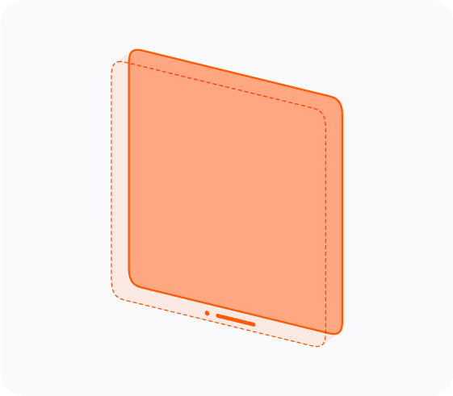
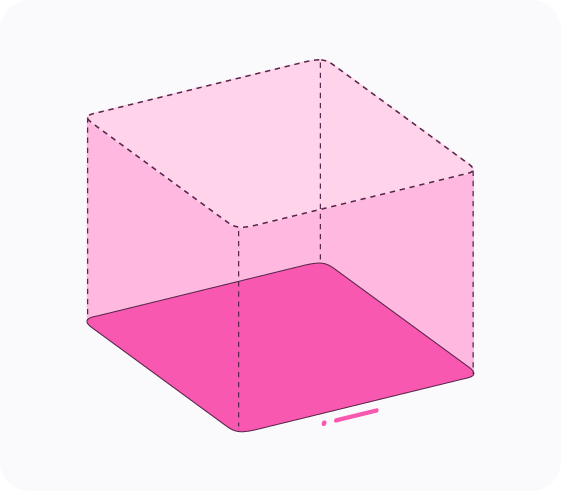
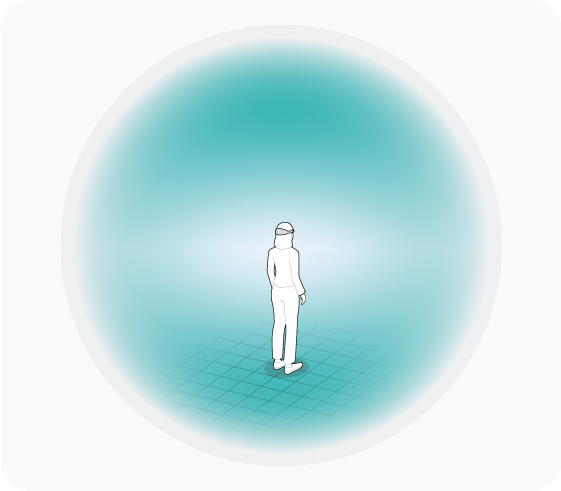
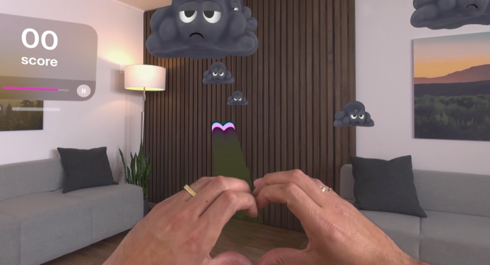
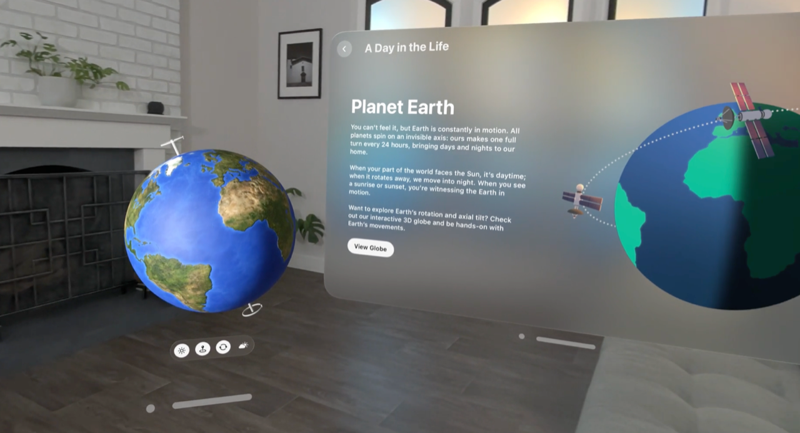

> Navigation: [Technologies](../technologies.md) · [visionOS](../visionos.md)

# Adding 3D content to your app

<sub>Article</sub>

Add depth and dimension to your visionOS app and discover how to incorporate your app’s content into a person’s surroundings.

## Overview

A device with a stereoscopic display lets people experience 3D content in a way that feels more real. Content appears to have real depth, and people can view it from different angles, making it seem like it’s there in front of them.

When building an app for visionOS, think about ways you might add depth to your app’s interface. The system provides several ways to display 3D content, including in your existing windows, in a volume, and in an immersive space. Choose the options that work best for your app and the content you offer.







### Add depth to traditional 2D windows

Windows are an important part of your app’s interface. With visionOS, apps automatically get materials with the visionOS look and feel, fully resizable windows with spacing tuned for eyes and hands input, and access to highlighting adjustments for your custom controls.

[A window titled “Objects in Orbit” floats in a room above a brown wooden conference table. The left side of the window contains text describing objects that orbit in space. The right side of the window contains a three dimensional satellite with eight solar panels tied to a cylindrical body and a satellite dish pointing downward. As the person walks toward the image, the window moves closer into view, and the three dimensional satellite rotates and shows depth.](https://docs-assets.developer.apple.com/published/d30560f74c5b7b932652bf510cc97d64/3D-Objects-detail.mp4)

Incorporate depth effects into your custom views as needed, and use 3D layout options to arrange views in your windows.

- Apply a [shadow(color:radius:x:y:)](<../swiftui/view/shadow(color_radius_x_y_).md>) or [visualEffect(_:)](<../swiftui/view/visualeffect(__).md>) modifier to the view.
- Lift or highlight the view when someone looks at it using a [hoverEffect(_:in:isEnabled:)](<../swiftui/view/hovereffect(__in_isenabled_).md>) modifier.
- Lay out views using a [ZStack](../swiftui/zstack.md).
- Animate view-related changes with [transform3DEffect(_:)](<../swiftui/view/transform3deffect(__).md>).
- Rotate the view using a [rotation3DEffect(_:axis:anchor:anchorZ:perspective:)](<../swiftui/view/rotation3deffect(__axis_anchor_anchorz_perspective_).md>) modifier.

In addition to giving 2D views more depth, you can also add static 3D models to your 2D windows. The `Model3D` view loads a USDZ file or other asset type and displays it at its intrinsic size in your window. Use this in places where you already have the model data in your app, or can download it from the network. For example, a shopping app might use this type of view to display a 3D version of a product.

### Display dynamic 3D scenes using RealityKit

RealityKit is Apple’s technology for building 3D models and scenes that you update dynamically onscreen. In visionOS, use RealityKit and SwiftUI together to seamlessly couple your app’s 2D and 3D content. Load existing USDZ assets or create scenes in Reality Composer Pro that incorporate animation, physics, lighting, sounds, and custom behaviors for your content. To use a Reality Composer Pro project in your app, add the Swift package to your Xcode project and import its module in your Swift file. For more information, see [Managing files and folders in your Xcode project](../xcode/managing-files-and-folders-in-your-xcode-project.md).



<sub>An illustration of a room with two gray couches, each having black pillow on top. There’s a brown wall made of vertical slats of wood directly ahead. To the left is a floating window showing a score of zero, a progress indicator that is nearly complete, and a pause button. Five dark grey clouds with grumpy faces appear in the middle coming toward the person. The person’s hands are placed together to make the appearance of a heart. </sub>

When you’re ready to display 3D content in your interface, use a [RealityView](../realitykit/realityview.md). This SwiftUI view serves as a container for your RealityKit content, and lets you update that content using familiar SwiftUI techniques.

The following example shows a view that uses a [RealityView](../realitykit/realityview.md) to display a 3D sphere. The code in the view’s closure creates a RealityKit entity for the sphere, applies a texture to the surface of the sphere, and adds the sphere to the view’s content.

```swift
 struct SphereView: View {
    var body: some View {
        RealityView { content in
            let model = ModelEntity(
                         mesh: .generateSphere(radius: 0.1),
                         materials: [SimpleMaterial(color: .white, isMetallic: true)])
            content.add(model)
        }
    }
}
```

When SwiftUI displays your [RealityView](../realitykit/realityview.md), it executes your code once to create the entities and other content. Because creating entities is relatively expensive, the view runs your creation code only once. When you want to update the state of your entities, change the state of your view and use an update closure to apply those changes to your content. The following example uses an update closure to change the size of the sphere when the value in the `scale` property changes:

```swift
struct SphereView: View {
    var scale = false

    var body: some View {
        RealityView { content in
            let model = ModelEntity(
                         mesh: .generateSphere(radius: 0.1),
                         materials: [SimpleMaterial(color: .white, isMetallic: true)])
            content.add(model)
        } update: { content in
            if let model = content.entities.first {
                model.transform.scale = scale ? [1.2, 1.2, 1.2] : [1.0, 1.0, 1.0]
            }
        }
    }
}
```

For information about how to create content using RealityKit, see [RealityKit](../realitykit.md).

### Respond to interactions with RealityKit content

To handle interactions with the entities of your RealityKit scenes:

- Attach a gesture recognizer to your [RealityView](../realitykit/realityview.md) and add the [targetedToAnyEntity()](<../swiftui/gesture/targetedtoanyentity().md>) modifier to it.
- Attach an [InputTargetComponent](../realitykit/inputtargetcomponent.md) to the entity or one of its parent entities.
- Add collision shapes to the RealityKit entities that support interactions.

The [targetedToAnyEntity()](<../swiftui/gesture/targetedtoanyentity().md>) modifier provides a bridge between the gesture recognizer and your RealityKit content. For example, to recognize when someone drags an entity, specify a [DragGesture](../swiftui/draggesture.md) and add the modifier to it. When the specified gesture occurs on an entity, SwiftUI executes the provided closure.

The following example adds a tap gesture recognizer to the sphere view from the previous example. The code also adds [InputTargetComponent](../realitykit/inputtargetcomponent.md) and [CollisionComponent](../realitykit/collisioncomponent.md) components to the shape to allow the interactions to occur. If you omit these components, the view doesn’t detect the interactions with your entity.

```swift
struct SphereView: View {
    @State private var scale = false

    var body: some View {
        RealityView { content in
            let model = ModelEntity(
                mesh: .generateSphere(radius: 0.1),
                materials: [SimpleMaterial(color: .white, isMetallic: true)])

            // Enable interactions on the entity.
            model.components.set(InputTargetComponent())
            model.components.set(CollisionComponent(shapes: [.generateSphere(radius: 0.1)]))
            content.add(model)
        } update: { content in
            if let model = content.entities.first {
                model.transform.scale = scale ? [1.2, 1.2, 1.2] : [1.0, 1.0, 1.0]
            }
        }
        .gesture(TapGesture().targetedToAnyEntity().onEnded { _ in
            scale.toggle()
        })
    }
}
```

### Display 3D content in a volume

A volume is a type of window that grows in three dimensions to match the size of the content it contains. Windows and volumes both accommodate 2D and 3D content, and are alike in many ways. However, windows clip 3D content that extends too far from the window’s surface, so volumes are the better choice for content that is primarily 3D.

To create a volume, add a [WindowGroup](../swiftui/windowgroup.md) scene to your app and set its style to [volumetric](../swiftui/windowstyle/volumetric.md). This style tells SwiftUI to create a window for 3D content. Include any 2D or 3D views you want in your volume. You can also add a [RealityView](../realitykit/realityview.md) to build your content using RealityKit. The following example creates a volume with a static 3D model of some balloons stored in the app’s bundle:

```swift
struct MyApp: App {
    var body: some Scene {
        WindowGroup {
            Model3D("balloons")
        }.windowStyle(style: .volumetric)
    }
}
```

Windows and volumes are a convenient way to display bounded 2D and 3D content, but your app doesn’t control the placement of that content in the person’s surroundings. The system sets the initial position of each window and volume at display time. The system also adds a window bar to allow someone to reposition the window or resize it.



<sub>An illustration of a window titled “Planet Earth” that contains text describing our planet, a button titled View Globe, and an image of the earth with two satellites tracking in orbit. The window floats in a room that has a dark grey fireplace affixed to a white brick wall. A green plant in a white vase sits atop a white mantle over the fireplace, and a picture hangs on the wall perpendicular to the fireplace. Suspended on the left side of the window is a globe of the earth with markers indicating its axis of rotation, and a button bar with four buttons beneath.</sub>

For more information about when to use volumes, see [Human Interface Guidelines \> Windows](../design/human-interface-guidelines/windows.md#visionOS).

### Display 3D content in a person’s surroundings

When you need more control over the placement of your app’s content, add that content to an [ImmersiveSpace](../swiftui/immersivespace.md). An immersive space offers an unbounded area for your content, and you control the size and placement of content within the space. After receiving permission from the user, you can also use ARKit with an immersive space to integrate content into their surroundings. For example, you can use ARKit scene reconstruction to obtain a mesh of furniture and nearby objects and have your content interact with that mesh.

An [ImmersiveSpace](../swiftui/immersivespace.md) is a scene type that you create alongside your app’s other scenes. The following example shows an app that contains an immersive space and a window:

```swift
@main
struct MyImmersiveApp: App {
    var body: some Scene {
        WindowGroup() {
            ContentView()
        }

        ImmersiveSpace(id: "solarSystem") {
            SolarSystemView()
        }
    }
}
```

If you don’t add a style modifier to your [ImmersiveSpace](../swiftui/immersivespace.md) declaration, the system creates that space using the [mixed](../swiftui/immersionstyle/mixed.md) style. This style displays your content together with the passthrough content that shows the person’s surroundings. Other styles let you hide passthrough to varying degrees. Use the [immersionStyle(selection:in:)](<../swiftui/scene/immersionstyle(selection_in_).md>) modifier to specify which styles your space supports. If you specify more than one style, you can toggle between the styles using the `selection` parameter of the modifier.

> [!warning] Warning
> Be mindful of how much content you include in immersive scenes that use the [mixed](../swiftui/immersionstyle/mixed.md) style. Content that fills a significant portion of the screen, even if that content is partially transparent, can prevent the person from seeing potential hazards in their surroundings. If you want to immerse the person in your content, configure your space with the [full](../swiftui/immersionstyle/full.md) style. For more information, see, [Creating fully immersive experiences in your app](creating-fully-immersive-experiences.md).

Remember to set the position of items you place in an [ImmersiveSpace](../swiftui/immersivespace.md). Position SwiftUI views using modifiers, and position a RealityKit entity using its transform component. SwiftUI places the origin of a space at a person’s feet initially, but can change this origin in response to other events. For example, the system might shift the origin to accommodate a SharePlay activity that displays your content with Spatial Personas. If you need to position SwiftUI views and RealityKit entities relative to one another, perform any needed coordinate conversions using the methods in the `content` parameter of [RealityView](../realitykit/realityview.md).

To display your [ImmersiveSpace](../swiftui/immersivespace.md) scene, open it using the [openImmersiveSpace](../swiftui/environmentvalues/openimmersivespace.md) action, which you obtain from the SwiftUI environment. This action runs asynchronously and uses the provided information to find and initialize your scene. The following example shows a button that opens the space with the `solarSystem` identifier:

```swift
Button("Show Solar System") {
    Task {
        let result = await openImmersiveSpace(id: "solarSystem")
        if case .error = result {
            print("An error occurred")
        }
    }
}
```

When an app presents an [ImmersiveSpace](../swiftui/immersivespace.md), the system hides the content of other apps to prevent visual conflicts. The other apps remain hidden while your space is visible but return when you dismiss it. If your app defines multiple spaces, you must dismiss the currently visible space before displaying a different space. If you don’t dismiss the visible space, the system issues a runtime warning when you try to open the other space.

## See Also

### App construction

- [Creating your first visionOS app](creating-your-first-visionos-app.md) — Build a new visionOS app using SwiftUI and add platform-specific features.
- [Creating fully immersive experiences in your app](creating-fully-immersive-experiences.md) — Build fully immersive experiences by combining spaces with content you create using RealityKit or Metal.
- [Drawing sharp layer-based content in visionOS](drawing-sharp-layer-based-content.md) — Deliver text and vector images at multiple resolutions from custom Core Animation layers in visionOS.
- [Introductory visionOS samples](introductory-visionos-samples.md) — Learn the fundamentals of building apps for visionOS with beginner-friendly sample code projects.
- [Combining spatial support from multiple frameworks](combining-spatial-support-from-multiple-frameworks.md) — Integrate the features of an array of frameworks seamlessly to enhance your spatial app.
- [Connecting iPadOS and visionOS apps over the local network](connecting-ipados-and-visionos-apps-over-the-local-network.md) — Build an iPadOS companion app to control your visionOS app.
