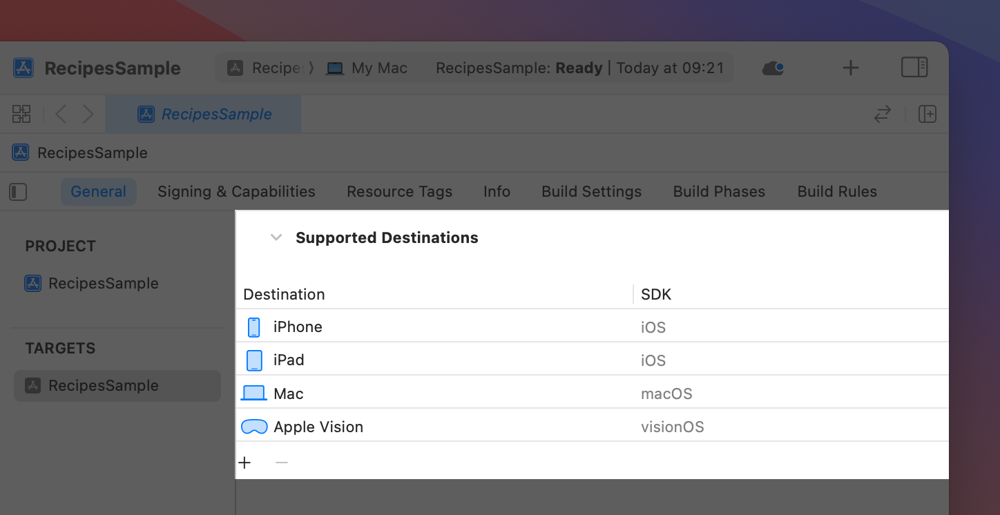

> Navigation: [Technologies](../technologies.md) · [visionOS](../visionos.md)

# Bringing your existing apps to visionOS

<sub>Article</sub>

Build a version of your iPadOS or iOS app using the visionOS SDK, and update your code for platform differences.

## Overview

If you have an existing app that runs in iPadOS or iOS, you can build that app against the visionOS SDK to run it on the platform. Apps built specifically for visionOS adopt the standard system appearance, and they look more natural on the platform. Updating your app is also an opportunity to add elements that work well on the platform, such as 3D content and immersive experiences.

In most cases, all you need to do to support visionOS is update your Xcode project’s settings and recompile your code. Depending on your app, you might need to make additional changes to account for features that are only found in the iOS SDK. While most of the same technologies are available on both platforms, some technologies don’t make sense or require hardware that isn’t present on visionOS devices. For example, people don’t typically use a headset to make contactless payments, so apps that use the ProximityReader framework must disable those features when running in visionOS.

> [!note] Note
> If you use ARKit in your iOS app to create an augmented reality experience, you need to make additional changes to support ARKit in visionOS. For information on how to update this type of app, see [Bringing your ARKit app to visionOS](bringing-your-arkit-app-to-visionos.md).

### Create a visionOS-specific version of your app

To update your app to build specifically for the visionOS SDK:

1. In your project’s settings, select your app target.
2. Navigate to the General tab.
3. In Supported Destinations, click the Add (+) button to add a new destination and select the Apple Vision option.



When you add Apple Vision as a destination, Xcode makes some one-time changes to your project’s build settings. After you add the destination, you can modify your project’s build settings and build phases to customize the build behavior specifically for visionOS. For example, you might remove dependencies for the visionOS version of your app, or change the set of source files you want to compile.

For more information about how to update a target’s configuration, see [Customizing the build phases of a target](../xcode/customizing-the-build-phases-of-a-target.md).

### Update your code for features that are unavailable in visionOS

The first step to updating your existing app to run in visionOS is to stop using deprecated frameworks and to check for frameworks with behavioral changes in visionOS.

If your app currently uses deprecated APIs or frameworks, update your code to use appropriate replacements. visionOS removes many deprecated symbols entirely, turning these deprecation warnings into missing-symbol errors on the platform. Fix any deprecation warnings in the iOS version of your code before you build for visionOS to see the original deprecation warning and replacement details. Read [Determining whether to bring your app to visionOS](determining-whether-to-bring-your-app-to-visionos.md) for a list of deprecated frameworks.

To help you avoid using APIs for unavailable features, many frameworks offer APIs to check the availability of those features. Continue to use those APIs and take appropriate actions when the features aren’t available. In other cases, prepare for the framework code to do nothing or to generate errors when you use it. Read [Determining whether to bring your app to visionOS](determining-whether-to-bring-your-app-to-visionos.md) for a list of APIs with availability checks and deprecated frameworks.

The iOS SDK includes many frameworks that don’t apply to visionOS, either because they use hardware that isn’t available or their features don’t apply to the platform. Move code that uses these frameworks to separate source files whenever possible, and include those files only in the iOS version of your app. The following frameworks are available in the iOS SDK but not in the visionOS SDK.

|  |  |  |
|---|---|---|
| ActivityKit | AdSupport | App Clips |
| AutomatedDeviceEnrollment | BusinessChat | CarKey |
| CarPlay | Cinematic | ClockKit |
| CoreLocationUI | CoreMediaIO | CoreNFC |
| CoreTelephony | DeviceActivity | DockKit |
| ExposureNotification | FamilyControls | FinanceKit |
| FinanceKitUI | ImageKit | ManagedSettings |
| ManagedSettingsUI | Messages | MLCompute |
| NearbyInteraction | OpenAL | OpenGLES |
| RoomPlan | SafetyKit | ScreenTime |
| SensorKit | ServiceManagement | Social |
| Twitter | WidgetKit | WorkoutKit |

When you can’t isolate the code to separate source files, use conditional statements such as the ones below to offer a different code path for visionOS and iOS. The following example shows how to do this:

```swift
#if os(visionOS)
   // visionOS code
#elseif os(iOS)
   // iOS code
#endif
```

For additional information about how to isolate code to the iOS version of your app, see [Running code on a specific platform or OS version](../xcode/running-code-on-a-specific-version.md).

### Update your interface to take advantage of visionOS features

After your existing code runs correctly in visionOS, look for ways to improve the experience you offer on the platform. In visionOS, you can display content using more than just windows. Think about ways to incorporate the following elements into your interface:

- **Depth.** Many SwiftUI views use visual effects to add depth. Look for similar ways to incorporate depth into your own custom views. For guidance on how best to incorporate depth and 3D elements in your interface, see [Human Interface Guidelines](../design/human-interface-guidelines.md).
- **3D content.** Think about where you might incorporate 3D models and shapes into your content. Use RealityKit to implement your content, and a [RealityView](../realitykit/realityview.md) to present that content from your app. See [Adding 3D content to your app](adding-3d-content-to-your-app.md).
- **Immersive experiences.** Present a space to immerse someone in your app’s content. Spaces let you place content anywhere in a person’s surroundings. You can also create fully immersive experiences that display only your app’s content. See [Creating fully immersive experiences in your app](creating-fully-immersive-experiences.md).
- **Interactions with someone’s surroundings.** Use ARKit to facilitate interactions between your content and the surroundings. For example, detect planar surfaces to use as anchor points for your content. See [ARKit](../arkit.md) for more details.
- **Color.** Standard visionOS windows typically use the system-defined glass material, which lets light and objects from people’s physical surroundings show through. Use color sparingly to draw attention to specific elements. Refer to the visionOS platform specific guidelines in the Human Interface Guidelines [Color](https://developer.apple.com/design/human-interface-guidelines/color#visionOS) documentation for best practices.
- **System-provided UI components.** Take advantage of the components built for visionOS in SwiftUI. Components like [TabView](../swiftui/tabview.md) appear on the bottom of iOS or iPadOS apps and on the left side of visionOS apps. Other UI elements, like ornaments, are introduced specifically for visionOS. Using these elements keeps your interface adaptable between platforms and provides hover effects for free.

Additional information on how to design your layout for visionOS is available on the Human Interface Guidelines [Layout](https://developer.apple.com/design/human-interface-guidelines/layout#visionOS) page.

> [!note] Note
> If you use ARKit in your iOS app to create an augmented reality experience, you need to make additional changes to support ARKit in visionOS. For information on how to update this type of app, see [Bringing your ARKit app to visionOS](bringing-your-arkit-app-to-visionos.md).

### Consider your implementation

If your existing app is built with UIKit, consider your implementation plan for visionOS. Although you can still use UIKit and load iOS storyboards into your app, you can’t include visionOS-specific or 3D content without using SwiftUI.

Consider migrating your app to SwiftUI. The declarative syntax gives you less code to maintain and makes it easier to validate that your interface does what you want. SwiftUI is also unified across all Apple platforms and adapts to device-specific behavior without extra work. To learn more about migrating to the SwiftUI lifecycle, see [Migrating to the SwiftUI life cycle](../swiftui/migrating-to-the-swiftui-life-cycle.md). You can also continue using UIKit views in a SwiftUI app with [UIViewRepresentable](../swiftui/uiviewrepresentable.md).

If you plan to continue using UIKit, read [Create adaptive layouts in UIKit](bringing-your-app-to-visionos.md#Create-adaptive-layouts-in-UIKit) to ensure your layout looks good on visionOS. The WWDC23 video [Meet UIKit for Spatial Computing](https://developer.apple.com/videos/play/wwdc2023/111215/) walks through bringing your UIKit app to visionOS and shows how to take advantage of native features for visionOS by including SwiftUI views using [UIHostingController](../swiftui/uihostingcontroller.md).

For a tutorial on mixing SwiftUI and UIKit content, see [Interfacing with UIKit](../tutorials/swiftui/interfacing-with-uikit.md).

### Create adaptive layouts in UIKit

Although visionOS is built for SwiftUI adoption, you can continue to use and build out your UIKit codebase as well. If your UIKit app uses hardcoded values or relies on [UIScreen](../uikit/uiscreen.md) for layout, the first step to migrating your app to visionOS is to start using an adaptable layout. When you make decisions using device details, your app might produce inconsistent or erroneous results on an unknown device type, or it might fail altogether. Find solutions that rely on environmental information, rather than the device type. For example, SwiftUI and UIKit start layout using the app’s window size, which isn’t necessarily the same size as the device’s display.

> [!note] Note
> Device-specific information is available when you absolutely need it, but validate the information you receive and provide reasonable default behavior for unexpected values.

Think about ways to create adaptive layouts using the following techniques:

- **Use stack views.** [UIStackView](../uikit/uistackview.md) objects adjust the position of their contained views automatically when interface dimensions change. Alternatively, [Auto Layout](https://developer.apple.com/library/archive/documentation/UserExperience/Conceptual/AutolayoutPG/index.html) constraints let you specify the rules that determine the size and position of the views in your interface.
- **Stay within layout margins.** Read [Positioning content within layout margins](../uikit/positioning-content-within-layout-margins.md) to set up constraints that respect layout margins and don’t crowd other content.
- **Respect the safe area.** Place views so they’re not obstructed by other content. Each view has a [layout guide](../uikit/uilayoutguide.md) that helps you create constraints to position your views within the safe area. Read [Positioning content relative to the safe area](../uikit/positioning-content-relative-to-the-safe-area.md) for guidance.
- **Adapt based on changes in UITraitCollection.** Write code to adjust your app’s layout according to changes in the iOS interface elements, such as size class, display scale, and layout direction. Read [UITraitCollection](../uikit/uitraitcollection.md) for more information.

### Update your app’s assets

Add vector-based or high-resolution images to your project specifically to support visionOS. In visionOS, people can view your app’s content at different angles and different distances, so image pixels rarely line up with screen pixels. Vector-based images work best because they maintain their detail and crispness at any size. For bitmap-based images, use high-resolution images (`@2x` or better) to ensure they retain detail at different sizes.

For more information about designing images for your app, see [Images](https://developer.apple.com/design/human-interface-guidelines/foundations/images) in Human Interface Guidelines.

## See Also

### iOS migration and compatibility

- [Determining whether to bring your app to visionOS](determining-whether-to-bring-your-app-to-visionos.md) — Decide whether to bring your existing iPadOS or iOS app to visionOS.
- [Bringing your ARKit app to visionOS](bringing-your-arkit-app-to-visionos.md) — Update an iPadOS or iOS app that uses ARKit, and provide an equivalent experience in visionOS.
- [Making your existing app compatible with visionOS](making-your-app-compatible-with-visionos.md) — Modify your iPadOS or iOS app to run successfully in visionOS as a compatible app.
