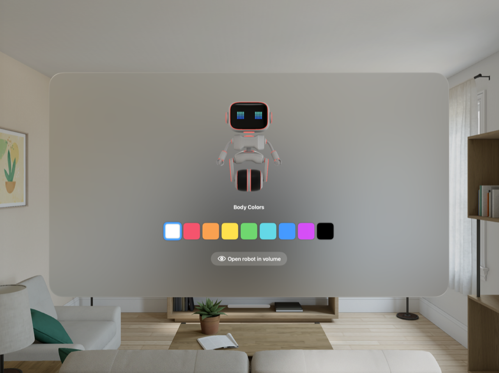
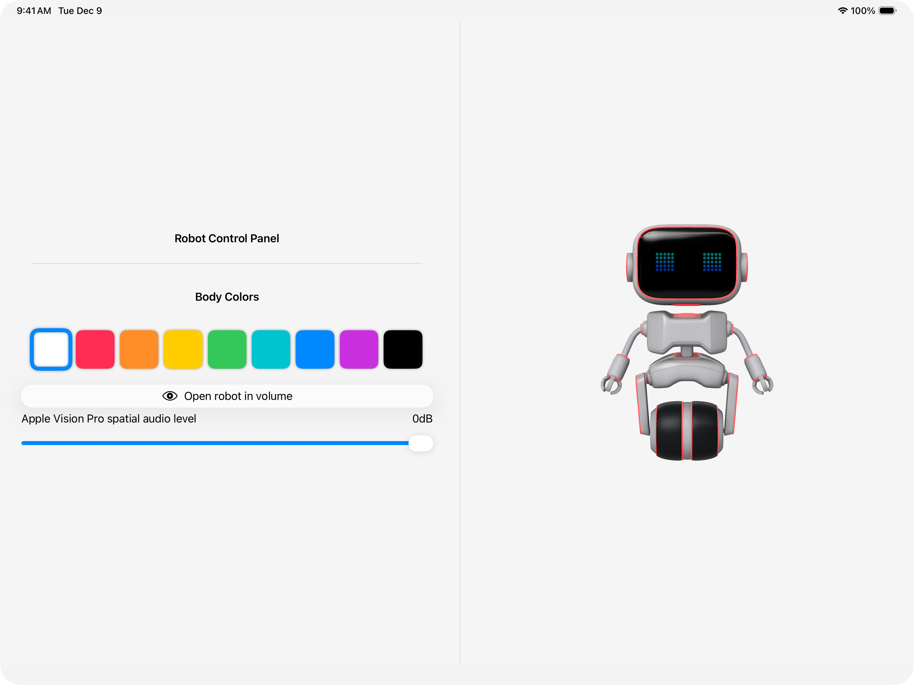

> Navigation: [Technologies](../technologies.md) · [visionOS](../visionos.md)

# Connecting iPadOS and visionOS apps over the local network

<sub>Sample Code</sub>

Build an iPadOS companion app to control your visionOS app.

## Overview

When demonstrating visionOS apps to others, someone wearing an Apple Vision Pro can’t easily show what they’re experiencing or request to have someone else control their experience. This sample uses the [Network](../network.md) framework to create a companion iPadOS app that remotely controls a visionOS experience, allowing a person to guide demonstrations while someone else wears the headset.

On Apple Vision Pro and iPad, the app displays a robot configurator where people can change the color of the robot. Someone using Apple Vision Pro sees and configures the 3D robot in their space, while the iPadOS companion app displays the same robot and provides extended controls, like a spatial audio volume slider. Changes made on either device immediately update on the other, keeping the apps synchronized.

The sample contains two targets and a custom package:

- `RobotConfigurationExperience`: A visionOS app that acts as a client and browses for connections to an available iPad. The app displays a 3D robot and plays spatial audio. Someone on an iPad can remotely control the Apple Vision Pro robot experience.
- `Companion`: An iPadOS app that acts as a server and listens for incoming connections from an Apple Vision Pro. The app displays a 3D robot and extended configuration controls. The iPad controls the robot configuration experience on Apple Vision Pro remotely.
- `PeerToPeerMessaging`: A custom package that contains the networking layer to create the peer-to-peer connection between an Apple Vision Pro and an iPad. You can integrate this package into your own apps to establish peer-to-peer connections with minimal setup.





<sub>A screenshot of an iPad window with controls, including color options and volume, on the leading side, and a 3D robot on the trailing side.</sub>

The first part of this article explains how to use the `PeerToPeerMessaging` package in your SwiftUI app to establish connections and synchronize UI without implementing the networking logic yourself. The second part explains how the package implements the networking layer using Network.framework, covering connection establishment, message handling, and security.

Use of this sample requires an Apple Vision Pro and an iPad. You’ll launch the `RobotConfigurationExperience` and `Companion` targets on the respective devices, and initiate a peer-to-peer connection using Bonjour for browsing on Apple Vision Pro, or listening on iPad. When starting the app, you’ll need to input a unique ID shown on Apple Vision Pro into the iPad to specify which device to connect to.

After connecting the devices, people using either app can customize the robot’s color and open or dismiss a volume that contains the robot on Apple Vision Pro. The iPadOS companion app also provides a slider to control spatial audio volume on Apple Vision Pro. All changes are synchronized between Apple Vision Pro and iPad as they’re made.

> [!tip] Tip
> The sample runs the `Companion` target on an iPad, but it can also run on iPhone or in Simulator.

### Configure Bonjour and network capabilities

The sample connects the two devices over the local network using [Bonjour](../network/bonjour.md), by adding the `Local Network` capability in the project’s Info pane in Xcode. The app defines a service type of `_example._udp` to uniquely identify the app and adds it to the Info pane with the [NSBonjourServices](../bundleresources/information-property-list/nsbonjourservices.md) key.

For more information on local network and privacy, see [TN3179: Understanding local network privacy](../technotes/tn3179-understanding-local-network-privacy.md). For instructions on adding support for local network privacy permissions, watch the WWDC20 presentation, [Support local network privacy in your app](../https_/developer.apple.com/videos/play/wwdc2020/10110.md).

### Create a connection

The `PeerToPeerMessaging` package implements the functionality to start the client and server. The sample uses this functionality to create a peer-to-peer connection by starting a browser on the Apple Vision Pro (_client_) and a listener on the iPad (_server_).

When creating a connection, there may be multiple devices on the network that are possible connection options. To differentiate between these devices, the sample implements a device identification flow. The visionOS app generates and displays a unique ID after launch, which you then enter in the iPadOS app.

On both the Apple Vision Pro and the iPad, the “Start” button calls the start method on the package’s `PeerMessagingController`, passing in the ID for device identification:

```swift
struct ClientContentView: View {
    @Environment(PeerMessagingController<Client<NetworkCommand>>.self) var clientController
    /// The network task to cancel the `NetworkBrowser`.
    @State private var networkTask: Task<Void, Error>?
    /// Client has a default random ID.
    @State private var clientID: Int = Int.random(in: 0...9000)
    var body: some View {
    // ...
    Button("Start browsing for devices with ID: \(clientID.description)") {
        // As long as the state isn't currently connecting, start the connection.
        guard clientController.connectionState != .connecting else { return }
        networkTask = clientController.start(with: clientID.description)
    }
```

This code is specific to the visionOS app and starts the browser. The iPadOS companion app calls the same function to start the listener.

> [!tip] Tip
> Cancel the `Task` that holds the listener or browser and set it to `nil` to stop listening or browsing.

After the peers connect, the sample updates the UI to display the main robot configurator view. The sample uses the package’s `PeerMessagingController` to monitor the connection state and update the UI when peers connect or disconnect:

```swift
struct ClientContentView: View {
    @Environment(PeerMessagingController<Client<NetworkCommand>>.self) var clientController
    var body: some View {
     // ...
     switch clientController.connectionState {
            case .connected:
                // Show the main robot view.
                RobotWindowView()
            // ...
```

### Synchronize the app state

The package defines methods to send and receive custom messages that describe app-specific UI updates to synchronize views between the Apple Vision Pro and the iPad.

The sample defines a custom message type, `NetworkCommand`, that represents the app’s interactions for robot configuration:

```swift
/// Defines all messages exchanged between the client and server.
public enum NetworkCommand: PeerToPeerMessage {
    /// The client sends a handshake to initiate bidirectional communication.
    case handshake
    /// App state synchronization events.
    case robotEvent(RobotEvent)

    /// Events that sync the robot's appearance and audio between devices.
    public enum RobotEvent: PeerToPeerMessage {
        /// Robot color selection change. Sets the material parameter of the shader graph.
        case colorChange(colorIndex: Int)
        /// Spatial audio gain change, which also correlates to the volume.
        case gain(level: Audio.Decibel)
        /// Volume visibility change. The robot is either in the window or in the volume.
        case volumeVisibility(Bool)
    }
}
```

When someone changes the robot’s color, the sample updates the value on the `RobotViewModel`:

```swift
struct RobotConfigurationPanel: View {
    @Environment(RobotViewModel.self) var robotViewModel
    var body: some View {
    // ...
    ForEach(Array(zip(robotViewModel.colors, 0...)), id: \.1) { (color, index) in
        RoundedRectangle(cornerRadius: 10)
            .fill(color)
            .stroke((index == robotViewModel.selectedColorIndex ? Color.blue : Color.clear),
            .onTapGesture {
                // Update the selected color and send a message to the other devices.
                robotViewModel.syncNewSelectedColor(of: index)
            }
```

`syncNewSelectedColor` updates the color locally and uses `PeerMessagingController` to send a message to the other device so it syncs the color. For example, when calling `syncNewSelectedColor` from the iPadOS app, it sends messages to update the color in the visionOS app.

```swift
@MainActor @Observable 
final class RobotViewModel {
   // ...
    private let sendMessage: (NetworkCommand) async throws -> Void
    
    init<Manager: PeerMessagingManager>(_ controller: PeerMessagingController<Manager>) where Manager.Message == NetworkCommand {
        self.sendMessage = { message in
            try await controller.send(message)
        }
    }
    // MARK: Colors
     let colors: [Color] = [.white, .pink, .orange, .yellow, .green, .teal, .blue, .purple, .black]
    /// The index of the selected color of the robot. Update the robot's appearance when it's set.
     private(set) var selectedColorIndex: Int = 0 {
        didSet {
            updateRobotAppearance(with: selectedColorIndex)
        }
    }
    
    /// Sets the robot color based on the user interaction. Updates the local state and sends it to the peer.
    func syncNewSelectedColor(of index: Int) {
        Task {
            await sendMessage(.robotEvent(.colorChange(colorIndex: index)))
            self.selectedColorIndex = index
        }
    }
    // ...
```

> [!important] Important
> Only send messages for updates that occur directly from the view. Sending messages when handling a received message creates an infinite loop.

To synchronize the UI when changes are made on other devices, the sample’s views monitor for incoming messages using a [task(name:priority:file:line:_:)](<../swiftui/view/task(name_priority_file_line___).md>) modifier and updates the state locally. The `.task` modifier runs for the lifetime of the view and cancels automatically when the view disappears. Messages are received only while the view is visible.

```swift
struct RobotWindowView: View {
    @Environment(PeerMessagingController<Client<NetworkCommand>>.self) var clientController
    @Environment(RobotViewModel.self) var robotViewModel
    var body: some View {
        // ...
        .task(receiveRobotMessages)
    }

/// Observe incoming messages.
private func receiveRobotMessages() async {
    for await case .robotEvent(let event) in clientController.incomingMessages {
        robotViewModel.handleRobotEvent(event)
    }
}
```

The sample uses the controller’s `incomingMessages` property to wait for cases of `NetworkCommand`, then handles updating the robot’s properties locally:

```swift
@MainActor @Observable 
final class RobotViewModel {
    // ...
    
    /// Handle an incoming message by updating the local state. This ensures messages aren't sent while receiving a message.
    func handleRobotEvent(_ event: NetworkCommand.RobotEvent) {
        switch event {
            case .colorChange(colorIndex: let colorIndex):
                self.selectedColorIndex = colorIndex
            case .gain(level: let level):
                self.receivedGain = level
            case .volumeVisibility(let isVisible):
                self.isOpenInVolume = isVisible
        }
    }
```

### Implement peer-to-peer networking

To establish a secure peer-to-peer connection, the package uses the [Network](../network.md) framework and implements several key components:

- `PeerMessagingController`: An observable controller that bridges the actor-isolated networking operations and `MainActor` UI updates.
- `Server`: An actor that conforms to `PeerMessagingManager` that starts a listener, advertises on Bonjour, and waits for connections.
- `Client`:  An actor that conforms to `PeerMessagingManager` that starts a browser, discovers servers, and initiates connections.
- `PeerMessagingManager`: A protocol that defines requirements for handling network connections and message passing, enabling the messaging controller to work with either a client or server.
- `PeerToPeerMessage`: A protocol that custom message types conform to for encoding and decoding over the network.
- `CertificateTrustManager`: A manager for validating peer certificates during the [Transport Layer Security (TLS)](https://developer.apple.com/documentation/network/tls) handshake.
- `TLSIdentity`: A manager for creating and storing self-signed certificates to create local identities.

> [!note] Note
> For an overview of changes to the Network framework APIs from WWDC25 and best practices, watch [Use structured concurrency with Network framework](../https_/developer.apple.com/videos/play/wwdc2025/250.md).

### Configure the networking stack

The package configures three aspects of peer-to-peer networking: data transmission, message formatting, and peer discovery.

The package uses [QUIC](https://www.rfc-editor.org/rfc/rfc9000.html) as the transport protocol. Unlike TCP, QUIC allows for multiple streams over a single connection without head-of-line blocking, which is ideal for apps that send concurrent messages as it reduces delays.

> [!note] Note
> For more information on QUIC and HTTP/3, watch the WWDC21 session: [Accelerate networking with HTTP/3 and QUIC](../https_/developer.apple.com/videos/play/wwdc2021/10094.md).

The package sets the [Application-Layer Protocol Negotiation (ALPN)](https://www.rfc-editor.org/rfc/rfc7301.html) to `"example"` to identify the application protocol. Application protocols define the structure and meaning of exchanged messages. Examples include HTTP/3, WebSocket, and custom app protocols. Peers agree on an application protocol using an ALPN. The client and server use the same ALPN:

```swift
QUIC(alpn: [NetworkServiceConstants.alpn])
```

The package uses [Bonjour](../network/bonjour.md) as the service discovery method. Service discovery methods help you find peers on the local network by advertising and discovering services.

> [!note] Note
> Alternatively, you could use [Wi-Fi Aware](../wifiaware.md) to connect peers on a local Wi-Fi network. For a project demonstrating Wi-Fi Aware, see [Building peer-to-peer apps](../wifiaware/building-peer-to-peer-apps.md).

To use Bonjour, the package defines a service type that uniquely identifies the app, composed of the ALPN and the transport protocol:

```swift
/// Bonjour service type: `_example` (ALPN) + `._udp` (transport protocol).
public static let serviceType = "_example._udp"
```

> [!important] Important
> If you use a custom ALPN, register the service type you use with [Service Name and Transport Protocol Port Number Registry](https://www.iana.org/assignments/service-names-port-numbers/service-names-port-numbers.xhtml) to avoid conflicts.

The package adds the service type in the Info pane in Xcode with the [NSBonjourServices](../bundleresources/information-property-list/nsbonjourservices.md) key, and uses it when initializing Bonjour for both the server and client:

```swift
for: .bonjour(
NetworkServiceConstants.serviceType,
includeTxtRecord: true)
```

> [!note] Note
> The package also adds the `Local Network` capability in Xcode to access the local network, as mentioned earlier. For more information on local network and privacy, see [TN3179: Understanding local network privacy](../technotes/tn3179-understanding-local-network-privacy.md).

### Configure the server actor

The `Server` actor creates a listener, waits for connections, and sends and receives messages.

The server advertises its availability using [Bonjour](../network/bonjour.md). The server uses a [NWTXTRecord](../network/nwtxtrecord.md) to include additional metadata with the service advertisement. The server initializes Bonjour with the service type noted in the Info pane in Xcode and creates a TXT record containing the device ID, which helps the browser identify the correct server.

The server creates a [NetworkListener](../network/networklistener.md) that awaits incoming connections. The listener fetches a TLS local identity and does peer certificate verification to complete the TLS handshake and create a secure connection.

```swift
// Get the TLS local identity before running the `NetworkListener`.
fetchLocalIdentity(for: id)

try await NetworkListener(
    for: .bonjour(name: NetworkServiceConstants.listenerName,
        type: NetworkServiceConstants.serviceType,
        txtRecord: createTXTRecord(with: id)), 
    using: .parameters {
        QUIC(alpn: [NetworkServiceConstants.alpn])
        .idleTimeout(NetworkServiceConstants.idleTimeoutInterval)
        .tls.localIdentity(localIdentity)
        .tls.peerAuthentication(.required)
        .tls.certificateValidator { metadata, trustResult in
            let isVerified = CertificateTrustManager.verifyCertificate(metadata: metadata, trustResult: trustResult)
            if !isVerified {
                self.networkUpdateContinuation.yield(.tlsFailed(TLSError.certificateVerificationFailed))
            }
            return isVerified
        }
    }
    .peerToPeerIncluded(true)
    .multipathServiceType(.disabled)
).onStateUpdate { _, state in
    self.handleListenerStateUpdates(state)
}
```

> [!tip] Tip
> If the listener state is [NetworkListener.State.waiting(_:)](<../network/networklistener/state/waiting(__).md>), you can check if a person has denied the local network authorization. For more information, see the [Check for local network access](https://developer.apple.com/documentation/technotes/tn3179-understanding-local-network-privacy#Check-for-local-network-access) section of [TN3179: Understanding local network privacy](../technotes/tn3179-understanding-local-network-privacy.md) for examples.

The [run(_:)](<../network/networklistener/run(__)-4iov3.md>) method runs the listener and provides a handler for incoming connections. The sample only connects to one peer at a time, so the listener accepts the first connection it receives. This also guards against handling multiple connections that might arrive over different network paths to the same endpoint. The listener then waits for the client to open a QUIC stream over the accepted connection.

```swift
.run { connection in
    
    // This sample only connects to one peer, so it uses the first connection it sees.
    // This guards against handling multiple connections that might arrive
    // over different network paths to the same endpoint.
    if self.currentConnectionInfo == nil {
        
        // Observe the state update of the connection to know when it cancels or fails.
        connection.onStateUpdate { connection, state in
            switch state {
                case .cancelled:
                self.networkUpdateContinuation.yield(.connection(.stopped(nil)))
                case .failed(let error):
                self.networkUpdateContinuation.yield(.connection(.stopped(error)))
                default: break
            }
        }
        // Get streams on the connection.
        await self.getInboundStreams(on: connection)
    }
}
```

After the client opens a QUIC stream and sends a message, both the client and server can send and receive messages bidirectionally.

To send and receive custom message types over the stream, the client builds a protocol stack on top of the inbound QUIC stream using [Coder](../network/coder.md). The `Coder` protocol automatically frames, encodes, and decodes `Codable` types. The client initializes `Coder` with a generic type that conforms to `PeerToPeerMessage` to allow custom message types, and uses the [json](../network/networkcoder/json.md) type property to handle JSON encoding and decoding automatically when sending and receiving messages.

```swift
try await connection.inboundStreams { stack in
    Coder(Message.self, using: .json) {
        stack
    }
} _: { stream in
    // Set the current connection and stream.
    self.currentConnectionInfo = (connection, stream)
    self.networkUpdateContinuation.yield(.connection(.ready))

    // Start receiving messages on the stream.
    self.messageReceiveTask = self.receiveMessages(on: stream)
}
```

The server sends messages of a custom type by calling [send(_:metadata:)](<../network/networkchannel/send(__metadata_)-4rxt1.md>) on the QUIC stream. The protocol stack takes care of the JSON encoding.

```swift
try await currentConnectionInfo?.stream.send(message)
```

To receive messages, the server iterates over the stream’s messages, and decodes them automatically. The server relays each message to an [AsyncStream.Continuation](../swift/asyncstream/continuation.md), making them available to the observable controller for state updates:

```swift
// Iterate through incoming messages from the QUIC stream and relay them using `receivedMessageContinuation`.
for try await (message, metadata) in stream.messages {
    self.receivedMessageContinuation.yield(message)
    //...
}
```

### Configure the client actor

The `Client` actor creates a browser, discovers a server to connect to, establishes a connection, and sends and receives messages.

The client starts the browser by creating a [NetworkBrowser](../network/networkbrowser.md) that discovers available [Bonjour](../network/bonjour.md) services.

When creating the `NetworkBrowser`, the client initializes Bonjour with the service type from the Info pane in Xcode and includes an [NWTXTRecord](../network/nwtxtrecord.md) to access metadata from the service advertisement, which contains the server’s ID. The ID tells the browser which server endpoint to connect to. Because QUIC secures the stream with TLS by default, the browser fetches its TLS local identity to use when creating a [NetworkConnection](../network/networkconnection.md).

```swift
// Get the TLS local identity before running the `NetworkBrowser`.
fetchLocalIdentity(for: id)

try await NetworkBrowser(
    for: .bonjour(NetworkServiceConstants.serviceType, 
        includeTxtRecord: true),
    using: .quic(alpn: [NetworkServiceConstants.alpn])
) .onStateUpdate { _, state in
    self.handleBrowserStateUpdates(state)
}
```

> [!tip] Tip
> If the browser state is [NetworkBrowser.State.waiting(_:)](<../network/networkbrowser/state/waiting(__).md>), you can check if a person has denied the local network authorization. For more information, see the [Check for local network access](https://developer.apple.com/documentation/technotes/tn3179-understanding-local-network-privacy#Check-for-local-network-access) section of [TN3179: Understanding local network privacy](../technotes/tn3179-understanding-local-network-privacy.md) for examples.

The `NetworkBrowser` class’s [run(_:)](<../network/networkbrowser/run(__)-31x4b.md>) method starts the browser and provides a handler for discovered endpoints. Each [NWEndpoint](../network/nwendpoint.md) has a  [txtRecord](../network/nwendpoint/txtrecord.md) that contains the ID included in the server’s TXT record, which corresponds to the unique ID used to choose a device to connect to. The package uses the TXT record to filter for an endpoint with the matching ID, then returns `.finish` with the endpoint to create a connection:

```swift
.run { endpoints in
    // Filter discovered endpoints by text records matching the ID.
    // This ensures the browser only connects to the intended device.
    for endpoint in endpoints {
        let textRecord = endpoint.txtRecord
        // If the incoming endpoint has the same identifier as the device ID, return that endpoint.
        if textRecord[NetworkServiceConstants.deviceIdentifier] == id {
            return .finish(endpoint)
        } else {
            self.logger.log("Found endpoint: \(endpoint), but it did not have the correct identifier.")
        }
    }
    // Continue browsing.
    return .continue
}
```

The client uses the returned endpoint from the browser to create a `NetworkConnection` to the server over QUIC. The client configures the `NetworkConnection` with the same QUIC parameters as the browser and does peer certificate verification to complete the TLS handshake:

```swift
let connection = NetworkConnection(
    to: endpoint,
    using: .parameters {
        QUIC(alpn: [NetworkServiceConstants.alpn])
            .idleTimeout(NetworkServiceConstants.idleTimeoutInterval)
            .tls.localIdentity(localIdentity)
            .tls.peerAuthentication(.required)
            .tls.certificateValidator { metadata, trustResult in
                let isVerified = CertificateTrustManager.verifyCertificate(metadata: metadata, trustResult: trustResult)
                if !isVerified {
                    self.networkUpdateContinuation.yield(.tlsFailed(TLSError.certificateVerificationFailed))
                }
                return isVerified
            }
    }
    .peerToPeerIncluded(true)
    .multipathServiceType(.disabled)
).start()
```

After starting a connection, the client opens a bidirectional [QUIC.Stream](../network/quic/stream.md) over the connection for the peers to communicate.

To send and receive custom message types over the stream,  the client uses [Coder](../network/coder.md) to build a protocol stack on top of the inbound QUIC stream. The `Coder` protocol automatically frames, encodes, and decodes `Codable` types. The client initializes `Coder` with a generic type that conforms to `PeerToPeerMessage`, which allows custom message types and uses [json](../network/networkcoder/json.md) to handle JSON encoding and decoding automatically when sending and receiving.

```swift
let stream = try await connection.openStream { stack in
    Coder(NetworkCommand.self, using: .json) {
        stack
    }
}
```

The client sends messages of a custom type by calling [send(_:metadata:)](<../network/networkchannel/send(__metadata_)-4rxt1.md>) on the QUIC stream. The protocol stack takes care of the JSON encoding.

```swift
try await currentConnectionInfo?.stream.send(message)
```

To receive messages, the client iterates over the stream’s messages, which are decoded automatically. The client relays each message to an [AsyncStream.Continuation](../swift/asyncstream/continuation.md), making them available to the observable controller for state updates:

```swift
// Iterate through incoming messages from the QUIC stream and relay them using `receivedMessageContinuation`.
for try await (message, metadata) in stream.messages {
    self.receivedMessageContinuation.yield(message)
    //...
}
```

### Bridge low-level networking and UI

The `Client` and `Server` actors handle networking operations in isolation, but SwiftUI views need to observe the connection state and react to messages on the main actor. To bridge the low-level networking layer implemented in the `Client` and `Server` actors with the app’s UI, the package creates an observable controller called `PeerMessagingController`.

The `PeerMessagingController` class works with any `PeerMessagingManager`. It can use either the `Client` or `Server` actor, both of which conform to `PeerMessagingManager`. `PeerMessagingController` exposes observable properties for the connection state and incoming messages that SwiftUI views can monitor:

```swift
@MainActor @Observable
final public class PeerMessagingController<Manager: PeerMessagingManager> {

    /// Network connection actor for isolated network operations, either client or server.
    let peerMessagingManager: Manager
    
    /// Current connection state for UI binding.
    public private(set) var connectionState: NetworkState = .cancelled
    
    /// Creates a new message stream for each view that needs to receive messages.
    /// Multiple views can independently consume the same messages from the actor.
    public var incomingMessages: AsyncStream<Manager.Message> {
        AsyncStream { continuation in
            let id = UUID()
            self.incomingMessageContinuations[id] = continuation
            
            // Clean up when the consumer stops listening.
            continuation.onTermination = { @Sendable [weak self] _ in
                Task { @MainActor [weak self] in
                    self?.incomingMessageContinuations.removeValue(forKey: id)
                }
            }
        }
    }
    //...
}
```

The controller monitors the peer messaging manager’s `AsyncStream` properties for network and message events. When network state changes occur, the controller updates its `connectionState` property. When messages arrive, the controller broadcasts them for `incomingMessages` subscribers to react to.

```swift
/// Monitors state events from the manager and updates the connection state.
private func monitorStateEvents() async {
    for await event in await peerMessagingManager.networkUpdateEvents {
        await handleStateEvent(event)
    }
}

/// Broadcasts messages to all subscribed consumers.
private func broadcastMessages() async {
    for await command in await peerMessagingManager.receivedMessages {
        // Relay the message to all active view consumers.
        for continuation in incomingMessageContinuations.values {
            continuation.yield(command)
        }
    }
}
```

This architecture keeps the networking logic isolated in actors while providing a clean, observable interface for SwiftUI views to monitor the connection state and react to incoming messages.

### Establish secure connections with self-signed certificates

To make a secure handshake between connected devices over a local network, TLS uses [Public Key Infrastructure (PKI)](https://www.rfc-editor.org/rfc/rfc5280), a framework for managing digital certificates and public-key encryption. During this handshake, peers exchange certificates to verify each other’s identity. This requires each device to have a digital identity, which is a cryptographic asset containing a public certificate and a private key that encrypts the network traffic.

For more information on TLS and local identities, see [Creating an Identity for Local Network TLS](../network/creating-an-identity-for-local-network-tls.md).

This sample uses self-signed certificates to create a digital identity for each peer. For more information, see [Creating Certificates for TLS Testing](https://developer.apple.com/library/archive/technotes/tn2326/_index.html).

> [!important] Important
> Self-signed certificates are appropriate only for sample projects and development. In production apps, obtain certificates from a trusted certificate authority and implement proper certificate validation. Self-signed certificates don’t provide protection against intermediary attacks without additional validation mechanisms. For certificate guidance per device, see [Intro to certificate management for Apple devices](https://support.apple.com/guide/deployment/intro-to-certificate-management-depb5eff8914/web), and [Apple’s Certificate Transparency policy](https://support.apple.com/en-us/103214) for server authentication certificate guidance.

The `TLSIdentity` class in the `PeerToPeerMessaging` package implements the logic for creating and storing a local identity.

The class takes the following steps to create a new identity:

1. Generates a private key.
2. Stores the private key in the keychain with a label that corresponds to the device ID using the [Keychain services](../security/keychain-services.md) API.
3. Gets an external representation of the key and converts the data to [Apple CryptoKit](../cryptokit.md) keys.
4. Creates a [Certificate](https://swiftpackageindex.com/apple/swift-certificates/main/documentation/x509/certificate) using these keys.
5. Converts the self-signed certificate back to a native keychain type and stores it in the keychain with the same label as the private key.

Storing the identity in the keychain ensures that it persists across app launches and remains secure. The private key never leaves the device.

> [!note] Note
> For more examples of storing keys in the keychain and best practices, see [Storing CryptoKit Keys in the Keychain](../cryptokit/storing-cryptokit-keys-in-the-keychain.md).

### Validate peer certificates

When establishing a connection that uses TLS, both peers must validate each other’s certificates. Because this sample uses self-signed certificates, the `CertificateTrustManager` class implements a “trust on first use” pattern. The class trusts a peer the first time it sees the peer’s certificate, then stores a cryptographic hash of that certificate for future validation. The class rejects the certificate if the identity changes after it’s trusted.

> [!important] Important
> This approach provides basic protection for sample projects, but it has its limitations. An attacker who intercepts the first connection can substitute their certificate. Production apps should use proper certificate validation with trusted certificate authorities and store trusted certificates in secure locations like [CloudKit](../cloudkit.md) or a server you control.

To implement the validation, the `CertificateTrustManager` class:

1. Retrieves the peer’s certificate.
2. Calculates a fingerprint of the certificate.
3. Attempts to retrieve the fingerprint associated with the device ID from the keychain.
4. If a fingerprint exists, the app:

    - accepts the certificate if the found fingerprint matches the calculated fingerprint.
    - rejects the certificate if the found fingerprint doesn’t match the calculated fingerprint.
5. If a fingerprint doesn’t exist, the app:

    - stores the calculated fingerprint in the keychain using the device ID as the label.
    - accepts the certificate.

## See Also

### App construction

- [Creating your first visionOS app](creating-your-first-visionos-app.md) — Build a new visionOS app using SwiftUI and add platform-specific features.
- [Adding 3D content to your app](adding-3d-content-to-your-app.md) — Add depth and dimension to your visionOS app and discover how to incorporate your app’s content into a person’s surroundings.
- [Creating fully immersive experiences in your app](creating-fully-immersive-experiences.md) — Build fully immersive experiences by combining spaces with content you create using RealityKit or Metal.
- [Drawing sharp layer-based content in visionOS](drawing-sharp-layer-based-content.md) — Deliver text and vector images at multiple resolutions from custom Core Animation layers in visionOS.
- [Introductory visionOS samples](introductory-visionos-samples.md) — Learn the fundamentals of building apps for visionOS with beginner-friendly sample code projects.
- [Combining spatial support from multiple frameworks](combining-spatial-support-from-multiple-frameworks.md) — Integrate the features of an array of frameworks seamlessly to enhance your spatial app.

## Download

- [ConnectingIPadOSAndVisionOSAppsOverTheLocalNetwork.zip](https://docs-assets.developer.apple.com/published/31f58137b320/ConnectingIPadOSAndVisionOSAppsOverTheLocalNetwork.zip)
