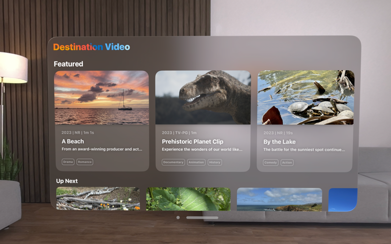
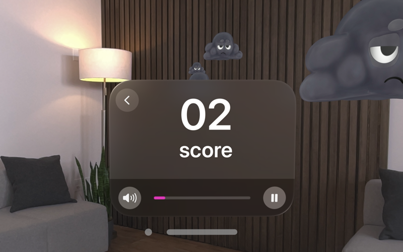
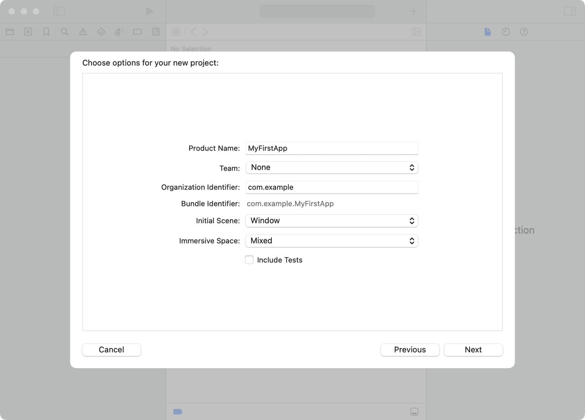
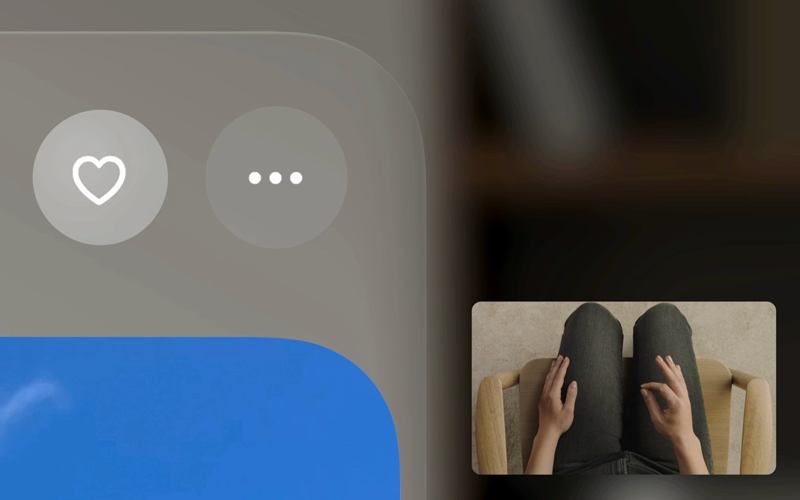
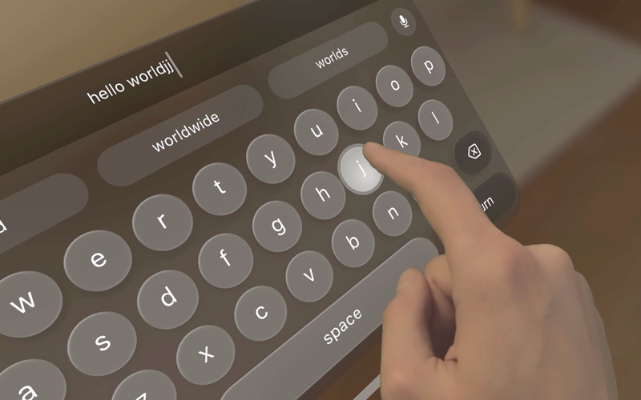
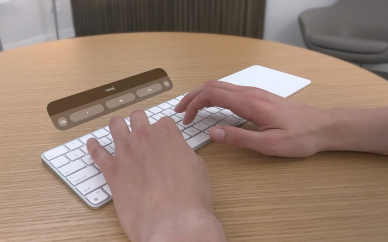

> Navigation: [Technologies](../technologies.md) · [visionOS](../visionos.md)

# Creating your first visionOS app

<sub>Article</sub>

Build a new visionOS app using SwiftUI and add platform-specific features.

## Overview

If you’re new to visionOS, start with a new Xcode project to learn about the platform features, and to familiarize yourself with visionOS content and techniques. When you build an app for visionOS, SwiftUI is an excellent choice because it gives you full access to visionOS features. Although you can also use UIKit to build portions of your app, you need to use SwiftUI for many features that are unique to the platform.

> [!note] Note
> Developing for visionOS requires a Mac with Apple silicon.

[A video that shows multiple 2D app scenes presented in a room that contains a couch. The scene in the center shows a window with a list of photo albums. The recents album is selected and a grid of landscape panoramic photos is visible. The video shows how the environment dims after a person selects a panoramic photo. The person then turns their head to the left to focus on a window from the Destination Video app that is partially out of view. The person scrolls horizontally through a list of tiles that show a poster photo, a title, and descriptive text.](https://docs-assets.developer.apple.com/published/40f2eeb392d88ba3d5475db92289a1e3/multiple-apps-overview.mp4)

In any SwiftUI app, you place content onscreen using scenes. A scene contains the views and controls to display onscreen. Scenes also define the appearance of those views and controls when they appear onscreen. In visionOS, you can include both 2D and 3D views in the same scene, and you can present those views in a window or as part of the person’s surroundings.



<sub>A screenshot that shows a 2D window presented in a room that contains a couch and a lamp. The window shows the Destination Video sample app, showing three featured tiles. Each tile contains a poster photo, a title, and descriptive text.</sub>



<sub>A screenshot of the Happy Beam app that shows a 2D window and 3D objects in a room that contains a couch, a lamp, and a plant. The 2D window shows the game’s current score, volume controls, and a pause button. Three 3D cloud objects are positioned at different depths from the player. </sub>

Start with a new Xcode project and add features to familiarize yourself with visionOS content and techniques. Run your app in Simulator to verify your content looks like you expect, and run it on device to see your 3D content come to life.

Organize your content around one or more scenes, which manage your app’s interface. Each scene contains the views and controls you want to display, and the scene type determines whether your content adopts a 2D or 3D appearance. SwiftUI adds 3D scene types specifically for visionOS, and also adds 3D elements and layout options for all scene types.

### Create your Xcode project

Create a new project in Xcode by choosing File \> New \> Project. Navigate to the visionOS section of the template chooser, and choose the App template. When prompted, specify a name for your project along with other options.

When creating a new visionOS app, you can configure your app’s initial scene types from the configuration dialog. To display primarily 2D content in your initial scene, choose a Window as your initial scene type. For primarily 3D content, choose a Volume. You can also add an immersive scene to place your content in the person’s surroundings.



Include a Reality Composer Pro project file when you want to create 3D assets or scenes to display from your app. Use this project file to build content from primitive shapes and existing USDZ assets. You can also use it to build and test custom RealityKit animations and behaviors for your content.

### Modify the existing window

Build your initial interface using standard SwiftUI views. Views provide the basic content for your interface, and you customize the appearance and behavior of them using SwiftUI modifiers. For example, the `.background` modifier adds a partially transparent tint color behind your content:

```swift
@main
struct MyApp: App {
    var body: some Scene {
        WindowGroup {
            ContentView()
               .background(.black.opacity(0.8))
        }

        ImmersiveSpace(id: "Immersive") {
            ImmersiveView()
        }
    }
}
```

To learn more about how to create and configure interfaces using SwiftUI, see [SwiftUI Essentials](https://developer.apple.com/tutorials/swiftui).

### Handle events in your views

Many SwiftUI views handle interactions automatically — all you do is provide code to run when the interactions occur. You can also add SwiftUI gesture recognizers to a view to handle tap, long-press, drag, rotate, and zoom gestures. The system automatically maps the following types of input to your SwiftUI event-handling code:



<sub>A photo that shows controls in the corner of a window and a superimposed top-down view of the person sitting in a chair with their hands over their lap.</sub>

**Indirect input**. The person’s eyes indicate the target of an interaction. To start the interaction, the person touches their thumb and forefinger together on one or both hands. Additional finger and hand movements define the gesture type.



**Direct input**. When a person’s finger occupies the same space as an onscreen item, the system reports an interaction. Additional finger and hand movements define the gesture type.



<sub>A photo that shows the person’s hands typing on a physical keyboard on a table. A virtual suggestion bar is shown floating above the physical keyboard.</sub>

**Keyboard input**. People can use a connected mouse, trackpad, or keyboard to interact with items, trigger menu commands, and perform gestures.

For more information about handling interactions in SwiftUI views, see [Handling User Input](https://developer.apple.com/tutorials/swiftui/handling-user-input) in the [SwiftUI Essentials](https://developer.apple.com/tutorials/swiftui) tutorial.

### Build and run your app

Build and run your app in Simulator to see how it looks. Simulator for visionOS has a virtual background as the backdrop for your app’s content. Use your keyboard and your mouse or trackpad to navigate around the environment and interact with your app.

Tap and drag the window bar below your app’s content to reposition the window in the environment. Move the pointer over the circle next to the window bar to reveal the window’s close button. Move the cursor to one of the window’s corners to turn the window bar into a resizing control.

> [!note] Note
> Apps don’t control the placement of windows in the space. The system places each window in its initial position, and updates that position based on further interactions with the app.

For additional information about how to interact with your app in Simulator, see [Device Hub](../xcode/device-hub.md).

## See Also

### App construction

- [Adding 3D content to your app](adding-3d-content-to-your-app.md) — Add depth and dimension to your visionOS app and discover how to incorporate your app’s content into a person’s surroundings.
- [Creating fully immersive experiences in your app](creating-fully-immersive-experiences.md) — Build fully immersive experiences by combining spaces with content you create using RealityKit or Metal.
- [Drawing sharp layer-based content in visionOS](drawing-sharp-layer-based-content.md) — Deliver text and vector images at multiple resolutions from custom Core Animation layers in visionOS.
- [Introductory visionOS samples](introductory-visionos-samples.md) — Learn the fundamentals of building apps for visionOS with beginner-friendly sample code projects.
- [Combining spatial support from multiple frameworks](combining-spatial-support-from-multiple-frameworks.md) — Integrate the features of an array of frameworks seamlessly to enhance your spatial app.
- [Connecting iPadOS and visionOS apps over the local network](connecting-ipados-and-visionos-apps-over-the-local-network.md) — Build an iPadOS companion app to control your visionOS app.
