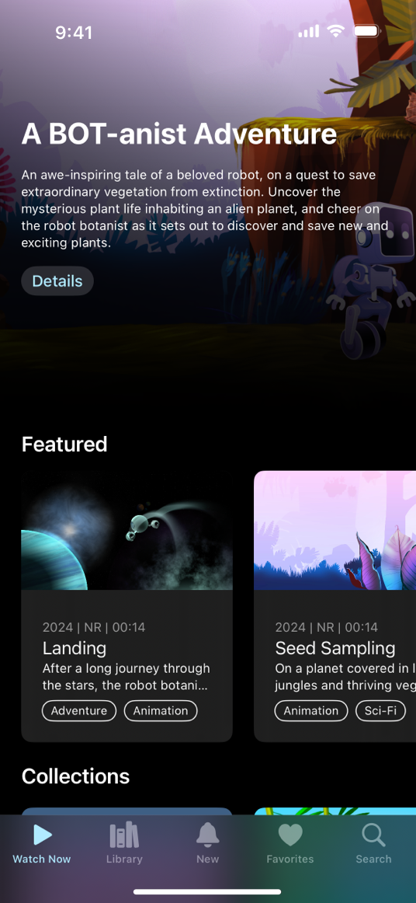
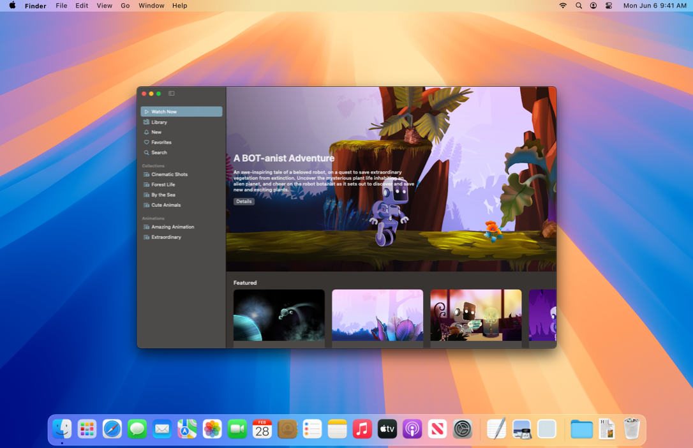
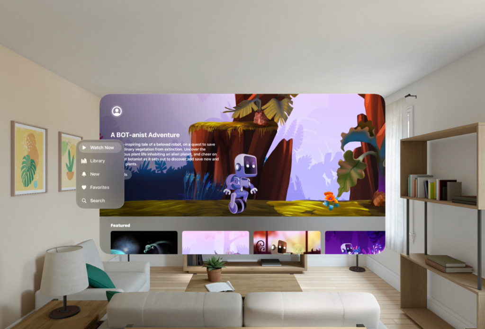
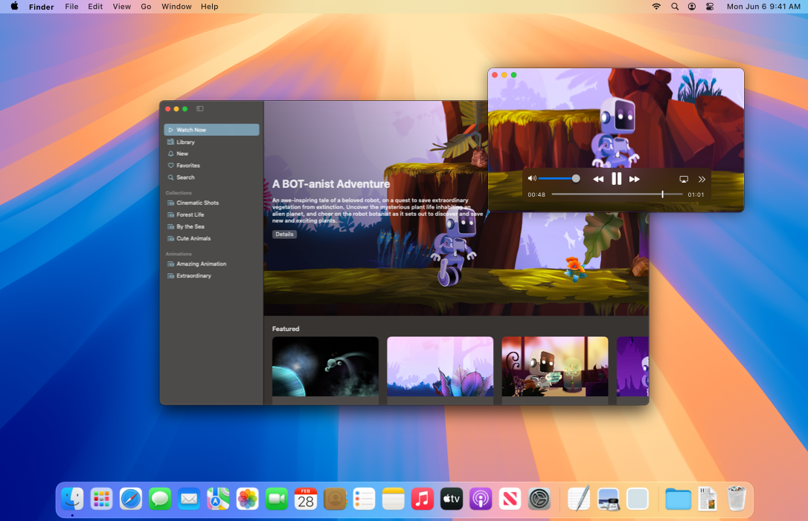
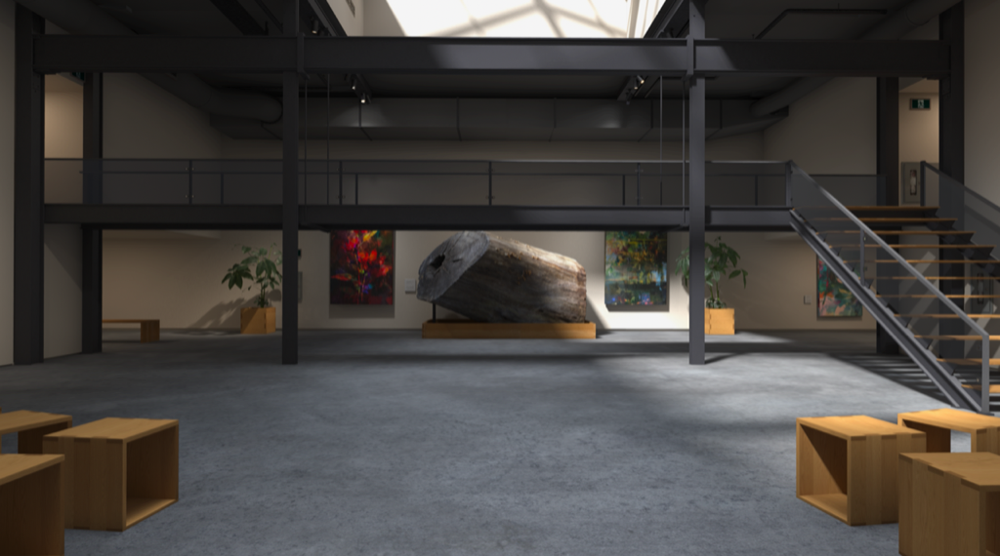
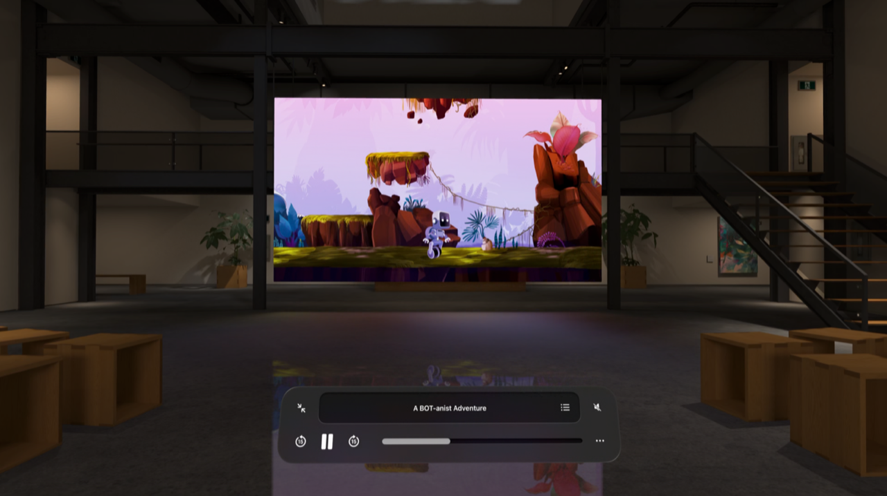

> Navigation: [Technologies](../technologies.md) · [visionOS](../visionos.md)

# Destination Video

<sub>Sample Code</sub>

Leverage SwiftUI to build an immersive media experience in a multiplatform app.

## Overview

Destination Video is a multiplatform video-playback [SwiftUI](../swiftui.md) app for iOS, iPadOS, macOS, tvOS, and visionOS. People get a familiar media-browsing experience navigating the libraryʼs content and playing videos they find interesting.

The sample uses the [TabView](../swiftui/tabview.md) structure in SwiftUI to create an immersive, full-screen browsing experience with rich navigation hierarchy. While the app shares many of its views across platforms, it leverages platform-specific features to create a playback experience native to each platform. For example, it uses the SwiftUI window and scene customization APIs to create a more engaging and natural experience in macOS. This sample also demonstrates how to use [SwiftData](../swiftdata.md) to persist app data in a SwiftUI app.

In visionOS, the sample demonstrates how to play video within an immersive environment configured with [Reality Composer Pro](https://developer.apple.com/documentation/visionos#realitykit-and-reality-composer-pro). It also uses the [Group Activities](../groupactivities.md) framework to enable shared viewing experiences.

[A video of the Destination Video player in an immersive space in visionOS.](https://docs-assets.developer.apple.com/published/ee9b11e4797974549098219580a8b287/Destination-video-hero.mp4)

### Implement tab navigation

Destination Video uses tab navigation with the [sidebarAdaptable](../swiftui/tabviewstyle/sidebaradaptable.md) style, which optimizes the content browsing experience for each platform. In iPadOS, the [TabView](../swiftui/tabview.md) with `sidebarAdaptable` style allows people to toggle between the sidebar and tab bar. The full-screen browsing experience of a tab bar brings content to the forefront while the sidebar allows for easy access to deeper navigation hierarchy.

**iPadOS**

[A video of Destination Video app on iPad. The video shows the app opening the sidebar from the tab bar. The video then shows the customization options in the sidebar.](https://docs-assets.developer.apple.com/published/5874b00c5c2b7ad74c1d96d5e24a0585/Destination-video-tab-navigation-video.mp4)

**iOS**



**macOS**



**tvOS**

[A video that shows tab view on tvOS.](https://docs-assets.developer.apple.com/published/9c378579774fcddd0ccc8677f34e90e6/Destination-video-tab-tvOS-video.mp4)

**visionOS**



To implement tab navigation, first declare a `TabView` with an explicit selection value using the [init(selection:content:)](<../swiftui/tabview/init(selection_content_).md>) initializer. Add tabs within a `TabView` by initializing [Tab](../swiftui/tab.md) structures. Destination Video uses the [init(_:systemImage:value:content:)](<../swiftui/tab/init(__systemimage_value_content_).md>) initializer to create each tab, then groups tabs within a [TabSection](../swiftui/tabsection.md) to declare a secondary tab hierarchy in the `TabView`.

```swift
TabView(selection: $selectedTab) {
    Tab("Watch Now", systemImage: "play", value: .watchnow) {
        WatchNowView()
    }

    // More tabs...
    
    TabSection {
        ForEach(Category.collectionsList) { collection in
            Tab(collection.name, systemImage: collection.icon, value: Tabs.collections(collection)) {
                // More tabs...
            }
        }
    } header: {
        Label("Collections", systemImage: "folder")
    }
}
```

You can also enable customization by adding the [tabViewCustomization(_:)](<../swiftui/view/tabviewcustomization(__).md>) modifier to the `TabView` and the [customizationID(_:)](<../swiftui/tabcontent/customizationid(__).md>) modifier to each tab. Customization in Destination Video allows people to drag tabs from the sidebar to the tab bar, hide nonessential tabs, and rearrange tabs in the sidebar.

For more information, see [Enhancing your app’s content with tab navigation](../swiftui/enhancing-your-app-content-with-tab-navigation.md).

### Customize windows in macOS

In macOS, the app supports multiple windows including a main window that shows the video collections and a separate video player window. You can customize the appearance and function of each window to create a more engaging experience.



The main window displays the app content — collections of videos — in a `TabView` navigation presented as a sidebar. Because the app doesn’t contain any additional toolbar items and the sidebar provides a visual indication of where a person is in the navigation hierarchy, the toolbar isn’t needed and unnecessarily takes up space. This sample removes the toolbar title and background using the [toolbar(removing:)](<../swiftui/view/toolbar(removing_).md>) and [toolbarBackgroundVisibility(_:for:)](<../swiftui/view/toolbarbackgroundvisibility(__for_).md>) modifiers. This creates a full-window browsing experience for Destination Video running in macOS.

```swift
ContentView()
    // ...
    #if os(macOS)
    .toolbarBackgroundVisibility(.hidden, for: .windowToolbar)
    .toolbar(removing: .title)
    #endif
```

Other window customizations in Destination Video include extending a window’s drag region, participating in a window’s zoom action, and modifying a window’s state restoration behavior. For more information, see [Customizing window styles and state-restoration behavior in macOS](../swiftui/customizing-window-styles-and-state-restoration-behavior-in-macos.md).

### Display horizontally scrollable cards in tvOS

Destination Video presents video cards in a horizontally scrollable list in the Watch Now tab. When a person taps on a video card, the app navigates to a view that shows detailed information about the video. In tvOS, each card implements the [card](../swiftui/primitivebuttonstyle/card.md) button style. When a person hovers on a card, it fully scales and lifts up.

[A video that shows Destination Video app in tvOS.](https://docs-assets.developer.apple.com/published/8abc482032660ba8cd72229f32774850/Destination-video-tvOS-video.mp4)

This sample prevents the scroll view from clipping its content when the card expands using the [scrollClipDisabled(_:)](<../swiftui/view/scrollclipdisabled(__).md>) modifier. Additionally, this sample provides a title for the list by placing the `ScrollView` within a [Section](../swiftui/section.md) container and passing the title into the [init(content:header:)](<../swiftui/section/init(content_header_).md>) initializer. This allows the title to also lift and move as the card expands and lifts upon when a person hovers on it.

```swift
Section {
    ScrollView(.horizontal, showsIndicators: false) {
        HStack(spacing: Constants.cardSpacing) {
            ForEach(videos) { video in
                // The video card view.
            }
        }
        .buttonStyle(buttonStyle)
        .padding(.leading, Constants.outerPadding)
    }
    .scrollClipDisabled()
} header: {
    // The list title
}

var buttonStyle: some PrimitiveButtonStyle {
    #if os(tvOS)
    .card
    #else
    .plain
    #endif
}
```

For more information about displaying content in tvOS, see [Creating a tvOS media catalog app in SwiftUI](../swiftui/creating-a-tvos-media-catalog-app-in-swiftui.md).

### Present an immersive space

Building video playback apps for visionOS provides new opportunities to enhance the viewing experience beyond the bounds of the player window. To add a greater level of immersion, this sample presents an immersive space that displays a scene around a person as they watch the video.



It defines the immersive space in the `DestinationVideo` app structure.

```swift
// Defines an immersive space to present a environment in which to watch the video.
ImmersiveSpace(id: ImmersiveEnvironmentView.id) {
    ImmersiveEnvironmentView()
        .environment(immersiveEnvironment)
        .onAppear {
            contentBrightness = immersiveEnvironment.contentBrightness
            surroundingsEffect = immersiveEnvironment.surroundingsEffect
        }
        .onDisappear {
            contentBrightness = .automatic
            surroundingsEffect = nil
        }
        // Applies a custom tint color for the video passthrough of a person's hands and surroundings.
        .preferredSurroundingsEffect(surroundingsEffect)
}
// Set the content brightness for the immersive space.
.immersiveContentBrightness(contentBrightness)
// Set the immersion style to progressive, so a person can use the Digital Crown to dial in their experience.
.immersionStyle(selection: .constant(.progressive), in: .progressive)
```

The [ImmersiveSpace](../swiftui/immersivespace.md) presents an instance of `ImmersiveEnvironmentView`, which maps a texture to the inside of a sphere that it displays around a person. The app presents it using the `.progressive` immersion style, which lets people change the amount of immersion they experience by turning the Digital Crown on the device.

### Play video in a full-window player

One of the most exciting features of visionOS is its ability to play 3D video along with Spatial Audio, which adds a deeper level of immersion to the viewing experience. Playing 3D content in your app requires that you display [AVPlayerViewController](../avkit/avplayerviewcontroller.md) full window. When you present the player this way, the system automatically docks it into the ideal viewing position, and presents streamlined playback controls that keep the person’s focus on the content.



> [!note] Note
> In iOS or tvOS, you typically present video in a full-screen presentation using the [fullScreenCover(isPresented:onDismiss:content:)](<../swiftui/view/fullscreencover(ispresented_ondismiss_content_).md>) modifier. This API is available in visionOS; however, the recommended way to present the player for full-window playback is to set it as the root view of your app’s window group.

Destination Video’s `ContentView` displays the app’s library by default. It observes changes to the player model’s `presentation` property, which indicates whether the app requests inline or full-window playback. When the presentation state changes to `fullWindow`, the view redraws the UI to display the player view in place of the library.

```swift
struct ContentView: View {
    @Environment(PlayerModel.self) private var player
    #if os(visionOS)
    @Environment(ImmersiveEnvironment.self) private var immersiveEnvironment
    #endif

    var body: some View {
        #if os(visionOS)
        Group {
            switch player.presentation {
            case .fullWindow:
                // Presents the player in a full window and begins playback.
                PlayerView()
                    .immersiveEnvironmentPicker {
                        ImmersiveEnvironmentPickerView()
                    }
                    .onAppear {
                        player.play()
                    }
            default:
                // Shows the app's content library by default.
                DestinationTabs()
            }
        }
        // A custom modifier that manages the presentation and dismissal of the app's immersive space.
        .immersionManager()
        #else
        DestinationTabs()
            // A custom modifier that presents the video player appropriately for the current platform.
            .presentVideoPlayer()
        #endif
    }
}
```

When someone selects the Play Video button on the detail view, the app calls the player model’s `loadVideo(_: presentation:)` method requesting the `fullWindow` presentation option.

```swift
Button {
    /// Load the media item for full-window presentation.
    player.loadVideo(video, presentation: .fullWindow)
} label: {
    Label("Play Video", systemImage: "play.fill")
}
```

After the player model successfully loads the video content for playback, it updates its `presentation` value to `fullWindow`, which causes the app to replace `DestinationTabs` with `PlayerView`.

To dismiss the full-window player in visionOS, people tap the Back button in the player UI. To handle this action, the app’s `PlayerViewControllerDelegate` type defines an [AVPlayerViewControllerDelegate](../avkit/avplayerviewcontrollerdelegate.md) object that handles the dismissal.

When the delegate receives this call, it clears the media from the player model and resets the presentation state back to its default value, which results in the Destination Video app redisplaying the `DestinationTabs` view.

### Configure the Spatial Audio experience

Media playback apps require common configuration of their capabilities and audio session. In addition to performing the steps outlined in [Configuring your app for media playback](../avfoundation/configuring-your-app-for-media-playback.md), Destination Video also adopts new [AVAudioSession](../avfaudio/avaudiosession.md) API to customize a person’s Spatial Audio experience.

After the app successfully loads a video for playback, it configures the Spatial Audio experience for the current presentation. For the inline player view, it sets the experience to a small, focused sound stage where the audio originates from the location of the view. When displaying a video full window, it sets the experience to a large, fully immersive sound stage.

```swift
private func configureAudioExperience(for presentation: Presentation) {
    #if os(visionOS)
    do {
        let experience: AVAudioSessionSpatialExperience
        switch presentation {
        case .inline:
            // Set a small, focused sound stage when watching trailers.
            experience = .headTracked(soundStageSize: .small, anchoringStrategy: .automatic)
        case .fullWindow:
            // Set a large sound stage size when viewing full window.
            experience = .headTracked(soundStageSize: .large, anchoringStrategy: .automatic)
        }
        try AVAudioSession.sharedInstance().setIntendedSpatialExperience(experience)
    } catch {
        logger.error("Unable to set the intended spatial experience. \(error.localizedDescription)")
    }
    #endif
}
```

### Customize an environment using RealityKit and Reality Composer Pro

In visionOS, Destination Video provides a custom environment, called Studio.

[A video that shows shows the Studio environment in visionOS. The video shows the app selecting the Studio environment from the environment picker menu. The video then shows the video player docking in an immersive space.](https://docs-assets.developer.apple.com/published/fdf2f24116b417c6817578407a4ae780/Destination-video-customize-an-environment.mp4)

To optimize the viewing experience in the Studio environment, this sample implements the following:

- **[DockingRegionComponent](../realitykit/dockingregioncomponent.md)** — Customizes the docking location for the video player in a custom environment.
- **[Reflection Specular (RealityKit)](<../shadergraph/realitykit/reflection-specular-(realitykit).md>)** — Enhances the reflections of the video content on glossy surfaces in the surrounding environment.
- **[Reflection Diffuse (RealityKit)](<../shadergraph/realitykit/reflection-diffuse-(realitykit).md>)** — Enhances the reflections of the video content on organic surfaces in the surrounding environment.
- **[VirtualEnvironmentProbeComponent](../realitykit/virtualenvironmentprobecomponent.md)** — Configures the virtual scene lighting.
- **[ReverbComponent](../realitykit/reverbcomponent.md)** — Applies reverb for enhanced audio immersion.

In visionOS, a person can select the environment in which they watch a video by tapping on the environment picker menu presented by [AVPlayerViewController](../avkit/avplayerviewcontroller.md). The Studio environment has light and dark variants. This sample adds them to the list of environments that appear in the environment picker menu using the [immersiveEnvironmentPicker(content:)](<../swiftui/view/immersiveenvironmentpicker(content_).md>) modifier.

```swift
PlayerView()
    .immersiveEnvironmentPicker {
        ImmersiveEnvironmentPickerView()
    }
```

For more information, see [Building an immersive media viewing experience](building-an-immersive-media-viewing-experience.md) and [Enabling video reflections in an immersive environment](enabling-video-reflections-in-an-immersive-environment.md).

### Provide a shared viewing experience

One of the best ways to enhance your app’s playback experience is to make that experience shareable with others. You can use the [AVFoundation](../avfoundation.md) and the [Group Activities](../groupactivities.md) frameworks to build [SharePlay](https://developer.apple.com/shareplay/) experiences that bring people together even when they can’t be in the same location.

The Destination Video app creates an experience where people can watch videos with others across devices and platforms. It defines a group activity called `WatchingActivity` that adopts the [GroupActivity](../groupactivities/groupactivity.md) protocol.  When people have a FaceTime call active and they play a video in the full-window player, it becomes eligible for playback for everyone on the call.

The app’s `WatchingCoordinator` actor manages Destination Video’s SharePlay functionality. It observes the activation of new `WatchingActivity` sessions. After a `WatchingActivity` session starts, the `WatchingCoordinator` sets the [GroupSession](../groupactivities/groupsession.md) instance on the player object’s [AVPlaybackCoordinator](../avfoundation/avplaybackcoordinator.md).

```swift
private typealias WatchingSession = GroupSession<WatchingActivity>
private weak var coordinator: AVPlayerPlaybackCoordinator?

private var liveSession: WatchingSession? {
    didSet {
        guard let liveSession else { return }
        // Set the group session on the AVPlayer object's playback coordinator
        // so it can synchronize playback with other devices.
        coordinator?.coordinateWithSession(liveSession)
    }
}
```

With the player configured to use the group session, when the app loads new videos, they become eligible to share with people in the FaceTime call.

## See Also

#### Related samples

- [BOT-anist](bot-anist.md)
- [Hello World](world.md)
- [Happy Beam](happybeam.md)
- [Diorama](diorama.md)

#### Related articles

- [Customizing window styles and state-restoration behavior in macOS](../swiftui/customizing-window-styles-and-state-restoration-behavior-in-macos.md)
- [Enhancing your app’s content with tab navigation](../swiftui/enhancing-your-app-content-with-tab-navigation.md)
- [Building an immersive media viewing experience](building-an-immersive-media-viewing-experience.md)
- [Enabling video reflections in an immersive environment](enabling-video-reflections-in-an-immersive-environment.md)

- [Configuring your app for media playback](../avfoundation/configuring-your-app-for-media-playback.md)
- [Adopting the system player interface in visionOS](../avkit/adopting-the-system-player-interface-in-visionos.md)
- [Controlling the transport behavior of a player](../avfoundation/controlling-the-transport-behavior-of-a-player.md)
- [Monitoring playback progress in your app](../avfoundation/monitoring-playback-progress-in-your-app.md)
- [Trimming and exporting media in visionOS](../avkit/trimming-and-exporting-media-in-visionos.md)

#### Related videos

- [Elevate your tab and sidebar experience in iPadOS](../https_/developer.apple.com/videos/play/wwdc2024/10147.md)
- [Tailor macOS windows with SwiftUI](../https_/developer.apple.com/videos/play/wwdc2024/10148.md)
- [Enhance the immersion of media viewing in custom environments](../https_/developer.apple.com/videos/play/wwdc2024/10115.md)
- [Create custom hover effects in visionOS](../https_/developer.apple.com/videos/play/wwdc2024/10152.md)
- [Create a great spatial playback experience](../https_/developer.apple.com/videos/play/wwdc2023/10070.md)
- [Deliver video content for spatial experiences](../https_/developer.apple.com/videos/play/wwdc2023/10071.md)

## Download

- [DestinationVideo.zip](https://docs-assets.developer.apple.com/published/3248dcf174b4/DestinationVideo.zip)
