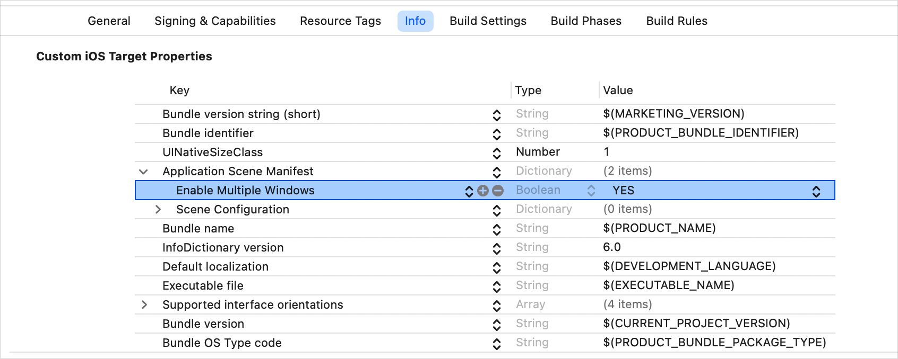

> Navigation: [Technologies](../technologies.md) · [visionOS](../visionos.md)

# Presenting windows and spaces

<sub>Article</sub>

Open and close the scenes that make up your app’s interface.

## Overview

An app’s scenes, which contain views that people interact with, can take different forms. For example, a scene can fill a window, a tab in a window, or an entire screen. Some scenes can even place views throughout a person’s surroundings. How a scene appears depends on its type, the platform, and the context.

When someone launches your app, SwiftUI looks for the first [WindowGroup](../swiftui/windowgroup.md), [Window](../swiftui/window.md), or [DocumentGroup](../swiftui/documentgroup.md) in your app declaration and opens a scene of that type, typically filling a new window or the entire screen, depending on the platform. For example, the following app running in macOS presents a window that contains a `MailViewer` view:

```swift
@main
struct MailReader: App {
    var body: some Scene {
        WindowGroup(id: "mail-viewer") {
            MailViewer()
        }

        Window("Connection Status", id: "connection") {
            ConnectionStatus()
        }
    }
}
```

In visionOS, you can alternatively configure your app to open the first [ImmersiveSpace](../swiftui/immersivespace.md) that the app declares. In any case, specific platforms and configurations enable you to open more than one scene at a time. Under those conditions, you can use actions that appear in the environment to programmatically open and close the scenes in your app.

### Check for multiple-scene support

If you share code among different platforms and need to find out at runtime whether the current system supports displaying multiple scenes, read the [supportsMultipleWindows](../swiftui/environmentvalues/supportsmultiplewindows.md) environment value. The following code creates a button that’s hidden unless the app supports multiple windows:

```swift
struct NewWindowButton: View {
    @Environment(\.supportsMultipleWindows) private var supportsMultipleWindows
    @Environment(\.openWindow) private var openWindow

    var body: some View {
        Button("Open New Window") {
            openWindow(id: "mail-viewer")
        }
        .opacity(supportsMultipleWindows ? 1 : 0)
    }
}
```

The value that you read depends on both the platform and how you configure your app:

- In macOS, this property returns `true` for any app that uses the SwiftUI app lifecycle.
- In iPadOS and visionOS, this property returns `true` for any app that uses the SwiftUI app lifecycle and has the Information Property List key [UIApplicationSupportsMultipleScenes](../bundleresources/information-property-list/uiapplicationscenemanifest/uiapplicationsupportsmultiplescenes.md) set to `true`, and `false` otherwise.
- For all other platforms and configurations, the value returns `false`.

If your app only ever runs in one of these situations, you can assume the associated behavior and don’t need to check the value.

### Enable multiple simultaneous scenes

You can always present multiple scenes in macOS. To enable an iPadOS or visionOS app to simultaneously display multiple scenes — including [ImmersiveSpace](../swiftui/immersivespace.md) scenes in visionOS — add the [UIApplicationSupportsMultipleScenes](../bundleresources/information-property-list/uiapplicationscenemanifest/uiapplicationsupportsmultiplescenes.md) key with a value of `true` in the [UIApplicationSceneManifest](../bundleresources/information-property-list/uiapplicationscenemanifest.md) dictionary of your app’s Information Property List. Use the Info tab in Xcode for your app’s target to add this key:



<sub>A screenshot of the Xcode info tab showing the values that a typical app’s information property list contains. The Enable Multiple Windows key, which has a type of Boolean and a value of yes, and is a subkey of the Application Scene Manifest dictionary, is highlighted.</sub>

Apps on other platforms can display only one scene during their lifetime.

### Open windows programmatically

Some platforms provide built-in controls that enable people to open instances of the window-style scenes that your app defines. For example, in macOS people can choose File \> New Window from the menu bar to open a new window. SwiftUI also provides ways for you to open new windows programmatically.

To do this, get the [openWindow](../swiftui/environmentvalues/openwindow.md) action from the environment and call it with an identifier, a value, or both to indicate what kind of window to open and optionally what data to open it with. The following view opens a new instance of the previously defined mail viewer window when someone clicks or taps the button:

```swift
struct NewViewerButton: View {
    @Environment(\.openWindow) private var openWindow

    var body: some View {
        Button("New Mail Viewer") {
            openWindow(id: "mail-viewer")
        }
    }
}
```

When the action runs on a system that supports multiple scenes, SwiftUI looks for a window in the app declaration that has a matching identifier and creates a new scene of that type.

> [!important] Important
> If [supportsMultipleWindows](../swiftui/environmentvalues/supportsmultiplewindows.md) is `false` and you try to open a new window, SwiftUI ignores the action and logs a runtime error.

In addition to opening more instances of an app’s main window, as in the above example, you can also open other window types that your app’s body declares. For example, you can open an instance of the [Window](../swiftui/window.md) that displays connectivity information:

```swift
Button("Connection Status") {
    openWindow(id: "connection")
}
```

### Open a space programmatically

In visionOS, you open an immersive space — a scene that you can use to present unbounded content in a person’s surroundings — in much the same way that you open a window, except that you use the [openImmersiveSpace](../swiftui/environmentvalues/openimmersivespace.md) action. The action runs asynchronously, so you use the `await` keyword when you call it, and typically do so from inside a [Task](../swift/task.md):

```swift
struct NewSpaceButton: View {
    @Environment(\.openImmersiveSpace) private var openImmersiveSpace

    var body: some View {
        Button("View Orbits") {
            Task {
                await openImmersiveSpace(id: "orbits")
            }
        }
    }
}
```

Because your app operates in a Full Space when you open an [ImmersiveSpace](../swiftui/immersivespace.md) scene, you can only open one scene of this type at a time. If you try to open a space when one is already open, the system logs a runtime error.

Your app can display any number of windows together with an immersive space. However, when you open a space from your app, the system hides all windows that belong to other apps. After you dismiss your space, the other apps’ windows reappear. Similarly, the system hides your app’s windows if another app opens an immersive space.

### Designate a space as your app’s main interface

When visionOS launches an app, it opens the first window group, window, or document scene that the app’s body declares, just like on other platforms. This is true even if you first declare a space. However, if you want to open your app into an immersive space directly, specify a space as the default scene for your app by adding the [UIApplicationPreferredDefaultSceneSessionRole](../bundleresources/information-property-list/uiapplicationpreferreddefaultscenesessionrole.md) key to your app’s information property list and setting its value to `UISceneSessionRoleImmersiveSpaceApplication`. In that case, visionOS opens the first space that it finds in your app declaration.

> [!important] Important
> Be careful not to overwhelm people when starting your app with an immersive space. For design guidance, see [Immersive experiences](../design/human-interface-guidelines/immersive-experiences.md).

### Close windows programmatically

People can close windows using system controls, like the close button built into the frame around a macOS window. You can also close windows programmatically. Get the [dismissWindow](../swiftui/environmentvalues/dismisswindow.md) action from the environment, and call it using the identifier of the window that you want to dismiss:

```swift
private struct ContentView: View {
    @Environment(\.dismissWindow) private var dismissWindow

    var body: some View {
        Button("Done") {
            dismissWindow(id: "connection")
        }
    }
}
```

In iPadOS and visionOS, the system ignores the dismiss action if you use it to close a window that’s your app’s only open scene.

### Close spaces programmatically

To close a space, call the [dismissImmersiveSpace](../swiftui/environmentvalues/dismissimmersivespace.md) action. Like the corresponding open space action, the close action operates asynchronously and requires the `await` keyword:

```swift
private struct ContentView: View {
    @Environment(\.dismissImmersiveSpace) private var dismissImmersiveSpace

    var body: some View {
        Button("Done") {
            Task {
                await dismissImmersiveSpace()
            }
        }
    }
}
```

You don’t need to specify an identifier for this action, because there can only ever be one space open at a time. Like with windows, you can’t dismiss a space that’s your app’s only open scene.

### Transition between a window and a space

Because you can’t programmatically close the last open window or immersive space in a visionOS app, be sure to open a new scene before closing the old one. Pay particular attention to the sequencing when moving between a window and an immersive space, because the space’s open and dismiss actions run asynchronously.

For example, consider a chess game that begins by displaying a start button in a window. When someone taps the button, the app dismisses the window and opens an immersive space that presents a chess board. The following button demonstrates proper sequencing by opening the space and then closing the window:

```swift
Button("Start") {
    Task {
        await openImmersiveSpace(id: "chessboard")
        dismissWindow(id: "start") // Runs after the space opens.
    }
}
```

In the above code, it’s important to include the [dismissWindow](../swiftui/environmentvalues/dismisswindow.md) action inside the task, so that it waits until the [openImmersiveSpace](../swiftui/environmentvalues/openimmersivespace.md) action completes. If you put the action outside the task — either before or after — it might execute before the asynchronous open action completes, when the window is still the only open scene. In that case, the system opens the space but doesn’t close the window.

## See Also

### SwiftUI

- [Canyon Crosser: Building a volumetric hike-planning app](canyon-crosser-building-a-volumetric-hike-planning-app.md) — Create a hike planning app using SwiftUI and RealityKit.
- [Hello World](world.md) — Use windows, volumes, and immersive spaces to teach people about the Earth.
- [Positioning and sizing windows](positioning-and-sizing-windows.md) — Influence the initial geometry of windows that your app presents.
- [Adopting best practices for persistent UI](adopting-best-practices-for-scene-restoration.md) — Create persistent and contextually relevant spatial experiences by managing scene restoration, customizing window behaviors, and surface snapping data.
