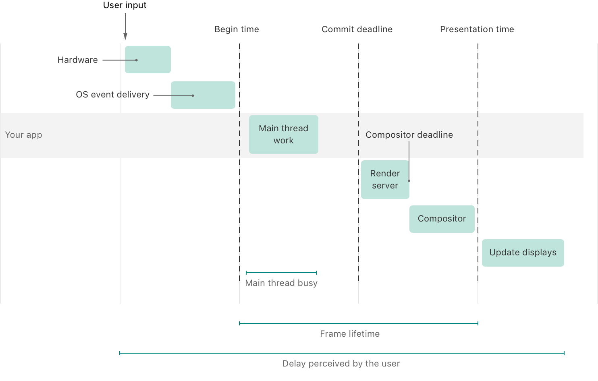
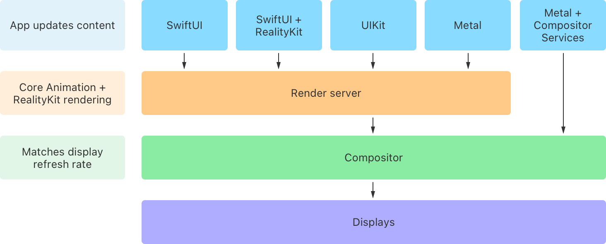
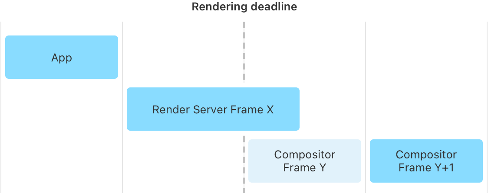

> Navigation: [Technologies](../technologies.md) · [visionOS](../visionos.md)

# Understanding the visionOS render pipeline

Article

Compare how visionOS handles events and manages its rendering loop differently from other Apple platforms.

## Overview

Like other Apple platforms, visionOS renders changes to the UI in response to updates your app makes, input events, callbacks from actions you initiate, timers, and notifications. Unique on Apple Vision Pro, the system renders updates to the images the device displays in order to reposition the UI relative to changes in head position. When the system detects eye and hand movement, deliberate or inadvertent, it requires additional processing to determine what a person is looking at, or interacting with, to calculate a response. The system does a lot more to render an up-to-date UI and account for input from spatial algorithms.

The following diagram illustrates how input propagates through the system and updates content in visionOS:

A timeline illustration with a horizontal bar labeled Your app that spans four columns. At the top left above the first column, a label called User input has an arrow pointing down to a square labeled Hardware. Below that and to the right above the horizontal bar is a rectangle labeled OS event delivery. Both rectangles are  in the first column. A dashed line separating the first and second column is labeled Begin time. In the second column, a rectangle labeled Main thread work sits on the horizontal bar. A horizontal line labeled Main thread busy appears at the bottom of the column aligned with the rectangle. A dashed line separating the second and third column is labeled Commit deadline. The fourth column contains a rectangle labeled Render server below the horizontal bar. The rectangle is left-aligned to the dashed line labeled Commit deadline, but not aligned with the right side of the column. A label called Compositor deadline has an arrow pointing down to the end of the square labeled Render server. Below that and to the right below the horizontal bar is a rectangle labeled Compositor. A dashed line that separates the third and fourth column is labeled Presentation time. A horizontal line at the bottom labeled Frame lifetime spans the second and third columns starting at the dashed line labeled Begin time and ending at the dashed line labeled Presentation time. The fifth column contains a rectangle labeled Update display below the horizontal bar that is left-aligned in its column. A horizontal line at the bottom labeled Delay perceived by the user spans from the User clicks arrow on the left to the right side of the Update display rectangle.

- **User input** — A person initiates an interaction through a look, hand gesture, a keyboard, or pointing device.
- **Hardware** — Sensors, or other hardware, recognize the input and forward it to the operating system (OS).
- **OS event delivery** — The OS relies on collision detection to determine which entity or entities to direct an interaction to, and the process responsible for handling the user input event — the app that owns the scene where the event occurs.
- **Main thread work** — The system puts the event into an app-specific queue, and your app’s main thread picks up those events from the queue and processes them. Your app updates its audio and visual output in response to these events. Your app updates the shared render server with any changes to the UI view hierarchy and 3D RealityKit based content.
- **Render server** — The _render server_ is a continuously running process (`backboardd`) that receives updates from all the running apps and other processes with Core Animation and RealityKit content to display. The render server processes the updates and composites them into a single drawable image. It sends this combined image to the compositor.
- **Compositor** — The _compositor_, another continuously running process, receives the image frames from the render server, processes data about your surroundings from Apple Vision Pro sensors and cameras, then combines them into a set of images to display. To maintain visual smoothness, the compositor strives to maintain a consistent display refresh rate.
- **Update display** — On visionOS, the display driver wakes up at a regular interval to update the display with the new image from the compositor. This differs from other platforms where the display driver checks at regular intervals with the render server to determine whether the screen needs updating.

In the Shared Space, each app updates its own UI and 3D content and syncs the updates to its view hierarchy and content to the shared render server. This server renders the updates from multiple apps running side-by-side. Then, the render server works with the compositor to generate final images to display of the UI and people’s surroundings. Metal apps in a Full Space use the [Compositor Services](../compositorservices.md) framework to render drawable frames directly to the Compositor, bypassing the render server.

An  illustration with four rows that shows how the render server and the compositor process updates to your app's content. This first three rows contain boxes to the left and aligned with each other. From top to bottom, these boxes are labeled App updates content, Core Animation + RealityKit rendering, and Matches display refresh rate. To the right of the box labeled App updates content, in the first row, are boxes labeled SwiftUI, SwiftUI + RealityKit, UIKit, Metal, and Metal + Compositor Services. To the right of the box labeled Core Animation + RealityKit rendering, in the second row, is a box labeled Render server. It spans the width of four boxes in the in the first row, SwiftUI, SwiftUI + RealityKit, UIKit, and Metal, with arrows pointing down from those boxes into it. To the right of the box labeled Matches Display refresh rate, in the third row, is a box labeled Compositor. It spans the width of all five boxes in the first row, including the one labeled Metal + Compositor Services. Arrows point down from the box labeled Render server in the second row and the box labeled Metal + Compositor Services in the first row into the this box. The last row contains a single box labeled Displays that also spans the width of the same five boxes in the first row with an arrow pointing down from the box labeled Compositor in the third row.

If your app running in the Shared Space has content or updates that take too long to render, the render server can miss deadlines. Visual updates you expect in one compositor frame don’t show up until a later frame.

A timeline illustration that spans four columns. At the top inside the first column is a rectangle labeled App. Below that, beginning at the start of the second column and extending into the third is a rectangle labeled Render Server Frame X. A dashed line separating the second and third column is labeled Rendering deadline. The third column contains a rectangle that extends the full length of the column labeled Compositor Frame Y. The fourth column contains a rectangle that extends the full length of the column labeled Compositor Frame Y+1.

Use the RealityKit Trace template in Instruments to profile your app and identify workflows with dropped frames and other rendering and responsiveness bottlenecks. For more information, see [Analyzing the performance of your visionOS app](analyzing-the-performance-of-your-visionos-app.md). To learn about optimizations you can make in your SwiftUI and UIKit interfaces, see [Reducing the rendering cost of your UI on visionOS](reducing-the-rendering-cost-of-your-ui-on-visionos.md). To learn about optimizing your RealityKit content, see [Reducing the rendering cost of RealityKit content on visionOS](reducing-the-rendering-cost-of-realitykit-content-on-visionos.md).

When using [Metal](../metal.md) and the [Compositor Services](../compositorservices.md) framework to bypass the render server, use the Metal System Trace template to profile your app’s performance. For more info, see [Analyzing the performance of your Metal app](../xcode/analyzing-the-performance-of-your-metal-app.md).

- Pace your metal frame submissions so that the compositor receives a new frame from your app on each of its updates.
- Maintain a consistent metal rendering frame rate that is equal to the Apple Vision Pro display refresh rate. Use the visualizations in the Display instrument timeline to compare your rendered frame times to the display refresh rate — usually 90Hz on the Apple Vision Pro, but it can be higher under certain environmental conditions.
- Query a new foveation map and pose prediction for each frame immediately before you use it to encode GPU work.
- Avoid long-running fragment and vertex shader executions from your Metal app, or from custom materials with Reality Composer Pro.
- Avoid any long frame stalls. If your app takes too long to submit a new frame to the compositor, the system terminates it.

To learn more about implementing fully immersive Metal apps, see [Drawing fully immersive content using Metal](../compositorservices/drawing-fully-immersive-content-using-metal.md) and watch the video [Discover Metal for immersive apps](../https_/developer.apple.com/videos/play/wwdc2023/10089.md).

## See Also

### Performance

- [Creating a performance plan for your visionOS app](creating-a-performance-plan-for-visionos-app.md) — Identify your app’s performance and power goals and create a plan to measure and assess them.
- [Analyzing the performance of your visionOS app](analyzing-the-performance-of-your-visionos-app.md) — Use the RealityKit Trace template in Instruments to evaluate and improve the performance of your visionOS app.
- [Reducing the rendering cost of your UI on visionOS](reducing-the-rendering-cost-of-your-ui-on-visionos.md) — Optimize your 2D user interface rendering on visionOS.
- [Reducing the rendering cost of RealityKit content on visionOS](reducing-the-rendering-cost-of-realitykit-content-on-visionos.md) — Optimize your app’s 3D augmented reality content to render efficiently on visionOS.
