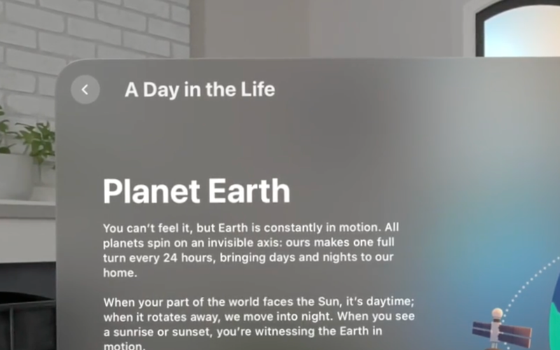
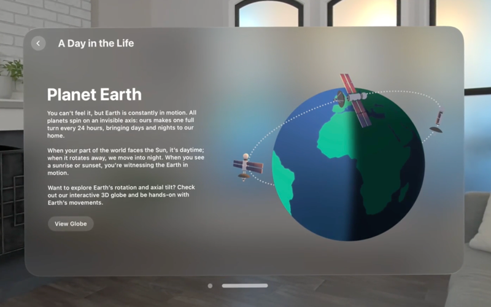
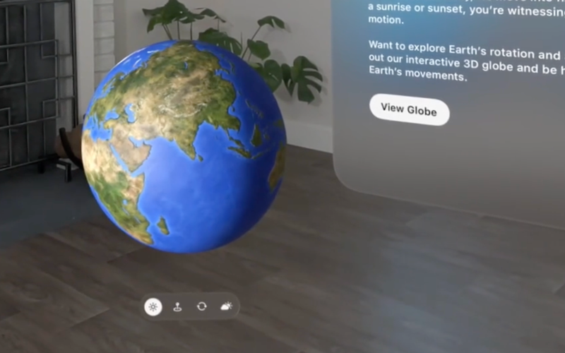
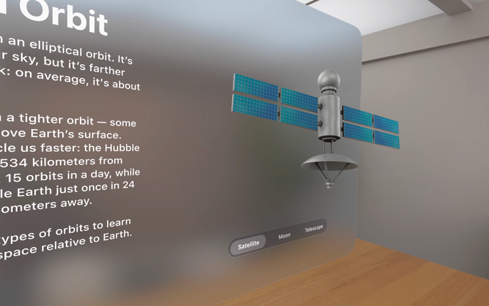
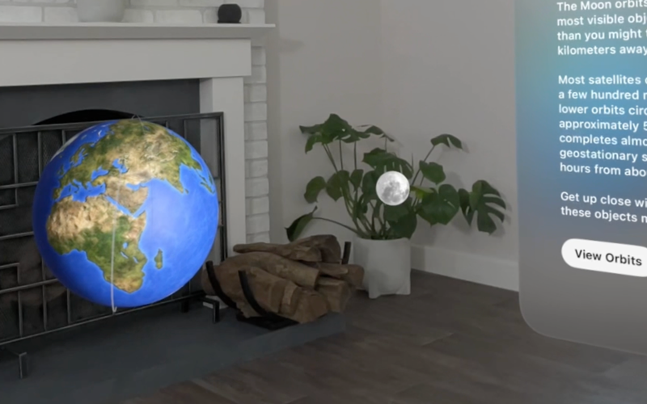
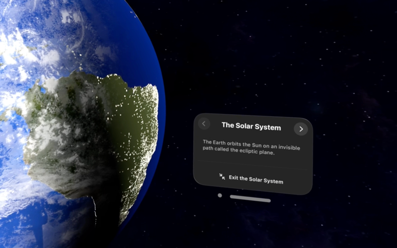

> Navigation: [Technologies](../technologies.md) · [visionOS](../visionos.md)

# Hello World

<sub>Sample Code</sub>

Use windows, volumes, and immersive spaces to teach people about the Earth.

## Overview

You can use visionOS scene types and styles to share information in fun and compelling ways. Features like volumes and immersive spaces let you put interactive virtual objects into people’s environments, or put people into a virtual environment.

Hello World uses these tools to teach people about the Earth — the planet we call home. The app shows how the Earth’s tilt creates the seasons, how objects move as they orbit the Earth, and how Earth appears from space.

[A video showing the Hello World app and each of its scenes. The video begins with an animation of the text Hello World typing in, followed by the modules screen. Each module appears in sequence: an interactive globe in a volume, orbiting satellites around the Earth in a mixed immersive space, and the solar system in a fully immersive environment with stars in all directions.](https://docs-assets.developer.apple.com/published/efa8e7a0a97cfab20bf0f4c307b9b121/Hello-World-overview.mp4)

The app uses SwiftUI to define its interface, including both 2D and 3D elements. To create, customize, and manage 3D models and effects, it also relies on the RealityKit framework and Reality Composer Pro.

### Create an entry point into the app

Hello World constructs the scene that it displays at launch — the first scene that appears in the `WorldApp` structure — using a [Window](../swiftui/window.md).

```swift
Window(String(localized: "Hello World", comment: "The name of the app. This is the typical title for many example apps in programming tutorials."),
       id: Self.modulesWindowID) {
    Modules()
        .environment(model)
        .frame(minWidth: 800, minHeight: 600)
}
.windowResizability(.contentMinSize)
```

Like other platforms — for example, macOS and iOS — visionOS displays a window group as a familiar-looking window. In visionOS, people can resize and move windows around the Shared Space. Even if your app offers a sophisticated 3D experience, a window is a great starting point for an app because it eases people into the experience. It’s also a good place to provide instructions and controls.

### Present different modules using a navigation stack

After you watch a brief introductory animation that shows the text “Hello World” typing in, the `Modules` view that defines the primary scene’s content presents options to explore different aspects of the world. This view contains a table of contents at the root of a [NavigationStack](../swiftui/navigationstack.md).

```swift
NavigationStack(path: $model.navigationPath) {
    TableOfContents()
        .navigationDestination(for: Module.self) { module in
            ModuleDetail(module: module)
                .navigationTitle(module.eyebrow)
        }
}
```

A visionOS navigation stack has the same behavior that it has in other platforms. When it first appears, the stack displays its root view. When someone chooses an embedded [NavigationLink](../swiftui/navigationlink.md), the stack draws a new view and displays a Back button in the toolbar. When someone taps the Back button, the stack restores the previous view.



<sub>A screenshot of the upper-left quarter of a visionOS window floating in a living room. A Back button that displays a left-pointing chevron appears in the upper-left corner of the window. The window's title, A Day in the Life, appears to the right of the button and centered vertically with it. The main part of the window displays the title Planet Earth, and a couple paragraphs of text.</sub>

The trailing closure of the [navigationDestination(for:destination:)](<../swiftui/view/navigationdestination(for_destination_).md>) view modifier in the code above displays a view when someone activates a link based on a `module` input that comes from the corresponding link’s initializer.

```swift
NavigationLink(value: module) { /* The link's label. */ }
```

The possible `module` values come from a custom `Module` enumeration.

```swift
enum Module: String, Identifiable, CaseIterable, Equatable {
    case globe, orbit, solar
    // ...
}
```

### Display an interactive globe in a new scene

The `globe` module opens with a few facts about the Earth in the main window next to a decorative, flat image that supports the content. To help people understand even more, the module includes a View Globe button that opens a 3D interactive globe in a new window.



<sub>A screenshot of a visionOS window floating in a living room. The window contains a top-left-aligned Back button and a toolbar with the title A Day in the Life. A stylized image of the Earth and three satellites appears on the right side of the window. The left side contains the title Planet Earth, three paragraphs of content about Earth, and a View Globe button, all stacked vertically.</sub>

To be able to open multiple scene types, Hello World includes the [UIApplicationSceneManifest](../bundleresources/information-property-list/uiapplicationscenemanifest.md) key in its [Information Property List](../bundleresources/information-property-list.md) file. The value for this key is a dictionary that includes the [UIApplicationSupportsMultipleScenes](../bundleresources/information-property-list/uiapplicationscenemanifest/uiapplicationsupportsmultiplescenes.md) key with a value of `true`.

```swift
<key>UIApplicationSceneManifest</key>
<dict>
    <key>UIApplicationSupportsMultipleScenes</key>
    <true/>
    <key>UISceneConfigurations</key>
    <dict/>
</dict>
```

### Declare a volume for the globe

With the key in place, the app makes use of a second [WindowGroup](../swiftui/windowgroup.md) in its [App](../swiftui/app.md) declaration. This new window group uses the `Globe` view as its content.

```swift
WindowGroup(id: Module.globe.name) {
    Globe()
        .environment(model)
}
.windowStyle(.volumetric)
.defaultSize(width: 0.6, height: 0.6, depth: 0.6, in: .meters)
```

This window group creates a _volume_ — which is a container that has three dimensions and behaves like a transparent box — because Hello World uses the [volumetric](../swiftui/windowstyle/volumetric.md) window style scene modifier. People can move this box around the Shared Space like they move other window types, and the content remains fixed inside. The [defaultSize(width:height:depth:in:)](<../swiftui/scene/defaultsize(width_height_depth_in_).md>) modifier specifies a size for the volume in meters, including a depth dimension.

[A video showing the volume that contains the globe. The globe rotates slowly as the viewpoint shifts from side to side, demonstrating how the 3D content remains fixed inside the volume.](https://docs-assets.developer.apple.com/published/8712f59eefa7840850fe229d9eec5e2b/HW-globe-detail.mp4)

The `Globe` view inside the volume contains 3D content, but is still just a SwiftUI view. It contains two elements: a view that draws a model of the Earth, and an ornament that provides a control panel that people can use to configure the model’s appearance.

### Open and dismiss the globe volume

The globe module presents a View Globe button that people can tap to display or dismiss the volume, depending on the current state. Hello World achieves this behavior by creating a [Toggle](../swiftui/toggle.md) with the button style, and embedding it in a custom `GlobeToggle` view.



<sub>A screenshot of the lower-left quarter of a visionOS window floating in a living room appears to the right of a globe, which is also floating in the space and is lit from the left. The window contains several paragraphs of text and a View Globe button that is highlighted. A control panel with four round buttons floats below the globe. The first button in the control panel contains a sun icon and is highlighted. The other buttons, none of which are highlighted, contain icons for a pin and ellipse, circular arrows, and a cloud and sun, respectively.</sub>

```swift
struct GlobeToggle: View {
    @Environment(ViewModel.self) private var model
    @Environment(\.openWindow) private var openWindow
    @Environment(\.dismissWindow) private var dismissWindow

    var body: some View {
        @Bindable var model = model

        Toggle(Module.globe.callToAction, isOn: $model.isShowingGlobe)
            .onChange(of: model.isShowingGlobe) { _, isShowing in
                if isShowing {
                    openWindow(id: Module.globe.name)
                } else {
                    dismissWindow(id: Module.globe.name)
                }
            }
            .toggleStyle(.button)
    }
}
```

When someone taps the toggle, the `isShowingGlobe` state changes, and the [onChange(of:initial:_:)](<../swiftui/view/onchange(of_initial___)-4psgg.md>) modifier calls the [openWindow](../swiftui/environmentvalues/openwindow.md) or [dismissWindow](../swiftui/environmentvalues/dismisswindow.md) action to open or dismiss the volume, respectively. The view gets these actions from the environment and uses an identifier that matches the volume’s identifier.

### Display objects that orbit the Earth

You use windows in visionOS the same way you do in other platforms. But even 2D windows in visionOS provide a small amount of depth you can use to create 3D effects — like elements that appear in front of other elements. Hello World takes advantage of this depth to present small models inline with 2D content.

The app’s second module, Objects in Orbit, provides information about objects that go around the Earth, like the Moon and artificial satellites. To give a sense of what these objects look like, the module displays 3D models of these items directly inside the window.



<sub>A screenshot of the right side of a visionOS window viewed at an angle. On the window's left, a title and several paragraphs are partially visible, but mostly cropped out of the image. The right side of the window contains a segmented control below a 3D model. The control has the text Satellite, Moon, and Telescope, with the first of these selected. The 3D model has solar panels and a satellite dish and sits just in front of the window's surface.</sub>

Hello World loads these models from the asset bundle using a [Model3D](../realitykit/model3d.md) structure inside a custom `ItemView`. The view scales and positions the model to fit the available space, and applies optional orientation adjustments.

```swift
private struct ItemView: View {
    var item: Item
    var orientation: SIMD3<Double> = .zero

    var body: some View {
        Model3D(named: item.name, bundle: worldAssetsBundle) { model in
            model.resizable()
                .scaledToFit()
                .rotation3DEffect(
                    Rotation3D(
                        eulerAngles: .init(angles: orientation, order: .xyz)
                    )
                )
                .frame(depth: modelDepth)
                .offset(z: -modelDepth / 2)
        } placeholder: {
            ProgressView()
                .offset(z: -modelDepth * 0.75)
        }
    }
}
```

The app uses this `ItemView` once for each model, placing each in an overlay that only becomes visible based on the current selection. For example, the following overlay displays the satellite model with a small amount of tilt in the x-axis and z-axis:

```swift
.overlay {
    ItemView(item: .satellite, orientation: [0.15, 0, 0.15])
        .opacity(selection == .satellite ? 1 : 0)
}
```

The [VStack](../swiftui/vstack.md) that contains the models also contains a [Picker](../swiftui/picker.md) that people use to select a model to view.

```swift
Picker("Satellite", selection: $selection) {
    ForEach(Item.allCases) { item in
        Text(item.name)
    }
}
.pickerStyle(.segmented)
```

When you add 3D effects to a 2D window, keep this guidance in mind:

- **Don’t overdo it.** These kinds of effects add interest, but can unintentionally obscure important controls or information as people view the window from different directions.
- **Ensure that elements don’t exceed the available depth.** Excess depth causes elements to clip. Account for any position or orientation changes that might occur after initial placement.
- **Avoid models intersecting with the backing glass.** Again, account for potential movement after initial placement.

### Show Earth’s relationship to its satellites in an immersive space

People can visualize how satellites move around the Earth because the app’s orbit module displays the Earth, the Moon, and a communications satellite together as a single system. People can move the system anywhere in their environment or resize it using standard gestures. They can also move themselves around the system to get different perspectives.



<sub>A screenshot of the lower-left bit of a visionOS window floating in a living room appears to the right of an Earth-Moon system, also floating in the space, and that's lit from the right. The window contains several paragraphs of text and a View Orbits button that is highlighted. A thin trace appears around the Earth, starting near the bottom and wrapping in a circle up and over the top of the Earth.</sub>

> [!note] Note
> To learn about designing with gestures in visionOS, see [Gestures](../design/human-interface-guidelines/gestures.md) in [Human Interface Guidelines](../design/human-interface-guidelines.md).

To create this visualization, the app displays the `Orbit` view — which contains a single [RealityView](../realitykit/realityview.md) that models the entire system — in an [ImmersiveSpace](../swiftui/immersivespace.md) scene with the [mixed](../swiftui/immersionstyle/mixed.md) immersion style. The immersive space also contains a second view: the `OpenWindow` view, which contains a single [RealityView](../realitykit/realityview.md). This `RealityView` contains an entity that has a [ViewAttachmentComponent](../realitykit/viewattachmentcomponent.md) for presenting the `OpenWindowButton` to reopen the navigation stack after closing it. The `OpenWindow` view allows the `OpenWindowButton` to be fixed in space; the system can reposition the `Orbit` with the `placementGestures` modifier.

```swift
ImmersiveSpace(id: Module.orbit.name) {
    Orbit()
        .environment(model)

    OpenWindow()
        .environment(model)
}
.immersionStyle(selection: $orbitImmersionStyle, in: .mixed)
```

> [!note] Note
> To learn more about this approach of reopening a window in an immersive space, see [Embedding controls in an immersive space](embedding-controls-in-an-immersive-space.md).

As with any secondary scene in a visionOS app, this scene depends on having the [UIApplicationSupportsMultipleScenes](../bundleresources/information-property-list/uiapplicationscenemanifest/uiapplicationsupportsmultiplescenes.md) key in the [Information Property List](../bundleresources/information-property-list.md) file. The app also opens and closes the space using a toggle view that resembles the one used for the globe.

```swift
struct OrbitToggle: View {
    @Environment(ViewModel.self) private var model
    @Environment(\.openImmersiveSpace) private var openImmersiveSpace
    @Environment(\.dismissImmersiveSpace) private var dismissImmersiveSpace

    var body: some View {
        @Bindable var model = model

        Toggle(Module.orbit.callToAction, isOn: $model.isShowingOrbit)
            .onChange(of: model.isShowingOrbit) { _, isShowing in
                Task {
                    if isShowing {
                        await openImmersiveSpace(id: Module.orbit.name)
                    } else {
                        await dismissImmersiveSpace()
                    }
                }
            }
            .toggleStyle(.button)
    }
}
```

There are a few key differences from the version that appears in the “[Open and dismiss the globe volume](world.md#Open-and-dismiss-the-globe-volume)” section above:

- `OrbitToggle` uses [openImmersiveSpace](../swiftui/environmentvalues/openimmersivespace.md) and [dismissImmersiveSpace](../swiftui/environmentvalues/dismissimmersivespace.md) from the environment, rather than the window equivalents.
- The dismiss action in this case doesn’t require an identifier because people can only open one space at a time, even across apps.
- The open and dismiss actions for spaces operate asynchronously, and so they appear inside a [Task](../swift/task.md).

### View the solar system from space using full immersion

The app’s final module gives people a sense of the Earth’s place in the solar system. Like other modules, this one includes information and a decorative image next to a button that leads to another visualization — in this case so people can experience Earth from space.

When a person taps the button, the app takes over the entire display and shows stars in all directions. The Earth appears directly in front, the Moon to the right, and the Sun to the left. The main window also shows a small control panel that people can use to exit the fully immersive experience.



<sub>A screenshot of a small fraction of the Earth against a star field, with a window visible to the right. Clouds appear on the part of the Earth that's lit, and ground light is visible on the part of the Earth that's in the dark. The window has the title The Solar System, with Back and Forward buttons, containing left-pointing and right-pointing chevrons respectively, on either side of the title. The Back button is dimmed out. A sentence appears below the title, and an Exit the Solar System button appears below that.</sub>

> [!tip] Tip
> People can always close the currently open immersive space by pressing the device’s Digital Crown, but it’s typically useful when you provide a built-in mechanism to maintain control of the experience within your app.

The app uses another immersive space scene for this module, but here with the [full](../swiftui/immersionstyle/full.md) immersion style that turns off the passthrough video.

```swift
ImmersiveSpace(id: Module.solar.name) {
    SolarSystem()
        .environment(model)
}
.immersionStyle(selection: $solarImmersionStyle, in: .full)
```

This scene depends on the same [UIApplicationSupportsMultipleScenes](../bundleresources/information-property-list/uiapplicationscenemanifest/uiapplicationsupportsmultiplescenes.md) key that other secondary scenes do, and activates with an `OpenSolarSystemButton` that opens the immersive space.

```swift
struct OpenSolarSystemButton: View {
    @Environment(\.openImmersiveSpace) private var openImmersiveSpace

    var body: some View {
        Button {
            Task {
                await openImmersiveSpace(id: Module.solar.name)
            }
        } label: {
            Text(Module.solar.openCallToAction)
        }
    }
}
```

This control appears in the main window to provide a way to begin the fully immersive experience. When the immersive space opens, [pushWindow](../swiftui/environmentvalues/pushwindow.md) replaces the window that contains the module’s navigation stack with the `SolarSystemControls`.

> [!note] Note
> To learn more about monitoring the state of the immersive space and coupling it with a window, see [Associating a window with an immersive space](associating-a-window-with-an-immersive-space.md).

## See Also

#### Related samples

- [Happy Beam](happybeam.md)
- [Destination Video](destination-video.md)
- [Diorama](diorama.md)

#### Related articles

- [Creating your first visionOS app](creating-your-first-visionos-app.md)
- [Adding 3D content to your app](adding-3d-content-to-your-app.md)
- [Creating fully immersive experiences in your app](creating-fully-immersive-experiences.md)
- [Presenting windows and spaces](presenting-windows-and-spaces.md)
- [Positioning and sizing windows](positioning-and-sizing-windows.md)

#### Related videos

- [Platforms State of the Union](../https_/developer.apple.com/videos/play/wwdc2023/102.md)
- [Meet SwiftUI for spatial computing](../https_/developer.apple.com/videos/play/wwdc2023/10109.md)
- [Go beyond the window with SwiftUI](../https_/developer.apple.com/videos/play/wwdc2023/10111.md)
- [Take SwiftUI to the next dimension](../https_/developer.apple.com/videos/play/wwdc2023/10113.md)
- [Develop your first immersive app](../https_/developer.apple.com/videos/play/wwdc2023/10203.md)
- [Get started with building apps for spatial computing](../https_/developer.apple.com/videos/play/wwdc2023/10260.md)

## Download

- [HelloWorld.zip](https://docs-assets.developer.apple.com/published/eb5d7fb6e0b9/HelloWorld.zip)
