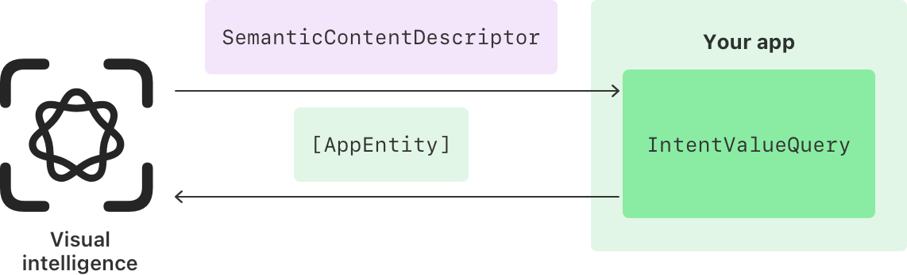
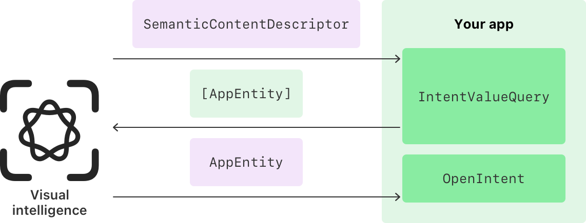

> Navigation: [Technologies](../technologies.md) · [Visual Intelligence](../visualintelligence.md)

# Integrating your app with visual intelligence

<sub>Article</sub>

Enable people to find app content that matches their surroundings or objects onscreen with visual intelligence.

## Overview

With visual intelligence, people can visually search for information and content that matches their surroundings, or an onscreen object. Integrating your app with visual intelligence lets people view your matching content quickly and launch your app for more detailed information or additional search results, giving it additional visibility.

### Understand how visual intelligence search communicates with your app

To integrate your app with visual intelligence, the Visual Intelligence framework provides information about objects it detects in the visual intelligence camera or a screenshot. To exchange information with your app, the system uses the [App Intents](../appintents.md) framework and its concepts of app intents and app entities.

When a person performs visual search on the visual intelligence camera or a screenshot, the system forwards the information captured to an App Intents query you implement. In your query code, search your app’s content for matching items, and return them to visual intelligence as app entities. Visual intelligence then uses the app entities to display your content in the search results view, right where a person needs it.

To learn more about a displayed item, someone can tap it to open the item in your app and view information and functionality. For example, an app that lets people view information about landmarks might show detailed information such as hours, a map, or community reviews for the item a person taps in visual search.

### Provide a display representation

Visual Intelligence uses the [DisplayRepresentation](../appintents/displayrepresentation.md) of your [AppEntity](../appintents/appentity.md) to organize and present your content in the visual intelligence search experience. Make sure to provide localized, concise, and high-quality display representations that consist of a title, subtitle, and an image. The following code from the [Adopting App Intents to support system experiences](../appintents/adopting-app-intents-to-support-system-experiences.md) sample code project shows the display representation of an `AppEntity` for a landmark. It uses strings from the model object for simplicity. In your code, make sure to provide a localized display representation.

```swift
struct LandmarkEntity: IndexedEntity {
    static var typeDisplayRepresentation: TypeDisplayRepresentation {
        TypeDisplayRepresentation(
            name: LocalizedStringResource("Landmark", table: "AppIntents", comment: "The type name for the landmark entity"),
            numericFormat: "\(placeholder: .int) landmarks"
        )
    }

    var displayRepresentation: DisplayRepresentation {
        DisplayRepresentation(
            title: "\(name)",
            subtitle: "\(continent)",
            image: .init(data: try! self.thumbnailRepresentationData)
        )
    }

    // ...
}
```

For additional information about display representations, refer to [Defining app entities for your custom data types](../appintents/defining-app-entities-for-your-custom-data-types.md).

### Provide search results

To integrate your app with visual search, provide visual intelligence with content that matches a person’s surroundings or onscreen object, as described in the steps below and illustrated in the following image:

1. In your Xcode project, adopt the [IntentValueQuery](../appintents/intentvaluequery.md) protocol and implement its [values(for:)](<../appintents/intentvaluequery/values(for_).md>) requirement.
2. Change the [values(for:)](<../appintents/intentvaluequery/values(for_).md>) function to receive a [SemanticContentDescriptor](semanticcontentdescriptor.md) as its `input`. The [SemanticContentDescriptor](semanticcontentdescriptor.md) makes visual intelligence information available to your app.
3. Use the descriptor’s [labels](semanticcontentdescriptor/labels.md) to access a list of labels that visual intelligence creates or the [pixelBuffer](semanticcontentdescriptor/pixelbuffer.md) of the camera capture.
4. Search your app’s content using the labels and perform an image search with an image you create from the `pixelBuffer`.
5. Describe your search results as [AppEntity](../appintents/appentity.md) objects and return them as the result of the query.



<sub>A flow chart that shows how visual intelligence retrieves an array of app entities from your app by calling your app’s intent value query.</sub>

> [!note] Note
> Labels are general, high-level terms in the `en_US` locale and might change over time. The Visual Intelligence framework doesn’t translate them or include synonyms. For example, [SemanticContentDescriptor](semanticcontentdescriptor.md) might provide the labels `tower` or `building` for a well-known building. It won’t provide the building’s actual name as a label.

The following example code from the [Adopting App Intents to support system experiences](../appintents/adopting-app-intents-to-support-system-experiences.md) sample code project demonstrates how an app that enables people to view information about points of interest and landmarks might access the `pixelBuffer` for its search:

```swift
struct LandmarkIntentValueQuery: IntentValueQuery {

    @Dependency var modelData: ModelData

    func values(for input: SemanticContentDescriptor) async throws -> [VisualSearchResult] {

        guard let pixelBuffer = input.pixelBuffer else {
            return []
        }

        let landmarks = try await modelData.search(matching: pixelBuffer)

        return landmarks
    }
}
```

The `search(matching:)` function asynchronously returns a list of app entities that represent landmarks. Returning results quickly makes for a good search experience, so make sure to limit the list of returned items, if needed. If your app finds a large number of matches — for example, several hundred items — return the first hundred results, and give people the opportunity to view the full list in your app as described in [Link to additional results in your app](integrating-your-app-with-visual-intelligence.md#Link-to-additional-results-in-your-app).

The process for matching the provided pixel buffer to app entities depends on your app. A common case is to convert the pixel buffer into an image, then use the image in an image search. The following code snippet shows how you might implement this conversion:

```swift
private func createImage(_ pixelBuffer: CVReadOnlyPixelBuffer) -> CGImage? {
    let context = CIContext()
    let image = CIImage(cvPixelBuffer: pixelBuffer)
    return context.createCGImage(image, from: image.extent)
}
```

### Open an item in your app

To let someone open your app and view additional information or access additional actions for a visual search, create an [OpenIntent](../appintents/openintent.md). In the intent’s `perform()` method, open your app to match the app entity that visual intelligence passes to the method, as illustrated in the image below.



<sub>A flow chart that shows how visual intelligence forwards the app entity that represents a person’s selection to the app so the app can display additional information.</sub>

Continuing the example that shows information about points of interest or landmarks, the `OpenIntent` might look like this:

```swift
struct OpenLandmarkIntent: OpenIntent {
    static let title: LocalizedStringResource = "Open Landmark"

    @Parameter(title: "Landmark", requestValueDialog: "Which landmark?")
    var target: LandmarkEntity
}
```

> [!note] Note
> If your query returns more than one app entity type using `@UnionValue`, create an `OpenIntent` for each app entity type that’s part of the union value.

Adopting the `OpenIntent` protocol isn’t specific to integrating your app with visual intelligence. Adopting App Intents, including one or more `OpenIntent` implementations, is a best practice for modern apps that offer additional integration with system experiences. If you’ve already adopted App Intents, you might be able to reuse existing code to open an item in your app with an `OpenIntent`.

For more information about adopting App Intents in your app, refer to [App Intents](../appintents.md) and [Making actions and content discoverable by Apple Intelligence](../appintents/making-actions-and-content-discoverable-by-apple-intelligence.md).

### Return different values in one query

Your app can’t contain more than one [IntentValueQuery](../appintents/intentvaluequery.md) that takes a [SemanticContentDescriptor](semanticcontentdescriptor.md). To return more than one [AppEntity](../appintents/appentity.md) type from a single intent value query, use the [UnionValue()](<../appintents/unionvalue().md>) Swift macro to return multiple app entity types. The following example uses a union value for its result — indicated by the `@UnionValue` annotation — to return a list of individual landmarks and collections of landmarks:

```swift
@UnionValue
enum VisualSearchResult {
    case landmark(LandmarkEntity)
    case collection(CollectionEntity)
}

struct LandmarkIntentValueQuery: IntentValueQuery {

    @Dependency var modelData: ModelData

    func values(for input: SemanticContentDescriptor) async throws -> [VisualSearchResult] {
        // ...

        // Returned search results are either landmarks or a collection.
        let landmarks = try await modelData.search(matching: pixelBuffer)

        return landmarks
    }
}
```

### Link to additional results in your app

Returning visual search results quickly and limiting the number of items ensures a quick and enjoyable experience for people using your app. However, your app might offer a lot — possibly hundreds — of results, or browsing long lists of items might be part of your app’s core experience. If you need to provide many results, display a limited amount and allow people to open your app from the “More results” button to view more visual search results.

First, create a new app intent that conforms to the [semanticContentSearch](../appintents/assistantschemas/visualintelligenceintent/semanticcontentsearch.md) schema. With App Intents domains and schemas, you can quickly create app intents that follow a predefined form to enable specific functionality, such as opening a content search experience or list of results.

> [!tip] Tip
> Type `visualintelligence_`, choose the suggested semantic content search schema, and let Xcode code completion create the conforming app intent for you.

In the semantic content search intent’s `perform()` method, navigate to your app’s search experience and pass information that the [SemanticContentDescriptor](semanticcontentdescriptor.md) object provides to perform a search and show the full list of results.

## See Also

### Search integration

- [Adopting App Intents to support system experiences](../appintents/adopting-app-intents-to-support-system-experiences.md) — Create app intents and entities so people can use your app’s content and actions across system experiences. _(beta)_
- [SemanticContentDescriptor](semanticcontentdescriptor.md) — A type that represents a scene that visual intelligence captures, for example, a screenshot, photo, or photo and video stream.
