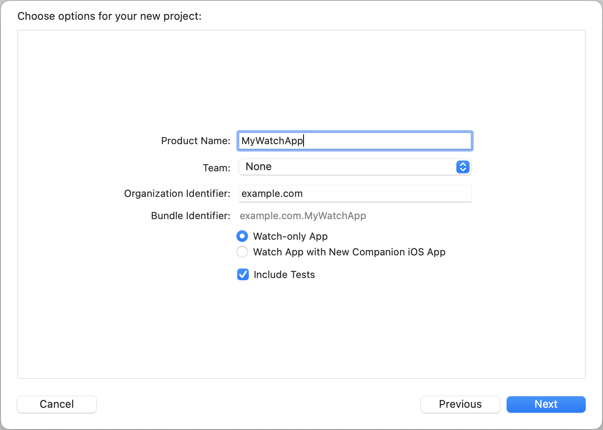
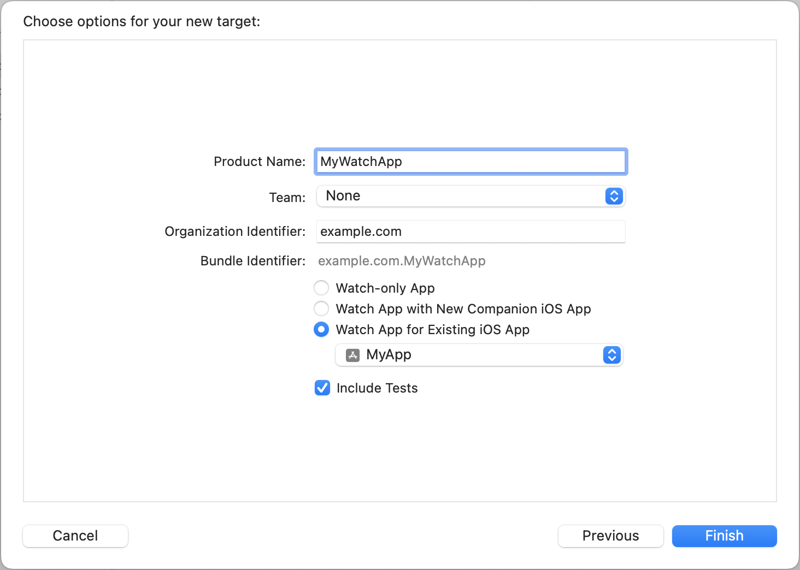

> Navigation: [Technologies](../technologies.md) · [watchOS apps](../watchos-apps.md)

# Setting up a watchOS project

Create a new watchOS project or add a watch target to an existing iOS project.

## Overview

Before you start a new watchOS project, you need to decide how you’re going to distribute that project: as a watch-only app or as a watchOS app with an iOS app. If your app is only available on Apple Watch, create a new watch-only project. If you want both a watchOS and an iOS app that deliver related experiences, either create a new watchOS app with a companion iOS app or add a watchOS target to an existing iOS project.

### Create a new watchOS project

To create a new watchOS project:

1. In Xcode, choose File \> New \> Project.
2. Select the watchOS tab.
3. Select the App icon and click Next.
4. In the project options sheet, enter a name for the project. To create a watch-only app, select “Watch-only App.” To create both a watchOS app and an iOS app, select “Watch App with New Companion iOS App.” Then click Next.
5. Select a location for the project and click Create.

A screenshot of Xcode’s project option sheet. The project name is set to MyWatchApp, and the Watch-only App setting is selected.

### Add a watchOS target to an existing iOS app

To add a watchOS target to an existing iOS project:

1. Select the project in the Project navigator.
2. Click the “Add a target” button in the Project editor.
3. Select the watchOS tab.
4. Select the App icon and click Next.
5. In the project option sheet, enter a name for the watchOS app, and select “Watch app for Existing iOS App.” Make sure to select the correct iOS app in the pull-down menu, and click Finish.

A screenshot of Xcode’s project option sheet. The project name is set to MyWatchApp. The Watch app for Existing iOS App setting is selected, and MyApp is selected in the pull-down menu.

## Topics

### Information property list keys

- [WKWatchKitApp](../bundleresources/information-property-list/wkwatchkitapp.md) — A Boolean value that indicates whether the bundle is a watchOS app.
- [WKAppBundleIdentifier](../bundleresources/information-property-list/wkappbundleidentifier.md) — The bundle ID of the watchOS app.
- [WKCompanionAppBundleIdentifier](../bundleresources/information-property-list/wkcompanionappbundleidentifier.md) — The bundle ID of the watchOS app’s companion iOS app.
- [WKExtensionDelegateClassName](../bundleresources/information-property-list/wkextensiondelegateclassname.md) — The name of your watchOS app’s extension delegate.
- [WKRunsIndependentlyOfCompanionApp](../bundleresources/information-property-list/wkrunsindependentlyofcompanionapp.md) — A Boolean value indicating whether the user can install and run the watchOS app independently of its iOS companion app.
- [WKWatchOnly](../bundleresources/information-property-list/wkwatchonly.md) — A Boolean value indicating whether the app is a watch-only app.

## See Also

### App experience

- [Creating independent watchOS apps](creating-independent-watchos-apps.md) — Set up a watchOS app that installs and runs without a companion iOS app.
- [Keeping your watchOS content up to date](keeping-your-watchos-app-s-content-up-to-date.md) — Ensure that your app’s content is relevant and up to date.
- [Updating watchOS apps with timelines](updating-watchos-apps-with-timelines.md) — Seamlessly schedule updates to your user interface, even while it’s inactive.
- [Authenticating users on Apple Watch](authenticating-users-on-apple-watch.md) — Create an account sign-up and sign-in strategy for your app.
- [Responding to the Action button on Apple Watch Ultra](../appintents/actionbuttonarticle.md) — Use App Intents to register actions for your app.
- [Enabling the double-tap gesture on Apple Watch](enabling-double-tap.md) — Customize your app’s response to the double-tap gesture on Apple Watch.
