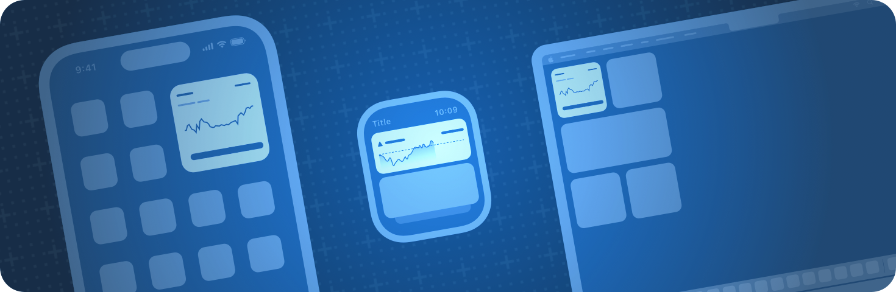

> Navigation: [Technologies](technologies.md)

# WidgetKit

Framework

Extend the reach of your app by creating widgets, watch complications, Live Activities, and controls.

## Overview

Using WidgetKit, you can make your app’s content available in contexts outside the app and extend its reach by building an ecosystem of glanceable, up-to-date experiences.

A conceptual image that shows a small widget on iPhone, a rectangular widget on Apple Watch, and a small widget on the Mac desktop.

The ecosystem that WidgetKit enables consists of:

- ****Widgets**** — Widgets elevate a small amount of timely, personally relevant information from your app, display it where people can see it at a glance, and offer specific app functionality without launching the app. On iPhone and iPad, people put widgets in Today View, on the Home Screen, and on the Lock Screen. On Mac, people put native Mac app widgets on the desktop and in Notification Center. Additionally, people place iPhone widgets in locations like a Mac desktop and Notification Center, or in CarPlay. On Apple Watch, widgets appear in the Smart Stack, and on Apple Vision Pro, widgets become three-dimensional objects that people pin to horizontal and vertical surfaces.
- ****Smart Stacks**** — On iPhone and iPad, people stack widgets on their Home Screen and create Smart Stacks that use Smart Rotate to show the most contextually relevant widget. On Apple Watch, the system intelligently displays widgets that are most relevant to someone’s personal context. Additionally, a person configures a widget to always appear in the Smart Stack or pins it to a fixed position.
- ****Watch complications**** — People place watch complications on the Apple Watch face to view timely, relevant information when they lift their wrist. Additionally, the Smart Stack on Apple Watch offers space for up to three complications.
- ****Live Activities**** — Live Activities display up-to-date content from your app such as event and task information on the Lock Screen or in the Dynamic Island. Live Activities use [ActivityKit](activitykit.md) for updates and optionally the Apple Push Notification service (APNs) to send ActivityKit push notifications. For more information, refer to [ActivityKit](activitykit.md).
- ****Controls**** — Controls act as a button or toggle that allows people to perform actions you describe with the [App Intents](appintents.md) framework in Control Center, on the Lock Screen, and from the Action button. A button control might initiate an action from your app, or open your app to a specific view, and a toggle might turn a light on and off or open and close a garage door. Controls appear in Control Center or as menu bar items and in Control Center on Apple Watch.

### Develop glanceable features iteratively

WidgetKit enables features across iPad, iPhone, the Mac, Apple Watch, and Apple Vision Pro, but only in a way that best fits a person’s device and personal needs. For example, WidgetKit powers widgets on all platforms in various sizes. It also powers Live Activities and controls, features that aren’t available on Apple Vision Pro.

Even though not every feature that WidgetKit powers is available on every platform or device, widgets, Live Activities, controls, and watch complications share technology and design similarities. This makes it easy to develop features in tandem and to expand usage across contexts.

Use an iterative approach and start with support for one feature or select sizes of widgets — for example, start with a small widget as described in [Creating a widget extension](widgetkit/creating-a-widget-extension.md), but plan and design additional sizes and features across platforms from the beginning. Then allow people to view your content in as many contexts as possible.

For more information, refer to [Developing a WidgetKit strategy](widgetkit/developing-a-widgetkit-strategy.md).

### Understand interactivity and personalization

The WidgetKit ecosystem enables people to view your app content in new contexts and offers specific interactions with your app when and where they need it:

- People tap a widget, watch complication, or Live Activity to launch the corresponding app or the app’s scene with matching information or functionality. For example, tapping an Emoji Ranger widget or watch complication launches the scene in the app that matches the displayed hero. For more information, refer to [Linking to specific app scenes from your widget or Live Activity](widgetkit/linking-to-specific-app-scenes-from-your-widget-or-live-activity.md).
- People use buttons and toggles in widgets, controls, and Live Activities to interact with your app without launching it. For example, the large widget of the [Emoji Rangers: Supporting Live Activities, interactivity, and animations](widgetkit/emoji-rangers-supporting-live-activities-interactivity-and-animations.md) sample code project includes a button that people tap to give the healing capability of their hero a temporary boost.

In addition to offering relevant information and specific interactivity at a glance, people use widgets, watch complications, Live Activities, and controls to personalize their devices:

- People configure widgets and watch complications to display details specific to their needs. For example, a widget of the [Emoji Rangers: Supporting Live Activities, interactivity, and animations](widgetkit/emoji-rangers-supporting-live-activities-interactivity-and-animations.md) sample code project allows people to configure the hero that appears on the widget.
- People arrange widgets and watch complications in the way that works best for them. When they stack widgets and enable Smart Rotate on iPhone or iPad, WidgetKit automatically rotates the most relevant widget to the top, making sure people see the most important details at the right time. On Apple Watch, the Smart Stack displays widgets based on contextual relevance, and people pin a favorite widget to a fixed position in the Smart Stack.

### Update content with timelines and push notifications

Widgets and watch complications use a special mechanism to update their content: You create a timeline of data updates and hand it to WidgetKit. WidgetKit then makes sure the widget or complication updates its content in an energy-efficient way. For more information on timelines, refer to [Keeping a widget up to date](widgetkit/keeping-a-widget-up-to-date.md). Additionally, widgets can receive updates by using the Apple Push Notification service (APNs) and remote push notifications.

Live Activities don’t use timelines to update their content. Instead, they use [ActivityKit](activitykit.md) and ActivityKit push notifications you send with APNs. For more information, refer to [ActivityKit](activitykit.md).

Controls don’t use timelines to update their content. Instead, your controls update their content when someone uses them, the app reloads them, or the system receives a remote push notification from APNs.

### Create a focused, glanceable design

Widgets, watch complications, Live Activities, and controls are small and require a focused, glanceable design. For design guidance, refer to [Human Interface Guidelines \> Widgets](https://developer.apple.com/design/human-interface-guidelines/components/system-experiences/widgets), [Human Interface Guidelines \> Complications](https://developer.apple.com/design/human-interface-guidelines/components/system-experiences/complications), [Human Interface Guidelines \> Live Activities](https://developer.apple.com/design/human-interface-guidelines/components/system-experiences/live-activities), and [Human Interface Guidelines \> Controls](https://developer.apple.com/design/human-interface-guidelines/controls).

## Topics

### Essentials

- [Developing a WidgetKit strategy](widgetkit/developing-a-widgetkit-strategy.md) — Explore features, tasks, related frameworks, and constraints as you make a plan to implement widgets, controls, watch complications, and Live Activities.
- [WidgetKit updates](updates/widgetkit.md) — Learn about important changes in WidgetKit.
- [Creating a widget extension](widgetkit/creating-a-widget-extension.md) — Display your app’s content in a convenient, informative widget on various devices.
- [Building Widgets Using WidgetKit and SwiftUI](widgetkit/building-widgets-using-widgetkit-and-swiftui.md) — Create widgets to show your app’s content on the Home screen, with custom intents for user-customizable settings.
- [Emoji Rangers: Supporting Live Activities, interactivity, and animations](widgetkit/emoji-rangers-supporting-live-activities-interactivity-and-animations.md) — Offer Live Activities, controls, animate data updates, and add interactivity to widgets.
- [WidgetBundle](swiftui/widgetbundle.md) — A container used to expose multiple widgets from a single widget extension.

### System experiences

- [Widgets and watch complications](widgetkit/widgets-and-complications-collection.md) — Allow people to personalize their devices, view relevant information, and perform interactions with widgets and watch complications.
- [Live Activities](widgetkit/liveactivities-collection.md) — Let people track updates from your app with Live Activities.
- [Controls](widgetkit/controls-collection.md) — Offer controls that people place in Control Center, on the Lock Screen, and on the Action button to quickly perform an action from your app.

### Presentation

- [Creating views for widgets, Live Activities, and watch complications](widgetkit/creating-views-for-widgets-live-activities-and-watch-complications.md) — Implement glanceable views with WidgetKit and SwiftUI.
- [SwiftUI views for widgets](widgetkit/swiftui-views.md) — Present your app’s content in widgets with SwiftUI views.

### Interactivity

- [Adding interactivity to widgets and Live Activities](widgetkit/adding-interactivity-to-widgets-and-live-activities.md) — Include buttons or toggles in a widget or Live Activity to offer app functionality without launching the app.
- [Animating data updates in widgets and Live Activities](widgetkit/animating-data-updates-in-widgets-and-live-activities.md) — Use SwiftUI animations to indicate data updates in your widgets and Live Activities.
- [Linking to specific app scenes from your widget or Live Activity](widgetkit/linking-to-specific-app-scenes-from-your-widget-or-live-activity.md) — Add deep links to your widgets and Live Activities that enable people to open a specific scene in your app.

### Accessibility

- [Adding accessible descriptions to widgets and Live Activities](activitykit/adding-accessible-descriptions-to-widgets-and-live-activities.md) — Describe the interface elements of your widgets and Live Activities to help people understand what they represent.

### Previews and debugging

- [Previewing widgets and Live Activities in Xcode](widgetkit/previewing-widgets-and-live-activities-in-xcode.md) — Use Xcode previews to iteratively develop, fine-tune, and troubleshoot widgets and Live Activities.
- [WidgetPreviewContext](widgetkit/widgetpreviewcontext.md) — A specification for the context of a widget preview.
- [Preview macros](widgetkit/preview-macros.md) — Use Swift macros to create widget previews in Xcode.
