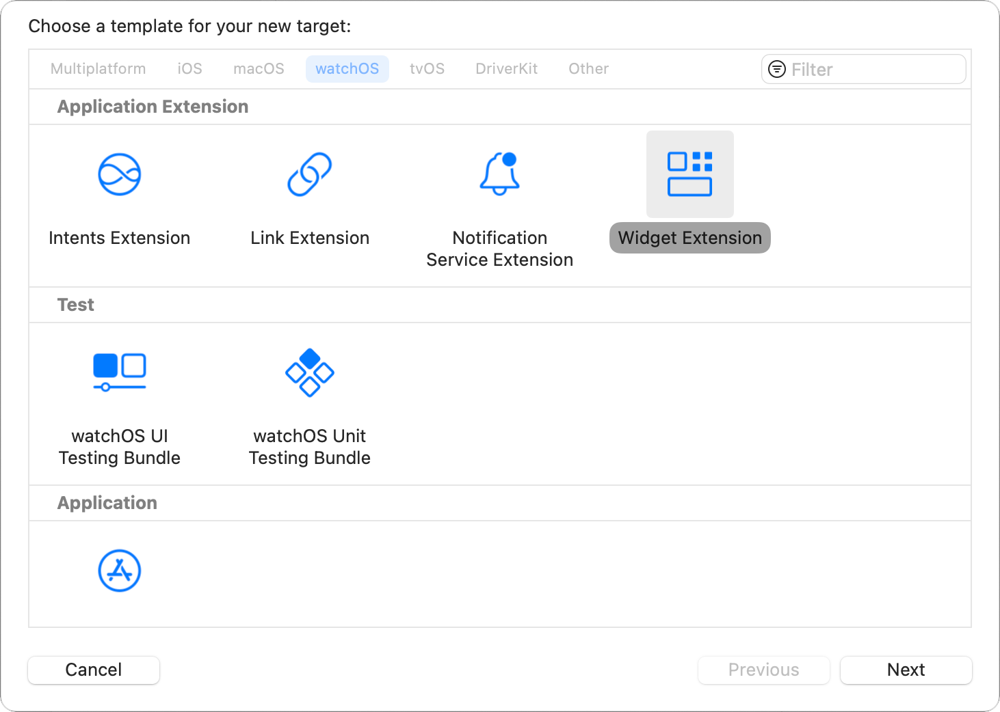
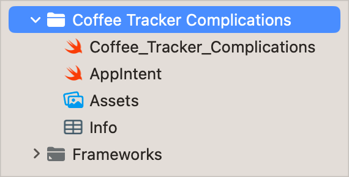

> Navigation: [Technologies](../technologies.md) · [WidgetKit](../widgetkit.md) · [Widgets and watch complications](widgets-and-complications-collection.md)

# Migrating ClockKit complications to WidgetKit

<sub>Article</sub>

Leverage WidgetKit’s API to create watchOS complications using SwiftUI.

## Overview

With watchOS 9 and later, you can create complications for your watchOS app using SwiftUI views in WidgetKit. WidgetKit provides a modern API for creating and updating glanceable elements — making it an ideal fit for watchOS complications. Because WidgetKit’s design is inspired by ClockKit, if you’ve already designed ClockKit complications for your app, the process feels familiar. Similarly, if you’re already using widgets for iOS, you can quickly set up WidgetKit complications for a watchOS app. In many cases, you can use the same code to display WidgetKit complications in watchOS and widgets on the Lock Screen on iPhone. For more information, see [Creating accessory widgets and watch complications](creating-accessory-widgets-and-watch-complications.md).

### Add WidgetKit to your project

To convert ClockKit complications to WidgetKit, start by adding a WidgetKit extension to your watchOS project.



1. In Xcode, select the project icon in the Project navigator.
2. Click the “Add a target” button.
3. In the watchOS tab, select the Widget Extension template and click Next.
4. Give the new target a name.
5. If your app dynamically creates the set of [CLKComplicationDescriptor](../clockkit/clkcomplicationdescriptor.md) objects to support multiple complication types, enable the Include Configuration App Intent option. If you don’t plan to configure your complications using app intents, you can disable this option.
6. Click Finish.

Xcode creates a new target containing Swift files for the widget, an asset catalog, and an `Info.plist` file for the extension. The WidgetKit template provides you with structures that adopt the [Widget](../swiftui/widget.md) and [View](../swiftui/view.md) protocols. It also includes a starting implementation for your [TimelineProvider](timelineprovider.md), or [AppIntentTimelineProvider](appintenttimelineprovider.md) if you enabled Include Configuration App Intent.



<sub>A screenshot of a Widget Extension that contains support for custom app intent definitions: an intent timeline provider and custom app intent.</sub>

> [!important] Important
> After you add a WidgetKit extension to your project, the system tries to use it to generate complications for your watchOS app. As soon as your WidgetKit extension begins providing widget-based complications, the system disables your app’s ClockKit complications. It no longer wakes your app to call your [CLKComplicationDataSource](../clockkit/clkcomplicationdatasource.md) object’s methods to request timeline entries. However, the system may still wake your data source to call [getWidgetConfiguration(from:completionHandler:)](<../clockkit/clkcomplicationwidgetmigrator/getwidgetconfiguration(from_completionhandler_).md>), while migrating complications from ClockKit to WidgetKit.

### Configure your timeline provider

The template creates a `Provider` structure that adopts the `TimelineProvider` or `AppIntentTimelineProvider` protocol, and provides a default implementation for the protocol’s methods. WidgetKit calls these methods to get the data needed to create the widget view.

> [!note] Note
> WidgetKit’s daily budget for reloading the timeline works differently than ClockKit’s. Your widget-based complication receives up to 75 updates per day, based on how often they’re viewed. If you have a complication on the Apple Watch face, it’s always considered viewed, so your budget tends towards the higher end of that range.

In each of the protocol methods, your app needs to create and return one or more [TimelineEntry](timelineentry.md) instances:

- **[placeholder(in:)](<timelineprovider/placeholder(in_).md>)** — Returns a single entry for your complication’s placeholder. By default, the system redacts all the content in the placeholder’s widget.
- **[getSnapshot(in:completion:)](<timelineprovider/getsnapshot(in_completion_).md>)** — Returns a single timeline entry for your app.
- **[getTimeline(in:completion:)](<timelineprovider/gettimeline(in_completion_).md>)** — Returns an array of timeline entries. WidgetKit uses this timeline to automatically update your complication over time.

The template provides a timeline entry that contains the date when the system should display it. Add any extra properties that you need for your complications.

```swift
struct CoffeeTrackerEntry: TimelineEntry {
    let date: Date
    let mgCaffeine: Double
    let totalCups: Double
}
```

Then, begin updating the timeline provider’s methods. For the placeholder, the system automatically redacts all of the widget’s content, unless you explicitly mark items with the [unredacted()](<../swiftui/view/unredacted().md>) view modifier in your complication’s SwiftUI view. As a result, you may want to provide generic data that fills out the redacted version.

```swift
func placeholder(in context: Context) -> SimpleEntry {
    
    // Show a complication with generic data.
    CoffeeTrackerEntry(date: Date(),
                       mgCaffeine: 250.0,
                       totalCups: 2.0)
}
```

The system can display the placeholder when the watch is locked, when it’s in Always On mode, and when it can’t otherwise display a live version of your complication.

For the snapshot, return a single entry. In general, you want to return the current state of your app. However, the system also uses the snapshot when displaying your complication in the complication picker. When returning your snapshot entry, be sure to check the `context` parameter [isPreview](timelineprovidercontext/ispreview.md) property. This property indicates whether the snapshot will be used in the complication picker. If this is `true`, provide generic data that shows your app’s typical appearance.

```swift
func getSnapshot(in context: Context, completion: @escaping (CoffeeTrackerEntry) -> Void) {
    
    if context.isPreview {
        // Show a complication with generic data.
        let entry = CoffeeTrackerEntry(date: Date(),
                    mgCaffeine: 250.0,
                    totalCups: 2.0)
        
        completion(entry)
        return
    }
    
    Task {
        
        let date = Date()
        
        // Get the current data from the model.
        let mgCaffeine = await data.mgCaffeine(atDate: date)
        let totalCups = await data.totalCupsToday
        
        // Create the entry.
        let entry = CoffeeTrackerEntry(date: date,
                                mgCaffeine: mgCaffeine,
                                totalCups: totalCups)
        
        // Pass the entry to the completion handler.
        completion(entry)
    }
}
```

For the timeline, create an array of entries, and then create a [Timeline](timeline.md) instance from that array. You can also select a reload policy for the timeline. By default, the system reloads the timeline when you reach its end. However, in the example below, the system only reloads the timeline when you explicitly request it.

```swift
func getTimeline(in context: Context, completion: @escaping (Timeline<Entry>) -> Void) {
    Task {

        // Create an array to hold the events.
        var entries: [CoffeeTrackerEntry] = []
        
        // The total number of cups consumed only changes when the user actively adds a drink,
        // so it remains constant in this timeline.
        let totalCups = await data.totalCupsToday

        // Generate a timeline covering every 5 minutes for the next 24 hours.
        let currentDate = Date()
        for minuteOffset in stride(from: 0, to: 60 * 24, by: 5) {
            let entryDate = Calendar.current.date(byAdding: .minute, value: minuteOffset, to: currentDate)!
            
            // Get the projected data for the specified date.
            let mgCaffeine = await data.mgCaffeine(atDate: entryDate)
            
            // Create the entry.
            let entry = CoffeeTrackerEntry(date: entryDate,
                                           mgCaffeine: mgCaffeine,
                                           totalCups: totalCups)
            
            // Add the event to the array.
            entries.append(entry)
        }

        // Create the timeline and pass it to the completion handler.
        // Because the caffeine dose drops to 0.0 mg after 24 hours,
        // there's no need to reload this timeline unless the user adds
        // a new drink. Setting the reload policy to .never.
        let timeline = Timeline(entries: entries, policy: .never)
        
        // Pass the timeline to the completion handler.
        completion(timeline)
    }
}
```

For more information, see [Making a configurable widget](making-a-configurable-widget.md) and [Keeping a widget up to date](keeping-a-widget-up-to-date.md).

### Support multiple complications

If your app provides a static set of widgets, you can define multiple widgets using a [WidgetBundle](../swiftui/widgetbundle.md) protocol. For example, the code listing below provides three complications: one that displays the user’s current caffeine dose, one that provides the total number of cups of coffee for the day, and one that provides both. Each widget can then support a different subset of the available families.

```swift
@main
struct CoffeeTrackerWidgets: WidgetBundle {
   var body: some Widget {
       CaffeineComplication()
       CupsComplication()
       CaffeineAndCupsComplication()
   }
}
```

However, if you need to dynamically configure a set of complications, provide a custom app intent. For example, a weather app may let people install complications for any cities in their favorites list.

WidgetKit uses app intents for customizable properties, the same method that Siri Suggestions and Siri Shortcuts use to customize those interactions. In iOS, the app intents describe elements that the user can customize. For WidgetKit complications in watchOS, these intents aren’t user configurable. Instead, they represent items that your app can dynamically configure.

To customize the widgets, implement your [AppIntentTimelineProvider](appintenttimelineprovider.md) structure’s [recommendations()](<appintenttimelineprovider/recommendations().md>) method to return an array of [AppIntentRecommendation](appintentrecommendation.md) instances.

```swift
func recommendations() -> [AppIntentRecommendation<ConfigurationAppIntent>] {
    var recommendations = [AppIntentRecommendation<ConfigurationAppIntent>]()
    
    for cityID in favoriteCityIDs {
        let intent = ConfigurationAppIntent()
        intent.cityID = cityID
        recommendations.append(AppIntentRecommendation(intent: intent, description: cityName(id: cityID)))
    }

    return recommendations
}
```

For more information, see [Making a configurable widget](making-a-configurable-widget.md).

### Design the complication using SwiftUI

Use SwiftUI static views, such as text, shapes, or images, to create your complication’s content. You can also add render effects like blurs and gradients, but keep in mind that complications only have one or two frames in which to render the effect.

Because complications show a snapshot of the app’s data at a particular point in time, they don’t support features like animation. Additionally, if the user touches your complication, the system launches your app instead of passing the touch event to the SwiftUI views, so a complication can’t use interactive elements like buttons or switches.

Start by updating your [Widget](../swiftui/widget.md) structure.

```swift
struct CaffeineComplication: Widget {
    
    // Create a unique string to identify the complication.
    let kind: String = "com.example.caffeine-complication"

    var body: some WidgetConfiguration {
        StaticConfiguration(kind: kind, provider: Provider()) { entry in
            CoffeeTrackerComplicationsEntryView(entry: entry)
        }
        .configurationDisplayName("Coffee Tracker")
        .description("Shows the current caffeine dose in your system.")
        .supportedFamilies([.accessoryCorner, .accessoryCircular, .accessoryInline])
    }
}
```

The body of the widget contains either a static or intent configuration, depending on whether your app uses custom app intent definitions. Use the configuration to set items like the complication’s display name and the supported families. The configuration also takes a closure that returns a SwiftUI view for the specified entry.

WidgetKit reduces the number of families you need to support. In some cases, a WidgetKit accessory family covers more than one ClockKit family, which reduces the number of supported families from 12 to 4.

| ClockKit family | WidgetKit family |
|---|---|
| [CLKComplicationFamily.graphicRectangular](../clockkit/clkcomplicationfamily/graphicrectangular.md) | [WidgetFamily.accessoryRectangular](widgetfamily/accessoryrectangular.md) |
| [CLKComplicationFamily.graphicCorner](../clockkit/clkcomplicationfamily/graphiccorner.md) | [WidgetFamily.accessoryCorner](widgetfamily/accessorycorner.md) |
| [CLKComplicationFamily.graphicCircular](../clockkit/clkcomplicationfamily/graphiccircular.md), [CLKComplicationFamily.graphicBezel](../clockkit/clkcomplicationfamily/graphicbezel.md), [CLKComplicationFamily.graphicExtraLarge](../clockkit/clkcomplicationfamily/graphicextralarge.md) | [WidgetFamily.accessoryCircular](widgetfamily/accessorycircular.md) |
| [CLKComplicationFamily.utilitarianSmallFlat](../clockkit/clkcomplicationfamily/utilitariansmallflat.md), [CLKComplicationFamily.utilitarianLarge](../clockkit/clkcomplicationfamily/utilitarianlarge.md) | [WidgetFamily.accessoryInline](widgetfamily/accessoryinline.md) |

> [!note] Note
> watchOS 9 and later no longer shows families like [CLKComplicationFamily.circularSmall](../clockkit/clkcomplicationfamily/circularsmall.md), [CLKComplicationFamily.modularSmall](../clockkit/clkcomplicationfamily/modularsmall.md), or [CLKComplicationFamily.modularLarge](../clockkit/clkcomplicationfamily/modularlarge.md) on watch faces.

Use the [widgetFamily](../swiftui/environmentvalues/widgetfamily.md) environment value to determine the complication’s family. You can provide a different SwiftUI view for each family. You can also get the family from the context passed to your timeline provider’s [getTimeline(in:completion:)](<timelineprovider/gettimeline(in_completion_).md>), [getSnapshot(in:completion:)](<timelineprovider/getsnapshot(in_completion_).md>), and [placeholder(in:)](<timelineprovider/placeholder(in_).md>) methods.

```swift
struct CaffeineComplicationView: View {
    
    // Get the widget's family.
    @Environment(\.widgetFamily) private var family
    
    var entry: Provider.Entry
    
    var body: some View {
        switch family {
        case .accessoryCircular:
            MyCircularComplication(mgCaffeine: entry.mgCaffeine,
                                   totalCups: entry.totalCups)
            
        case .accessoryCorner:
            MyCornerComplication(mgCaffeine: entry.mgCaffeine,
                                 totalCups: entry.totalCups)
            
        case .accessoryInline:
            MyInlineComplication(mgCaffeine: entry.mgCaffeine,
                                 totalCups: entry.totalCups)
            
        default:
            Image("AppIcon")
        }
    }
}
```

Then, check the [WidgetRenderingMode](widgetrenderingmode.md) environmental value to determine whether your complication is rendered in full color or using accent colors. Modify your design to best suit the current rendering mode.

```swift
struct MyCircularComplication: View {
    // Get the rendering mode.
    @Environment(\.widgetRenderingMode) var renderingMode
    
    var mgCaffeine: Double
    var totalCups: Double
    let maxMG = 500.0
    
    var body: some View {
        Gauge( value: min(mgCaffeine, maxMG), in: 0.0...maxMG ) {
            Text("mg")
        } currentValueLabel: {
            if renderingMode == .fullColor {
                // Add a foreground color to the label.
                Text(mgCaffeine.formatted(myFloatFormatter))
                    .foregroundStyle(.doseColor(for: mgCaffeine))
            }
            else {
                // Otherwise, use the default text color.
                Text(mgCaffeine.formatted(myFloatFormatter))
            }
        }
        .gaugeStyle(
            // Add a gradient to the gauge.
            CircularGaugeStyle(tint: Gradient(stops: myStops)))
    }
}
```

In [accented](widgetrenderingmode/accented.md) mode, you can explicitly partition your view into an accented group and the default group by adding the [widgetAccentable(_:)](<../swiftui/view/widgetaccentable(__).md>) view modifier to part of your complication’s view hierarchy. For more information, see [Creating accessory widgets and watch complications](creating-accessory-widgets-and-watch-complications.md) and [Creating views for widgets, Live Activities, and watch complications](creating-views-for-widgets-live-activities-and-watch-complications.md).

When designing your WidgetKit complications, build your complication views so that they can adapt to different sizes. For example, you can use [ViewThatFits](../swiftui/viewthatfits.md) to provide a set of different-sized views, letting the system pick the best fit for the current context.

You can add a standard background to your complication by adding a [AccessoryWidgetBackground](accessorywidgetbackground.md) in a [ZStack](../swiftui/zstack.md) behind your widget’s content, and you can also add additional information to circular and corner complications using a [widgetLabel(label:)](<../swiftui/view/widgetlabel(label_).md>). Use the widget label to add gauges, progress views, or text along the inside curve of the corner view, or to add an image and text along the bezel of the Infograph watch face.

Finally, consider how Always On affects your complications. You may need to redact sensitive information, or adjust the widget’s appearance for reduced luminance. You can explicitly redact sensitive information using the [privacySensitive(_:)](<../swiftui/view/privacysensitive(__).md>) view modifier. If you do, the system displays the redacted version of your view during Always On. For more information, see [Designing your app for the Always On state](../watchos-apps/designing-your-app-for-the-always-on-state.md).

> [!note] Note
> If you don’t use the [privacySensitive(_:)](<../swiftui/view/privacysensitive(__).md>) view modifier anywhere in your view hierarchy, the system displays a placeholder instead of a live complication. By default, the placeholder redacts all of your complication’s content.

## Migrate complications on a watch face

When users upgrade your app, you need to transition them from the old ClockKit complications to your new WidgetKit complications. Start by implementing your [CLKComplicationDataSource](../clockkit/clkcomplicationdatasource.md) type’s [widgetMigrator](../clockkit/clkcomplicationdatasource/widgetmigrator.md) method. Use your implementation to return an instance that conforms to the [CLKComplicationWidgetMigrator](../clockkit/clkcomplicationwidgetmigrator.md) protocol.

For example, update your data source so that it conforms to the [CLKComplicationWidgetMigrator](../clockkit/clkcomplicationwidgetmigrator.md) protocol.

```swift
class ComplicationController: NSObject, CLKComplicationDataSource, CLKComplicationWidgetMigrator {
   // ...
}
```

Then, have the [widgetMigrator](../clockkit/clkcomplicationdatasource/widgetmigrator.md) property return `self`.

```swift
var widgetMigrator: CLKComplicationWidgetMigrator {
    self
}
```

Finally, implement the [getWidgetConfiguration(from:completionHandler:)](<../clockkit/clkcomplicationwidgetmigrator/getwidgetconfiguration(from_completionhandler_).md>) method. This method determines the best WidgetKit configuration for the given complication descriptor. This example uses the Swift async version of the method:

```swift
func widgetConfiguration(from complicationDescriptor: CLKComplicationDescriptor) async -> CLKComplicationWidgetMigrationConfiguration? {
    
    switch complicationDescriptor.identifier {
    case caffeineDoseIdentifier:
        return CLKComplicationStaticWidgetMigrationConfiguration(
            kind: "com.example.Caffeine-Complication",
            extensionBundleIdentifier: "com.example.apple-samplecode.Coffee-Tracker.watchkitapp.watchkitextension.CoffeeTracker-Complications")

    case cupTotalIdentifier:
        return CLKComplicationStaticWidgetMigrationConfiguration(
            kind: "com.example.CupTotal-Complication",
            extensionBundleIdentifier: "com.example.apple-samplecode.Coffee-Tracker.watchkitapp.watchkitextension.CoffeeTracker-Complications")

    case cupAndCaffeineIdentifier:
        return CLKComplicationStaticWidgetMigrationConfiguration(
            kind: "com.example.CupAndCaffeine-Complication",
            extensionBundleIdentifier: "com.example.apple-samplecode.Coffee-Tracker.watchkitapp.watchkitextension.CoffeeTracker-Complications")

    default:
        return nil
    }
}
```

## See Also

### Accessory and watchOS widgets

- [Creating accessory widgets and watch complications](creating-accessory-widgets-and-watch-complications.md) — Support accessory widgets that appear on the Lock Screen and as complications on Apple Watch.
- [AccessoryWidgetGroup](accessorywidgetgroup.md) — A view type that has a label at the top and three content views masked with a circle or rounded square.
- [AccessoryWidgetGroupStyle](accessorywidgetgroupstyle.md) — The style for an [AccessoryWidgetGroup](accessorywidgetgroup.md) view.
