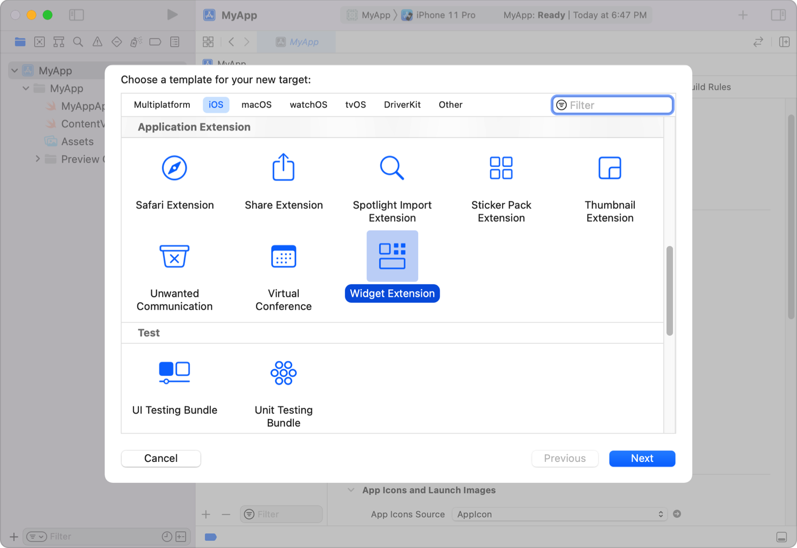

> Navigation: [Technologies](../technologies.md) · [WidgetKit](../widgetkit.md)

# Creating a widget extension

<sub>Article</sub>

Display your app’s content in a convenient, informative widget on various devices.

## Overview

Widgets display relevant, glanceable content that people can quickly access for more details. Your app can provide a variety of widgets, letting people focus on the information that’s most important to them.

A good way to get started with widgets and WidgetKit is by adding a _static_ widget to your app. A static widget doesn’t need any configuration by a person. For example, a static widget might show a stock market summary, or the next event on the person’s calendar. The _data_ the widget shows is dynamic, but the _type_ of data it shows is fixed. Consider the information your app presents, and choose something that people would find useful to see at a glance on their device.

Widgets can display data in many sizes, from small watch complications or Dynamic Island presentations, to extra large iPad and macOS widgets. The example that follows below focuses on a single size widget, the small system size, or [WidgetFamily.systemSmall](widgetfamily/systemsmall.md). The example widget displays the status of a hypothetical game such as the health level of a character.

You build widgets using SwiftUI. While there are similarities to how you present views in your app, some aspects are unique to developing widgets. For more information about using SwiftUI, refer to [SwiftUI](../swiftui.md). However, not all SwiftUI views work in widgets. For a list of the views that work in widgets, refer to [SwiftUI views for widgets](swiftui-views.md).

### Add a widget target to your app

The Widget Extension template provides a starting point for creating your widget. The template creates an extension target that contains a single widget. Later, you can add widgets to the same extension to display different types of information or to support additional widget sizes.

1. Open your app project in Xcode and choose File \> New \> Target.
2. From the Application Extension group, select Widget Extension, and then click Next.
3. Enter the name of your extension.
4. Deselect the Include Live Activity and Include Configuration App Intent checkboxes, if they’re selected.
5. Click Finish.



> [!note] Note
> Live Activities use WidgetKit and share many aspects of their design and implementation with the widgets in your app. If your app supports Live Activities, consider implementing them at the same time you add your widgets. For more information about Live Activities, refer to [Displaying live data with Live Activities](../activitykit/displaying-live-data-with-live-activities.md).

The widget extension template provides an initial implementation that conforms to the [Widget](../swiftui/widget.md) protocol. The widget’s `body` property determines the type of content that the widget presents. Static widgets use a [StaticConfiguration](staticconfiguration.md) for the `body` property. Other types of widget configurations include:

- [AppIntentConfiguration](appintentconfiguration.md) that enables user customization, such as a weather widget that needs a zip or postal code for a city, or a package-tracking widget that needs a tracking number.
- [ActivityConfiguration](activityconfiguration.md) to present live data, such as scores during a sporting event or a food delivery estimate.
- [RelevanceConfiguration](relevanceconfiguration.md) to provide relevance clues for widgets in watchOS.

For more information about these other widget configurations, refer to [Making a configurable widget](making-a-configurable-widget.md), [Displaying live data with Live Activities](../activitykit/displaying-live-data-with-live-activities.md), and [Increasing the visibility of widgets in Smart Stacks](widget-suggestions-in-smart-stacks.md).

### Add configuration details

To configure a static widget, provide the following information:

- **`kind`** — A string that identifies the widget. This is an identifier you choose, and should be descriptive of what the widget represents.
- **`provider`** — An object that conforms to [TimelineProvider](timelineprovider.md) and produces a _timeline_ that tells WidgetKit when to render the widget. A timeline is a sequence that contains a custom [TimelineEntry](timelineentry.md) type you define. The entries in this sequence identify the date when you want WidgetKit to update the widget’s content and includes properties your widget’s view needs to render in the custom type.
- **`content`** — A closure that contains SwiftUI views. WidgetKit invokes this to render the widget’s content, passing a `TimelineEntry` parameter from the provider.

Use modifiers to provide additional configuration details, including a display name, a description, and the families the widget supports. The following code shows a widget that provides general status for a game:

```swift
@main
struct GameStatusWidget: Widget {
    var body: some WidgetConfiguration {
        StaticConfiguration(
            kind: "com.mygame.game-status",
            provider: GameStatusProvider(),
        ) { entry in
            GameStatusView(entry.gameStatus)
        }
        .configurationDisplayName("Game Status")
        .description("Shows an overview of your game status")
        .supportedFamilies([.systemSmall])
    }
}
```

The widget’s provider generates a timeline for the widget, and includes the game-status details in each entry. When the date of each timeline entry arrives, WidgetKit invokes the `content` closure to display the widget’s content. Finally, the modifiers specify the name and description shown in the widget gallery, and the sizes that the widget supports.

> [!important] Important
> For an app’s widget to appear in the widget gallery, a person must launch the app that contains the widget at least once after the app is installed.

Note the usage of the `@main` attribute on this widget. This attribute indicates that the `GameStatusWidget` is the entry point for the widget extension, implying that the extension contains a single widget. To support multiple widgets, refer to the [WidgetBundle](../swiftui/widgetbundle.md).

### Provide timeline entries

The timeline provider you define generates a sequence of timeline entries. Each specifies the date and time to update the widget’s content, and includes the data your widget needs to render its view. The game-status widget might define its timeline entry to include a string that represents the status of the game, as follows:

```swift
struct GameStatusEntry: TimelineEntry {
    var date: Date
    var gameStatus: String
}
```

WidgetKit calls [getTimeline(in:completion:)](<timelineprovider/gettimeline(in_completion_).md>) to request the timeline from the provider. The timeline consists of one or more timeline entries and a reload policy that informs WidgetKit when to request a subsequent timeline.

> [!tip] Tip
> You can use APNs and WidgetKit push notifications to update your widgets. To build your first widget, create a widget that uses a timeline to update its data, then add push notification updates if it’s a good fit for your widget. For more information, refer to [Keeping a widget up to date](keeping-a-widget-up-to-date.md).

The following example shows how the game-status widget’s provider generates a timeline that consists of a single entry with the current game status from the server, and a reload policy to request a new timeline in 15 minutes:

```swift
struct GameStatusProvider: TimelineProvider {
    func getTimeline(in context: Context, completion: @escaping (Timeline<GameStatusEntry>) -> Void) {
        // Create a timeline entry for "now."
        let date = Date()
        let entry = GameStatusEntry(
            date: date,
            gameStatus: gameStatusFromServer
        )

        // Create a date that's 15 minutes in the future.
        let nextUpdateDate = Calendar.current.date(byAdding: .minute, value: 15, to: date)!

        // Create the timeline with the entry and a reload policy with the date
        // for the next update.
        let timeline = Timeline(
            entries:[entry],
            policy: .after(nextUpdateDate)
        )

        // Call the completion to pass the timeline to WidgetKit.
        completion(timeline)
    }
}
```

In this example, if the widget didn’t have the current status from the server, it could store a reference to the completion, perform an asynchronous request to the server to fetch the game status, and call the completion when that request completes.

For more information about generating timelines, refer to [Keeping a widget up to date](keeping-a-widget-up-to-date.md) and [Increasing the visibility of widgets in Smart Stacks](widget-suggestions-in-smart-stacks.md). For more information about handling network requests, refer to [Making network requests in a widget extension](making-network-requests-in-a-widget-extension.md).

### Generate a preview for the widget gallery

In order for people to be able to use your widget, it needs to be available in the widget gallery. To show your widget in the widget gallery, WidgetKit asks the provider for a _preview snapshot_ that displays generic data. WidgetKit makes this request by calling the provider’s [getSnapshot(in:completion:)](<timelineprovider/getsnapshot(in_completion_).md>) method with the `context` parameter’s [isPreview](timelineprovidercontext/ispreview.md) property set to `true`.

In response, you need to create the preview snapshot quickly. If your widget would normally need assets or information that takes time to generate or fetch from a server, use sample data instead.

In the following code, the game-status widget’s provider implements the snapshot method by showing the game status if it’s available, falling back to an empty status if it doesn’t have the status from its server:

```swift
struct GameStatusProvider: TimelineProvider {
    var hasFetchedGameStatus: Bool
    var gameStatusFromServer: String

    func getSnapshot(in context: Context, completion: @escaping (Entry) -> Void) {
        let date = Date()
        let entry: GameStatusEntry

        if context.isPreview && !hasFetchedGameStatus {
            entry = GameStatusEntry(date: date, gameStatus: "—")
        } else {
            entry = GameStatusEntry(date: date, gameStatus: gameStatusFromServer)
        }
        completion(entry)
    }
```

### Display content in your widget

Widgets define their content using a SwiftUI view, commonly by composing other SwiftUI views. As shown in the [Add configuration details](creating-a-widget-extension.md#Add-configuration-details) section, the widget configuration contains the closure that WidgetKit invokes to render the widget’s content.

When people add your widget from the widget gallery, they choose the specific family — for example, small or medium — from the ones your widget supports. The widget’s content closure has to be capable of rendering each family the widget supports. WidgetKit sets the corresponding family and additional properties, such as the color scheme (light or dark), in the SwiftUI environment.

In the game-status widget’s configuration shown above, the content closure uses a `GameStatusView` to display the status. Because this widget only supports the `.systemSmall` family, it uses a composed `GameTurnSummary` SwiftUI view to display a summary of the game’s current status. For any other family size, it shows the default view, which indicates that game status is unavailable.

```swift
struct GameStatusView : View {
    @Environment(\.widgetFamily) var family: WidgetFamily
    var gameStatus: GameStatus
    var selectedCharacter: CharacterDetail

    @ViewBuilder
    var body: some View {
        switch family {
        case .systemSmall: GameTurnSummary(gameStatus)
        default: GameDetailsNotAvailable()
        }
    }
}
```

In your widget, as you add more supported families to the widget’s configuration, you would add additional cases in the widget view’s `body` property for each additional family.

> [!note] Note
> The view declares its body with `@ViewBuilder` because the type of view it uses varies.

### Display a placeholder widget

A placeholder view is similar to a preview snapshot, but instead of showing example data to let people see the type of data the widget displays, it shows a generic visual representation with no specific content. When WidgetKit renders your widget, it may need to render your content as a placeholder, for example, while you load data in the background or if you tell the system that your widget contains sensitive information.

### Hide sensitive content

Widgets and watch complications may show sensitive information and can be highly visible, especially on devices with an Always-On display. When you create your widget or watch complication, review its content and consider hiding sensitive information.

To let people decide whether a widget should show sensitive data on a locked device, mark views that contain sensitive information using the [privacySensitive(_:)](<../swiftui/view/privacysensitive(__).md>) modifier. In iOS, people can configure whether to show sensitive data on the Lock Screen and during Always On. In Settings, they can deactivate data access for Lock Screen widgets in the ALLOW ACCESS WHEN LOCKED section of Settings \> Face ID & Passcode. On Apple Watch, people can configure whether to show sensitive data during Always On by Choosing Settings \> Display & Brightness \> Always On \> Hide Sensitive Complications. They can choose to show redacted content for all or individual complications.

If a person chooses to hide privacy sensitive content, WidgetKit renders a placeholder or redactions you configure. To configure redactions, implement the [redacted(reason:)](<../swiftui/view/redacted(reason_).md>) callback, read out the [privacy](../swiftui/redactionreasons/privacy.md) property, and provide custom placeholder views. You can also choose to render a view as unredacted with the [unredacted()](<../swiftui/view/unredacted().md>) view modifier.

As an alternative to marking individual views as privacy sensitive, for example, if your entire widget content is privacy sensitive, you can add the Data Protection capability to your widget extension. Until a person unlocks their device to match the privacy level you chose, WidgetKit displays a placeholder instead of the widget content. First, enable the Data Protection capability for your widget extension in Xcode, then set the [Data Protection Entitlement](../bundleresources/entitlements/com.apple.developer.default-data-protection.md) entitlement to the value that fits the level of privacy you want to offer:

- **`NSFileProtectionComplete`** — WidgetKit hides widget content when the device is locked. Additionally, iOS widgets aren’t available as iPhone widgets on Mac.
- **`NSFileProtectionCompleteUnlessOpen`** — WidgetKit hides widget content when the device is passcode locked. Additionally, iOS widgets aren’t available as iPhone widgets on Mac.

If you choose the `NSFileProtectionCompleteUntilFirstUserAuthentication` or `NSFileProtectionNone` protection level for your widget extension:

- WidgetKit uses its default behavior and displays a placeholder until a person authenticates after they reboot their device.
- iOS widgets are available as iPhone widgets on Mac.

### Add dynamic content to your widget

Widgets typically present read-only information and don’t generally support interactive elements such as scrolling lists or text input. Widgets support some interactive elements and animations. For details on adding interactivity to your widgets, refer to [Adding interactivity to widgets and Live Activities](adding-interactivity-to-widgets-and-live-activities.md).

For a list of views that WidgetKit supports, refer to [SwiftUI views for widgets](swiftui-views.md). WidgetKit ignores other views when it renders the widget’s content.

Although the display of a widget is based on a snapshot of your view, you can use various SwiftUI views that continue to update while your widget is visible. For more about providing dynamic content, refer to [Keeping a widget up to date](keeping-a-widget-up-to-date.md) and [Displaying dynamic dates in widgets](displaying-dynamic-dates.md).

### Respond to user interactions

When people interact with your widget, beyond interactive elements described above, the system launches your app to handle the request. When the system activates your app, navigate to the details that correspond to the widget’s content. Your widget can specify a URL to inform the app what content to display. To configure custom URLs in your widget:

- For all widgets, add the [widgetURL(_:)](<../swiftui/view/widgeturl(__).md>) view modifier to a view in your widget’s view hierarchy. If the widget’s view hierarchy includes more than one `widgetURL` modifier, the behavior is undefined.
- For widgets that use [WidgetFamily.systemMedium](widgetfamily/systemmedium.md), [WidgetFamily.systemLarge](widgetfamily/systemlarge.md), or [WidgetFamily.systemExtraLarge](widgetfamily/systemextralarge.md), add one or more [Link](../swiftui/link.md) controls to your widget’s view hierarchy. You can use both `widgetURL` and `Link` controls. If the interaction targets a `Link` control, the system uses the URL in that control. For interactions anywhere else in the widget, the system uses the URL specified in the `widgetURL` view modifier.

For more details about adding links from your widgets to your app, refer to [Linking to specific app scenes from your widget or Live Activity](linking-to-specific-app-scenes-from-your-widget-or-live-activity.md).

### Preview widgets in Xcode

Xcode allows you to look at previews of your widgets without running your app in Simulator or on a test device. The following example shows the preview code from the Emoji Rangers widget of the [Building Widgets Using WidgetKit and SwiftUI](building-widgets-using-widgetkit-and-swiftui.md) sample code project.

```swift
#Preview(as: .systemMedium, widget: {
    EmojiRangerWidget()
}, timeline: {
    SimpleEntry(date: Date(), relevance: nil, hero: .spouty)
})
```

As you support more widget families in your widget, you can add more preview views to see multiple sizes in a single preview.

For additional information about previewing widgets, refer to [Previewing widgets and Live Activities in Xcode](previewing-widgets-and-live-activities-in-xcode.md).

### Expand your widget’s capabilities

To give people flexible access to your app’s content, you can support additional families, add widget types, make your widgets user-configurable, or add support for Live Activities if your app presents live data. To explore a plan to support additional features, refer to [Developing a WidgetKit strategy](developing-a-widgetkit-strategy.md).

To explore WidgetKit code for the first time, refer to the following sample code projects:

- [Building Widgets Using WidgetKit and SwiftUI](building-widgets-using-widgetkit-and-swiftui.md) is the sample code project associated with the WWDC20 code-alongs [Widgets Code-along, part 1: The adventure begins](https://developer.apple.com/videos/play/wwdc2020/10034/), [Widgets Code-along, part 2: Alternate timelines](https://developer.apple.com/videos/play/wwdc2020/10035/), and [Widgets Code-along, part 3: Advancing timelines](https://developer.apple.com/videos/play/wwdc2020/10036/), where you learn how to build your first widget.
- [Emoji Rangers: Supporting Live Activities, interactivity, and animations](emoji-rangers-supporting-live-activities-interactivity-and-animations.md) expands the Emoji Rangers sample code project to include Lock Screen widgets, Live Activities, interactivity, and animations.
- [Fruta: Building a feature-rich app with SwiftUI](../appclip/fruta-building-a-feature-rich-app-with-swiftui.md) and [Backyard Birds: Building an app with SwiftData and widgets](../swiftui/backyard-birds-sample.md) are sample code projects that support widgets in addition to other technologies like [App Clips](../appclip.md) and [SwiftData](../swiftdata.md).

### Create multiple widget extensions

You can include multiple widget types in your widget extension, although your app can contain multiple extensions. For example, if some of your widgets use location information and others don’t, keep the widgets that use location information in a separate extension. This allows the system to prompt someone for authorization to use location information only for the widgets from the extension that uses location information. For details about bundling multiple widgets in an extension, refer to [WidgetBundle](../swiftui/widgetbundle.md).

## See Also

### Essentials

- [Developing a WidgetKit strategy](developing-a-widgetkit-strategy.md) — Explore features, tasks, related frameworks, and constraints as you make a plan to implement widgets, controls, watch complications, and Live Activities.
- [WidgetKit updates](../updates/widgetkit.md) — Learn about important changes in WidgetKit.
- [Building Widgets Using WidgetKit and SwiftUI](building-widgets-using-widgetkit-and-swiftui.md) — Create widgets to show your app’s content on the Home screen, with custom intents for user-customizable settings.
- [Emoji Rangers: Supporting Live Activities, interactivity, and animations](emoji-rangers-supporting-live-activities-interactivity-and-animations.md) — Offer Live Activities, controls, animate data updates, and add interactivity to widgets.
- [WidgetBundle](../swiftui/widgetbundle.md) — A container used to expose multiple widgets from a single widget extension.
