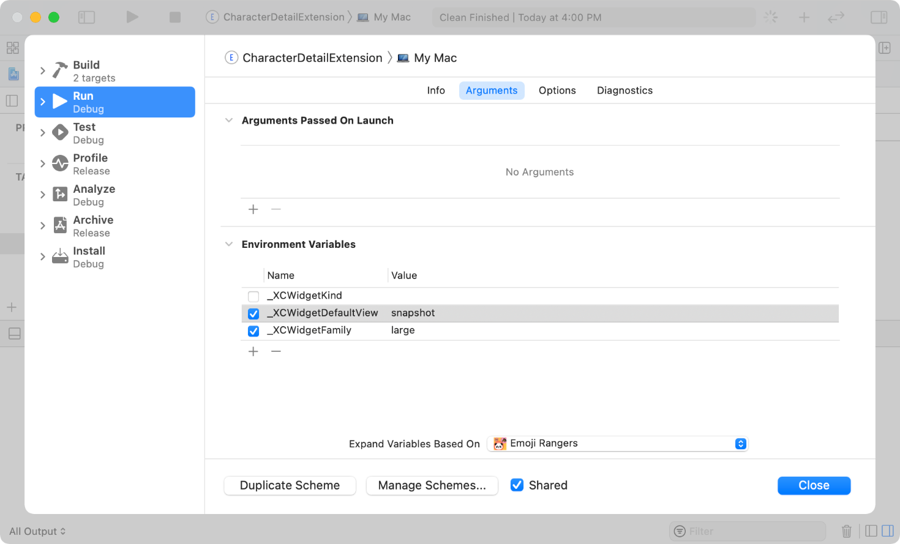

> Navigation: [Technologies](../technologies.md) · [WidgetKit](../widgetkit.md) · [Widgets and watch complications](widgets-and-complications-collection.md)

# Debugging widgets

Article

Set environment variables in Xcode to control your widget’s configuration in the debugger.

## Overview

To debug your widget, select the widget-extension target in Xcode and choose Product \> Run. Xcode automatically displays your widget on the target device, as follows:

- On iPhone, on the Home Screen
- On iPad, in the Today view
- On Mac, in the WidgetKit Simulator app

> [!note] Note
> If your Home Screen pages are full, Xcode instead uses the Today view.

To debug accessory widgets that appear on the iPhone Lock Screen or as complications on Apple Watch, build and run the app target, then manually add the widget.

To configure a specific widget configuration, use the Arguments pane of the widget extension’s scheme, shown here, to set environment variables as described below.

Additionally, use Xcode previews for iOS widgets as described in [Previewing widgets and Live Activities in Xcode](previewing-widgets-and-live-activities-in-xcode.md).

## Debug specific widget configurations

To debug a specific family of your widget that’s not an accessory widget, edit the scheme for your widget extension target and set the `_XCWidgetFamily` environment variable to `small`, `medium`, `large`, or `extralarge`.

If your widget extension supports multiple widgets using [WidgetBundle](../swiftui/widgetbundle.md), select the specific widget to debug by setting `_XCWidgetKind` to a string that matches the `kind` property of the widget’s configuration.

## Debug watch complications

Debugging a watch complication you create with WidgetKit works the same as debugging a complication you create with ClockKit. To learn more about testing complications, see [Creating complications for your watchOS app](../clockkit/creating-complications-for-your-watchos-app.md).

## Debug Mac widgets

The WidgetKit Simulator app provides a flexible way to see all your widget configurations in one place. Running your widget in the WidgetKit Simulator app lets you:

- View your widget’s display name, description, kind, supported families, and more.
- View multiple entries in your widget’s timeline.
- View your widget’s snapshot representation.
- View placeholder views for all supported sizes.
- Quickly switch between supported sizes when viewing snapshots or timeline entries.
- Reload your widget.

To select the default view the WidgetKit Simulator app shows when you start a debug session, edit the scheme for your Widget extension target and set the `_XCWidgetDefaultView` environment variable to `timeline`, `snapshot`, `placeholder`, or `info`.

## See Also

### Debugging

- [Previewing widgets and Live Activities in Xcode](previewing-widgets-and-live-activities-in-xcode.md) — Use Xcode previews to iteratively develop, fine-tune, and troubleshoot widgets and Live Activities.
- [Preview macros](preview-macros.md) — Use Swift macros to create widget previews in Xcode.
- [WidgetPreviewContext](widgetpreviewcontext.md) — A specification for the context of a widget preview.
