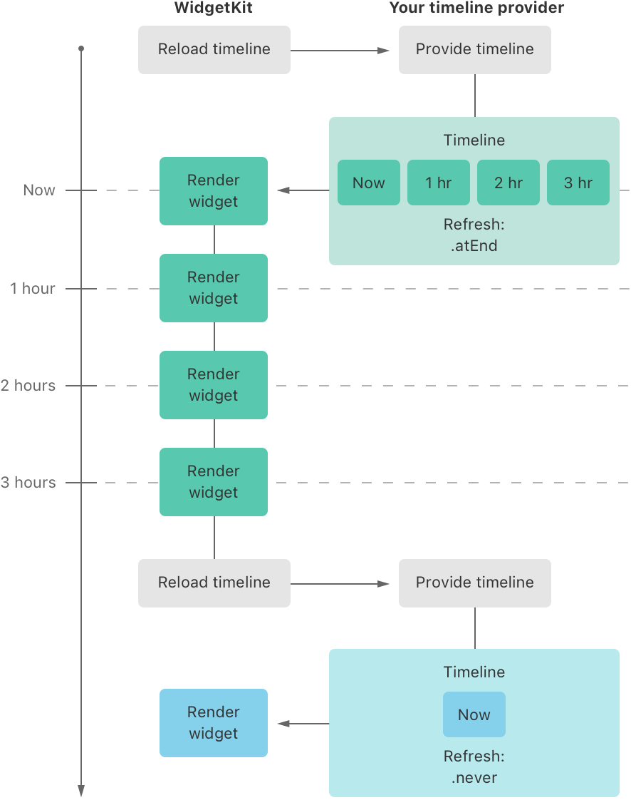
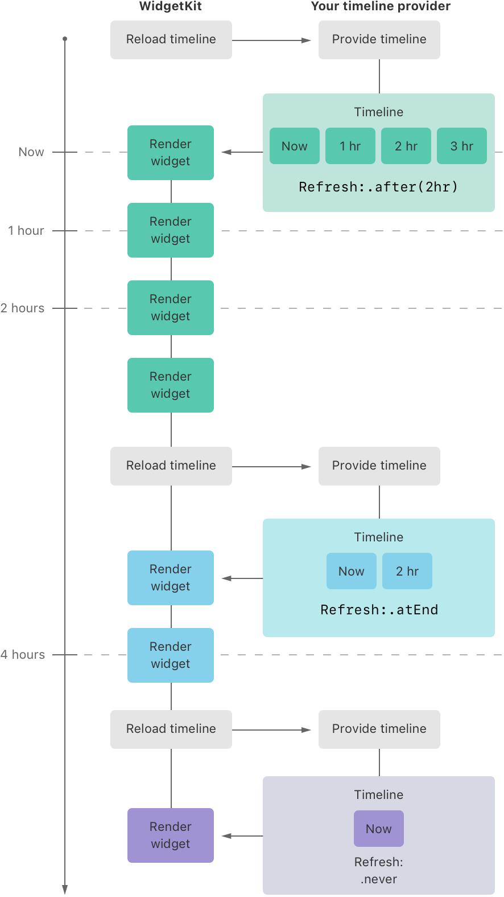

> Navigation: [Technologies](../technologies.md) · [WidgetKit](../widgetkit.md) · [Widgets and watch complications](widgets-and-complications-collection.md)

# Keeping a widget up to date

<sub>Article</sub>

Plan your widget’s timeline to show timely, relevant information using dynamic views, and update the timeline when things change.

## Overview

Widgets use SwiftUI views to display their content. WidgetKit renders the views on your behalf in a separate process. As a result, your widget extension is not continually active, even if the widget is onscreen. Despite your widget not always being active, there are several ways you can keep its content up to date:

- Create a timeline that updates your widget for regular, predictable events.
- Tell the system to reload all timelines when data changes; for example, when your app receives new data.
- Use WidgetKit push notifications in addition to timelines to update your widget.

WidgetKit push notifications are an additional way to update your widget that doesn’t replace timeline updates. For more information, refer to [Updating widgets with WidgetKit push notifications](updating-widgets-with-widgetkit-push-notifications.md).

### Plan reloads within a budget

Reloading widgets consumes system resources and causes battery drain due to additional networking and processing. To reduce this performance impact and maintain all-day battery life, limit the frequency and number of updates you request to what’s necessary.

To manage system load, WidgetKit uses a budget to distribute widget reloads over the course of the day. The budget allocation is dynamic and takes many factors into account, including:

- The frequency and times the widget is visible to the user.
- The widget’s last reload time.
- Whether the widget’s containing app is active.

WidgetKit maintains different budgets for each active widget the user adds to their device. For example, if the user adds two instances of a configurable sports widget, showing information for two different teams, each widget has its own budget.

A widget’s budget applies to a 24-hour period. WidgetKit tunes the 24-hour window to the user’s daily usage pattern, which means the daily budget doesn’t necessarily reset at exactly midnight. For a widget the user frequently views, a daily budget typically includes from 40 to 70 refreshes. This rate roughly translates to widget reloads every 15 to 60 minutes, but it’s common for these intervals to vary due to the many factors involved.

> [!note] Note
> The system takes a few days to learn the user’s behavior. During this learning period, your widget may receive more reloads than normal.

Cases in which WidgetKit doesn’t count reloads against your widget’s budget include when:

- The widget’s containing app is in the foreground.
- The widget’s containing app has an active audio or navigation session.
- The widget performs an app intent, such as when the user taps a button or toggles a switch.
- The widget performs an animation.
- The system locale changes.
- Dynamic Type or Accessibility settings change.

For cases such as system appearance changes or system locale changes, don’t request a timeline reload from your app. The system updates your widgets automatically. In StandBy, the system refreshes your widget’s display at a system-defined rate that doesn’t count against its budget.

Although your widget timeline provider drives your reload schedule, WidgetKit sometimes reloads your widget to help keep its content fresh. Some common scenarios include:

- If a widget is on a Home Screen page that the user rarely visits, WidgetKit may reduce the frequency of reloads for that widget. Later, when the user views the page, WidgetKit may reload the widget when it becomes visible.
- For widgets that use Location Services, WidgetKit reloads them after a significant location change happens. For more information related to reloads for widgets that use Location Services, refer to [Accessing location information in widgets](accessing-location-information-in-widgets.md).

If your widget can predict points in time that it should reload, the best approach is to generate a timeline for as many future dates as possible. Keep the interval of entries in the timeline as large as possible for the content you display. WidgetKit imposes a minimum amount of time before it reloads a widget. Your timeline provider should create timeline entries that are at least about 5 minutes apart. WidgetKit may coalesce reloads across multiple widgets, affecting the exact time a widget is reloaded.

### Generate a timeline for predictable events

Many widgets have predictable points in time where it makes sense to update their content. For example, a widget that displays weather information might update the temperature hourly throughout the day. A stock market widget could update its content frequently during open market hours, but not at all over the weekend. By planning these times in advance, WidgetKit automatically refreshes your widget when the appropriate time arrives.

When you define your widget, you implement a custom [TimelineProvider](timelineprovider.md). WidgetKit gets a timeline from your provider, and uses it to track when to update your widget. A timeline is an array of [TimelineEntry](timelineentry.md) objects. Each entry in the timeline has a date and time, and additional information the widget needs to display its view. In addition to the timeline entries, the timeline specifies a refresh policy that tells WidgetKit when to request a new timeline.

The following is an example of a game widget that displays a character’s health level. When the health level is less than 100 percent, the character recovers at a rate of 25 percent per hour. For example, when the character’s health level is 25 percent, it takes 3 hours to fully recover to 100 percent. The following diagram shows how WidgetKit requests the timeline from the provider, rendering the widget at each time specified in the timeline entries.



<sub>A diagram showing WidgetKit requesting a timeline, the provider generating the timeline, and the progression of time for 3 hours after which WidgetKit requests a new timeline</sub>

When WidgetKit initially requests the timeline, the provider creates one with four entries. The first entry represents the current time, followed by three entries at hourly intervals. With the refresh policy set to the default [atEnd](timelinereloadpolicy/atend.md), WidgetKit requests a new timeline after the last date in the timeline’s entries. When each date in the timeline arrives, WidgetKit invokes the widget’s content closure and displays the result. After the last timeline entry passes, WidgetKit repeats the process by asking the provider for a new timeline. Because the character’s health has reached 100 percent, the provider responds with a single entry for the current time and a refresh policy set to [never](timelinereloadpolicy/never.md). With this setting, WidgetKit doesn’t ask for another timeline until the app uses [WidgetCenter](widgetcenter.md) to tell WidgetKit to request a new timeline.

In addition to the `atEnd` and `never` refresh policies, a provider can specify a different date altogether if the timeline might change before or after reaching the end of the entries. For example, if a dragon will appear in 2 hours to challenge the character to a battle, the provider sets the reload policy to [after(_:)](<timelinereloadpolicy/after(__).md>), passing a date 2 hours in the future. The following diagram shows how WidgetKit, after rendering the widget at the 2-hour mark, requests a new one.



<sub>A diagram showing WidgetKit requesting a timeline, the provider generating the timeline, and WidgetKit requesting a new timeline after 2 hours</sub>

Due to the battle with the dragon, the character’s healing will take 2 additional hours to reach 100 percent. The new timeline consists of two entries, one for the current time, and a second entry 2 hours in the future. The timeline specifies `atEnd` for the refresh policy, indicating there are no more known events that might alter the timeline.

When the 2 hours have passed, and the character’s health is at 100 percent, WidgetKit asks the provider for a new timeline. Because the character’s health has recovered, the provider generates the same final timeline as the first diagram above. When the user plays the game and the character’s health level changes, the app uses [WidgetCenter](widgetcenter.md) to have WidgetKit refresh the timeline and update the widget.

In addition to specifying a date _before_ the end of the timeline, the provider can specify a date _after_ the end of the timeline. This is useful when you know that the widget’s state won’t change until a later time. For example, a stock market widget could create a timeline at the close of the market on Friday with an [after(_:)](<timelinereloadpolicy/after(__).md>) refresh policy specifying the time the market opens on Monday. Because the stock market is closed over the weekend, there is no need to update the widget until the market opens.

> [!important] Important
> Plan ahead if your widget makes requests to a server when it reloads and uses [after(_:)](<timelinereloadpolicy/after(__).md>) with a specific date in timeline entries. WidgetKit tries to respect the date you specify, which may cause a significant increase in server load when multiple devices reload your widget at around the same time.

### Inform WidgetKit when a timeline changes

Your app can tell WidgetKit to request a new timeline when something affects a widget’s current timeline. In the game widget example above, if the app receives a push notification indicating a teammate has given the character a healing potion, the app can tell WidgetKit to reload the timeline and update the widget’s content. To reload a specific type of widget, your app uses [WidgetCenter](widgetcenter.md), as shown here:

```swift
WidgetCenter.shared.reloadTimelines(ofKind: "com.mygame.character-detail")
```

The `kind` parameter contains the same string as the value used to create the widget’s [WidgetConfiguration](../swiftui/widgetconfiguration.md).

If your widgets have user-configurable properties, avoid unnecessary reloads by using WidgetCenter to verify that a widget with the appropriate settings exists. For example, when the game receives a push notification about a character receiving a healing potion, it verifies that a widget is showing that character before reloading the timeline.

In the following code, the app calls [getCurrentConfigurations(_:)](<widgetcenter/getcurrentconfigurations(__).md>) to retrieve the list of user-configured widgets. It then iterates through the resulting [WidgetInfo](widgetinfo.md) objects to find one with an `intent` configured with the character that received the healing potion. If it finds one, the app calls [reloadTimelines(ofKind:)](<widgetcenter/reloadtimelines(ofkind_).md>) for that widget’s `kind`.

```swift
WidgetCenter.shared.getCurrentConfigurations { result in
    guard case .success(let widgets) = result else { return }

    // Iterate over the WidgetInfo elements to find one that matches
    // the character from the push notification.
    if let widget = widgets.first(
        where: { widget in
            let intent = widget.configuration as? SelectCharacterIntent
            return intent?.character == characterThatReceivedHealingPotion
        }
    ) {
        WidgetCenter.shared.reloadTimelines(ofKind: widget.kind)
    }
}
```

If your app uses [WidgetBundle](../swiftui/widgetbundle.md) to support multiple widgets, you can use `WidgetCenter` to reload the timelines for all your widgets. For example, if your widgets require the user to sign in to an account but they have signed out, you can reload all the widgets by calling:

```swift
WidgetCenter.shared.reloadAllTimelines()
```

### Update relevance information

On iPhone and iPad, people place widgets in Smart Stacks and rely on the system to show them the most relevant widget at the right time. On Apple Watch, widgets automatically appear in the Smart Stack. To help the system determine when a widget in a Smart Stack is most relevant, and to offer Widget Suggestions, provide the system with hints about your widget’s relevance. While this is an optional step, providing relevance clues gives your widget additional visibility. In your timeline provider, implement the [relevance()](<timelineprovider/relevance().md>) callback and make sure to keep relevance information up-to-date. For more information, refer to [Increasing the visibility of widgets in Smart Stacks](widget-suggestions-in-smart-stacks.md).

### Display dynamic dates

Even though your widget doesn’t run continually, it can display time-based information that WidgetKit updates live. For example, it might display a countdown timer that continues to count down even if your widget extension isn’t running. For more information, refer to [Displaying dynamic dates in widgets](displaying-dynamic-dates.md).

### Load data from your server before updating the timeline

You may need to load new data from your server before reloading a timeline. To do this, use the system’s URL loading system and a [URLSession](../foundation/urlsession.md). To learn more, refer to [Making network requests in a widget extension](making-network-requests-in-a-widget-extension.md).

## See Also

### Timeline updates

- [TimelineProvider](timelineprovider.md) — A type that advises WidgetKit when to update a widget’s display.
- [AppIntentTimelineProvider](appintenttimelineprovider.md) — A type that advises WidgetKit when to update a user-configurable widget’s display.
- [IntentTimelineProvider](intenttimelineprovider.md) — A type that advises WidgetKit when to update a user-configurable widget’s display.
- [TimelineProviderContext](timelineprovidercontext.md) — An object that contains details about how a widget is rendered, including its size and whether it appears in the widget gallery.
- [TimelineEntry](timelineentry.md) — A type that specifies the date to display a widget, and, optionally, indicates the current relevance of the widget’s content.
- [Timeline](timeline.md) — An object that specifies a date for WidgetKit to update a widget’s view.
- [WidgetCenter](widgetcenter.md) — An object that contains a list of user-configured widgets and is used for reloading widget timelines.
