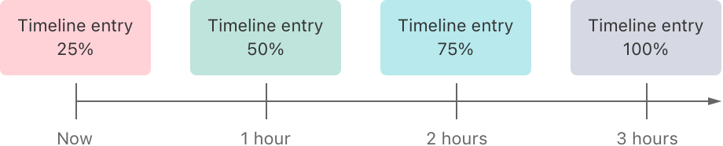

> Navigation: [Technologies](../technologies.md) · [WidgetKit](../widgetkit.md)

# TimelineProvider

<sub>Protocol</sub>

A type that advises WidgetKit when to update a widget’s display.

<sub>iOS, iPadOS, Mac Catalyst, macOS, visionOS, watchOS</sub>

```swift
protocol TimelineProvider
```

## Overview

At various times, WidgetKit requests a _timeline_ from the provider. A timeline is an array of objects conforming to [TimelineEntry](timelineentry.md). Each timeline entry has a date, and you can specify additional properties for displaying the widget.

For example, consider a widget that displays the health level of a game character. In the game, when the character’s health level is below 100 percent, it recovers at a rate of 25 percent per hour. If the character’s health level is 25 percent, the provider creates a timeline consisting of the following entries:



<sub>A diagram showing a timeline with four entries, starting with the current time at 25 percent health, and hourly entries for the next three hours at 50, 75, and 100 percent health</sub>

The following code shows the structure encapsulating this information.

```swift
struct CharacterDetailEntry: TimelineEntry {
    var date: Date
    var healthLevel: Double
}
```

WidgetKit asks for timeline entries in one of two ways:

- A single immediate snapshot, representing the widget’s current state.
- An array of entries, including the current moment and, if known, any future dates when the widget’s state will change.

WidgetKit makes the snapshot request when displaying the widget in transient situations, such as when the user is adding a widget. WidgetKit provides a `context` parameter that includes details about how to use the entry, including whether it’s a preview for the widget gallery, and the family, or size, of the widget to display. If `context.isPreview` is `true`, the widget appears in the widget gallery and requires a quick response from your provider. If the information you need to generate the snapshot is not readily available, or requires additional time to load, use sample data instead. For example, if determining the character’s health level requires fetching data from a server, the widget could show the health level at 75 percent. The following code shows how the game widget might implement its snapshot method.

```swift
struct CharacterDetailProvider: TimelineProvider {
    func getSnapshot(in context: Context, completion: @escaping (Entry) -> Void) {
        let date = Date()
        let entry: CharacterDetailEntry

        if context.isPreview && !hasHealthLevel {
            entry = CharacterDetailEntry(date: date, healthLevel: 0.75)
        } else {
            entry = CharacterDetailEntry(date: date, healthLevel: currentHealthLevel)
        }
        completion(entry)
    }
}
```

WidgetKit makes the timeline request after the user adds your widget from the widget gallery. Because your widget extension is not always running, WidgetKit needs to know when to activate it to update the widget. The timeline your provider generates informs WidgetKit when you would like to update the widget. The following example shows how the [Emoji Rangers: Supporting Live Activities, interactivity, and animations](emoji-rangers-supporting-live-activities-interactivity-and-animations.md) sample code project creates a timeline for its leaderboard widget.

```swift
func getTimeline(in context: Context, completion: @escaping (Timeline<LeaderboardEntry>) -> Void) {
    EmojiRanger.loadLeaderboardData { (heros, error) in
        guard let heros else {
            let timeline = Timeline(entries: [LeaderboardEntry(date: Date(), heros: EmojiRanger.availableHeros)], policy: .atEnd)

            completion(timeline)

            return
        }
        let timeline = Timeline(entries: [LeaderboardEntry(date: Date(), heros: heros)], policy: .atEnd)
        completion(timeline)
    }
}
```

If your provider needs to do asynchronous work to generate the timeline, such as fetching data from a server, store a reference to the `completion` handler and call it when you are done with your asynchronous work.

### Determine a refresh policy

When creating the timeline, the provider specifies a refresh policy that controls when WidgetKit requests a new timeline. The default behavior is to use [atEnd](timelinereloadpolicy/atend.md) to request a new timeline after the last date specified by the entries in a timeline. However, if there is a different date when WidgetKit should request a new timeline, you can specify a refresh policy of [after(_:)](<timelinereloadpolicy/after(__).md>). For example, a dragon will appear in 2.5 hours and might engage in battle with the game character. Because the outcome of this battle may change the character’s health level, the provider can tell WidgetKit to request a new timeline after the battle.

```swift
// Request a timeline refresh after 2.5 hours.
let date = Calendar.current.date(byAdding: .minute, value: 150, to: Date())!
let timeline = Timeline(entries: entries, policy: .after(date))
completion(timeline)
```

Other examples of when it makes sense to use a different date include:

- In a widget displaying stock market details, you might specify the next market opening or closing date because information typically doesn’t change overnight or during weekends.
- A flight tracking widget might continue showing a “flight landed” indication after the flight lands. In this case, you could specify a date later than when the flight lands so that its status remains visible for a while before being cleared.

Alternatively, if future events are unpredictable, you can tell WidgetKit to not request a new timeline at all by specifying [never](timelinereloadpolicy/never.md) for the policy. In that case, your app calls the [WidgetCenter](widgetcenter.md) function [reloadTimelines(ofKind:)](<widgetcenter/reloadtimelines(ofkind_).md>) when a new timeline is available. Some examples of when using [never](timelinereloadpolicy/never.md) makes sense include:

- When the user has a widget configured to display the health of a character, but that character is no longer actively engaging in battle and its health level won’t change.
- When a widget’s content is dependent on the user being logged into an account and they aren’t currently logged in.

In both examples, when your app determines that the status has changed, it calls the [WidgetCenter](widgetcenter.md) function [reloadTimelines(ofKind:)](<widgetcenter/reloadtimelines(ofkind_).md>) and WidgetKit requests a new timeline.

### Refresh widgets efficiently

Each configured widget receives a limited number of refreshes every day. Several factors affect how many refreshes a widget receives, such as whether the containing app is running in the foreground or background, how frequently the widget is shown onscreen, and what types of activities the containing app engages in.

> [!note] Note
> WidgetKit does not impose this limit when debugging your widget in Xcode. To verify that your widget behaves correctly, test your app and widget’s behavior outside of Xcode’s debugger.

Use the following approaches to optimize your widget refreshes:

- Have the containing app prepare data for the widget in advance of when the widget needs it. Use a shared group container to store the data.
- Use background processing time in your app to keep shared data up to date. For more information, see [Using background tasks to update your app](../uikit/using-background-tasks-to-update-your-app.md).
- Choose the most appropriate refresh policy for the information being shown, as described in the preceding section.
- Call [reloadTimelines(ofKind:)](<widgetcenter/reloadtimelines(ofkind_).md>) only when information the widget is currently displaying changes.

When your app is in the foreground, has an active media session, or is using the standard location service, refreshes don’t count against the widget’s daily limit. For more information about media sessions and location services, see [AVAudioSession](../avfaudio/avaudiosession.md) and [Configuring your app to use location services](../corelocation/configuring-your-app-to-use-location-services.md).

## Topics

### Generating Timelines

- [getSnapshot(in:completion:)](<timelineprovider/getsnapshot(in_completion_).md>) — Provides a timeline entry that represents the current time and state of a widget.
- [getTimeline(in:completion:)](<timelineprovider/gettimeline(in_completion_).md>) — Provides an array of timeline entries for the current time and, optionally, any future times to update a widget.
- [placeholder(in:)](<timelineprovider/placeholder(in_).md>) — Provides a timeline entry representing a placeholder version of the widget.
- [Entry](timelineprovider/entry.md) — A type that specifies the date to display a widget, and, optionally, indicates the current relevance of the widget’s content.
- [Context](timelineprovider/context.md) — An object that contains details about how a widget is rendered, including its size and whether it appears in the widget gallery.

### Providing relevance clues

- [relevance()](<timelineprovider/relevance().md>) — Provides an object containing attributes that describe when a specific widget is relevant.

## See Also

### Timeline updates

- [Keeping a widget up to date](keeping-a-widget-up-to-date.md) — Plan your widget’s timeline to show timely, relevant information using dynamic views, and update the timeline when things change.
- [AppIntentTimelineProvider](appintenttimelineprovider.md) — A type that advises WidgetKit when to update a user-configurable widget’s display.
- [IntentTimelineProvider](intenttimelineprovider.md) — A type that advises WidgetKit when to update a user-configurable widget’s display.
- [TimelineProviderContext](timelineprovidercontext.md) — An object that contains details about how a widget is rendered, including its size and whether it appears in the widget gallery.
- [TimelineEntry](timelineentry.md) — A type that specifies the date to display a widget, and, optionally, indicates the current relevance of the widget’s content.
- [Timeline](timeline.md) — An object that specifies a date for WidgetKit to update a widget’s view.
- [WidgetCenter](widgetcenter.md) — An object that contains a list of user-configured widgets and is used for reloading widget timelines.
