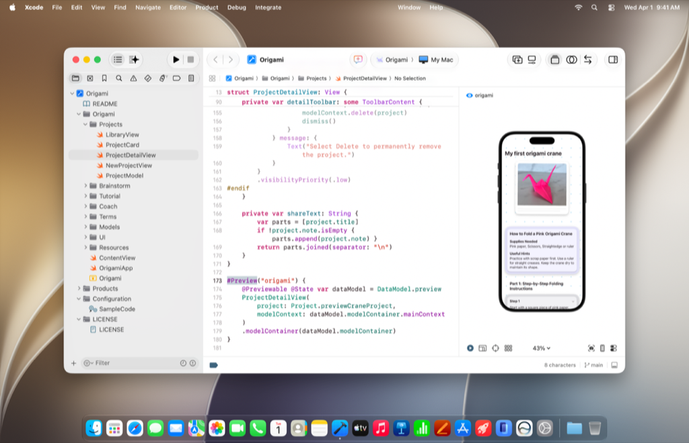

> Navigation: [Technologies](technologies.md)

# Xcode

Build, test, and submit your app with Apple’s integrated development environment.

## Overview

Xcode is the suite of tools you use to build apps for Apple platforms. Use Xcode to manage your entire development workflow — from creating your app to testing, optimizing, and submitting it to the App Store.

Xcode includes a world-class source editor with code completion, source control, and a powerful debugger. Add playground macros to run code snippets, and add previews to see your UI as you build it. Customize the toolbar and apply themes to your workspace or projects.

Use coding intelligence from anywhere in your project to explain and write code, analyze bugs, and generate fixes. Use agents that iterate and refine your code with Xcode guidance, skills, and other expertise. You can also use coding intelligence to localize your app or make it more accessible for people who use VoiceOver.

Xcode also includes several tools to help you rapidly develop and test your app:

- Run your app on a simulated or physical device using Device Hub.
- Create a single, multilayer icon for your app using the Icon Composer app.
- Use Instruments to profile and analyze your app, improve performance, and investigate system resource usage.
- Construct 3D content with Reality Composer.
- Train custom machine learning models with Create ML.
- Identify areas of your app that aren’t accessible with Accessibility Inspector.
- Use Xcode Cloud to build and test your app. Later, join the Apple Developer Program to distribute it.

> [!note] Note
> Download the latest version of Xcode from the [Mac App Store](https://apps.apple.com/us/app/xcode/id497799835). Download beta versions of Xcode from the [Apple Developer website](https://developer.apple.com/xcode/).

## Topics

### Essentials

- [Creating an Xcode project for an app](xcode/creating-an-xcode-project-for-an-app.md) — Start developing your app by creating an Xcode project from a template.
- [Creating your app’s interface with SwiftUI](xcode/creating-your-app-s-interface-with-swiftui.md) — Develop apps in SwiftUI with an interactive preview that keeps the code and layout in sync.
- [Previewing your app’s interface in Xcode](xcode/previewing-your-apps-interface-in-xcode.md) — Iterate designs quickly and preview your apps’ displays across different Apple devices.
- [Building and running an app](xcode/building-and-running-an-app.md) — Compile your source files and assemble an app bundle to run on a device or simulator.
- [Xcode updates](updates/xcode.md) — Learn about important changes to Xcode.

### Xcode IDE

- [Projects and workspaces](xcode/projects-and-workspaces.md) — Manage the code and resources you use to build apps, libraries, and other software for Apple platforms.
- [Source control management](xcode/source-control-management.md) — Back up your files, collaborate with others, and tag your releases with Git source control support in Xcode.
- [Capabilities](xcode/capabilities.md) — Enable services that Apple provides, such as In-App Purchase, Push Notifications, Apple Pay, iCloud, and many others.
- [Build system](xcode/build-system.md) — Compile your code into a binary format, and customize your project settings to build your code.
- [Command-line tools](xcode/command-line-tools.md) — Develop and customize your projects in Terminal.

### Code

- [Source editor](xcode/source-editor.md) — Edit your source files, locate issues, and make necessary changes using the source editor.
- [Coding intelligence](xcode/coding-intelligence.md) — Use agents to help you explore code, add features, refine your interface, and leverage skills, such as localization and accessibility.
- [Bundles and frameworks](xcode/bundles-and-frameworks.md) — Organize code and resources in bundles and frameworks.
- [Swift packages](xcode/swift-packages.md) — Create reusable code, organize it in a lightweight way, and share it across Xcode projects and with other developers.

### Interface

- [Asset management](xcode/asset-management.md) — Add app icons, images, strings, data files, machine learning models, and other resources to your projects, and manage how you load them at runtime.
- [Localization](xcode/localization.md) — Expand the market for your app by supporting multiple languages and regions.
- [Accessibility Inspector](accessibility/accessibility-inspector.md) — Reveal how your app represents itself to people using accessibility features.

### Documentation

- [Writing documentation](xcode/writing-documentation.md) — Produce rich and engaging developer documentation for your apps, frameworks, and packages.

### Tuning and debugging

- [Device Hub](xcode/device-hub.md) — Manage the simulated and physical devices that you use to test your app.
- [Debugging](xcode/debugging.md) — Identify and address issues in your app using the Xcode debugger, Xcode Organizer, Metal debugger, and Instruments.
- [Performance and metrics](xcode/performance-and-metrics.md) — Measure, investigate, and address the use of system resources and issues impacting performance using Instruments and Xcode Organizer.
- [Testing](xcode/testing.md) — Develop and run tests to detect logic failures, UI problems, and performance regressions.

### Distribution and continuous integration

- [Distribution](xcode/distribution.md) — Prepare your app and share it with your team, beta testers, and customers.
- [Xcode Cloud](xcode/xcode-cloud.md) — Automatically build, test, and distribute your apps with Xcode Cloud to verify changes and create high-quality apps.

### Hardware considerations

- [Apple silicon](apple-silicon.md) — Get the resources you need to create software for Macs with Apple silicon.
- [Application binary interfaces](xcode/application-binary-interfaces.md) — Write assembly instructions that adhere to the application binary interfaces of Apple platforms.
