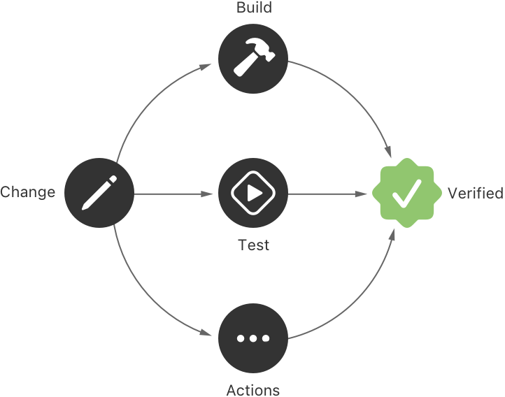
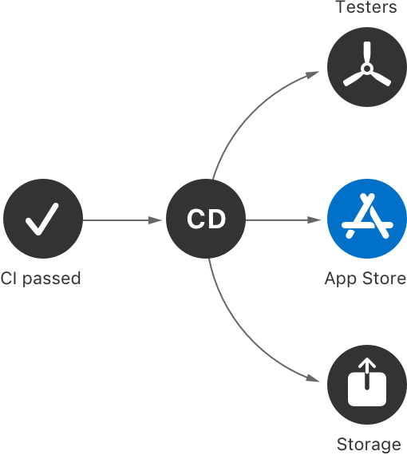
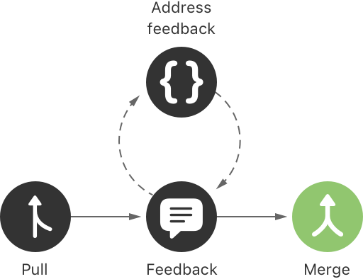
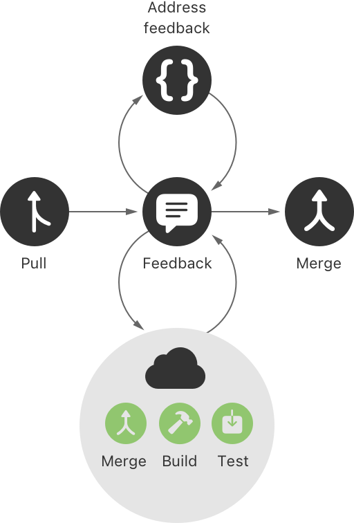

> Navigation: [Technologies](../technologies.md) · [Xcode](../xcode.md) · [Xcode Cloud](xcode-cloud.md)

# About continuous integration and delivery with Xcode Cloud

Article

Learn how continuous integration and delivery with Xcode Cloud helps you create high-quality apps and frameworks.

## Overview

Xcode consists of a suite of tools you use to build, test, and release apps and frameworks for Apple platforms. When you add features and support more devices and platforms, your app or framework and its codebase grow in complexity, making it harder to ensure its quality. With Xcode Cloud, you can adopt _continuous integration and delivery_ (CI/CD), a standard practice to monitor, ensure, and improve the quality of your apps and frameworks.

Xcode Cloud is a CI/CD system that uses Git for source control and provides you with an integrated system that ensures the quality and stability of your codebase. It also helps you publish apps efficiently. By combining [Xcode](https://developer.apple.com/xcode/) with Apple’s cloud infrastructure for building and testing your code — along with [TestFlight](https://developer.apple.com/testflight/) and [App Store Connect](https://appstoreconnect.apple.com) — Xcode Cloud makes it easy for you to:

- Build and test your code automatically.
- Test your app on Apple devices in Simulator automatically and frequently.
- Receive notifications from Xcode Cloud to identify errors before they become serious issues.
- Distribute new versions of your app to team members and testers with TestFlight.
- Making new versions of your app available for app review before publishing them in the App Store.
- Develop your software collaboratively using Xcode and Apple’s cloud infrastructure.

A figure that shows the iterative continuous integration and delivery process that’s made of building, testing, distributing, and gathering feedback to fix issues and verify a change.

You don’t need to introduce every aspect of continuous integration and delivery at once. Instead, take a slow but steady approach and start by using [Git](https://git-scm.com) for managing your project’s source code. After you’re comfortable with Git’s workflows and processes, configure your project to use Xcode Cloud at the most basic level — for continually building and testing your projects. As you become more familiar with how Xcode Cloud works, you can start to take advantage of its CD features like delivering test builds with TestFlight.

### The role of source control

Changes to your app’s code can be difficult to manage. This is especially true when you work on several changes at the same time. To help you organize, manage, and document source code changes, Xcode supports source control with Git. By using source control, you improve your project’s quality by tracking and reviewing code changes.

Because source control plays such a fundamental role in CI/CD, Xcode Cloud requires your code to be in a Git repository. It supports the following _source code management_ (SCM) providers:

- [Bitbucket Cloud](https://bitbucket.org) and [Bitbucket Server](https://bitbucket.org/product/enterprise)
- [GitHub](https://github.com) and [GitHub Enterprise](https://github.com/enterprise)
- [GitLab](https://gitlab.com) and [self-managed GitLab](https://about.gitlab.com/install)

> [!note] Note
> Xcode Cloud comes with support for [Git LFS](https://git-lfs.github.com/).

To learn more about source control with Xcode, see [Source control management](source-control-management.md).

### The importance of automated building and testing

A typical development process starts with making changes to your code, building the project, and running your app in the Simulator or on a test device. Your process may even include verifying changes locally by running unit tests you create with [Swift Testing](../testing.md) or [XCTest](../xctest.md), and by running integration, performance, or user interface tests.

While Xcode can reduce the time it takes to perform these tasks, they still take a significant amount of your time. This is especially true for complex apps or frameworks that support a wide range of devices and operating systems. With Xcode Cloud, however, you can build, run, and test your project on multiple simulated devices in less time than you can traditionally.

A figure that illustrates the various steps of automated building and testing: a change leads to automated building, testing, and other actions that verify a change.

After verifying a change, Xcode Cloud automatically notifies you about the result via email. You can also view the results in Xcode or in App Store Connect. This helps you detect errors before they become an issue, and gives you the reassurance you need about the stability and quality of your code.

For more information about automatically building your project with Xcode Cloud, see [Configuring your first Xcode Cloud workflow](configuring-your-first-xcode-cloud-workflow.md).

For more information about testing your code, see [Testing](testing.md).

### Continuous delivery

The flip side to continuous integration (CI) is continuous delivery (CD). While automatic building and testing are important to developing high-quality apps and frameworks, it doesn’t replace the hands-on testing you get from team members and testers. When Xcode Cloud verifies a change to your code (CI), it can automatically deliver (CD) a new version of your app to internal testers with [TestFlight](https://developer.apple.com/testflight/). Xcode Cloud can also sign your app for external testing with TestFlight and submission to app review. You can also upload the exported app archive or a framework to your own server.

A figure that illustrates the various steps of CD that happen after CI has passed: distribution to internal testers, external testers, and the App Store.

### Collaborative software development with Xcode Cloud

Source control with Git helps you manage changes to your code. For example, Git branches enable you to make a change without affecting your verified, stable codebase. Additionally, branches are helpful when you develop your app or framework as a team. However, merging changes, resolving conflicts, and verifying code changes can be time-consuming.

To make code review and merging easier, SCM providers offer support for _pull requests_ (PRs), also known as _merge requests_. When you create a PR, you inform your team that a change is ready for review, and you and your team can take a look at each other’s code changes, and provide and address feedback before merging branches.

A figure that illustrates a collaborative software development workflow with Git. A team member creates a PR, gathers feedback, addresses the feedback, and eventually merges branches.

If you develop code as a team, or if you work on several changes at the same time, a common practice to follow is to use separate branches for each change and then create PRs to receive code reviews from your peers. This introduces another verification step that helps you identify errors before they become serious issues.

Xcode allows you to create, view, and comment on PRs, and merge changes into your codebase if you host your Git repository with [Bitbucket Server](https://bitbucket.org/product/enterprise), [GitHub](https://github.com), or [GitHub Enterprise](https://github.com/enterprise).

A figure that illustrates how Xcode Cloud integrates with pull requests. When someone creates a pull request, Xcode Cloud detects this change, builds the project, runs configured tests, and posts the status to the pull request.

You can also configure Xcode Cloud to detect new PRs, or changes to an existing PR. When it detects a change, Xcode Cloud merges the involved branches in a temporary build environment, and automatically builds your project and runs your tests to verify the merged code. After verifying the changes, Xcode Cloud adds a status message to the PR to inform you of the result.

> [!tip] Tip
> Using your SCM provider’s website, you can require the Xcode Cloud build to succeed before team members can complete the PR and merge branches.

## See Also

### Essentials

- [Getting started with Xcode Cloud](getting-started-with-xcode-cloud.md) — Use Xcode Cloud to build and test your app in the cloud during development.
- [Distributing your Xcode Cloud builds through TestFlight](distributing-your-xcode-cloud-builds-through-testflight.md) — Create a TestFlight distribution workflow for internal testers.
- [Setting up your project to use Xcode Cloud](setting-up-your-project-to-use-xcode-cloud.md) — Review account, project, and source control requirements before configuring your project or workspace to use Xcode Cloud.
- [Configuring your first Xcode Cloud workflow](configuring-your-first-xcode-cloud-workflow.md) — Set up your project or workspace to use Xcode Cloud and adopt continuous integration and delivery.
