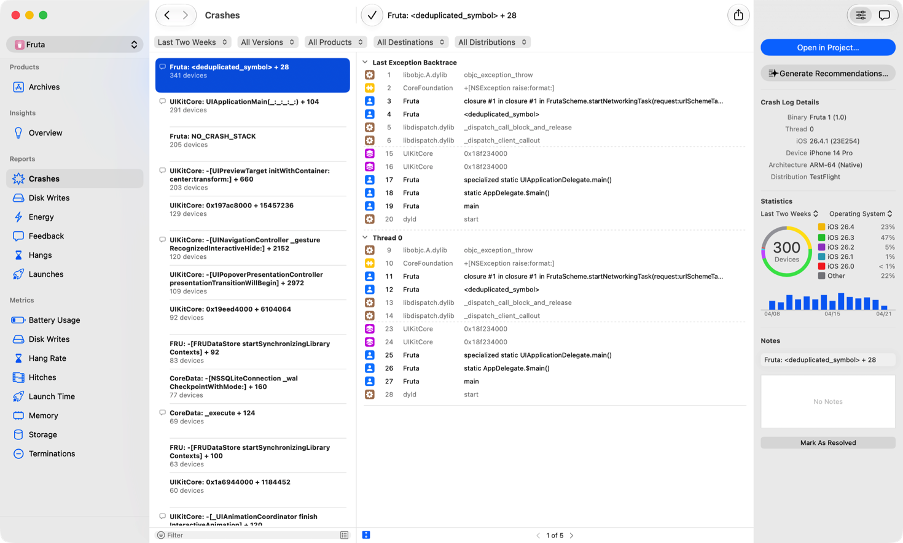

> Navigation: [Technologies](../technologies.md) · [Xcode](../xcode.md) · [Debugging](debugging.md) · [Diagnosing issues using crash reports and device logs](diagnosing-issues-using-crash-reports-and-device-logs.md)

# Acquiring crash reports and diagnostic logs

<sub>Article</sub>

Gather crash reports and device logs from the App Store, TestFlight, and directly from devices.

## Overview

After your app is distributed to customers, learn ways to improve it by collecting crash reports and diagnostic logs. If a customer reports an issue with your app, use the Crashes organizer in Xcode to get a report about the issue, as described in [How are reports created?](https://help.apple.com/xcode/mac/current/#/dev675635e70) If the Crashes organizer doesn’t contain the diagnostic information you need or is unavailable to you, the customer can collect logs from their device and share them directly with you to resolve the issue. Once you have a crash report, you may need to add identifiable symbol information to the crash report—see [Adding identifiable symbol names to a crash report](adding-identifiable-symbol-names-to-a-crash-report.md) for more information.

For issues that aren’t crashes, inspect the operating system’s console log to find important information for diagnosing the issue’s source.

### Collect crash reports from TestFlight and the App Store

TestFlight and the App Store collect crash reports for every submitted version of your app. Crash reports automatically contain identifiable symbol information if you include symbol information when submitting a build to the App Store. Review [Building your app to include debugging information](building-your-app-to-include-debugging-information.md) for the recommended settings.

The Crashes organizer presents crash reports from customers who share diagnostic and usage information, as described in [Share crash, energy, and metrics data with developers](https://help.apple.com/xcode/mac/current/#/deve2819c518). TestFlight users of your app automatically share crash reports with you, regardless of the device settings for sharing diagnostic and use data. If no crash reports appear in the Crashes organizer, see [If no crash, energy, or metrics reports appear in the organizer](https://help.apple.com/xcode/mac/current/#/dev9a80ab71d) to enable collection of crash reports from your customers.

The following crash report types aren’t available through the Crashes organizer, but are available by other means. See [Transfer crash reports and device logs to a Mac](acquiring-crash-reports-and-diagnostic-logs.md#Transfer-crash-reports-and-device-logs-to-a-Mac) and [Locate crash reports and memory logs on the device](acquiring-crash-reports-and-diagnostic-logs.md#Locate-crash-reports-and-memory-logs-on-the-device).

- Watchdog events, such as those from slow app launch times
- Invalid code-signature crashes
- Thermal events, where a device overheats because an app uses too much CPU
- Jetsam events, where an app has high memory use

### Get coding assistant recommendations for crash issues

After selecting a crash report in the Crashes organizer, click Generate Recommendations in the Inspector to get assisted triage in Xcode. After selecting a workspace, Xcode opens your project and pastes the crash stack trace into coding assistant to help you identify and fix the root cause of the crash.



<sub>A screenshot showing the Generate Recommendations button in the Inspector of the Crashes reports pane in Xcode Organizer.</sub>

### Transfer crash reports and device logs to a Mac

If you have access to the device on which your app crashes, you can transfer diagnostic logs by connecting the device to your Mac. You can view these logs using the Devices and Simulators window in Xcode, described in [About Devices and Simulators window](https://help.apple.com/xcode/mac/current/#/dev7b20475ba).

If a customer reports a crash, they can transfer the crash report to either a Mac or Windows computer. See [Find device crash and energy logs on a Mac or Windows computer](https://help.apple.com/xcode/mac/current/#/dev0f3181c2c).

### Locate crash reports and memory logs on the device

If a customer reports a crash in your app and you don’t have a crash report for it in the Crashes organizer, ask the customer to e-mail you the crash report from their device.

> [!note] Note
> Crash reports from watchOS are available on the paired iPhone.

To locate and email crash reports for iOS, iPadOS, tvOS, visionOS, and watchOS apps:

1. Open the Analytics & Improvements section of Settings on the device. See [Share analytics, diagnostics, and usage information with Apple](https://support.apple.com/en-us/HT202100).
2. Tap Analytics Data.
3. Locate the log for your app. The log name starts with `<AppBinaryName>_<DateTime>` for crash reports, or `JetsamEvent_<DateTime>` for high-memory use crashes.
4. Select the desired log.
5. Tap the Share icon, and select Mail to send the crash report as a mail attachment.

To locate and email crash reports for macOS and Mac Catalyst apps:

1. Open the Console app, from Applications \> Utilities in Finder.
2. Select _Crash Reports_.
3. Locate crash reports for your app in the list. Logs are listed by your app’s binary name.
4. Right-click the desired log’s file name.
5. Select Reveal in Finder.
6. Drag the file displayed in Finder to Mail to send the crash report as a mail attachment.

### Create a crash report while debugging

If you encounter a crash while debugging your app using Xcode, the debugger intercepts the crash so you can inspect your app’s state. If you’d like to gather the full crash report for the issue, detach the debugger, either by using the Debug \> Detach menu item in Xcode, or by issuing the `detach` command in the debugging console. This allows the app to finish crashing and lets the operating system generate the crash report. See [Locate crash reports and memory logs on the device](acquiring-crash-reports-and-diagnostic-logs.md#Locate-crash-reports-and-memory-logs-on-the-device) for how to collect the crash report file.

### Access device console logs

If a customer reports an issue in your app that isn’t a crash, look at the device’s console log for additional information about the issue.

To access a device’s console logs:

1. For iOS, iPadOS, tvOS, and visionOS issues, connect the device to your Mac. For watchOS issues, install the logging profile to the paired iPhone and then connect the iPhone to your Mac. See [Profiles and Logs](https://developer.apple.com/bug-reporting/profiles-and-logs/?name=sysdiagnose&platform=watchos) to download the profile. For macOS issues, proceed to the next step.
2. On the Mac, open the Console app, from Applications \> Utilities in Finder.
3. Select the device in the Console sidebar.
4. Reproduce the issue and note the exact time.
5. Look for logs that pertain to the issue from around the time you reproduced the issue.
6. Use information from the log as clues to further guide your investigation of the issue.

### Share crash reports to receive help

If you need assistance debugging a crash, extract crash reports from the Xcode organizer to share. In the Xcode organizer, Control-click the crash and choose Show in Finder to reveal the Xcode crashpoint document (`.xccrashpoint`) in Finder. Then, Control-click on that document and choose Show Package Contents. In the resulting Finder window, find a crash report (`.crash`) that matches the crash you’re investigating.

When you post to the [Developer Forums](https://developer.apple.com/forums/), include the complete crash report as a text attachment. This preserves all diagnostic information while avoiding cluttered discussion threads. If you want to highlight a specific section, include that snippet in the main body using a code block with triple backticks (```).

Use Apple crash reports whenever possible, as third-party crash reports may omit necessary information. Always symbolicate your crash report before sharing it, otherwise the report shows hexadecimal addresses instead of function names and line numbers, making diagnosis more difficult. For symbolication information, see [Adding identifiable symbol names to a crash report](adding-identifiable-symbol-names-to-a-crash-report.md).

Crash reports commonly have `.crash` and `.ips` file extensions. If you have an `.ips` file, post that instead of a `.crash` file when available. Some forums allow `.crash` files but not `.ips` files. To ensure your crash report posts, change the `.ips` extension to `.txt` before uploading. If the forum alerts you about having “sensitive language” in your crash report, attach it to a reply instead of your initial post. If you still can’t post your crash report directly, upload it to a file sharing service and include the URL in your post.

Always look for and redact sensitive information in your shared crash reports. Replace your app name and bundle ID throughout the crash report with redacted characters that maintain the original length of the text to keep text properly aligned, while maintaining the distinction between them. For example, replace `MyApp` with `MmVvv` and `com.company.myapp` with `com.ccccccc.mmmm`.

## See Also

### Related Documentation

- [Adding identifiable symbol names to a crash report](adding-identifiable-symbol-names-to-a-crash-report.md) — Replace hexadecimal addresses in a crash report with function names and line numbers that correspond to your app’s code.
- [Identifying the cause of common crashes](identifying-the-cause-of-common-crashes.md) — Find patterns in crash reports that identify common problems, and investigate the issue based on the pattern.
- [Analyzing a crash report](analyzing-a-crash-report.md) — Identify clues in a crash report that help you diagnose problems.
- [Identifying high-memory use with jetsam event reports](identifying-high-memory-use-with-jetsam-event-reports.md) — Discover why the operating system terminated your app when available memory was low.
