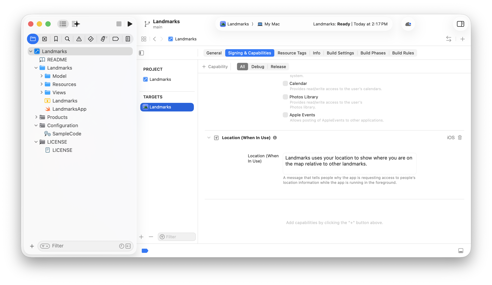
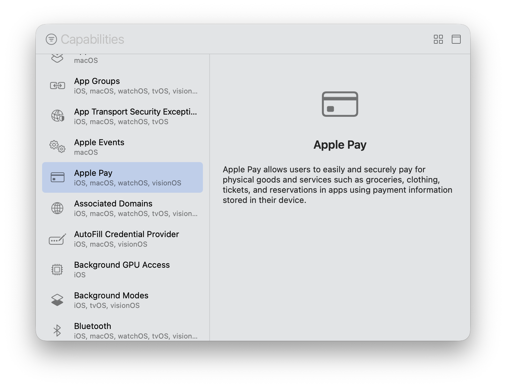
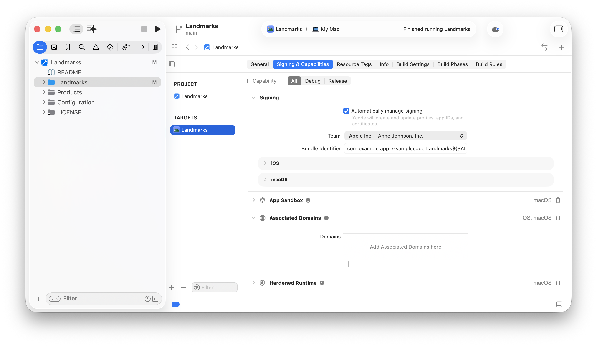

> Navigation: [Technologies](../technologies.md) · [Xcode](../xcode.md) · [Capabilities](capabilities.md)

# Adding capabilities to your app

Article

Configure your target to include and customize capabilities that provide access to Apple’s app services.

## Overview

A _capability_ grants your app access to an _app service_ that Apple provides, such as CloudKit, Game Center, or In-App Purchase. To use some app services, you need to add a capability to your target in Xcode to configure the app service correctly. Xcode may edit the [Entitlements](../bundleresources/entitlements.md) and [Information Property List](../bundleresources/information-property-list.md) files, add related frameworks, and configure your signing assets.

Some app services — such as Game Center and In-App Purchase — require additional configuration in App Store Connect and your developer account. For example, to provide directions for other apps using the Maps cabability, you [upload a geographic coverage file](https://developer.apple.com/help/app-store-connect/manage-submissions-to-app-review/upload-a-geographic-coverage-file/) in App Store Connect.

The platform, and whether you’re a member of the [Apple Developer Program](https://developer.apple.com/programs/), may limit the capabilities available to your app. For the supported capabilities, go to the Reference section of [Developer Account Help](https://developer.apple.com/help/account/) — for example, go to [Supported capabilities (iOS)](https://developer.apple.com/help/account/reference/supported-capabilities-ios) for the capabilities available to iOS apps.

Before you begin, add your Apple Account to settings and assign the project to a team in the project editor so that Xcode can create a provisioning profile for your app. For iOS, iPadOS, tvOS, visionOS, and watchOS apps, run your app on a device to register the device and create a development provisioning profile. For more information, see [Running your app on simulated or physical devices](running-your-app-on-simulated-or-physical-devices.md).

> [!important] Important
> Use the default automatic signing when you create a project from a template. If you manually sign your app, you need to perform the capability configuration steps yourself. For more information on manually signing, see [Configure code signing](distributing-your-app-to-registered-devices.md#Configure-code-signing).

### Add a capability

You add capabilities to your app using the Signing & Capabilities pane of the project editor.

In the Project navigator, select the project — the root group with the same name as your app — and in the project editor that appears on the right, select the appropriate target in the sidebar and then click the Signing & Capabilities tab.

A screenshot of Xcode showing the project editor with the Signing & Capabilities tab open. The project is selected in the Project navigator, a target is selected in the project editor sidebar, and the Signing & Capabilities tab is selected in the toolbar showing a Location capability added below.

Optionally, select a build configuration (All, Debug, or Release). For example, if you want to add the capability to the Debug configuration only, select Debug; otherwise, select All.

In the Signing & Capabilities toolbar, click the Capability button (+) to open the Capabilities library (or choose Editor \> Add Capability). The Capabilities library displays only the capabilities available to the target platform and your program membership. Select a capability in the list to view its description on the right. Use the filter field in the toolbar to find a capability quickly.

A screenshot of the Capabilities library with the Apple Pay capability selected in the sidebar on the left and information about Apple Pay displayed in the detail area on the right.

To add a capability to the target, double-click the capability in the sidebar or drag the capability from the library to the Signing & Capabilities pane. The capability appears below the Signing section. If there are more configuration steps, the capability expands to show additional controls (see [Perform additional configuration steps](adding-capabilities-to-your-app.md#Perform-additional-configuration-steps) below). To remove a capability, click the trash icon in the upper-right corner of the capability in the Signing & Capabilities pane.

A screenshot of Xcode showing the project editor with the Signing & Capabilities tab open and additional configuration options for the Associated Domains capability below.

If errors appear in the Signing section, read the message and correct the problem. For example, the bundle ID ([CFBundleIdentifier](../bundleresources/information-property-list/cfbundleidentifier.md)) that appears in the Bundle Identifier field under Signing needs to be unique. The default value for the bundle ID is the organization identifier concatenated with the app name that you enter when creating a project.

### Perform additional configuration steps

For some capabilities, you may need to perform additional configuration steps in Xcode, your developer account, or App Store Connect. For other capabilities, you may need to write some code.

For more guidance on specific capabilities, see the table below:

| Capability | Additional information |
|---|---|
| App Groups | [Configuring app groups](configuring-app-groups.md) |
| App Sandbox | [Configuring the macOS App Sandbox](configuring-the-macos-app-sandbox.md) |
| Apple Pay | [Configuring Apple Pay support](configuring-apple-pay-support.md) |
| Associated Domains | [Configuring an associated domain](configuring-an-associated-domain.md) |
| Background Modes | [Configuring background execution modes](configuring-background-execution-modes.md) |
| ClassKit | [Enabling ClassKit in your app](../classkit/enabling-classkit-in-your-app.md) |
| Family Controls | [Configuring Family Controls](configuring-family-controls.md) |
| Fonts | [Configuring custom fonts](configuring-custom-fonts.md) |
| Game Controllers | [Configuring game controllers](configuring-game-controllers.md) |
| Group Activities | [Configuring Group Activities](configuring-group-activities.md) |
| Hardened Runtime | [Configuring the hardened runtime](configuring-the-hardened-runtime.md) |
| HealthKit | [Configuring HealthKit access](configuring-healthkit-access.md) |
| HomeKit | [Configuring HomeKit access](configuring-homekit-access.md) |
| iCloud | [Configuring iCloud services](configuring-icloud-services.md) |
| In-App Purchase | [Configuring in-app purchases](https://developer.apple.com/help/app-store-connect/configure-in-app-purchase-settings/overview-for-configuring-in-app-purchases) |
| Keychain Sharing | [Configuring keychain sharing](configuring-keychain-sharing.md) |
| Maps | [Configuring Maps support](configuring-maps-support.md) |
| Media Device Discovery | [Configuring media device discovery](configuring-media-device-discovery.md) |
| Network Extensions | [Configuring network extensions](configuring-network-extensions.md) |
| On-Demand Install Capable | [Creating an App Clip with Xcode](../appclip/creating-an-app-clip-with-xcode.md) |
| Push Notifications | [Registering your app with APNs](../usernotifications/registering-your-app-with-apns.md) |
| Sign in with Apple | [Configuring Sign in with Apple support](configuring-sign-in-with-apple.md) |
| Siri | [Configuring Siri support](configuring-siri-support.md) |
| Wallet | [Configuring Wallet support](configuring-wallet-support.md) |
