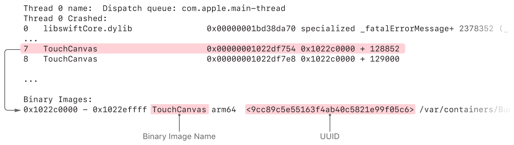
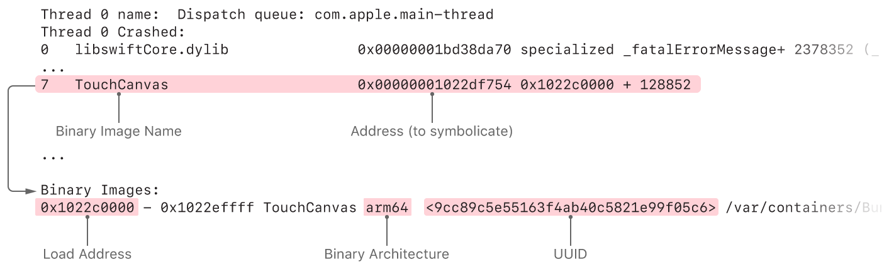

> Navigation: [Technologies](../technologies.md) · [Xcode](../xcode.md) · [Debugging](debugging.md) · [Diagnosing issues using crash reports and device logs](diagnosing-issues-using-crash-reports-and-device-logs.md)

# Adding identifiable symbol names to a crash report

<sub>Article</sub>

Replace hexadecimal addresses in a crash report with function names and line numbers that correspond to your app’s code.

## Overview

When an app crashes, the operating system collects diagnostic information about what the app was doing at the time of crash. One of the most important parts of the crash report are the thread backtraces, reported as hexadecimal addresses. You translate these thread backtraces into readable function names and line numbers in source code, a process called _symbolication_, then use that information to understand why your app crashed. In many cases, the Crashes organizer in Xcode [automatically symbolicate the crash reports](https://help.apple.com/xcode/mac/current/#/dev709125d2e) for you.

### Determine if a crash report is symbolicated

To diagnose an app issue using a crash report, you need a fully symbolicated or partially symbolicated crash report. An unsymbolicated crash report is rarely useful.

A fully symbolicated crash report has function names on every frame of the backtrace, instead of hexadecimal memory addresses. Each frame represents a single function call that’s currently running on a specific thread, and provides a view of the functions from your app and the operating system frameworks that were executing at the time your app crashed. Fully symbolicated crash reports give you the most insight about the crash. Once you have a fully symbolicated crash report, consult [Analyzing a crash report](analyzing-a-crash-report.md) for details about determing the source of the crash.

An example of a fully symbolicated crash report:

```other
Thread 0 name:  Dispatch queue: com.apple.main-thread
Thread 0 Crashed:
0   libswiftCore.dylib                0x00000001bd38da70 specialized _fatalErrorMessage+ 2378352 (_:_:file:line:flags:) + 384
1   libswiftCore.dylib                0x00000001bd38da70 specialized _fatalErrorMessage+ 2378352 (_:_:file:line:flags:) + 384
2   libswiftCore.dylib                0x00000001bd15958c _ArrayBuffer._checkInoutAndNativeTypeCheckedBounds+ 66956 (_:wasNativeTypeChecked:) + 200
3   libswiftCore.dylib                0x00000001bd15c814 Array.subscript.getter + 88
4   TouchCanvas                       0x00000001022cbfa8 Line.updateRectForExistingPoint(_:) (in TouchCanvas) + 656
5   TouchCanvas                       0x00000001022c90b0 Line.updateWithTouch(_:) (in TouchCanvas) + 464
6   TouchCanvas                       0x00000001022e7374 CanvasView.updateEstimatedPropertiesForTouches(_:) (in TouchCanvas) + 708
7   TouchCanvas                       0x00000001022df754 ViewController.touchesEstimatedPropertiesUpdated(_:) (in TouchCanvas) + 304
8   TouchCanvas                       0x00000001022df7e8 @objc ViewController.touchesEstimatedPropertiesUpdated(_:) (in TouchCanvas) + 120
9   UIKitCore                         0x00000001b3da6230 forwardMethod1 + 136
10  UIKitCore                         0x00000001b3da6230 forwardMethod1 + 136
11  UIKitCore                         0x00000001b3e01e24 -[_UIEstimatedTouchRecord dispatchUpdateWithPressure:stillEstimated:] + 340
```

A partially symbolicated crash report has function names for some of the backtrace frames, and hexadecimal addresses for other frames of the backtrace. A partially symbolicated crash report may contain enough information to understand the crash, depending upon the type of crash and which frames in the backtraces are symbolicated. However, you should still [Symbolicate the crash report in Xcode](adding-identifiable-symbol-names-to-a-crash-report.md#Symbolicate-the-crash-report-in-Xcode) to make the report fully symbolicated, which will give you a complete understanding of the crash.

An example of a partially symbolicated crash report:

```other
Thread 0 name:  Dispatch queue: com.apple.main-thread
Thread 0 Crashed:
0   libswiftCore.dylib                0x00000001bd38da70 specialized _fatalErrorMessage+ 2378352 (_:_:file:line:flags:) + 384
1   libswiftCore.dylib                0x00000001bd38da70 specialized _fatalErrorMessage+ 2378352 (_:_:file:line:flags:) + 384
2   libswiftCore.dylib                0x00000001bd15958c _ArrayBuffer._checkInoutAndNativeTypeCheckedBounds+ 66956 (_:wasNativeTypeChecked:) + 200
3   libswiftCore.dylib                0x00000001bd15c814 Array.subscript.getter + 88
4   TouchCanvas                       0x00000001022cbfa8 0x1022c0000 + 49064
5   TouchCanvas                       0x00000001022c90b0 0x1022c0000 + 37040
6   TouchCanvas                       0x00000001022e7374 0x1022c0000 + 160628
7   TouchCanvas                       0x00000001022df754 0x1022c0000 + 128852
8   TouchCanvas                       0x00000001022df7e8 0x1022c0000 + 129000
9   UIKitCore                         0x00000001b3da6230 forwardMethod1 + 136
10  UIKitCore                         0x00000001b3da6230 forwardMethod1 + 136
11  UIKitCore                         0x00000001b3e01e24 -[_UIEstimatedTouchRecord dispatchUpdateWithPressure:stillEstimated:] + 340
```

Unsymbolicated crash reports contain hexadecimal addresses of executable code within the loaded binary images. These reports don’t contain any function names in the backtraces. Because an unsymbolicated crash report is rarely useful, [Symbolicate the crash report in Xcode](adding-identifiable-symbol-names-to-a-crash-report.md#Symbolicate-the-crash-report-in-Xcode).

An example of an unsymbolicated symbolicated crash report:

```other
Thread 0 name:  Dispatch queue: com.apple.main-thread
Thread 0 Crashed:
0   libswiftCore.dylib                0x00000001bd38da70 0x1bd149000 + 2378352
1   libswiftCore.dylib                0x00000001bd38da70 0x1bd149000 + 2378352
2   libswiftCore.dylib                0x00000001bd15958c 0x1bd149000 + 66956
3   libswiftCore.dylib                0x00000001bd15c814 0x1bd149000 + 79892
4   TouchCanvas                       0x00000001022cbfa8 0x1022c0000 + 49064
5   TouchCanvas                       0x00000001022c90b0 0x1022c0000 + 37040
6   TouchCanvas                       0x00000001022e7374 0x1022c0000 + 160628
7   TouchCanvas                       0x00000001022df754 0x1022c0000 + 128852
8   TouchCanvas                       0x00000001022df7e8 0x1022c0000 + 129000
9   UIKitCore                         0x00000001b3da6230 0x1b3348000 + 10871344
10  UIKitCore                         0x00000001b3da6230 0x1b3348000 + 10871344
11  UIKitCore                         0x00000001b3e01e24 0x1b3348000 + 11247140
```

### Symbolicate the crash report in Xcode

Xcode is the preferred way to symbolicate crash reports because it uses all available `dSYM` files on your Mac at once. For specialized debugging situations, such as when you have an unsymbolicated stack trace in the Xcode debugger without a full crash report, you can [Symbolicate the crash report with the command line](adding-identifiable-symbol-names-to-a-crash-report.md#Symbolicate-the-crash-report-with-the-command-line) to symbolicate each frame.

To symbolicate in Xcode, click the Device Logs button in the [Devices and Simulators window](https://help.apple.com/xcode/mac/current/#/dev85c64ec79), then drag and drop the crash report file into the list of device logs.

> [!important] Important
> Crash reports must have the `.crash` file extension. If a crash report doesn’t have a file extension, or has a different file extension like `.txt` , rename it with the `.crash` extension before symbolicating it.

If the crash report does not symbolicate, or only partly symbolicates, Xcode can’t locate matching symbol information, and you’ll need to acquire symbol information in these ways:

- If the operating system’s frameworks aren’t symbolicated, you need device symbol information matching the operating system version recorded in the crash report. To address this, see [Acquire device symbol information](adding-identifiable-symbol-names-to-a-crash-report.md#Acquire-device-symbol-information).
- If the frames for your app, app extension, or frameworks aren’t symbolicated, you need to locate the existing `dSYM` files using Spotlight. To address this, see [Locate a dSYM using Spotlight](adding-identifiable-symbol-names-to-a-crash-report.md#Locate-a-dSYM-using-Spotlight). If your app uses frameworks built by a third-party, you may need to ask the framework vendor for the `dSYM` file.

Once you have a fully symbolicated crash report, consult [Analyzing a crash report](analyzing-a-crash-report.md) to determine the source of the crash.

### Acquire device symbol information

To make symbols from the operating system frameworks identifiable in a crash report, you need to collect the symbols for the system frameworks from a device. For iOS, iPadOS, tvOS, visionOS, and watchOS apps, Xcode automatically copies operating system symbols from each device you connect to your Mac. For macOS and Mac Catalyst apps, symbolicate the crash log by using Xcode on a version of macOS that matches the macOS version named in the crash report.

The symbols for system frameworks are specific to the operating system release and the CPU architecture of the device. For example, the symbols for an iPhone running iOS 13.1.0 aren’t the same as the symbols for the same iPhone running iOS 13.1.2. If your app runs on operating system versions that support multiple CPU architectures, such as `arm64` and `arm64e`, a device with an `arm64` architecture will only contain the symbols for the `arm64` version of the operating system frameworks; it won’t have symbols for the operating system frameworks on `arm64e` devices.

### Locate a dSYM using Spotlight

To determine whether the `dSYM` file you need to symbolicate a hexadecimal addresses for one of your binaries is present on your Mac:

1. Find a frame in the backtrace that isn’t symbolicated. Note the name of the binary image in the second column.
2. Look for a binary image with that name in the list of binary images at the bottom of the crash report. This list contains the build UUID of each binary image that was loaded into the process at the time of the crash. Use the `grep` command line tool to find the entry in the list of binary images:

  ```other
  % grep --after-context=1000 "Binary Images:" <Path to Crash Report> | grep <Binary Name>
  ```

After getting the build UUID from the binary image section:

1. Convert the build UUID of the binary image to a 32-character string, that’s separated into groups of 8-4-4-4-12 (`XXXXXXXX-XXXX-XXXX-XXXX-XXXXXXXXXXXX`). All letters must be uppercase.
2. Search for the build UUID using the `mdfind` command line tool query (including quotation marks):

  ```other
  % mdfind "com_apple_xcode_dsym_uuids == <UUID>"
  ```

If Spotlight finds a `dSYM` file for the build UUID, `mdfind` prints the path to the `dSYM` file.



Using the information in this example, the commands to find the `dSYM` are:

```other
% grep --after-context=1000 "Binary Images:" <Path to Crash Report> | grep TouchCanvas
0x1022c0000 - 0x1022effff TouchCanvas arm64  <9cc89c5e55163f4ab40c5821e99f05c6>

% mdfind "com_apple_xcode_dsym_uuids == 9CC89C5E-5516-3F4A-B40C-5821E99F05C6"
```

Once you find the `dSYM` file, [Match build UUIDs](adding-identifiable-symbol-names-to-a-crash-report.md#Match-build-UUIDs) to confirm that its build UUID matches the binary image’s build UUID. Once you verify that build UUIDs match, either [Symbolicate the crash report in Xcode](adding-identifiable-symbol-names-to-a-crash-report.md#Symbolicate-the-crash-report-in-Xcode) or [Symbolicate the crash report with the command line](adding-identifiable-symbol-names-to-a-crash-report.md#Symbolicate-the-crash-report-with-the-command-line).

If Spotlight doesn’t find a matching `dSYM`, `mdfind` won’t print anything and you’ll need to:

- Verify that you still have the Xcode archive for the version of your app that crashed. If you no longer have this archive, you can’t symbolicate your app’s stack frames for that version of your app. To avoid this in the future, release a new version of your app, and retain the Xcode archive for that version. You’ll then be able to symbolicate crash reports for the new version of your app.
- Ensure the Xcode archive is located somewhere Spotlight can find it, such as your macOS home directory.
- Verify that your build produces debugging information. See [Building your app to include debugging information](building-your-app-to-include-debugging-information.md).

### Match build UUIDs

If you have a binary or a `dSYM` that you think can be used to symbolicate a crash report, verify that the build UUIDs match, using the `dwarfdump` command. If the build UUIDs don’t match each other or don’t match the build UUID listed in the Binary Images section of the crash report, you can’t use the files to symbolicate that crash report.

```other
% dwarfdump --uuid <PathToDSYMFile>/Contents/Resources/DWARF/<BinaryName>
% dwarfdump --uuid <PathToBinary>
```

### Symbolicate the crash report with the command line

For specialized debugging situations, such as symbolicating parts of a backtrace provided by the LLDB command line, you can symbolicate a crash report using the `atos` command. The `atos` command converts hexadecimal addresses to the identifiable function name and line number from your source code, if symbol information is available. To symbolicate using `atos`:

1. Find a frame in the backtrace that you want to symbolicate. Note the name of the binary image in the second column, and the address in the third column.
2. Look for a binary image with that name in the list of binary images at the bottom of the crash report. Note the architecture and load address of the binary image.
3. Locate the `dSYM` file for the binary. If you don’t know where the `dSYM` file is located, see [Locate a dSYM using Spotlight](adding-identifiable-symbol-names-to-a-crash-report.md#Locate-a-dSYM-using-Spotlight) to find the `dSYM` file that matches the build UUID of the binary image.
4. Symbolicate the addresses in the backtrace using `atos` with the formula, substituting the information you gathered in previous steps:

```other
% atos -arch <BinaryArchitecture> -o <PathToDSYMFile>/Contents/Resources/DWARF/<BinaryName>  -l <LoadAddress> <AddressesToSymbolicate>
```

> [!note] Note
> `dSYM` files are macOS bundles that contain a file with the debug symbols. When invoking `atos`, you must provide the path to this file inside the bundle, not just to the outer `dSYM` bundle.

As an example, look at the highlighted sections of this crash report:



Using the information in this example, the complete `atos` command and its output are:

```other
% atos -arch arm64 -o TouchCanvas.app.dSYM/Contents/Resources/DWARF/TouchCanvas -l 0x1022c0000 0x00000001022df754
ViewController.touchesEstimatedPropertiesUpdated(_:) (in TouchCanvas) + 304
```

Once you have at least a partially symbolicated crash report by using `atos`, consult [Analyzing a crash report](analyzing-a-crash-report.md) for information to determine the source of the crash.

## See Also

### Crash reports

- [Identifying the cause of common crashes](identifying-the-cause-of-common-crashes.md) — Find patterns in crash reports that identify common problems, and investigate the issue based on the pattern.
- [Analyzing a crash report](analyzing-a-crash-report.md) — Identify clues in a crash report that help you diagnose problems.
- [Examining the fields in a crash report](examining-the-fields-in-a-crash-report.md) — Understand the structure of a crash report and the information each field contains.
- [Interpreting the JSON format of a crash report](interpreting-the-json-format-of-a-crash-report.md) — Understand the structure and properties of the objects the system includes in the JSON of a crash report.
- [Understanding the exception types in a crash report](understanding-the-exception-types-in-a-crash-report.md) — Learn what the exception type tells you about why your app crashed.
