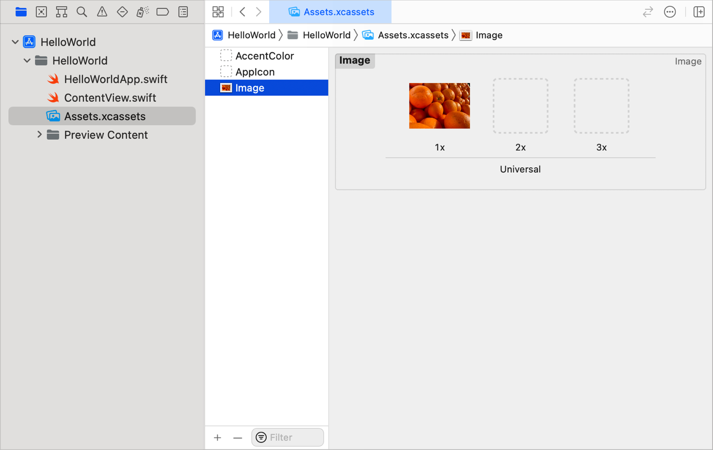
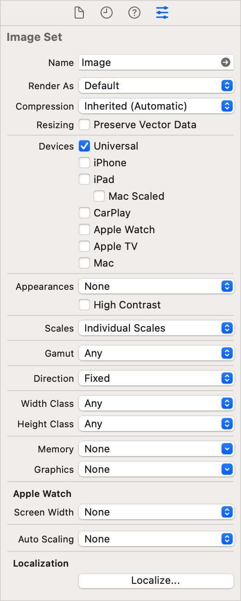

> Navigation: [Technologies](../technologies.md) · [Xcode](../xcode.md) · [Asset management](asset-management.md)

# Adding images to your Xcode project

<sub>Article</sub>

Import images into your project, manage their appearances and variations, and load them at runtime.

## Overview

Xcode projects often contain many images, and need to manage multiple variations of each image to create a great visual experience for all the devices and platforms on which your app runs. For example, your app might display a different version of an image depending on the device screen size, resolution, language, appearance, gamut, and many other factors. If your app uses images, you can use asset catalogs to simplify managing those images through image sets.

### Create a new image set

An _image set_ represents one image that you intend to load at runtime. Each image set contains multiple variations of a single image that you customize to support different device characteristics. If you have multiple images in your app, you need to create an image set for each image.

To create an image set, generate an image asset outside of Xcode, then import it into an asset catalog. The system converts the image format into the most appropriate representation when you build the project.

1. In the Project navigator, select an asset catalog: a file with a `.xcassets` file extension.
2. Drag an image from the Finder to the outline view. A new image set appears in the outline view, and the image asset appears in a well in the detail area.
3. Double-click the image set name in the outline view to rename the image set with a descriptive name, and press the Return key.



<sub>Screenshot of an asset catalog in Xcode. An image set with the name Image contains a single picture of oranges in the 1x well in the detail area.</sub>

### Select supported appearances and variations for images

By default, Xcode creates each image set with wells for @1x, @2x, and @3x resolutions. If the filename of the image you import ends in `@2x` or `@3x`, Xcode automatically places the image into the well with the corresponding resolution. Supply high-resolution images for all images in your app, for all devices your app supports.

In addition to resolution, your image assets might vary based on other device characteristics. Use the Attributes inspector to add, remove, and edit the image variations to include in your image set. You can accomplish this task in an asset catalog or in Interface Builder.

1. In the Project navigator, select the asset catalog.
2. In the outline view, select the image set.
3. In the inspector area, select the Attributes inspector.
4. In the Attributes inspector, add, remove, and edit the device characteristic settings to show additional image wells for the variations you want to customize.



For more information about image size and resolution, see [Image Size and Resolution](https://developer.apple.com/design/human-interface-guidelines/ios/icons-and-images/image-size-and-resolution) in the [Human Interface Guidelines](https://developer.apple.com/design/human-interface-guidelines/ios).

### Drag images to the variant wells

After you select the desired characteristic settings for your image set, provide image variations by dragging additional images into the corresponding wells in the image set.

1. In the Project navigator, select the asset catalog.
2. In the outline view, select the image set.
3. In the Finder, drag other variations of the image to the wells in the detail area that match their resolutions or other characteristics.

### Load the image asset from your code

To use the image from code, initialize an image with the name of the image set. Don’t include the file extension.

```swift
// SwiftUI
let image = Image("ImageName")

// UIKit
let image = UIImage(named: "ImageName")

// AppKit
let image = NSImage(named: "ImageName")
```

## See Also

### Images

- [Creating custom symbol images for your app](../uikit/creating-custom-symbol-images-for-your-app.md) — Create, organize, and annotate symbol images using SF Symbols.
