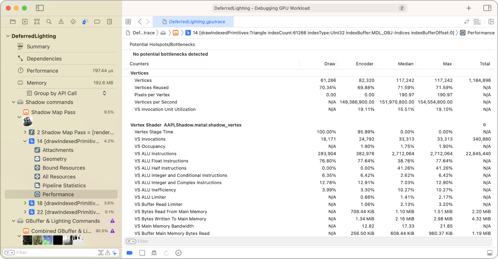
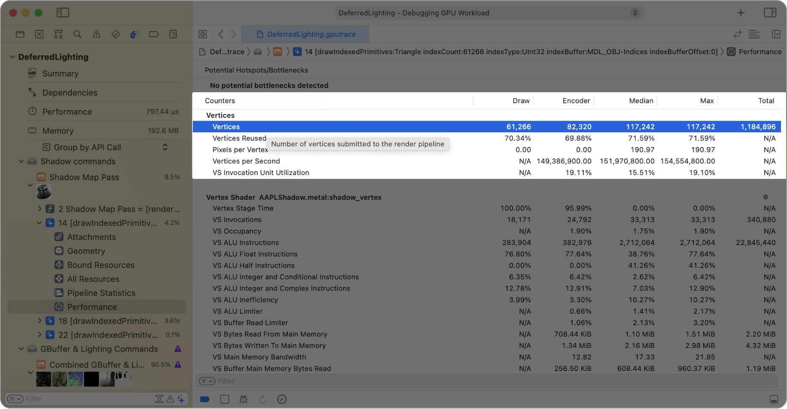

> Navigation: [Technologies](../technologies.md) · [Xcode](../xcode.md) · [Debugging](debugging.md) · [Metal debugger](metal-debugger.md)

# Analyzing draw command and compute dispatch performance with GPU counters

Article

Identify issues within your frame capture by examining performance counters.

## Overview

The Performance Statistics viewer displays counters to help you understand the automatically generated insights for hotspots and bottlenecks so you can improve GPU performance. GPU performance counters are granular statistics that relate to the specific render, compute, or blit work your app performed in the captured frame.

### Show columns for performance counters

Control-click a column header to show and hide counter value columns for median, maximum, and total values. You can view the following columns:

- **Draw** — The statistics for a command. For percentages like Vertex Stage Time, it measures the percentage of samples that the vertex stage uses for that draw.
- **Encoder** — The statistics for a pass. For percentages like Vertex Stage Time, it measures the percentage of samples that the vertex stage uses for all draws in the render pass.
- **Median** — The median counter value across all passes in the GPU trace.
- **Max** — The maximum counter value across all passes in the GPU trace.
- **Total** — The total of counter values for all passes in the GPU trace.

### Check counters data for anomalies

Move the pointer over a counter to reveal its description.

By analyzing values that may be hotspots, counters can suggest a specific cause of your app’s performance problem. For example, if the number of vertices is twice as high as you expect, it’s likely that your code has duplicate meshes or render encoder draw calls.

### Limit your scope with filters

Use the filter field at the bottom of the table to adjust filtering criteria by typing filter terms into it. The table shows individual counters and groups of counters with names that match those filter terms.

When there are two or more filter terms, you can click the filter button to choose whether to match any or all of the terms. For any filter term, you can click it to choose to include or exclude counters that match the term.

## See Also

### Metal command analysis

- [Inspecting the bound resources for a command](inspecting-the-bound-resources-for-a-command.md) — Discover issues by examining the bound resources at any point in an encoder.
- [Inspecting the geometry of a draw command](inspecting-the-geometry-of-a-draw-command.md) — Find problems in your app’s vertex, object, or mesh function by examining the current geometry.
- [Inspecting the attachments of a draw command](inspecting-the-attachments-of-a-draw-command.md) — Discover attachment issues by inspecting individual pixels and samples.
- [Debugging the shaders within a draw command or compute dispatch](debugging-the-shaders-within-a-draw-command-or-compute-dispatch.md) — Identify and fix problematic shaders in your app using the shader debugger.
- [Analyzing draw command and compute dispatch performance with pipeline statistics](analyzing-draw-command-and-compute-dispatch-performance-with-pipeline-statistics.md) — Identify issues within your frame capture by examining pipeline statistics.
