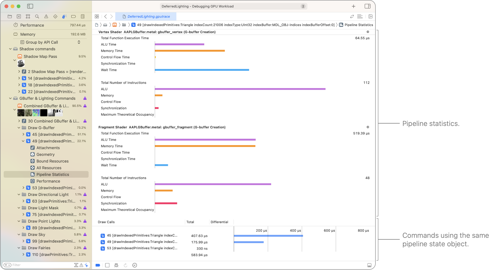
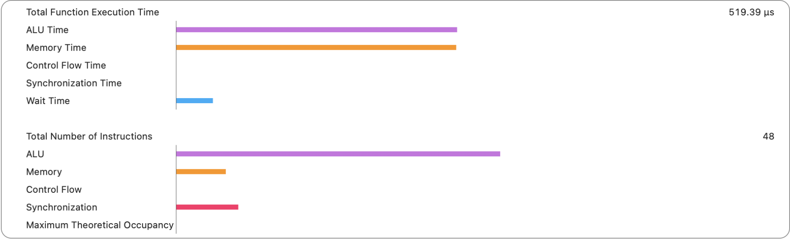
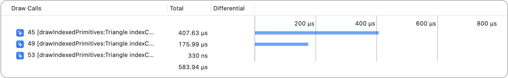

> Navigation: [Technologies](../technologies.md) · [Xcode](../xcode.md) · [Debugging](debugging.md) · [Metal debugger](metal-debugger.md)

# Analyzing draw command and compute dispatch performance with pipeline statistics

Article

Identify issues within your frame capture by examining pipeline statistics.

## Overview

The Pipeline Statistics viewer displays each shader stage in your pipeline state, the amount of time it took to complete, and the GPU activities it performed during that time.

A screenshot of the Pipeline Statistics viewer showing statistics for each shader and timing comparison across commands using the pipeline state.

### Interpret the GPU activities

Various GPU activities appear with bar charts for compiler statistics and runtime profiling statistics.

A screenshot of the statistics for a shader. The top portion shows the timing by operations, and the bottom portion shows the number of instructions by operations.

| GPU activity | Explanation and recommendations |
|---|---|
| ALU | The amount of time that the GPU spends in the arithmetic logic unit. Change floats to half-floats where possible to reduce the time in the ALU. Also, try to minimize your use of complex instructions like `sqrt`, `sin`, `cos`, and `recip`. |
| Memory | The amount of time that the GPU spends waiting for access to your app’s buffers or texture memory. Reduce time by downsampling textures, or, if you’re not spending much time in memory, improve your texture resolution instead. |
| Control flow | The amount of time that the GPU spends in conditional, increment, or jump instructions as a result of branches or loops in your shader. Use a constant iteration count to minimize control flow time for loops because the Metal compiler can generate optimized code in those cases. |
| Synchronization | The amount of time that the GPU spends waiting for a required resource or event before execution can begin. Synchronization types are described below. |
| Synchronization (wait memory) | The amount of time that the GPU spends waiting for dependent memory accesses, such as texture sampling or buffer read/write. |
| Synchronization (wait pixel) | The amount of time that the GPU spends waiting for underlying pixels to release resources. In addition to color attachments, pixels can come from depth or stencil buffers or user-defined resources. Blending is a common cause of pixel waiting. Use raster order groups to reduce the wait time. |
| Synchronization (barrier) | The amount of time that the GPU spends when a thread reaches a barrier and the GPU waits for remaining threads in the same group to arrive at the barrier before proceeding. |
| Synchronization (atomics) | The amount of time that the GPU spends on atomic instructions. |

### Inspect the GPU time of the commands in the pass

The bottom portion of the Pipeline Statistics viewer displays the GPU time in the Total column for each command in the pass so you can compare their respective elapsed times.

## See Also

### Metal command analysis

- [Inspecting the bound resources for a command](inspecting-the-bound-resources-for-a-command.md) — Discover issues by examining the bound resources at any point in an encoder.
- [Inspecting the geometry of a draw command](inspecting-the-geometry-of-a-draw-command.md) — Find problems in your app’s vertex, object, or mesh function by examining the current geometry.
- [Inspecting the attachments of a draw command](inspecting-the-attachments-of-a-draw-command.md) — Discover attachment issues by inspecting individual pixels and samples.
- [Debugging the shaders within a draw command or compute dispatch](debugging-the-shaders-within-a-draw-command-or-compute-dispatch.md) — Identify and fix problematic shaders in your app using the shader debugger.
- [Analyzing draw command and compute dispatch performance with GPU counters](analyzing-draw-command-and-compute-dispatch-performance-with-gpu-counters.md) — Identify issues within your frame capture by examining performance counters.
