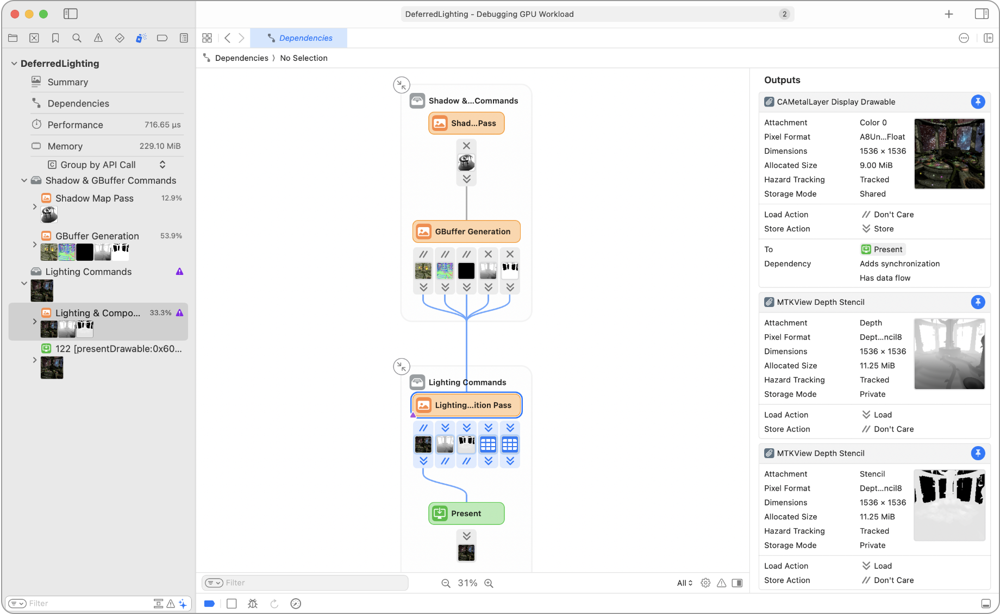
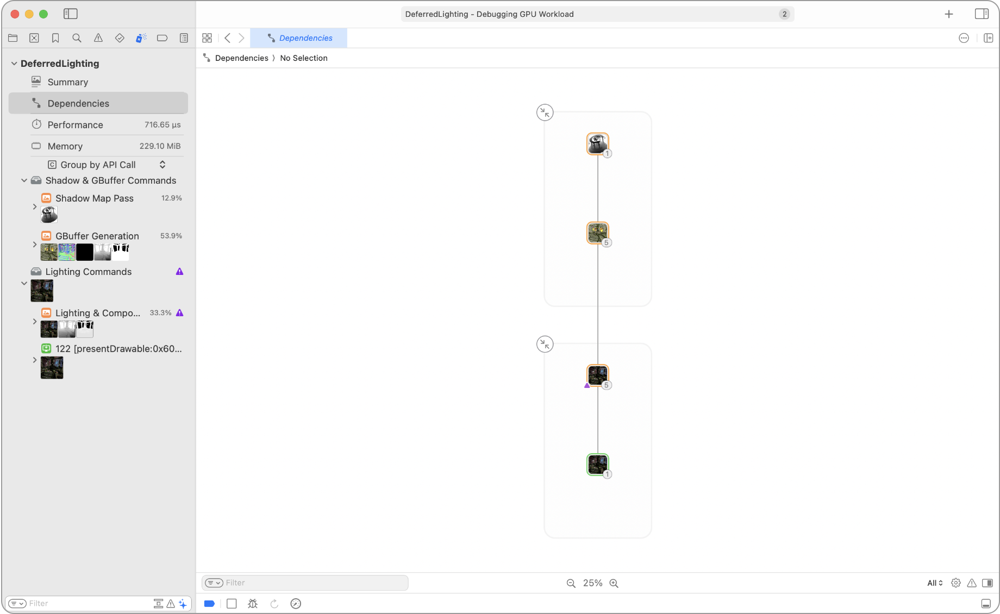
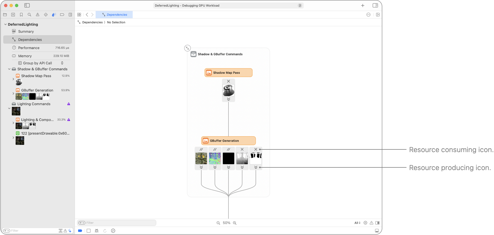
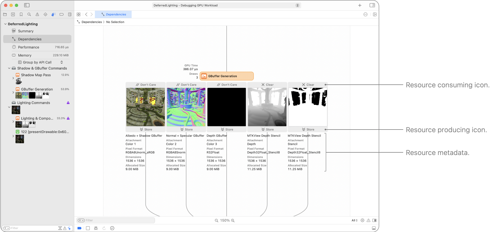
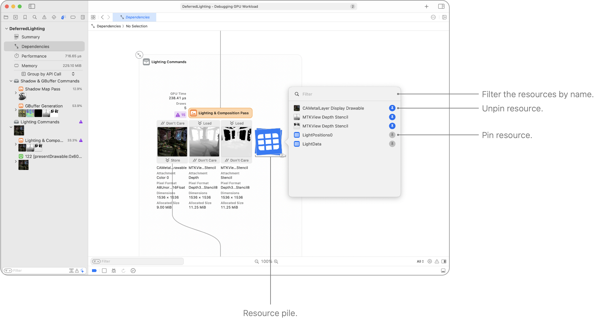
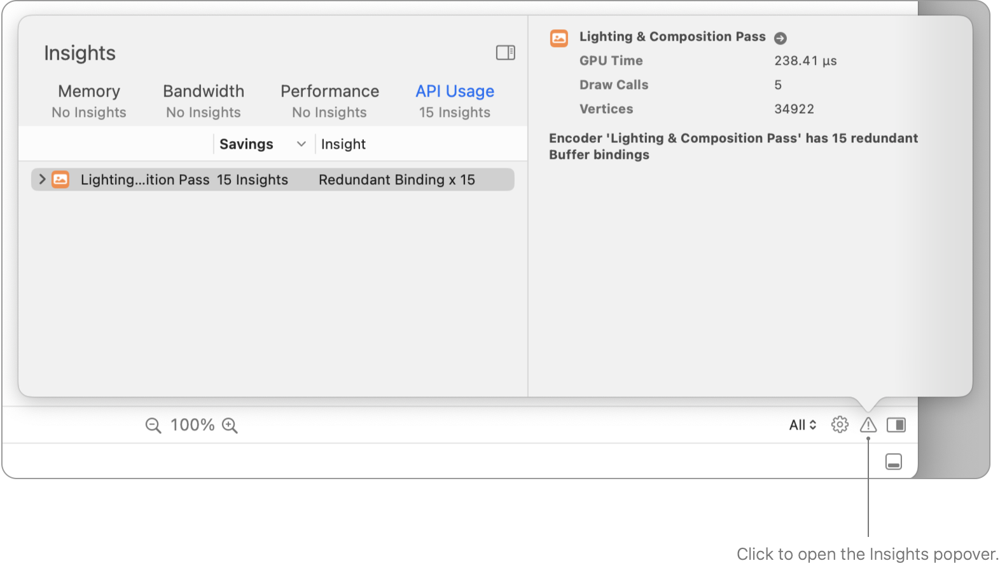

> Navigation: [Technologies](../technologies.md) · [Xcode](../xcode.md) · [Debugging](debugging.md) · [Metal debugger](metal-debugger.md)

# Analyzing resource dependencies

Article

Avoid unnecessary work in your Metal app by understanding the relationships between resources.

## Overview

The Dependencies viewer provides a graphical representation of the structure of your GPU trace and allows you to see the relationships between resources and the encoders that access them. It also highlights the manual synchronizations you use between encoders, and indicates any unnecessary work by showing you all the unused resources in your frame.

### Inspect the graph at different levels of detail

At the highest level, the Dependencies viewer shows the overall structure of your frame. At this level, you can see the graph of command encoders inside command buffers. You can also see all of the passes in your frame. Each pass includes a thumbnail preview of its work, as well as the number of resources that it consumed or produced. At this level, you can see whether data is flowing and whether there’s synchronization between passes.

As you zoom in to the next level, the Dependencies viewer expands the resources for each pass. Additionally, each resource can have icons above and below it that indicate the consuming and producing actions. For attachments in a render pass, the icons refer to the load and store actions. Otherwise, they refer to general resource read-and-write operations. At this level, you can also view which resources are introducing data flow or synchronization between passes.

As you zoom in more, the Dependencies viewer shows larger thumbnails and metadata for the resources.

### View a resource’s consuming and producing actions

The consuming and producing actions above and below a resource help you understand the resource accesses in a given pass at a quick glance.

For textures in a render pass, the actions refer to the load and store actions for each attachment.

For a multisample render pass, the store action may affect the storing for both the multisample and the resolve textures. With [MTLStoreAction.storeAndMultisampleResolve](../metal/mtlstoreaction/storeandmultisampleresolve.md), the multisample texture shows a store action and the resolve texture shows a store action. With [MTLStoreAction.multisampleResolve](../metal/mtlstoreaction/multisampleresolve.md), the multisample texture shows a don’t-care action and the resolve texture shows a store action.

Otherwise, the Dependencies viewer annotates the actions with generic read-and-write operations.

### Analyze the data flow and synchronization dependencies

The Dependencies viewer displays two categories of dependencies between passes:

- Solid lines depict data flow. A previous pass produced data and a later pass consumes it.
- Dashed lines depict synchronization. There’s no data flow, but there’s a relationship between the two passes.

For example, a compute pass reading from a texture that a previous render encoder wrote has data flow between the two passes.

Additionally, a render pass that clears an attachment on load has no data dependency on any pass that previously modified the texture. However, that render pass needs to wait until the previous passes finish modifying the texture — a synchronization.

### Choose a mode for viewing dependencies

You can use the Dependencies viewer to choose different modes for visualization, each with a different subset of edges:

- All: Shows all edges from synchronization primitives, and tracked and untracked resources.
- Synchronzation: Shows dashed synchronization edges from synchronization primitives and tracked resources.
- Data Flow: Shows solid data-flow edges from tracked or untracked resources.

### Pin resources from the resource pile

To maintain a compact graph, the Dependencies viewer attempts to keep a few interesting resources visible on the graph and hide the rest in a pile under each pass. Clicking the pile opens a popover of the resources.

You can click the button to the right of each resource to pin or unpin it.

### Get more information about a pass

Clicking any pass in the Dependencies viewer selects it and displays additional information about the pass in the sidebar. You can also determine which resources the pass consumes or produces:

- For a resource the pass consumes, the Dependencies viewer suggests the pass that most recently modified the resource.
- For a resource the pass produces, the Dependencies viewer suggests the passes that later consume the data in the resource.

### Get more information about a resource

Clicking any resource in the Dependencies viewer selects it and displays additional information about the resource in the sidebar. You can also see the passes that last produced, or will later consume, the data in the resource.

When you select a resource, the Dependencies viewer highlights any related resources. For example, when you select a texture view, it highlights the parent textures. When you select a heap, it highlights the resources from the heap.

### Improve your Metal workload with Insights

Click the Insights button in the bottom right corner to open a popover of recommendations in the Dependencies viewer.

### Limit your scope with filters

Use the filter field at the bottom of the Dependencies viewer to adjust the graph’s filtering criteria. Type filter terms into the field and the Dependencies viewer displays any related passes that match the filter terms. In addition, when filtering by a resource, you can find passes that consume or produce the resource.

### Search for specific elements

Choose Find \> Find to display the search bar above the Dependencies viewer. You can type search terms into the search bar’s text field to find matching passes and resources.

For any search term, you can click it and choose to include or exclude elements that match the term.

The two arrow buttons to the right of the text field let you move to the previous or the next matching element in the Dependencies viewer.

## See Also

### Metal workload analysis

- [Analyzing your Metal workload](analyzing-your-metal-workload.md) — Investigate your app’s workload, dependencies, performance, and memory impact using the Metal debugger.
- [Analyzing memory usage](analyzing-memory-usage.md) — Manage your Metal app’s memory usage by inspecting its resources.
- [Analyzing Apple GPU performance using a visual timeline](analyzing-apple-gpu-performance-using-a-visual-timeline.md) — Locate performance issues using the Performance timeline.
- [Analyzing Apple GPU performance using counter statistics](analyzing-apple-gpu-performance-using-counter-statistics.md) — Optimize performance by examining counters for individual passes and commands.
- [Analyzing Apple GPU performance with performance heat maps](analyzing-apple-gpu-performance-using-performance-heatmaps-a17-m3.md) — Gain insights to SIMD group performance by inspecting source code execution.
- [Analyzing Apple GPU performance using the shader cost graph](analyzing-apple-gpu-performance-using-shader-cost-graph-a17-m3.md) — Discover potential shader performance issues by examining pipeline states.
- [Analyzing non-Apple GPU performance using counter statistics](analyzing-non-apple-gpu-performance-using-counter-statistics.md) — Optimize performance by examining counters for individual passes and commands.
