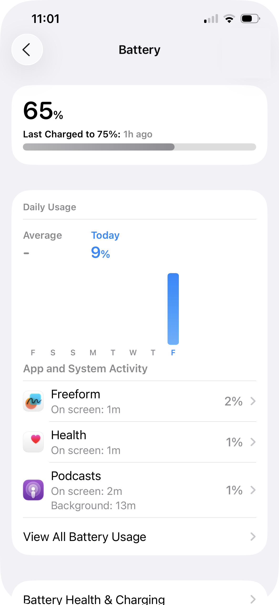
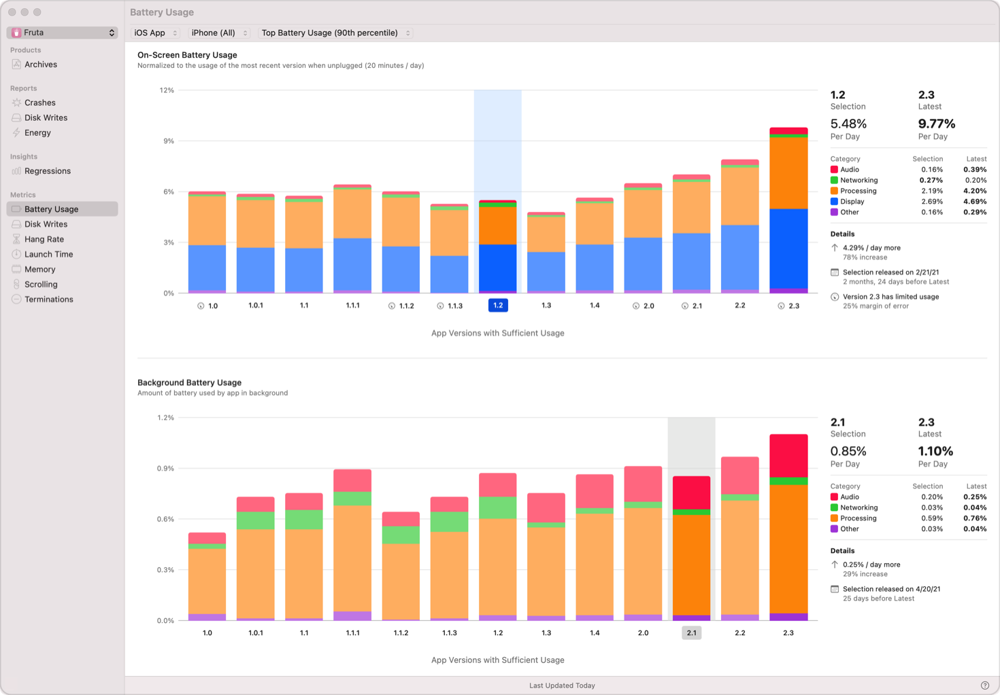
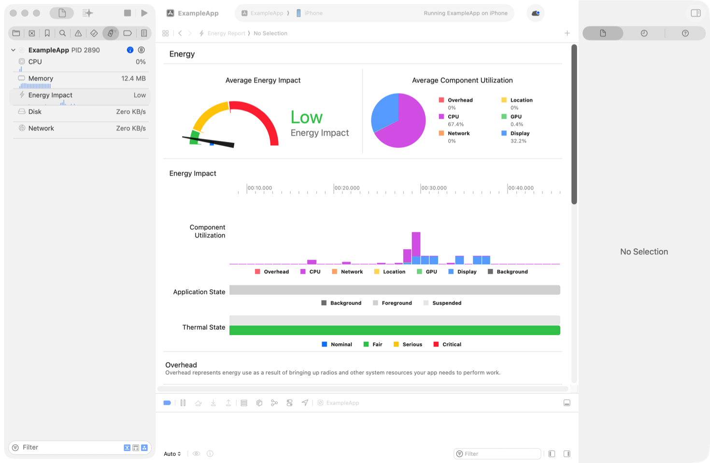

> Navigation: [Technologies](../technologies.md) · [Xcode](../xcode.md) · [Performance and metrics](performance-and-metrics.md)

# Analyzing your app’s battery use

Article

Increase the available use time for your app on a single battery charge by reducing your appʼs power consumption.

## Overview

A person’s device maximizes its battery life by reducing its use of power-consuming subsystems when apps don’t require them. For example, when there aren’t any apps making a network request, the device can switch off its Wi-Fi and cellular components.

When your app uses these features, it reduces the time the device lasts between charges and potentially increases the device’s temperature, which can cause the device to limit its function to avoid overheating. A person can see which apps use significant amounts of battery power by opening the Battery settings on their device. If the person sees that your app uses a lot of power and contributes to a poor overall experience using the device, they might choose to use your app less, or uninstall your app.

Gather information from Xcode, MetricKit, and Instruments to understand your app’s battery use, and identify and prioritize opportunities for improving your app’s performance.

### Review your app’s energy use in Xcode

The Battery Usage pane in the Xcode Organizer shows a breakdown of the appʼs foreground and background power use by app version, giving you a starting place to optimize power consumption. The graph only includes app versions for which Xcode has sufficient information to display metrics.

The top graph shows the onscreen use, and the percentage of battery used, normalized to a 24-hour period while the app is in the foreground and the device isnʼt connected to power.

Screenshot of the Battery Usage metric pane in the Xcode Organizer. From left to right is the list of metrics and reports, the metric UI with a bar graph showing the battery usage over the last 8 app versions, and a detail view of the comparison data and battery usage category breakdown on the right side. 

The bottom graph shows the background battery use during the same period.

Clicking on a bar for a previous version shows a comparison of battery use to the right of the graphs, as shown in the figure above. The percentage values for each version are followed by a category breakdown. The graph shows larger values in bold for easier comparison.

The power-use categories are:

- Audio
- Networking
- Processing: CPU and GPU use
- Display: Screen use
- Bluetooth
- Location
- Camera
- Torch
- NFC
- Other: A combination of the power in the above categories thatʼs too small to show in the list, plus any system power usage outside these categories.

### Review energy exception reports

When your app uses a significant amount of energy over a 24-hour period, the system generates an energy exception report. View aggregated exception reports in the Energy pane of the Xcode Organizer.

Each report in the Report List shows the function that caused the exception and the percentage of total energy use it accounts for. Clicking a report shows a sample stack trace, as well as additional details in the Inspector, including operating system version, device model, the number of logs received, and a 14-day reporting trend.

### Get coding assistant recommendations for energy issues

After selecting an energy report, click Generate Recommendations in the Inspector to get assisted triage in Xcode. After selecting a workspace, Xcode opens your project and pastes the stack trace and energy-use context into the coding assistant to help you identify and fix the root cause of the excessive energy use.

### Measure your running app’s power use in Xcode

In Xcode, set the run destination to a device and choose Product \> Run. For more information, see [Running your app on simulated or physical devices](running-your-app-on-simulated-or-physical-devices.md).

In the Debug navigator, show the debug gauges and click Energy Impact to see your app’s energy usage. The gauge shows the app’s average energy impact, and the pie chart shows how much each power use category contributes to energy use on the device. The timeline reports the instantaneous energy use associated with each category, along with the app’s life-cycle state and the device’s thermal condition.

Screenshot of the Energy Impact view in Xcode. A gauge shows the average overall energy impact of the running app, and other charts report which power-use categories are active, and the state of the device.

### Gather power metrics

Use [MetricKit](../metrickit.md) to receive metrics about how your app uses the battery on people’s devices. Understand your app’s battery use by gathering the following metrics:

| Power-use category | Metric |
|---|---|
| CPU | [CPUTimeMetric](../metrickit/cputimemetric.md), [CPUInstructionsCountMetric](../metrickit/cpuinstructionscountmetric.md) |
| Display | [PixelLuminanceMetric](../metrickit/pixelluminancemetric.md) |
| GPU | [GPUTimeMetric](../metrickit/gputimemetric.md) |
| Location activity | [LocationActivityTimeMetric](../metrickit/locationactivitytimemetric.md) |
| Network activity | [TotalWiFiUploadMetric](../metrickit/totalwifiuploadmetric.md), [TotalWiFiDownloadMetric](../metrickit/totalwifidownloadmetric.md), [TotalCellularUploadMetric](../metrickit/totalcellularuploadmetric.md), [TotalCellularDownloadMetric](../metrickit/totalcellulardownloadmetric.md) |

### Profile your app’s power use in Instruments

Use the Power Profiler tool in Instruments to investigate your app’s battery use. You can use this tool to analyze data you collect during development, and data that someone sends you from a device on which they use your app. For more information, see [Measuring your app’s power use with Power Profiler](measuring-your-app-s-power-use-with-power-profiler.md).

### Measure energy use in performance tests

If you identify that a particular part of your code contributes significantly to your app’s overall energy use through CPU-intensive activity, create a performance test that measures that code’s CPU use. Run the test regularly to detect regressions in your app’s CPU use, which may cause a corresponding increase in energy use.

Use [XCTCPUMetric](../xctest/xctcpumetric.md) in your performance test to measure the CPU use of the code block in the test. For more information, see [Writing and running performance tests](writing-and-running-performance-tests.md).

### Adopt recommended practices for minimizing battery use

Reduce the work your app does, and perform the remaining work in more efficient ways. For more information, see [Reducing your app’s battery use](reducing-your-app-s-battery-use.md).

## See Also

### Power

- [Measuring your app’s power use with Power Profiler](measuring-your-app-s-power-use-with-power-profiler.md) — Profile your app’s power impact whether or not your device is connected to Xcode.
- [Reducing your app’s battery use](reducing-your-app-s-battery-use.md) — Adopt design principles and recommended APIs to consume less power.
