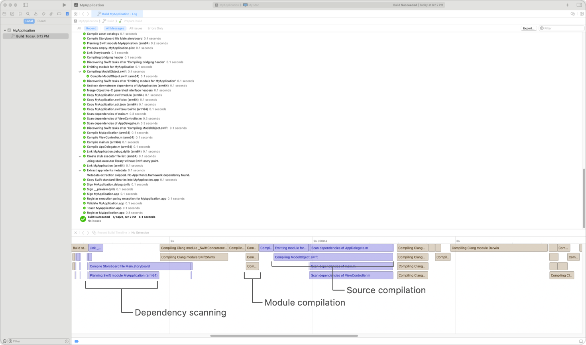

> Navigation: [Technologies](../technologies.md) · [Xcode](../xcode.md) · [Build system](build-system.md)

# Building your project with explicit module dependencies

Article

Reduce compile times by eliminating unnecessary module variants using the Xcode build system.

## Overview

The Xcode build system is responsible for managing the compilation of source files in a project. Often, this source code has dependencies on other modules in the project, SDK, or external dependencies. When building with modules, C or Objective-C source code depends on modules imported with `@import` and modules that cover headers imported using `#import`. Swift code depends on modules imported with `import`. These modules must be built before compilation can proceed. In Xcode 16 and later, the build system coordinates with the compiler to surface this work as a set of explicit tasks in the build log.

Explicit scheduling of module builds allows the Xcode build system to make intelligent scheduling decisions which maximize parallelism and shorten compile times. It also produces clearer, more actionable error messages in the build log when diagnosing a compiler error in a module dependency.

The Xcode build system explicitly builds module dependencies when:

- Compiling C or Objective-C source code with modules enabled. The `Enable Modules (C and Objective-C)` setting in the build settings editor controls the use of modules. This is the default setting for all new projects, but can be changed in the `Apple Clang - Language - Modules` section of the build settings editor.
- Compiling Swift source code using the default C/Objective-C interoperability mode.

For Swift code, explicitly built modules improves the debugging experience.

> [!note] Note
> Explicitly built modules aren’t supported when using the C++ interoperability features in Swift and not enabled by default for targets using Swift 4 or earlier. To enable explicitly built modules, set the [Explicitly Built Modules](build-settings-reference.md#Explicitly-Built-Modules) build setting to `Yes`.

### Understand how module dependencies are built

When explicitly building module dependencies, compilation is divided into three distinct stages:

- **Dependency scanning**: The compiler scans the input source files to determine which modules they depend upon. For C and Objective-C sources, this work is performed by a per-file dependency scanning task. When compiling Swift sources, the compiler scans all module sources during its planning task.
- **Module compilation**: When dependency scanning is complete, the results are communicated to the Xcode build system. The build system invokes the Clang and Swift compilers to build modules in dependency order, with unrelated modules built in parallel.
- **Source compilation**: The primary compilation unit is compiled using the module dependencies that were built.

In addition to appearing as distinct steps in the build log, you can also review the tasks in the build timeline:

A screenshot of an Xcode build log and accompanying timeline showing dependency scanning, module build, and compile tasks.

### Improve compile times by reducing module variants

In more complex projects, the build log may show multiple tasks that correspond to builds of the same module, but with different sets of options. Modules are sensitive to the compiler options used by their dependents, so building different parts of a project with different options may require building multiple variants. Sometimes, building multiple variants of a module is necessary. For example, when building code for multiple architectures, at least one module variant must be built for each. In other cases, inconsistent project configurations may lead to building many variants of a module unnecessarily. For example, two targets with the same dependencies but different values of the `Preprocessor Macros` build setting are unable to share built modules. To reduce build times and the number of variants to build, you’ll instead update the project configuration to compile sources using a uniform set of options.

Xcode provides tools to determine when differences in project settings require additional module variants to be built. If you initiate a build by choosing Product \> Perform Action \> Build With Timing Summary, Xcode generates a report that shows all of the modules that were built along with the differences in options used when building them.

## See Also

### Performance

- [Configuring your project to use mergeable libraries](configuring-your-project-to-use-mergeable-libraries.md) — Use mergeable dynamic libraries to get app launch times similar to static linking in release builds, without losing dynamically linked build times in debug builds.
- [Improving the speed of incremental builds](improving-the-speed-of-incremental-builds.md) — Tell the Xcode build system about your project’s target-related dependencies, and reduce the compiler workload during each build cycle.
- [Improving build efficiency with good coding practices](improving-build-efficiency-with-good-coding-practices.md) — Shorten compile times by reducing the number of symbols your code exports and by giving the compiler the explicit information it needs.
