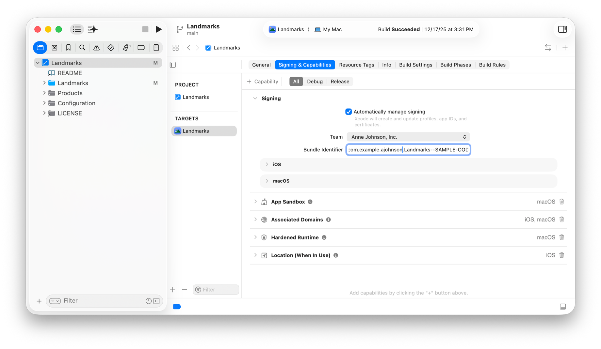

> Navigation: [Technologies](../technologies.md) · [Xcode](../xcode.md) · [Xcode Cloud](xcode-cloud.md)

# Changing the bundle identifier

Article

Modify your app’s bundle identifier and update it anywhere it appears.

## Overview

If you want to change your app’s bundle ID before you upload a build to App Store Connect, you need to change it in multiple locations. It’s particularly important that you update the bundle ID in all the locations below if your app uses certain capabilities that depend on the bundle ID.

The _bundle ID_ is an information property list key that uniquely identifies your app throughout the system. Some capabilities use information property list or entitlement keys in your project that contain the main bundle ID.

If you refer to a bundle ID in your code, replace it with the [bundle()](<../foundation/bundle().md>) macro that returns the bundle for the calling code.

> [!note] Note
> If you use [Xcode Cloud](xcode-cloud.md), commit your project changes to your remote repository before creating a workflow.

## Change the main bundle ID

First, change the bundle ID in your Xcode project:

1. In the Project navigator, select the project.
2. In the project editor on the right, select the target.
3. Click the Signing & Capabilities tab and if necessary, expand Signing.
4. In the Bundle Identifier text field, enter your new bundle ID and press Return.

An Xcode screenshot of the project editor showing the Signing & Capabilities tab selected with the Signing settings revealed and the cursor in the Bundle Identifier text field. 

Xcode changes the underlying [CFBundleIdentifier](../bundleresources/information-property-list/cfbundleidentifier.md) information property list key that appears in the app bundle.

## Update companion target bundle IDs

Change any target bundle IDs that are derived from the main bundle ID, such as, bundle IDs for watchOS, app extension, and app clip targets.

In the project editor, select each target in the sidebar and update its bundle ID in the Bundle Identifier field on the Signing & Capabilities pane on the right.

For watchOS targets, Xcode updates the underlying [WKCompanionAppBundleIdentifier](../bundleresources/information-property-list/wkcompanionappbundleidentifier.md) and [WKAppBundleIdentifier](../bundleresources/information-property-list/wkappbundleidentifier.md) information property list keys.

## Change keys that depend on the main bundle ID

Update any other information property list and entitlement keys that contain the main bundle ID.

For example, if you use App Clips, change the associated [com.apple.developer.associated-appclip-app-identifiers](../bundleresources/entitlements/com.apple.developer.associated-appclip-app-identifiers.md) and [Parent Application Identifiers Entitlement](../bundleresources/entitlements/com.apple.developer.parent-application-identifiers.md) keys. If you have an app extension, be sure to change the [com.apple.developer.app-migration.data-container-access](../bundleresources/entitlements/com.apple.developer.app-migration.data-container-access.md) key too.

## Update the bundle ID in App Store Connect

> [!important] Important
> If you previously uploaded a build to App Store Connect, you can’t change the bundle ID. Create a new app record with the bundle ID instead of updating the existing app record. For more information, see [Add a new app](https://developer.apple.com/help/app-store-connect/create-an-app-record/add-a-new-app).

If you plan to distribute your app through the App Store and you’ve created an app record, but haven’t uploaded a build yet, then you can still change the bundle ID in your app record to match your Xcode project. After you change the bundle ID in your Xcode project, to update the bundle ID in your app record in App Store Connect:

1. Build and run your app on a device to register the new bundle ID and update the provisioning profile.
2. In App Store Connect, select Apps and then select your app.
3. In the Distribution pane, select App Information under General in the sidebar.
4. Choose the new identifier from the Bundle ID pop-up menu under General Information on the right, and click Save.

For more information, see [View and edit app information](https://developer.apple.com/help/app-store-connect/create-an-app-record/view-and-edit-app-information).

Update any other settings in App Store Connect that use the bundle ID, such as in-app purchase settings. Re-request any special entitlements from Apple that require approval. Deleting an existing app record doesn’t make its bundle ID available.

> [!note] Note
> If you use any third-party services that depend on your app’s bundle ID, notify them to update your app’s bundle ID too.

## Update manual provisioning profiles

If you use manual provisioning, update the App ID in those provisioning files to match the bundle ID in your project. For more information, see [Edit, download, or delete provisioning profiles](https://developer.apple.com/help/account/provisioning-profiles/edit-download-or-delete-profiles) in Developer Account Help. After you update your provisioning profile in your developer account, you can download it from Xcode \> Settings \> Accounts, using the Download Manual Profiles button when you select your account.

If you toggle the “Automatically manage signing” checkbox in the Signing & Capabilities pane, Xcode updates your provisioning profiles for you.

## See Also

### Setup and maintenance

- [Making dependencies available to Xcode Cloud](making-dependencies-available-to-xcode-cloud.md) — Review dependencies and make them available to Xcode Cloud before you configure your project to use Xcode Cloud.
- [Configuring Xcode Cloud for your team](configuring-xcode-cloud-for-your-team.md) — Start using continuous integration and delivery with Xcode Cloud as a team.
- [Sharing macOS and Xcode versions across Xcode Cloud workflows](sharing-custom-aliases-across-xcode-cloud-workflows.md) — Use custom aliases to share configurations with multiple workflows.
- [Sharing environment variables across Xcode Cloud workflows](sharing-environment-variables-across-xcode-cloud-workflows.md) — Apply common configurations to multiple workflows by using shared environment variables.
- [Building Swift packages and Swift Playgrounds app projects with Xcode Cloud](building-swift-packages-or-swift-playground-app-projects-with-xcode-cloud.md) — Add your Swift package or Swift Playgrounds app project to an Xcode project to build it in Xcode Cloud.
- [Setting the next build number for Xcode Cloud builds](setting-the-next-build-number-for-xcode-cloud-builds.md) — Start numbering builds from a custom build number for your existing Mac app to avoid version collisions.
- [Including notes for testers with a beta release of your app](including-notes-for-testers-with-a-beta-release-of-your-app.md) — Add text files to your Xcode project to provide notes to beta testers about what to test.
- [Removing your project from Xcode Cloud](removing-your-project-from-xcode-cloud.md) — Remove your project from Xcode Cloud to delete app and workflow data, disconnect your Git repository, and remove the Slack integration.
