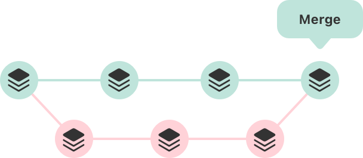
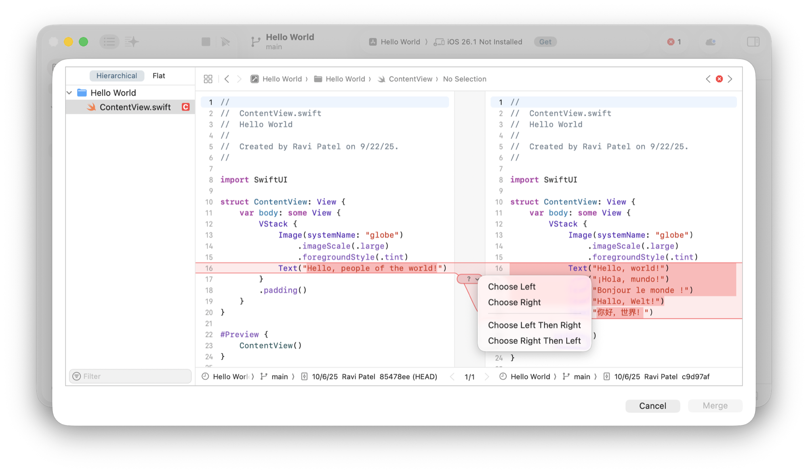

> Navigation: [Technologies](../technologies.md) · [Xcode](../xcode.md) · [Source control management](source-control-management.md)

# Combining code changes in a source control repository

Article

Integrate code changes from multiple sources and resolve conflicts between different versions of code using source control tools in Xcode.

## Overview

If you use source control to work on code with collaborators or to manage multiple versions of your Xcode project for different releases, eventually, you need to sync code changes between versions. Git source control provides a mechanism for combining sets of code changes by merging those changes together, and Xcode provides a visual interface for performing a _merge_.

Conceptual diagram that shows two rows of commits, each row representing a branch. The rightmost commit in the bottom row merges into the top row to illustrate two commits merging together.

### Merge code changes

After you complete work in a feature or bug fix branch, you merge your changes into your main development or production branch. Alternatively, you merge other updates from your main development or production branch into your feature or bug fix branch to resolve conflicts or to sync your work with the latest updates and ensure everything functions appropriately before merging back into your main development or production branch.

1. Open the Source Control navigator and select Repositories.
2. In the Repositories navigator, expand your repository and the Branches or Remotes folder.
3. To make the branch you want to merge into the current branch, Control-click it and choose Switch.
4. Control-click the branch you want to merge from and choose “Merge [_from branch_] into [_to branch_]”.

If there are no conflicts, Xcode completes the merge.

### Resolve conflicts with other code

In a source control repository, a _conflict_ occurs when two commits have incompatible changes and Git can’t merge the changes automatically. For example, a conflict might occur when two developers change the same lines in the same source file.

If there are conflicts when you attempt to merge changes in Xcode, Xcode presents a comparison view for you to review and resolve the conflicts.

The Xcode merge conflict view showing a list of files to merge and highlighting the file with a conflict. The view shows the conflict and the button you use to select a resolution for it. The view also highlights the options to navigate between conflicts in a file.

To resolve a conflict, click the question mark (?) for that conflict (that appears in the gutter between the left and right versions of the file) and select which option you want to use to resolve it:

- Choose Left
- Choose Right
- Choose Left Then Right
- Choose Right Then Left

After you choose a resolution for each conflict, Xcode enables the Merge button. Click the Merge button to complete the merge, or click Cancel to abort the merge and restore your branch so you can make more changes before merging.

## See Also

### Git

- [Organizing your code changes with source control](organizing-your-code-changes-with-source-control.md) — Use Git branches and tags to streamline your collaboration and manage features and releases.
- [Configuring source control in Xcode](configuring-source-control-in-xcode.md) — Customize the default Xcode Settings for connecting to Git repositories, applying code changes, and more options for configuring source control.
