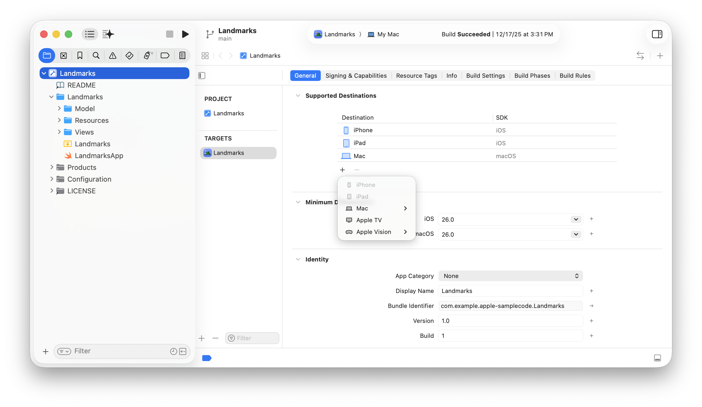
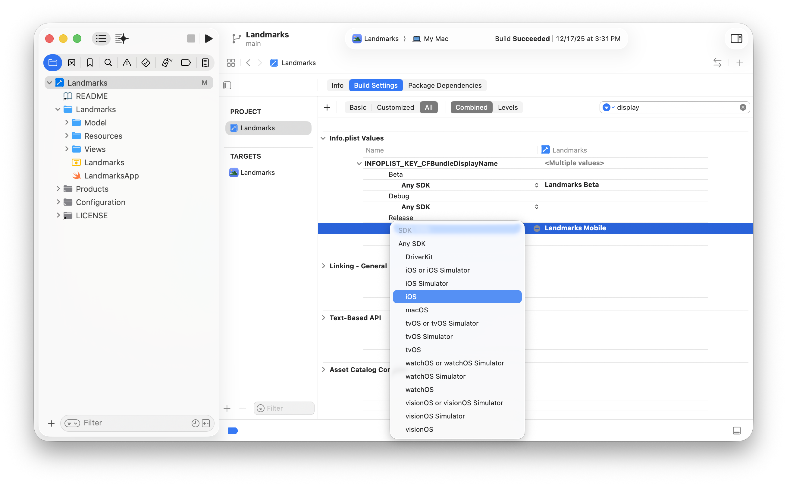
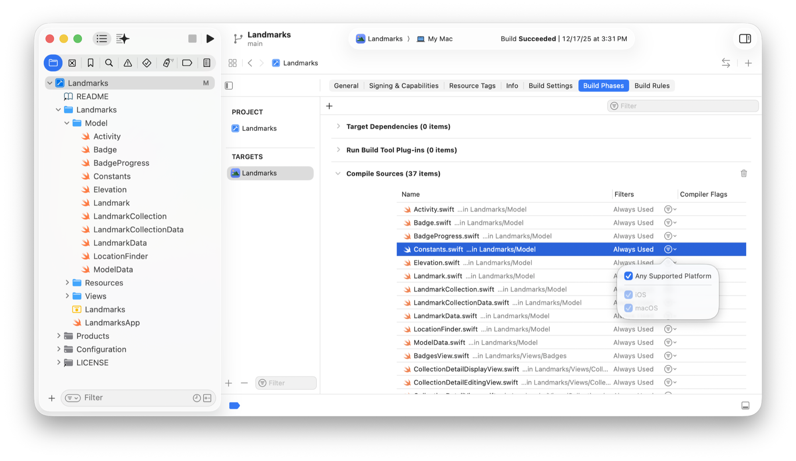

> Navigation: [Technologies](../technologies.md) · [Xcode](../xcode.md) · [Build system](build-system.md)

# Configuring a multiplatform app

<sub>Article</sub>

Share project settings and code across platforms in a single app target.

## Overview

Multiplatform apps broaden the experience of your app to each additional platform you support. You can share your app’s project settings and code across platforms using a single, multiplatform target.

In Xcode, an _app target_ specifies project settings information like your app’s bundle identifier and display name, as well as which source code files belong to your app. By default, apps that share a multiplatform target share project settings, so you only need to set them once. You can adjust your project settings as needed for individual platforms.

To create a new project with a multiplatform target, choose Multiplatform as the platform when you create the project from a template. For more information, see [Creating an Xcode project for an app](creating-an-xcode-project-for-an-app.md).

As you developer your multiplatform app, or combine existing targets into a multiplatform target, check your app to determine the differences in build configuration, framework availability, and API availability.

> [!note] Note
> iOS, iPadOS, macOS, tvOS, and visionOS apps can share a single target. watchOS apps remain in a separate target.

### Evaluate the project settings and code your apps share

If you want to bring an existing app to a new platform, consider the technologies you use on the platform you already support and the additional platforms you plan to build for. If the technologies and project settings that you plan to use overlap considerably, multiplatform app targets are a good fit. Otherwise, use a separate target for each platform. For example, if your existing app uses SwiftUI and you plan to use SwiftUI for the new platform, use one multiplatform target. However, if your existing app uses UIKit and you want to use AppKit for the Mac, use separate targets.

If your app already supports multiple platforms and shares substantial amounts of code and configuration between multiple targets, consider combining them into a single target. In particular, if you’re developing your app in SwiftUI, your app targets likely already share a lot of the same code and configuration. You can use a single `App` structure to define the SwiftUI app life cycle for each platform.

If your app supports multiple platforms and the platform-specific targets don’t share much code or configuration, you can continue using separate targets.

### Configure the supported destinations for a target

To add a destination to a target, click the Add button (+) under Supported Destinations, and then select the destination from the pop-up menu. Depending on the platforms your app already supports, the Add button brings up a different set of destinations that are available to add to the current target. To remove a destination from a target, select the destination, then click the Remove button (-).



<sub>A screenshot of Xcode showing the target editor area. Under General Settings, a list of Supported Destinations shows iPhone and iPad, followed by a plus button.</sub>

If you’re adding a Mac or Apple Vision destination to a target, choose the destination type that matches the kind of experience you want to provide from the Mac or Apple Vision menu:

- ****Mac**** — Choose this option if you’re creating a new Mac app. You can use all the features and APIs from the macOS SDK, powered by AppKit and SwiftUI. This option is the default for multiplatform apps.
- ****Mac Catalyst**** — Choose this option if you’re bringing an existing iPad app to Mac. The system adjusts the appearance of standard UIKit interface elements in your app for Mac. You might need to make changes to your app’s layout to adopt Mac Catalyst.
- ****Apple Vision**** — Choose this option if you’re creating a new app or modifying an existing app for Apple Vision Pro. You can use all the features and APIs from the visionOS SDK, powered by RealityKit and SwiftUI. This option is the default for multiplatform apps.
- ****Designed for iPad**** — Choose this option to run an unmodified version of your iPad app on a Mac with Apple silicon or Apple Vision Pro. Standard UIKit interface elements retain their appearance when your app runs on Apple silicon or Apple Vision Pro. This option is the default Mac or Apple Vision destination type for iPad apps.

### Customize project settings

When you add multiple platforms, you can customize your project settings and build configurations for one or more platforms that you support. You can conditionalize build settings either by platform or build configuration.

For example, append “Mobile” to the display name of the iOS build. In the project editor, choose the project and click the Build Settings tab. In the upper-right corner of the build settings editor, enter `display` in the filter field to quickly find the [CFBundleDisplayName](../bundleresources/information-property-list/cfbundledisplayname.md) key. Under the key and next to the build configuration you want to vary, such as the default Debug or Release configuration, click the Add button (+). Then choose the iOS platform from the Any SDK pop-up menu and enter the alternate display name on the right.



Similarly, vary other keys for your build configurations, such as appending “Beta” to the display name of a beta build.

For more information on changing build settings for targets and platforms, see [Configuring the build settings of a target](configuring-the-build-settings-of-a-target.md). To add a build configuration, see [Adding a build configuration file to your project](adding-a-build-configuration-file-to-your-project.md).

### Resolve build issues by adding conditional statements

Adding another platform can also reveal build-time issues in your app. To resolve those issues, insert conditional statements around any code that uses platform-specific APIs or frameworks. For example, an app that includes an AR experience in iOS and iPadOS likely contains code that uses ARKit. ARKit isn’t available in macOS or tvOS, so you need to separate out code that uses platform-specific APIs or frameworks.

Xcode identifies this sort of build-time issue when you build your project. To try a build on a new platform, pick the new run destination in the scheme menu that corresponds with the platform you added. If Xcode identifies any issues, navigate to them one-by-one and use the following steps to resolve them.

**Address unavailable frameworks.** If a framework isn’t available for a platform, surround the import with a `canImport` conditional statement:

```swift
#if canImport(ARKit)
import ARKit
#endif
```

**Address unavailable APIs.** Frameworks that are available across multiple platforms might have individual symbols likes types, methods, or enumeration cases that are restricted to a subset of platforms. To resolve these availability issues, surround the relevant code with an `#if os` platform compilation condition statement:

```swift
Toggle(isOn: $isOn) {
    Text("Show Holidays calendar")
}
#if os(macOS)
.toggleStyle(.checkbox)
#endif
```

If an entire file is platform specific, you can remove it entirely from the platforms where it’s not applicable. In the project editor, choose the target and click the Build Phases tab. Under Compile Sources in the source file row, deselect Any Supported Platform and from the Filters column pop-up menu, select the platforms.



<sub>A screenshot of Xcode that shows the platform selection popover for a source file. The current selection includes both platforms and there are checkboxes to include or exclude iOS or macOS.</sub>

### Customize the experience of your app for each platform

Ensure that your app’s user interface and experience fit the needs of each platform by adding platform-specific views and features. For example, some Mac apps include a menu bar extra that appears even when the app isn’t the frontmost app. The following adds a `MenuBarExtra` instance only in the macOS version of a scene:

```swift
var body: some Scene {
    WindowGroup {
        PrimaryView()
    }
    #if os(macOS)
    MenuBarExtra("Inspect", systemImage: "eyedropper") {
        VStack {
            Button("Action One") {
                // ...
            }
            Button("Action Two") {
                // ...
            }
        }
    }
    #endif
}
```

For design guidance, see [Human Interface Guidelines](https://developer.apple.com/design/human-interface-guidelines/).

## See Also

### Essentials

- [Configuring a new target in your project](configuring-a-new-target-in-your-project.md) — Configure your project to build a new product, and add the code and resources the product requires.
