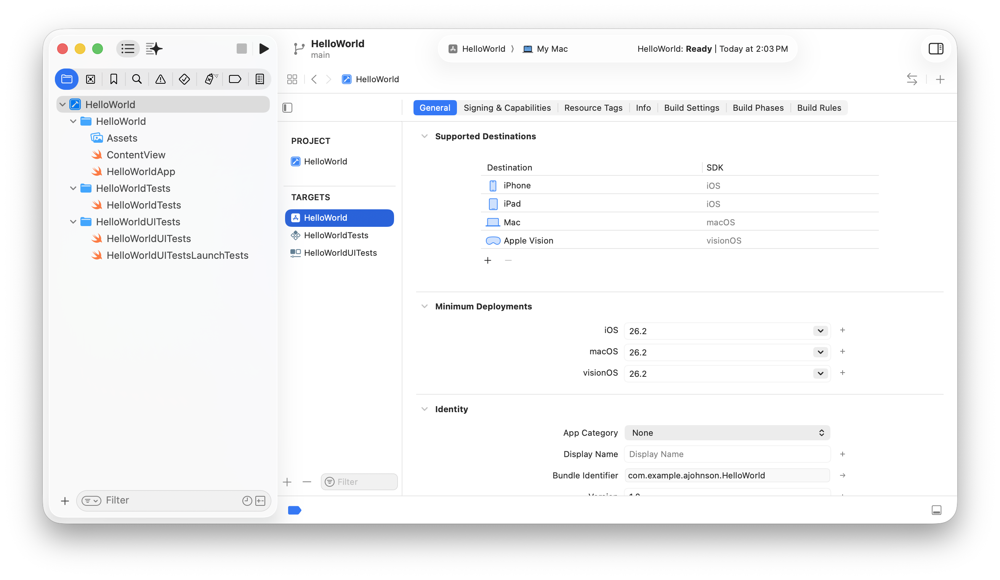
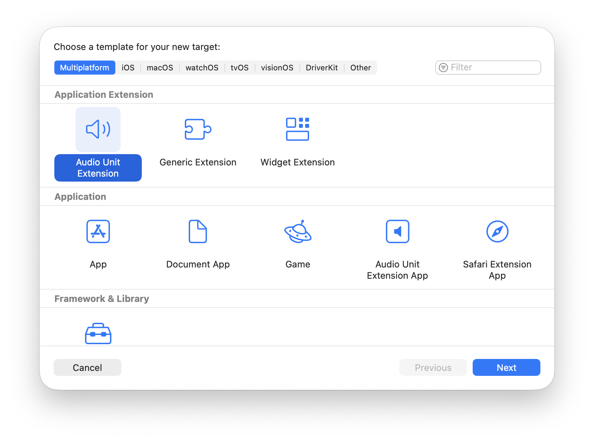
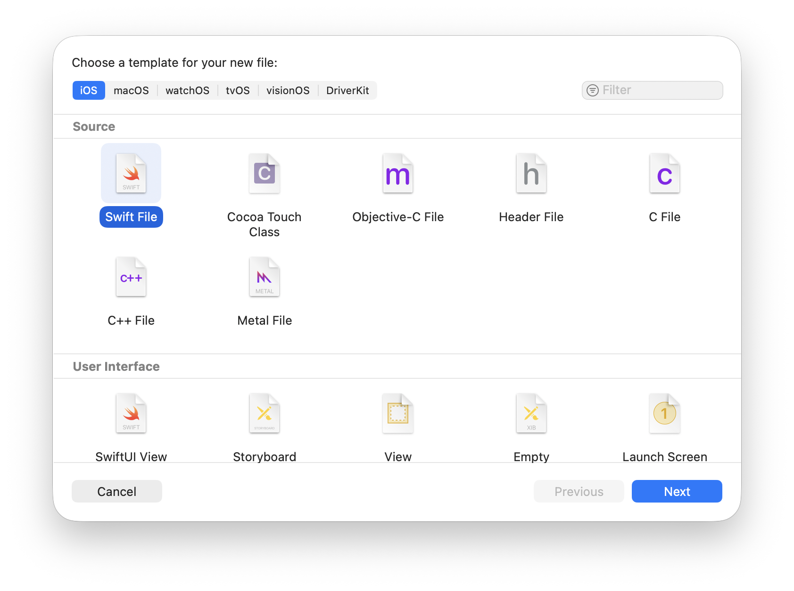
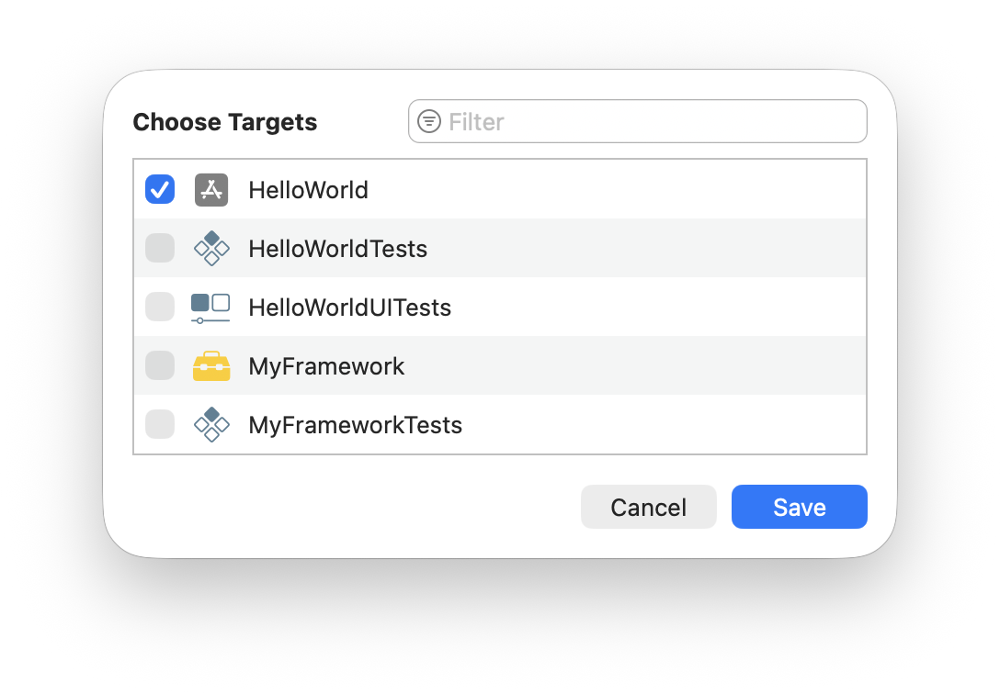
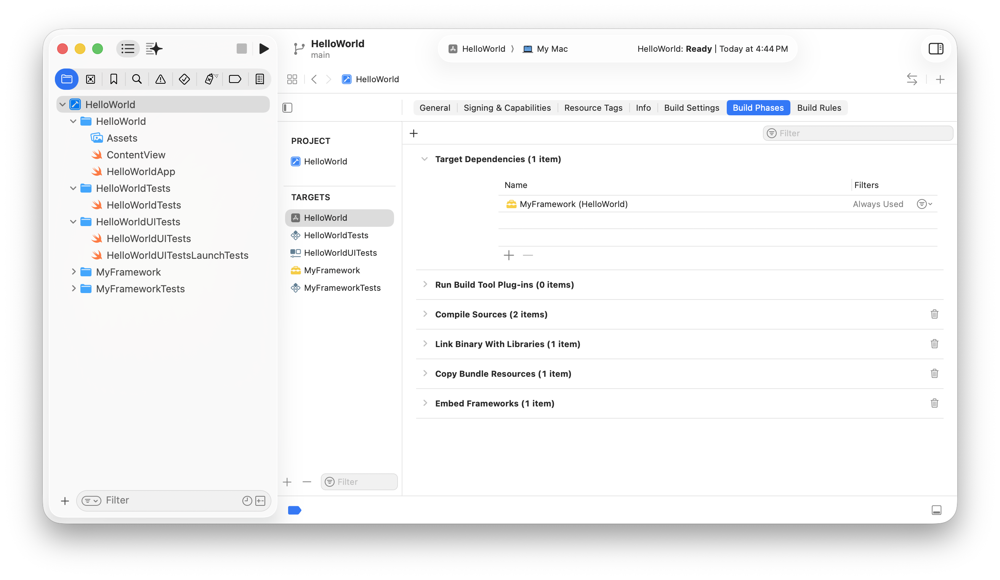

> Navigation: [Technologies](../technologies.md) · [Xcode](../xcode.md) · [Build system](build-system.md)

# Configuring a new target in your project

Article

Configure your project to build a new product, and add the code and resources the product requires.

## Overview

A target specifies a product to build, such as an app, framework, app extension, or unit test. A project can contain multiple targets that represent related parts of a single product. For example, a project might contain separate targets for an app, a private framework, an app extension, and a suite of tests.

When you create a new project from a template, Xcode adds one or more targets to the project automatically. To view the targets in a project, select the project in the Project navigator, and the list of targets appears in the sidebar of the project editor on the right. For example, the multiplatform app template with tests contains separate targets for the app and the tests.

A screenshot of the Xcode project window with the project selected in the Project navigator, the app target selected in the sidebar of the project editor, and the General pane on the right.

The editor area displays the current project and target information. To view general information about a target, click the General tab in the toolbar of the project editor. To view signing assets and capabilities you add to a target, click the Signing & Capabilities tab.

To view settings of the project, select the project in the sidebar above the list of targets. Changes you make to a target affect that target only, whereas changes you make to the project affect all targets.

### Add a new target to your project

Add new targets to create separate products in your project, augment an existing app using app extensions, or factor code into a private framework. You can also add new apps, system extensions, test suites, and other types of targets to your project.

To add a new target:

1. Choose File \> New \> Target.
2. Select the platform for the new target.
3. Choose a template below.
4. Click Next.
5. In the dialog, enter a name for the target and choose other settings, such as the programming language.
6. Click Finish.

You can embed some types of targets directly into the bundle of an existing app. This option simplifies the setup process for frameworks, app extensions, and other products that you plan to ship inside your app. When you embed a target, Xcode configures the necessary project settings to build the target and copy it into your app. Xcode also creates the necessary dependencies to ensure that the targets build in the proper order.

### Add source files and other content to a target

Use file templates to help you get started quickly developing your app.

To create new files and embed them directly into an existing target, choose File \> New \> File from Template. Then choose a platform, choose a template, and click Next in the dialog that appears. Alternatively, choose File \> New \> Empty File.

To assign an existing file to a new target, select the file in the Project navigator and change the target membership attributes in the File inspector. Under Target Membership, click the Add button (+). In the Choose Targets dialog, select the targets you want to add the file to and click Save.

For more information about how to add files to a project, see [Managing files and folders in your Xcode project](managing-files-and-folders-in-your-xcode-project.md).

### Configure a dependency between two targets

Dependencies tell Xcode the correct order in which to build a set of targets. Xcode builds targets in parallel when it can, but sometimes it must build targets serially.

For example, Xcode must build a custom framework before it builds an app that links against that framework. When you embed a new target inside an app, Xcode creates a dependency between the app and target if you select the Find Implicit Dependencies scheme option. If you don’t select that option, you must configure the dependency yourself.

To view and add dependencies, select a target in the sidebar and click the Build Phases tab in the toolbar of the project editor. The targets that Xcode must successfully build before it builds the current target appear under Target Dependencies. Xcode can build multiple dependent targets simultaneously if there are no interdependencies between those targets.

A screenshot of the Xcode project editor with a target selected in the sidebar and the Build Phases tab selected with the Target Dependencies settings revealed.

When there’s a relationship between targets that Xcode can’t easily detect, add dependencies manually. While Xcode can add dependencies automatically when you select the Find Implicit Dependencies build scheme option, it can’t detect all dependencies. For example, Xcode can’t detect when a target relies on data files built by a custom script in another target. If you don’t specify a required dependency, Xcode might report errors or build the targets incorrectly.

> [!note] Note
> If your target depends on content in a different Xcode project, add a reference to the project before configuring any dependencies. For more information, see [Managing multiple projects and their dependencies](managing-multiple-projects-and-their-dependencies.md).

For more information on optimizing your targets to improve build times, see [Improving the speed of incremental builds](improving-the-speed-of-incremental-builds.md).

## See Also

### Essentials

- [Configuring a multiplatform app](configuring-a-multiplatform-app-target.md) — Share project settings and code across platforms in a single app target.
