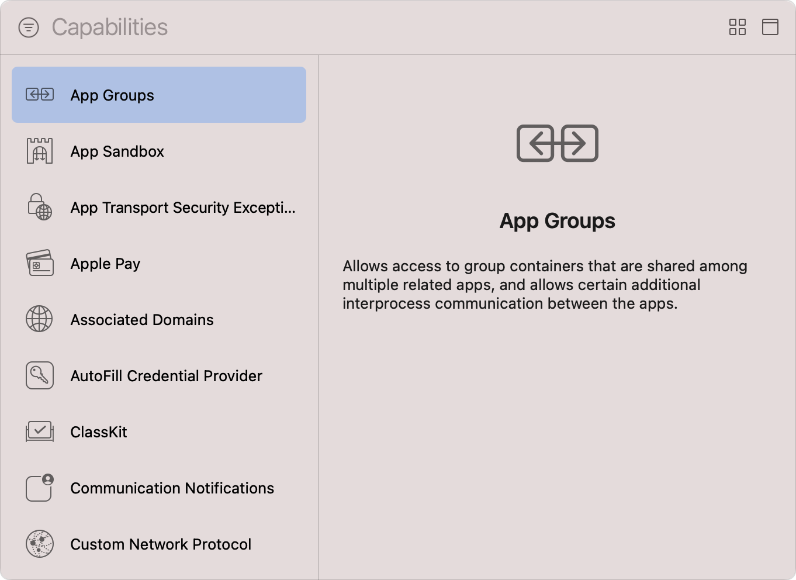
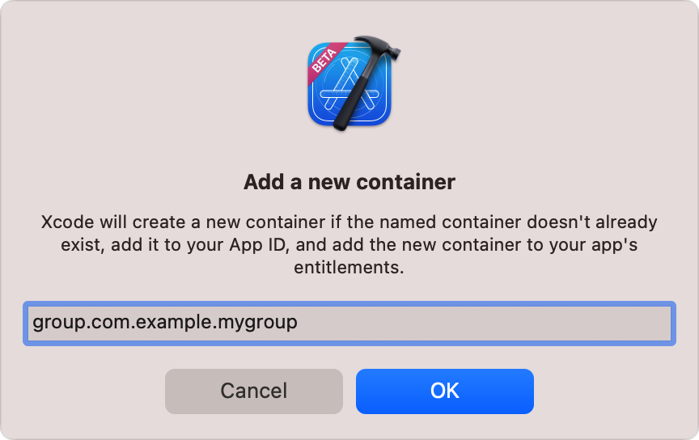
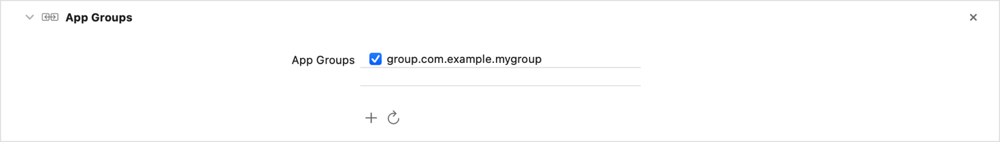

> Navigation: [Technologies](../technologies.md) · [Xcode](../xcode.md) · [Capabilities](capabilities.md)

# Configuring app groups

Article

Enable communication and data sharing between multiple installed apps created by the same developer.

## Overview

An _app group_ allows multiple apps developed by the same team to access one or more shared containers. It also enables additional interprocess communication (IPC) between those apps using Mach IPC, POSIX semaphores and shared memory, and UNIX domain sockets, among other IPC mechanisms. In macOS, app groups can facilitate communication between sandboxed apps, and between sandboxed and nonsandboxed apps. Apps can belong to one or more app groups. You can also use an app group to share data between an app extension or App Clip and its host app.

Before creating an app group, follow the steps in [Add a capability](adding-capabilities-to-your-app.md#Add-a-capability) to add the [App Groups Entitlement](../bundleresources/entitlements/com.apple.security.application-groups.md) to your app’s target.

A screenshot of Xcode’s Capabilities library with a list of available capabilities on the left and an information pane on the right. The list shows a range of capabilities from App Groups to Custom Network Protocol, and the App Groups capability is in a selected state. The text on the information pane explains that App Groups allow access to group containers that are shared among multiple related apps, and allow certain additional interprocess communication between the apps.

### Create app groups

After adding the app groups capability to your app, Xcode retrieves any existing groups from your developer account and displays them in the capability’s section. Use the Refresh button below the app groups list to re-fetch your account’s groups at any time. Each developer account can register a maximum of 1,000 app groups.

To register an app group, see [Register an app group](https://developer.apple.com/help/account/manage-identifiers/register-an-app-group). You need to register app groups for iOS, iPadOS, tvOS, visionOS, and watchOS apps.

Enable one or more groups in the list by selecting their checkboxes to add your app as a member of those groups. Conversely, uncheck a group’s checkbox to revoke your app’s membership.

To create an app group for your app, perform the following:

1. Click the Add button (+) below the App Groups list.
2. Enter a container ID in the dialog that appears. A container ID must begin with `group.` and then a custom string.
3. Click OK to save the new app group.

A screenshot of the Add a new container dialog that Xcode displays after you click the Add button, which states Xcode will create a new container if the named container doesn’t already exist, add it to your App ID, and add the new container to your app’s entitlements. The text box contains the value group.com.example.mygroup.

Xcode automatically selects the new app group in the App Groups list; this selection indicates that your app is now a member of that app group.

A screenshot of the App Groups capability after you add it to a target. The groups list contains a single app group with the name group.com.example.mygroup.

> [!note] Note
> You can also create macOS app groups using the naming convention `<Developer team ID>.<group name>`. By using this naming scheme, macOS checks that the code signature of processes that try to access the app group container contains the same `Developer-Team-ID` as app group container ID.

### Access an app group’s shared container

When your app becomes a member of an app group, there are a number of APIs you can use to read and write data to that group’s shared container, such as:

- Sharing preferences and other limited data by using the [init(suiteName:)](<../foundation/userdefaults/init(suitename_).md>) method to access the app group’s shared user defaults database.
- Retrieving the physical location of the app group’s shared container by calling the [containerURL(forSecurityApplicationGroupIdentifier:)](<../foundation/filemanager/containerurl(forsecurityapplicationgroupidentifier_).md>) method, which you can later use to read and write data.
- Set the [sharedContainerIdentifier](../foundation/urlsessionconfiguration/sharedcontaineridentifier.md) property on the configuration of a background URL session to download files directly into the app group’s shared container.

You can also use an app group, which has an identifier that starts with the `group.` prefix, as a Keychain Access Group. For more information, see [Sharing access to keychain items among a collection of apps](../security/sharing-access-to-keychain-items-among-a-collection-of-apps.md).

## See Also

### Data management

- [Configuring an associated domain](configuring-an-associated-domain.md) — Create a two-way association between your app and your website to enable universal links, Handoff, App Clips, and shared web credentials.
- [Configuring iCloud services](configuring-icloud-services.md) — Share user or app data among multiple instances of your app running on different devices.
