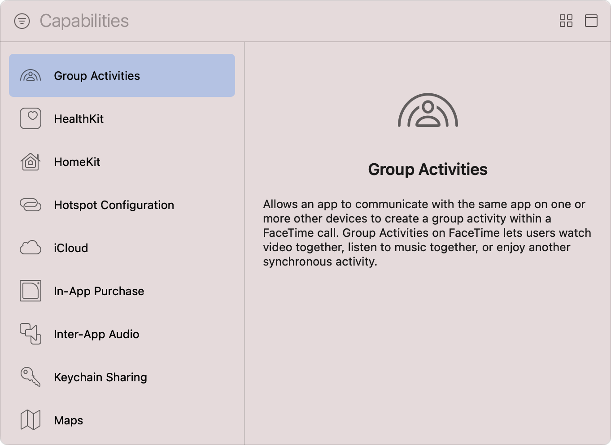

> Navigation: [Technologies](../technologies.md) · [Xcode](../xcode.md) · [Capabilities](capabilities.md)

# Configuring Group Activities

Article

Leverage FaceTime infrastructure to create coordinated experiences users can share.

## Overview

Use [Group Activities](../groupactivities.md) to bring your app’s users together to enjoy new and exciting shared experiences that are built atop [SharePlay](https://developer.apple.com/shareplay) and the FaceTime infrastructure. For example, a karaoke app might offer karaoke parties where several participants take part simultaneously from their own devices.

Represent shareable activities by creating objects that conform to the [GroupActivity](../groupactivities/groupactivity.md) protocol and, after a shared activity begins, use [GroupSession](../groupactivities/groupsession.md) to synchronize that activity across participants’ devices.

### Add the Group Activities capability to your target

Follow the steps in [Add a capability](adding-capabilities-to-your-app.md#Add-a-capability) to add the capability to your app’s target, making sure you select the Group Activities capability from Xcode’s Capabilities library. This capability is available on all platforms except watchOS, and you must add it to an app target — Group Activities aren’t available in widgets, extensions, or App Clips.

A screenshot of Xcode’s Capabilities library with a list of available capabilities on the left and an information pane on the right. The list shows a range of capabilities from Group Activities to Maps, and the Group Activities capability is in a selected state. The text on the information pane explains that Group Activities allows an app to communicate with the same app on one or more other devices to create a group activity within a FaceTime call, and how Group Activities on FaceTime lets users watch video together, listen to music together, or enjoy another synchronous activity.

After you add the Group Activities capability, Xcode updates your target’s entitlements file to include the [com.apple.developer.group-session](../bundleresources/entitlements/com.apple.developer.group-session.md) entitlement. If Xcode automatically manages the signing of your app, it also enables Group Activities for your app’s App ID.

> [!note] Note
> If you remove the Group Activities capability in Xcode, you must manually update your App ID’s configuration in your developer account to disable Group Activities.

When you add the Group Activities capability, there are additional steps you must complete before your app’s users can start experiencing shared activities; for more information on these steps, see [Defining your app’s SharePlay activities](../groupactivities/defining-your-apps-shareplay-activities.md) and [Joining and managing a shared activity](../groupactivities/joining-and-managing-a-shared-activity.md).

## See Also

### Network

- [Configuring network extensions](configuring-network-extensions.md) — Customize the various capabilities of your app’s networking stack, such as proxying DNS queries or creating packet tunnels.
- [Registering your app with APNs](../usernotifications/registering-your-app-with-apns.md) — Communicate with Apple Push Notification service (APNs) and receive a unique device token that identifies your app.
- [Configuring media device discovery](configuring-media-device-discovery.md) — Add a third-party media device or protocol as a streaming option in the same system menu as AirPlay.
