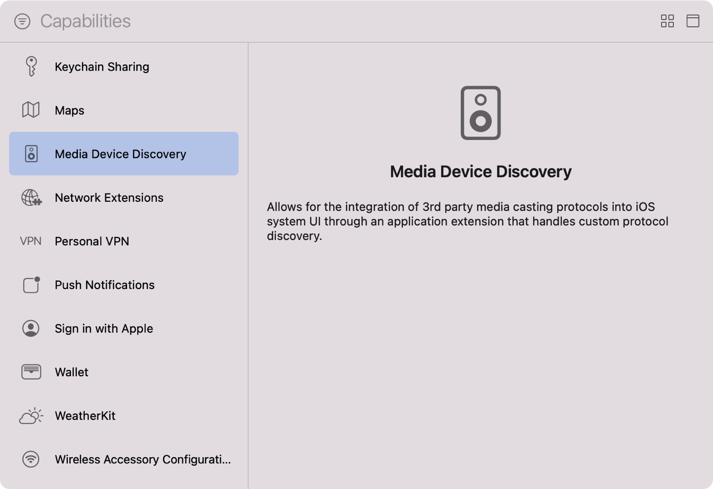

> Navigation: [Technologies](../technologies.md) · [Xcode](../xcode.md) · [Capabilities](capabilities.md)

# Configuring media device discovery

Article

Add a third-party media device or protocol as a streaming option in the same system menu as AirPlay.

## Overview

> [!important] Important
> Media Device Discovery Extension is deprecated in iOS 27.0 and visionOS 27.0. Refer to [Routing and streaming media to remote devices](../avsystemrouting/routing-and-streaming-media-to-remote-devices.md) for device discovery.

Enable the Media Device Discovery capability in an iOS app extension to indicate its intent to search the local network or paired Bluetooth devices for a third-party media receiver. This capability corresponds to the [Media Device Discovery Extension](../bundleresources/entitlements/com.apple.developer.media-device-discovery-extension.md) entitlement. When you enable Media Device Discovery, Xcode adds the entitlement to a code-signing entitlements file for the extension’s target.

At run-time, when a user invokes a UI to play media, the app presents an [AVRoutePickerView](../avkit/avroutepickerview.md) to offer possible devices for the user to stream to. The system searches your app’s bundle for extensions with this entitlement to check whether your app provides such a device. If so, the system adds the third-party device next to any available AirPlay devices in the picker, which provides the user with a unified media streaming experience.

## Add the Media Device Discovery capability to your target

To add the capability, follow the steps in the [Add a capability](adding-capabilities-to-your-app.md#Add-a-capability) section of [Adding capabilities to your app](adding-capabilities-to-your-app.md) for your extension’s target. If you add a new target in your Xcode project using the Media Device Discovery template, Xcode enables this capability automatically.

## Code the extension

Code the extension to search the local network or paired Bluetooth devices for a specific media receiver by using the [DeviceDiscoveryExtension](../devicediscoveryextension.md) framework. If the search succeeds, the extension passes the discovered device to the system. For an example app that demonstrates media device discovery, see [Discovering a third-party media-streaming device](../devicediscoveryextension/discovering-a-third-party-media-streaming-device.md).

## See Also

### Network

- [Configuring network extensions](configuring-network-extensions.md) — Customize the various capabilities of your app’s networking stack, such as proxying DNS queries or creating packet tunnels.
- [Registering your app with APNs](../usernotifications/registering-your-app-with-apns.md) — Communicate with Apple Push Notification service (APNs) and receive a unique device token that identifies your app.
- [Configuring Group Activities](configuring-group-activities.md) — Leverage FaceTime infrastructure to create coordinated experiences users can share.
