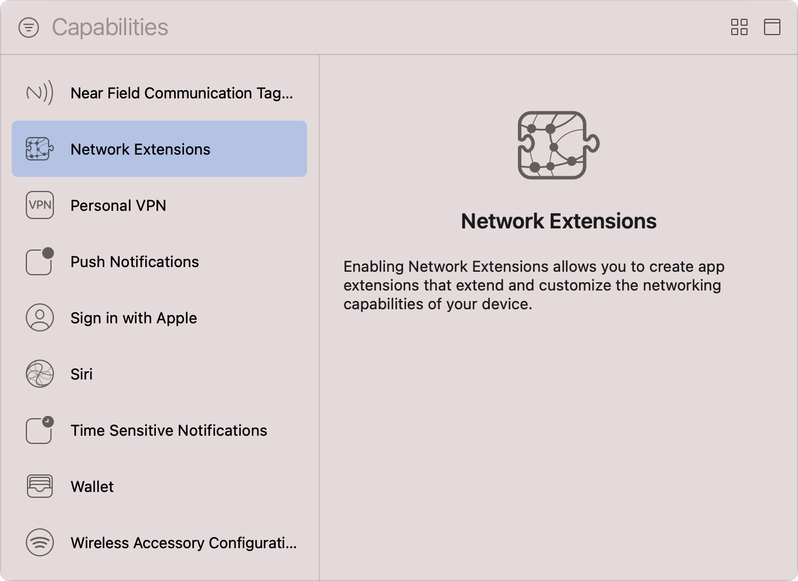

> Navigation: [Technologies](../technologies.md) · [Xcode](../xcode.md) · [Capabilities](capabilities.md)

# Configuring network extensions

Article

Customize the various capabilities of your app’s networking stack, such as proxying DNS queries or creating packet tunnels.

## Overview

Network Extensions allow you to customize and extend the core networking features of iOS and macOS. For example, your app can implement a virtual private network (VPN) client for a flow-oriented or packet-oriented custom VPN protocol, which an enterprise might require to facilitate secure remote access to resources not available on the public internet.

Prior to implementing a customized networking stack, follow the steps in the [Add a capability](adding-capabilities-to-your-app.md#Add-a-capability) section of [Adding capabilities to your app](adding-capabilities-to-your-app.md) to add the capability to your iOS or macOS app, and select the Network Extensions capability from Xcode’s Capabilities library.

A screenshot of Xcode’s Capabilities library with a list of available capabilities on the left and an information pane on the right. The list shows a range of capabilities from Near Field Communication Tag Reading to Wireless Accessory Configuration, and the Network Extensions capability is in a selected state. The text on the information pane explains that, by enabling Network Extensions, your app can create network extensions that extend and customize the networking capabilities of the user’s device.

After you add the Network Extensions capability, Xcode updates your app’s entitlements file to include the [Network Extensions Entitlement](../bundleresources/entitlements/com.apple.developer.networking.networkextension.md), which is an array that comprises the app capabilities you enable. If Xcode automatically manages your app’s signing, it also enables the Network Extensions capability for your app’s App ID in your developer account.

> [!note] Note
> If you remove the Network Extensions capability in Xcode, you must manually update the configuration of your app’s App ID in your developer account to disable Network Extensions.

### Enable the required app capabilities

Before your app can use the [Network Extension](../networkextension.md) framework to customize and extend the core networking features of iOS and macOS by implementing specific app capabilities, you must configure your Xcode project to include the necessary entitlements by performing the following steps:

1. Select your project in Xcode’s Project navigator.
2. Select the app’s target in the Targets list.
3. Click the Signing & Capabilities tab in the project editor.
4. Locate the Network Extensions capability.
5. Enable one or more app capabilities by checking the corresponding checkboxes.

A screenshot of the Network Extensions capability after you add it to your app’s target. The Content Filter app capability is in an enabled state.

Xcode automatically updates the [Network Extensions Entitlement](../bundleresources/entitlements/com.apple.developer.networking.networkextension.md) array in your app’s entitlements file to include the enabled app capabilities.

> [!important] Important
> App capabilities may have specific restrictions and use cases, such as only being available on supervised iOS devices. For more information, see the documentation for each capability.

The following table lists the app capabilities that Network Extensions support:

| Name | Description |
|---|---|
| App Proxy | Your app provides a virtual private network (VPN) client for a flow-oriented, custom VPN protocol. For more information, see [App proxy provider](../networkextension/app-proxy-provider.md). |
| Content Filter | Your app examines user content as it passes through the network stack and determines if the system should allow it or block it. For more information, see [Content filter providers](../networkextension/content-filter-providers.md) and the sample code [Filtering Network Traffic](../networkextension/filtering-network-traffic.md). |
| Packet Tunnel | Your app provides a VPN client for a packet-oriented, custom VPN protocol. For more information, see [Packet tunnel provider](../networkextension/packet-tunnel-provider.md). |
| DNS Proxy | Your app is responsible for resolving all DNS queries on-device using a custom protocol. For more information, see [DNS proxy provider](../networkextension/dns-proxy-provider.md). |
| DNS Settings | Your app creates and manages a system-wide DNS configuration using the DNS protocols DNS-over-TLS and DNS-over-HTTP. For more information, see [DNS settings](../networkextension/dns-settings.md). |

> [!tip] Tip
> To learn more about the APIs you use to create apps that extend and customize the device’s networking capabilities, see the WWDC videos [Network Extensions for the Modern Mac](https://developer.apple.com/videos/play/wwdc2019/714), [Advances in Networking, Part 1](https://developer.apple.com/videos/play/wwdc2019/712), and [What’s New in Network Extension and VPN](https://developer.apple.com/videos/play/wwdc2015/717).

## See Also

### Network

- [Registering your app with APNs](../usernotifications/registering-your-app-with-apns.md) — Communicate with Apple Push Notification service (APNs) and receive a unique device token that identifies your app.
- [Configuring Group Activities](configuring-group-activities.md) — Leverage FaceTime infrastructure to create coordinated experiences users can share.
- [Configuring media device discovery](configuring-media-device-discovery.md) — Add a third-party media device or protocol as a streaming option in the same system menu as AirPlay.
