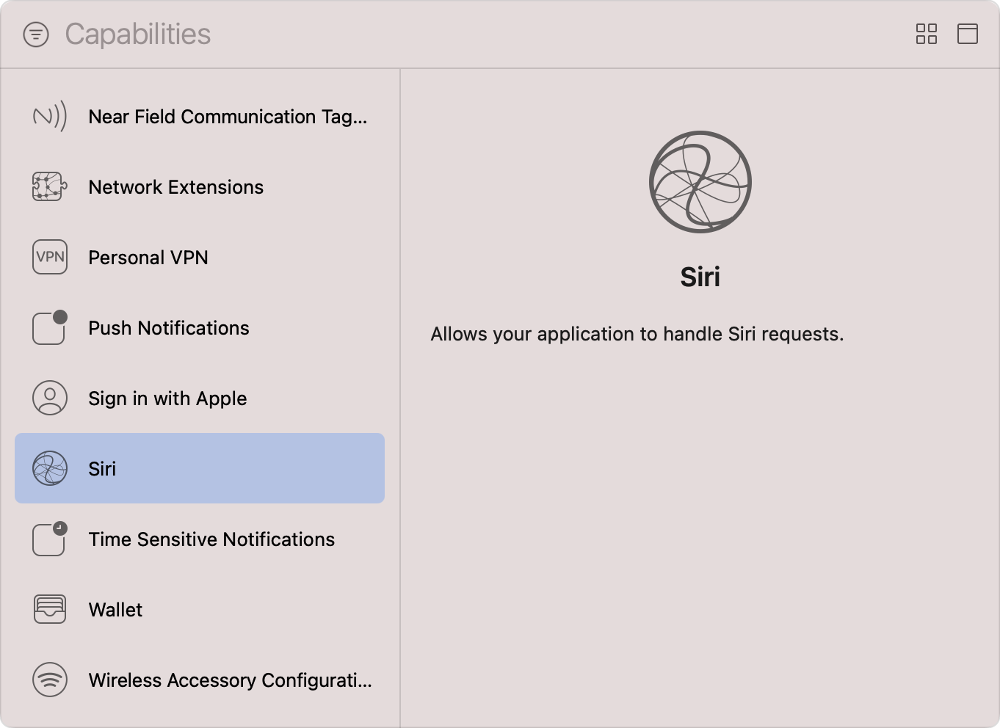

> Navigation: [Technologies](../technologies.md) · [Xcode](../xcode.md) · [Capabilities](capabilities.md)

# Configuring Siri support

Article

Enable your app and its Intents extension to resolve, confirm, and handle user-driven Siri requests for your app’s services.

## Overview

To process user requests that originate from Siri, first add the Siri capability to your app’s target. This informs the system that your app is ready to resolve, confirm, and handle SiriKit intents, typically through its Intents extension; in iOS 14 and later, you can choose to perform each of these steps from within your app.

After you configure your app to process SiriKit intents, add code — to your app delegate or your Intents extension — to route incoming intents to your custom handlers. For more information, see [Dispatching intents to handlers](../sirikit/dispatching-intents-to-handlers.md).

> [!note] Note
> watchOS doesn’t support all intent types. For example, a watchOS app can’t start a video call or handle intents in the CarPlay domain. Check an intent’s availability information to determine whether you can use it on watchOS.

### Add the Siri capability to your target

Follow the steps in [Add a capability](adding-capabilities-to-your-app.md#Add-a-capability) to add the capability to your app’s target, making sure you select the Siri capability from Xcode’s Capabilities library. For watchOS apps with separate WatchKit extensions, you must add the capability to the WatchKit Extension target. The capability isn’t available for macOS.

A screenshot of Xcode’s Capabilities library with a list of available capabilities on the left and an information pane on the right. The list shows a range of capabilities from Near Field Communication Tag Reading to Wireless Access Configuration, and the Siri capability is in a selected state. The text on the information pane explains that the Siri capability allows your application to handle Siri requets.

After you add the Siri capability, Xcode automatically updates the entitlements file of your target to include the [Siri Entitlement](../bundleresources/entitlements/com.apple.developer.siri.md). The App Store requires this entitlement for any app that contains an Intents extension that handles non-shortcut Siri requests.

### Handle SiriKit intents in an Intents extension

Use an Intents extension to respond to the user’s request from Siri quickly and without incurring the performance cost of loading the entire app into memory. To use an extension, you must first complete a number of additional configuration steps, such as adding one or more Intents extensions to your app’s target and specifying the types of intents those extensions support. For more information, see [Add an Intents App Extension to Your Project](https://developer.apple.com/documentation/sirikit/intent_handling_infrastructure/creating_an_intents_app_extension#2864127).

### Handle SiriKit intents directly in your app

In iOS 14 and later, you can choose not to use an Intents extension, and instead respond to the user’s request directly from within your iOS app. To do this, override the [application(_:handlerFor:)](<../uikit/uiapplicationdelegate/application(__handlerfor_).md>) method in your app delegate and use it to map incoming intents to the objects that are capable of handling them.

In the same way you configure an Intents extension, you must specify the types of intents that your iOS app supports. For more information, see [Specify the Intents Your Extension Supports](https://developer.apple.com/documentation/sirikit/intent_handling_infrastructure/creating_an_intents_app_extension#2864128).

## See Also

### App execution

- [Configuring background execution modes](configuring-background-execution-modes.md) — Indicate the background services your app requires to continue executing in the background in iOS, iPadOS, tvOS, visionOS, and watchOS.
- [Configuring custom fonts](configuring-custom-fonts.md) — Register your app as a provider or consumer of systemwide custom fonts.
- [Configuring game controllers](configuring-game-controllers.md) — Enhance gameplay input by enabling the discovery, configuration, and use of physical game controllers.
- [Configuring Maps support](configuring-maps-support.md) — Register your iOS routing app to provide point-to-point directions to Maps and other apps.
