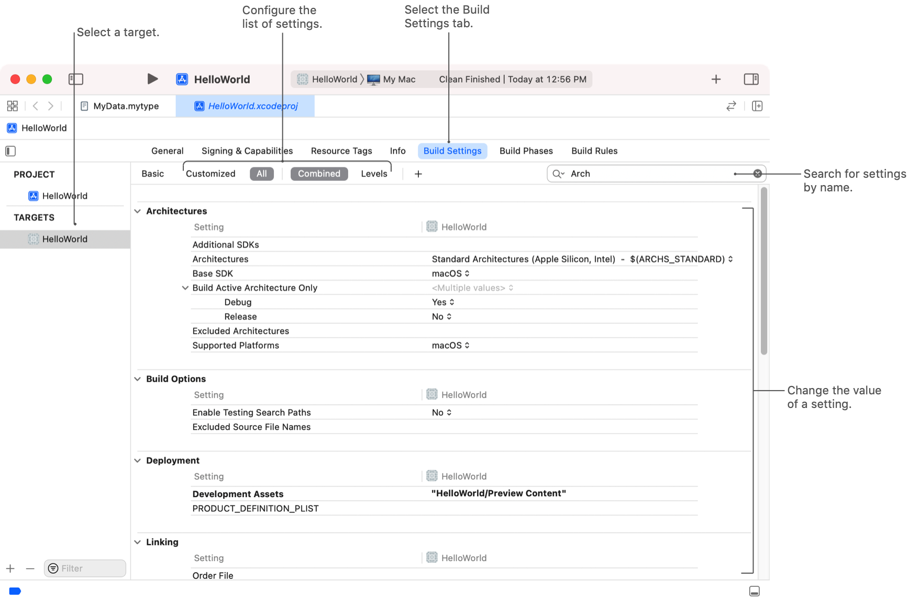
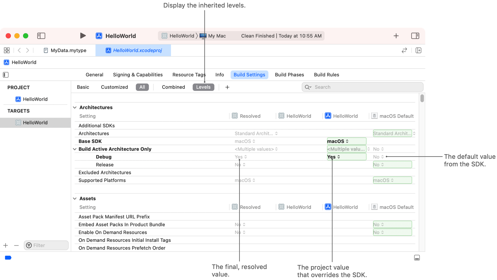
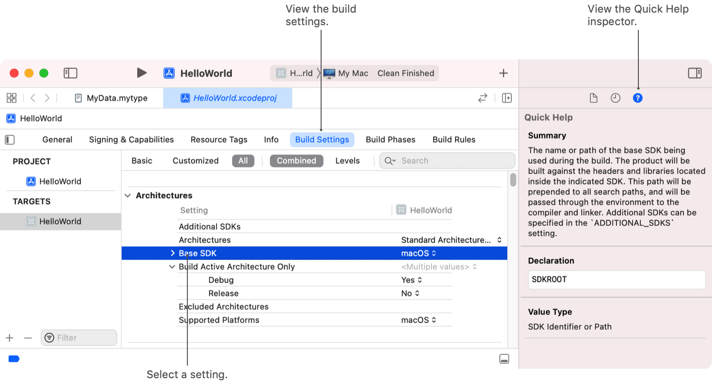

> Navigation: [Technologies](../technologies.md) · [Xcode](../xcode.md) · [Build system](build-system.md)

# Configuring the build settings of a target

Article

Specify the options you use to compile, link, and produce a product from a target, and identify settings inherited from your project or the system.

## Overview

The Xcode build process is highly configurable, and you can change the build settings of a single target or all the targets in your project. Build settings control every aspect of the build process, including how Xcode compiles your source files, how it links your executable, whether it generates debug information, and how it packages and distributes your code. Xcode has hundreds of build settings to support the tools and steps associated with the build process.

Make changes to your project or target’s settings from the Build Settings tab or with build configuration files. The following image shows the Build Settings tab for a project.

An Xcode window shows the build settings for the selected target, and the controls you use to filter and search the list of settings.

> [!note] Note
> You can also store settings in specially formatted text files called build configuration files. These files make it easy to save your settings along with your source files in your source control management system. For information about build configuration files, see [Adding a build configuration file to your project](adding-a-build-configuration-file-to-your-project.md).

For a complete list of build settings, see [Build settings reference](build-settings-reference.md).

### Search and filter the list of build settings

To find a specific build setting quickly, use the filters and Search field at the top of the Build Settings tab.

- Select a filter to display all settings or only the modified settings.
- Enter text in the search field to display settings that contain the specified string. Xcode searches all settings attributes by default.
- To refine your search, click the magnifying glass and select a single attribute to match.

### Configure the value of a build setting

Each build setting has the following attributes.

| Attribute | Description | Example |
|---|---|---|
| Title | A human-readable name for the build setting. | `Build Active Architecture Only` |
| Name | The programmatic name for the build setting. This name appears in the Quick Help inspector, in build configuration (`xcconfig`) files, and in the `xcodebuild` command-line tool. | `ONLY_ACTIVE_ARCH` |
| Value type | Common types include Booleans, strings, enumerations, string lists, path strings, and a list of path strings. | `Boolean` |
| Value | The current value of the setting. | `YES` |

The Build Settings tab displays a setting’s title or name, but not both. When titles are visible, choose Editor \> Show Setting Names to display the names. When names are visible, choose Editor \> Show Setting Titles to display the titles.

When you find the setting you want to modify, click the value attribute and type the new value. Xcode applies a bold font to modified settings to help you find them later. To restore a setting’s original value, select it and press the Delete key. If you modified the setting from the Levels view, delete the setting at the level where you overrode the value. For example, if you overrode the setting in your project, delete the setting there, and not in a target belonging to that project.

To configure different values for debug and release builds, click a setting’s disclosure triangle to reveal the configuration-specific values, and make the changes there. If you modify a setting while its disclosure triangle is in the closed position, Xcode applies the change to both configurations.

Some settings define their values in terms of other settings. For example, an attribute whose value is a path to a file might use the `BUILD_DIR` setting to specify part of the path. When a setting’s definition is visible, choose Editor \> Show Values to see the computed final value — that is, the value without the environment variable. When the final value is visible, choose Editor \> Show Definitions to see the definition.

### Evaluate how your project inherits settings

Every target inherits settings from both its parent project and the platform SDK. This inheritance model ensures that the target starts with valid baseline settings. When you create a target, Xcode changes some settings based on the target type, and you are free to make other changes based on your needs.

To help you track down the source of a setting’s value, open the build settings for your project or target and select the Levels filter. Xcode displays the current settings hierarchy in the build settings editor. This hierarchy includes the default SDK values and any other project or target values that are active. The Resolved column shows the final resolved value Xcode uses to build the item.

The levels option in the build settings editor shows the inheritance of default system settings, project settings, and target settings.

With levels displayed, highlighted values indicate values that take precedence. Xcode uses a target’s build settings before referring to build settings you define for the project. At each level, Xcode gives precedence to settings you provide in the project over those you provide in build configuration files. Xcode gives the lowest precedence to the default system values. The hierarchy of precedence is:

1. Target-level values.
2. Configuration settings file values mapped to a target.
3. Project-level values.
4. Configuration settings file mapped to the project.
5. System default values.

> [!note] Note
> When using the `xcodebuild` command-line tool, the tool gives any settings you pass to it the highest prededence.

### Obtain additional details about a build setting

To see detailed information about a particular setting, select the setting and choose View \> Inspectors \> Quick Help. Xcode displays a description of the setting, along with its name and value type.

## See Also

### Build settings

- [Adding a build configuration file to your project](adding-a-build-configuration-file-to-your-project.md) — Specify your project’s build settings in plain-text files, and supply different settings for debug and release builds.
- [Build settings reference](build-settings-reference.md) — A detailed list of individual Xcode build settings that control or change the way a target is built.
- [Identifying and addressing framework module issues](identifying-and-addressing-framework-module-issues.md) — Detect and fix common problems found in framework modules with the module verifier.
- [Understanding build product layout changes in Xcode](understanding-build-product-layout-changes.md)
